# 3.3. 用户注册

原文链接：https://learnku.com/courses/laravel-intermediate-training/9.x/register/12481

## 测试注册功能

点击页面右上角的 [注册按钮](http://larabbs.test/register) 进入注册页面，并填写表单：

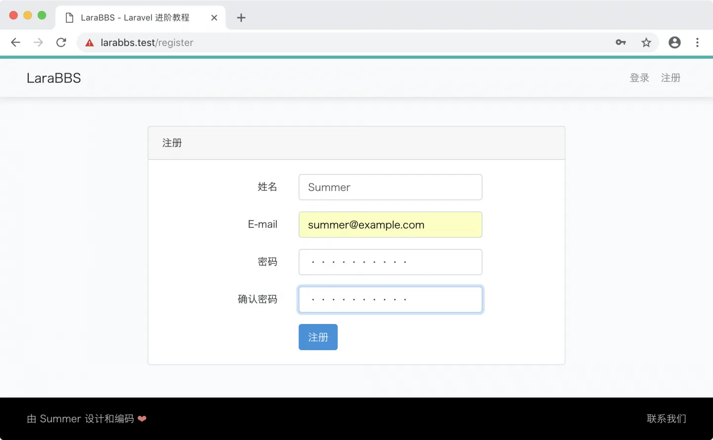

点击『注册』按钮提交表单，将会出现下图报错：

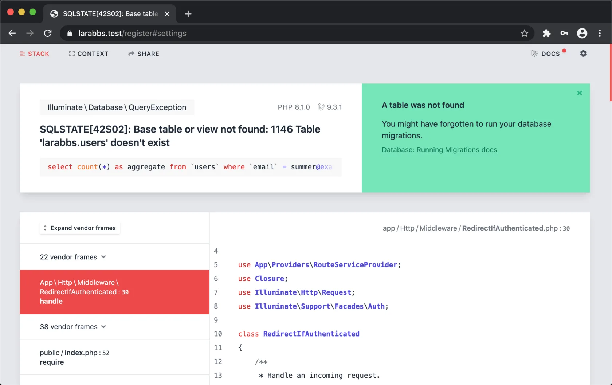

这是 Laravel 框架内部集成的异常处理扩展 [Laravel Ignition](https://github.com/facade/ignition) 所渲染出来的视图。日常开发中，我们会有大量的机会跟此工具打交道，接下来我们一起来熟悉一下。

## Laravel Ignition

Laravel Ignition 是一个非常优秀的 Laravel Debug 扩展，它有助于我们快速定位问题。

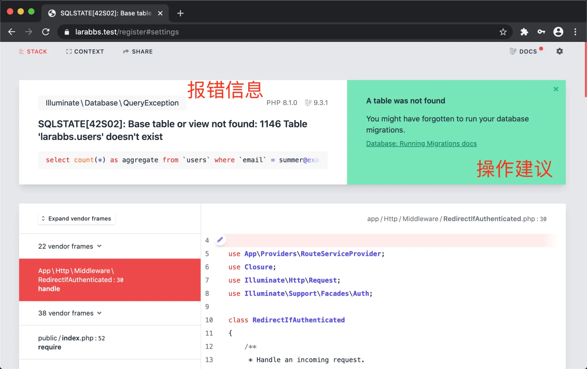

顶部左边是异常简介，是应用程序内部出错时抛出的信息。右边区域是建议的解决方案，例如上面，会提示我们「是不是忘记执行 `artisan migrate` 命令了？」，这里正好被说中了，我们就是因为没执行此命令，数据库还未准备好的原因，很智能。

往下滚动，这一部分是代码调用堆栈。方便我们查看具体哪一行代码出错：

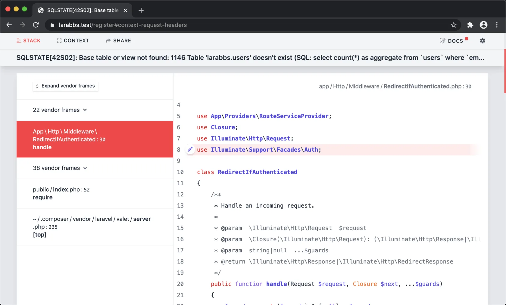

再往下滚动，还可以看到更加详细的信息：

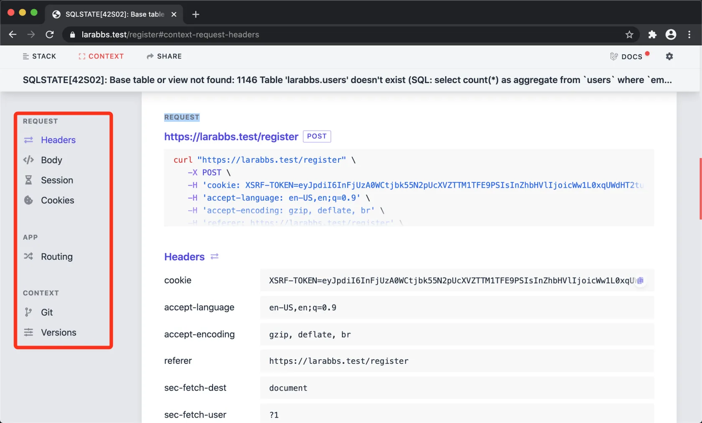

- 选项卡 `Request` —— 是一些运行环境的信息，包括：

- Request —— 请求简介；

- Headers —— 请求的头信息；

- Body —— 表单提交的数据，PHP 超级全局变量 `$_POST` 里的内容

- Session —— 当前用户会话信息，PHP 超级全局变量 `$_SESSION` 里的内容

- Cookies —— 当前用户的 Cookie 信息，PHP 超级全局变量 `$_COOKIE` 里的内容

- 选项卡 `App` —— 应用启动信息，执行逻辑，包括路由调用、中间件调用、控制器调用、模板文件等信息；

- 选项卡 `User` —— （有登录用户时才显示）登录用户信息；

- 选项卡 `Context`

- Git  信息

- Versions  —— 一些有用的环境变量信息

上面只是一个简单介绍，后续如果有报错，请多注意 Laravel Ignition 为我们展示的内容。这个工具利用好，可以让调试代码变得更加高效。

## 修复错误

介绍完 Laravel Ignition ，我们重新回到我们的注册流程中。重点看下报错信息，也就是『区域 1』中的内容：

>

Illuminate \ Database \ QueryException (42S02)
SQLSTATE[42S02]: Base table or view not found: 1146 Table ‘larabbs.users’ doesn’t exist (SQL: select count(*) as aggregate from `users` where `email` = [summer@example.com](mailto:summer@example.com))

`QueryException` 是数据库查询语句执行出错异常。上面的简介中，重点在 `Table 'larabbs.users' doesn't exist` ，数据库 `larabbs` 中表 `users` 不存在。

>

注意数据库  `larabbs` 是在 Homestead 初始化时为我们创建的，我们在 Homestead.yaml 中配置过。

命令行进入 MySQL 终端查看：

```bash
$ mysql -u homestead -p
```

`mysql` 是 MySQL 终端命令的调用名称， 参数 `-u` 是指定用户，`homestead` 是 Homestead 虚拟机中为我们准备好的 MySQL 用户，`-p` 参数是告知我们将要为 `homestead` 用户输入密码。

按回车键以后，命令行将会要求你输入 MySQL 密码，密码在 `.env` 文件里的 `DB_PASSWORD` 选项中可以找到，是 `secret`，输入密码后按回车，就能进入 MySQL 命令行终端。

在 MySQL 命令行终端里，命令行提示符号为 `mysql>`，在接下来的章节中，如果你遇到此命令行提示符，请识别为此命令必须在 MySQL 命令行终端里运行。

接下来查看我们的 `larabbs` 数据库中，是否有数据库表存在：

```
mysql> use larabbs;
mysql> show tables;
```

执行的结果如下图：

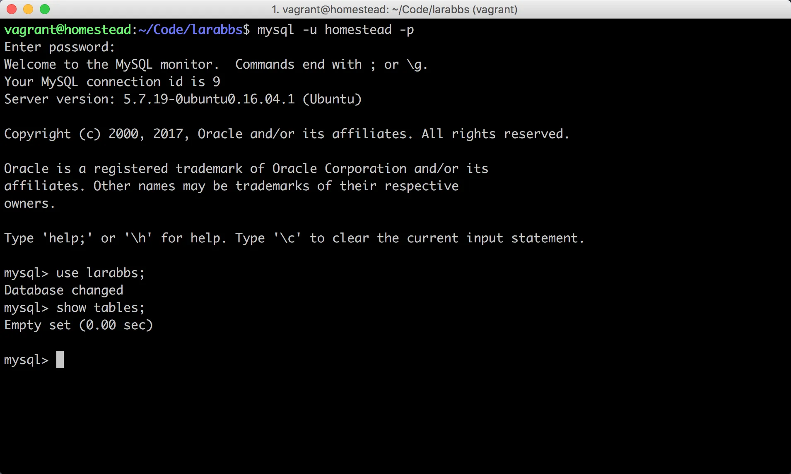

`Empty set` 意味着没有任何数据。这是必然的，因为我们还未执行 `artisan migrate` 命令，接下来我们开始执行数据迁移来创建数据库表结构。

先退出 MySQL 命令行终端：

```
mysql> exit;
```

执行迁移：

```bash
$ php artisan migrate
```

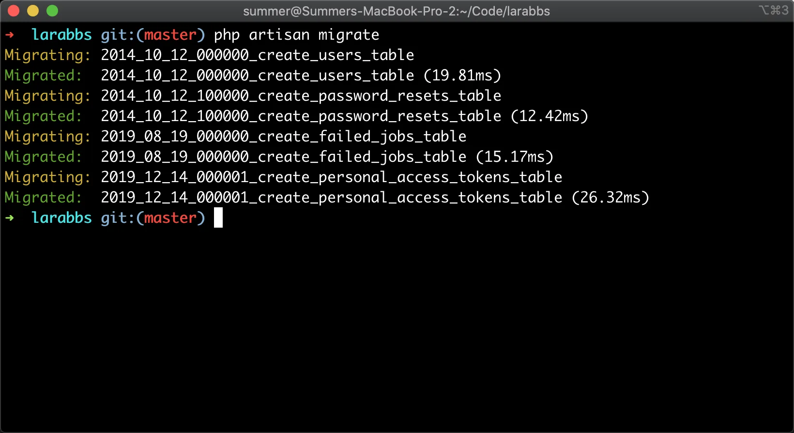

执行成功，此时再重新进入 MySQL 命令行终端查看数据库表的情况：

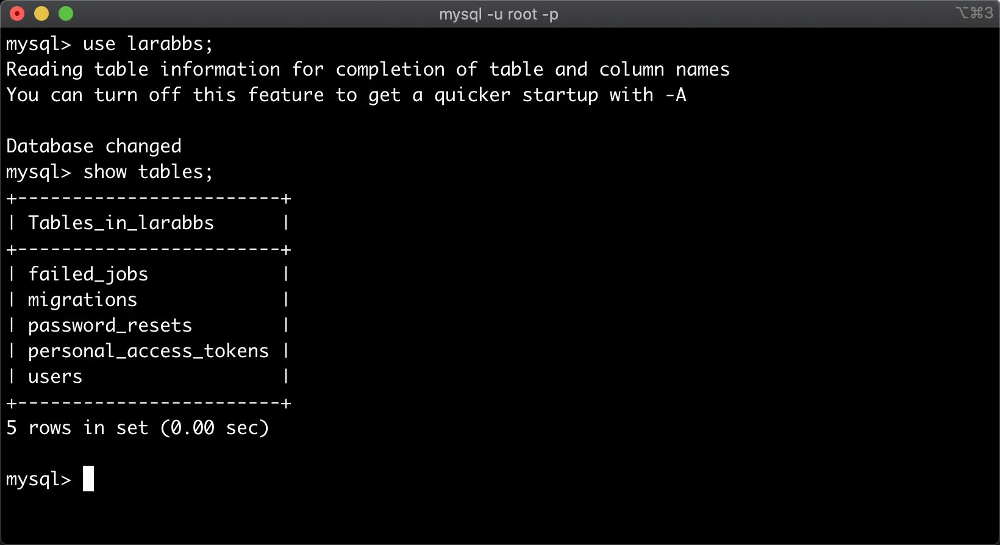

数据库表结构已经创建成功。

进入浏览器，刷新错误页面以此来重新提交注册页面的表单（如果你意外关闭了错误页面，只需要重新填写表单再次提交即可）：

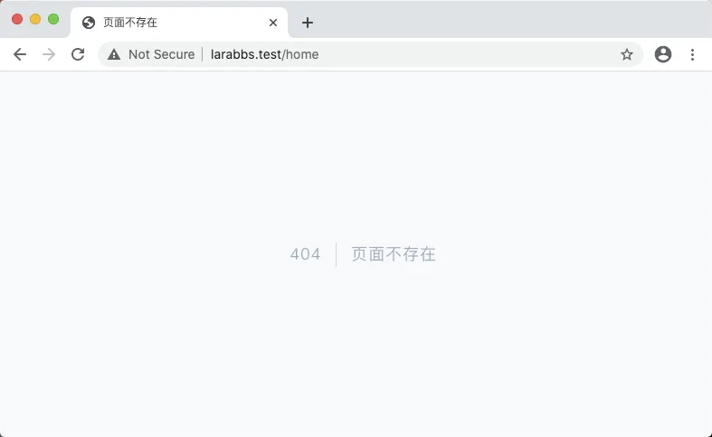

显示 404 页面不存在，我们能看到地址栏链接为 [larabbs.test/home](http://larabbs.test/home) ，因我们自定义了主页，`make:auth` 生成的 `home` 主页文件已经被我们删除，而默认的业务逻辑是在注册成功后，直接跳转到 `home` 主页，接下来我们需要修改这些逻辑。

修改 `app/Providers/RouteServiceProvider.php` 文件，搜索 `public const HOME = '/home';` 将 `/home` 替换为 `/`。

app/Providers/RouteServiceProvider.php

```
/**
* The path to the "home" route for your application.
*
* @var string
*/
public const HOME = '/';
```

## 登录状态

Laravel 默认注册后的用户是已登录的，接下来我们要制作顶部导航栏来响应用户的登录状态：

resources/views/layouts/_header.blade.php

```
.
.
.
<!-- Right Side Of Navbar -->
<ul class="navbar-nav navbar-right">
<!-- Authentication Links -->
@guest
<li class="nav-item"><a class="nav-link" href="{{ route('login') }}">登录</a></li>
<li class="nav-item"><a class="nav-link" href="{{ route('register') }}">注册</a></li>
@else
<li class="nav-item dropdown">
<a class="nav-link dropdown-toggle" href="#" id="navbarDropdown" role="button" data-bs-toggle="dropdown"
aria-haspopup="true" aria-expanded="false">

{{ Auth::user()->name }}
</a>
<div class="dropdown-menu" aria-labelledby="navbarDropdown">
<a class="dropdown-item" href="">个人中心</a>
<a class="dropdown-item" href="">编辑资料</a>
<div class="dropdown-divider"></div>
<a class="dropdown-item" id="logout" href="#">
<form action="{{ route('logout') }}" method="POST">
{{ csrf_field() }}
<button class="btn btn-block btn-danger" type="submit" name="button">退出</button>
</form>
</a>
</div>
</li>
@endguest
</ul>
.
.
.
```

代码讲解：

重点看 Blade 的 `guest` 条件语句：

```
@guest
<li><a href="{{ route('login') }}">登录</a></li>
<li><a href="{{ route('register') }}">注册</a></li>
@else
.
.
.
@endguest
```

如果是未登录用户的话，就显示注册和登录按钮，如果是已登录用户的话，即显示用户菜单。

## 登录注册用户

重新打开首页 [larabbs.test/](http://larabbs.test/) ，点击右上角的下拉菜单中的『退出登录』按钮：

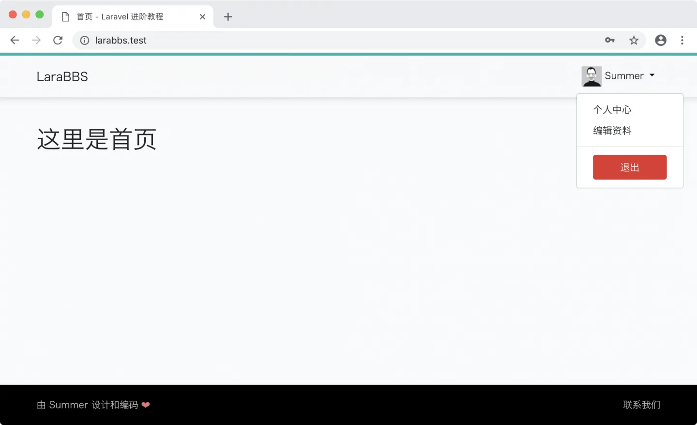

点击右上角 [登录](http://larabbs.test/login) 按钮，填写上一步注册时使用的邮箱和密码：

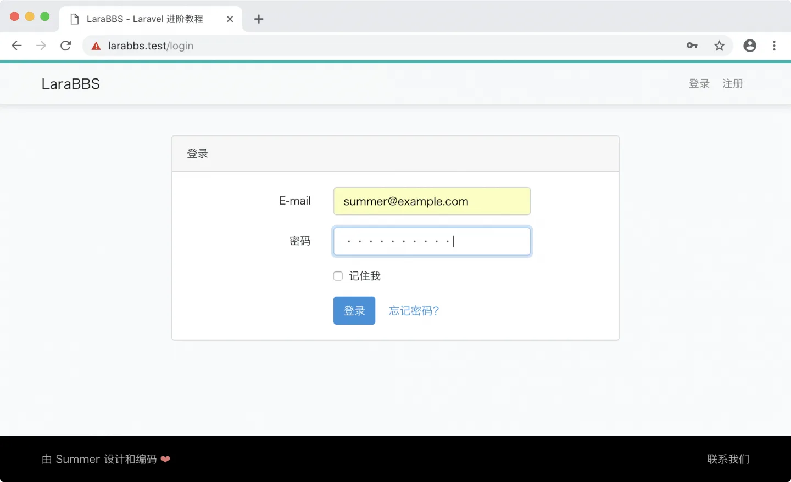

点击登录按钮进行登录：

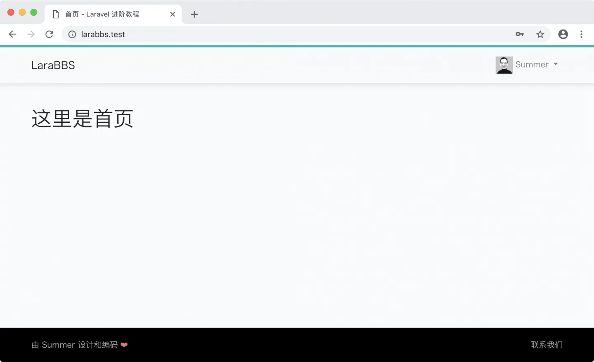

能看到我们用户名和乔布斯老爷子的头像，意味着登录成功。

## Git 版本控制

至此注册登录功能已经完成，接下来把代码纳入到版本管理：

```bash
$ git add -A
$ git commit -m "修复跳转链接"
```
