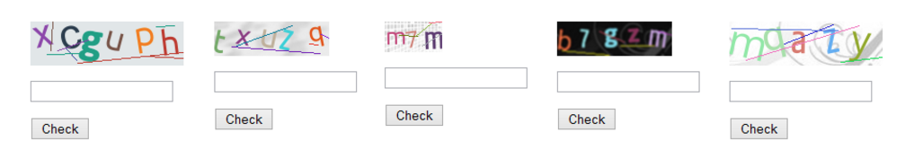
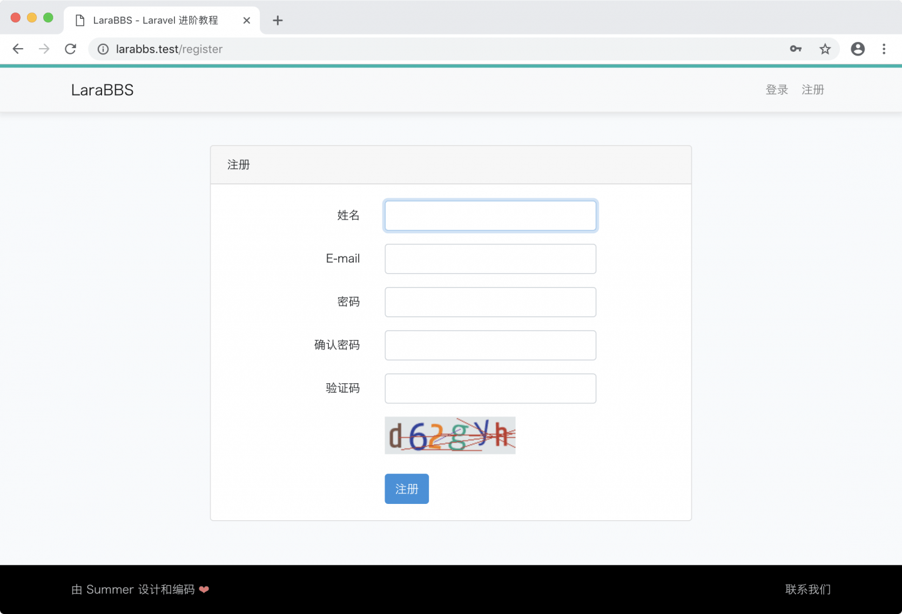
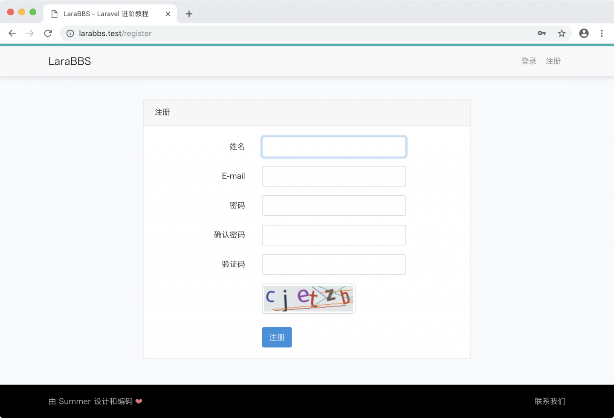
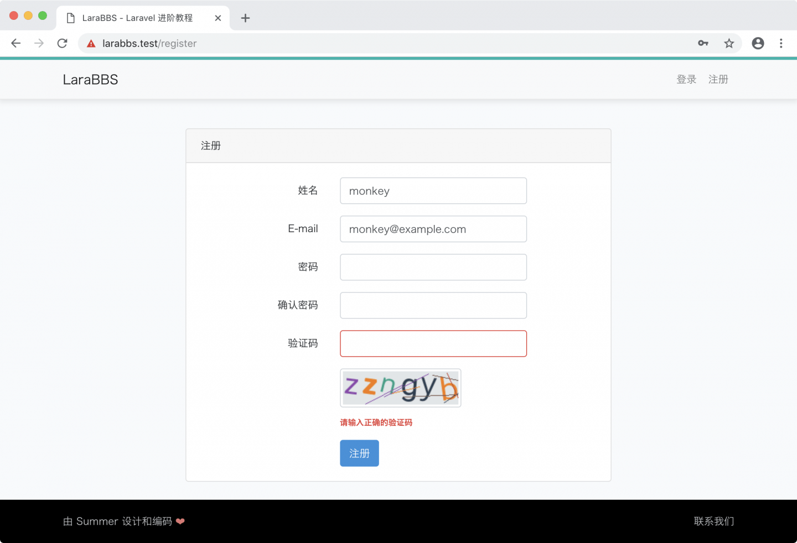
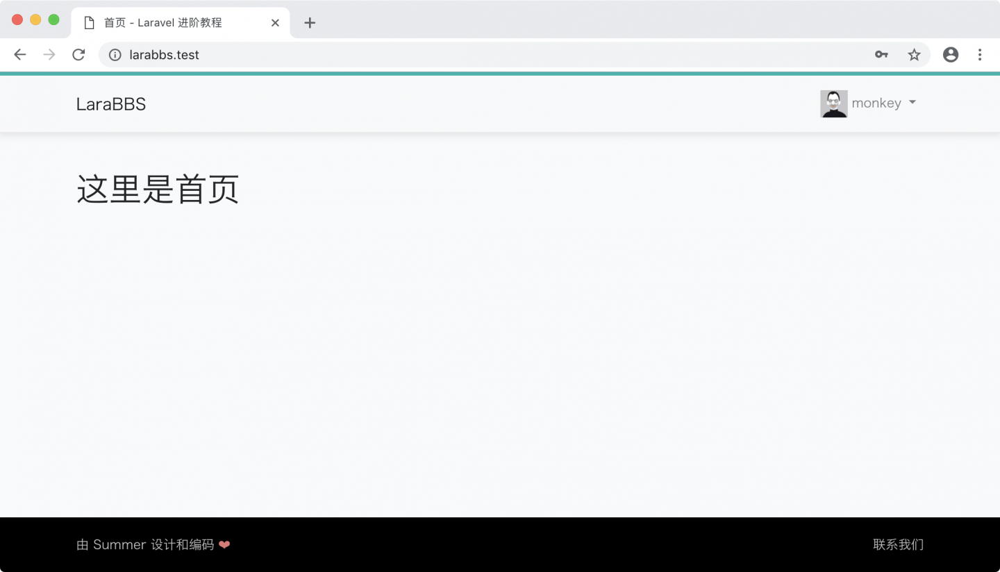

# 3.4. 注册验证码

原文链接：https://learnku.com/courses/laravel-intermediate-training/9.x/registration-verification-code/12482

## 问题说明

我们的注册功能存在一个问题，因我们表单未添加任何防护，恶意用户可以轻易使用机器人自动化注册新用户。机器人自由注册，对我们站点稳定性来讲是巨大的威胁，恶意用户可以很轻易的通过机器人程序在短时间内，注册大量用户，甚至于填满我们的数据库。

## 验证码



[验证码](https://baike.baidu.com/item/%E9%AA%8C%E8%AF%81%E7%A0%81/31701) 是防止恶意破解密码、刷票、论坛灌水、刷页的手段。验证码有 [多种类型](https://baike.baidu.com/item/%E9%AA%8C%E8%AF%81%E7%A0%81/31701#4)。 本项目中我们将使用图片验证码，其原理是让用户输入一个扭曲变形的图片上所显示的文字或数字，扭曲变形是为了避免被光学字符识别软件（OCR）自动辨识。由于计算机无法识别验证码的图片，所以回答出问题的用户就可以被认为是人类。

接下来我们将使用验证码来防卫的用户注册功能。

## 安装扩展包

我们将以第三方扩展包 [mews/captcha](https://github.com/mewebstudio/captcha) 作为基础来实现 Laravel 中的验证码功能。

使用 Composer 安装：

```
$ composer require "mews/captcha:~3.0"
```

>

注意： 如出现 Composer 抱怨内存不够的问题，请执行 `composer self-update` 升级到 2.0 ，详见 [翻译：如何升级 Composer 到 2.0 版本？](https://learnku.com/laravel/t/52709) 。

运行以下命令生成配置文件 `config/captcha.php`：

```
$  php artisan vendor:publish --provider='Mews\Captcha\CaptchaServiceProvider'
```

我们可以打开配置文件，查看其内容：

config/captcha.php

```
<?php

return [
'characters' => ['2', '3', '4', '6', '7', '8', '9', 'a', 'b', 'c', 'd', 'e', 'f', 'g', 'h', 'j', 'm', 'n', 'p', 'q', 'r', 't', 'u', 'x', 'y', 'z', 'A', 'B', 'C', 'D', 'E', 'F', 'G', 'H', 'J', 'M', 'N', 'P', 'Q', 'R', 'T', 'U', 'X', 'Y', 'Z'],
'default' => [
'length' => 9,
'width' => 120,
'height' => 36,
'quality' => 90,
'math' => false,
],
'math' => [
'length' => 9,
'width' => 120,
'height' => 36,
'quality' => 90,
'math' => true,
],

'flat' => [
'length' => 6,
'width' => 160,
'height' => 46,
'quality' => 90,
'lines' => 6,
'bgImage' => false,
'bgColor' => '#ecf2f4',
'fontColors' => ['#2c3e50', '#c0392b', '#16a085', '#c0392b', '#8e44ad', '#303f9f', '#f57c00', '#795548'],
'contrast' => -5,
],
'mini' => [
'length' => 3,
'width' => 60,
'height' => 32,
],
'inverse' => [
'length' => 5,
'width' => 120,
'height' => 36,
'quality' => 90,
'sensitive' => true,
'angle' => 12,
'sharpen' => 10,
'blur' => 2,
'invert' => true,
'contrast' => -5,
]
];
```

可以看到这些配置选项都非常通俗易懂，`characters` 选项是用来显示给用户的所有字符串，`default`, `flat`, `mini`, `inverse` 分别是定义的四种验证码类型，你可以在此修改对应选项自定义验证码的长度、背景颜色、文字颜色等属性，在此不做过多叙述。

## 页面嵌入

此扩展包的使用分为两步：

1. 前端展示 —— 生成验证码给用户展示，并收集用户输入的答案；

2. 后端验证 —— 接收答案，检测用户输入的验证码是否正确。

### 1. 前端展示

接下来我们先将注册页面模板 `register.blade.php` 里 password-confirm 区块下面：

resources/views/auth/register.blade.php

```
.
.
.
<div class="row mb-3">
<label for="password-confirm" class="col-md-4 col-form-label text-md-end">{{ __('Confirm Password') }}</label>

<div class="col-md-6">
<input id="password-confirm" type="password" class="form-control" name="password_confirmation" required autocomplete="new-password">
</div>
</div>

<div class="mb-3 row">
<label for="captcha" class="col-md-4 col-form-label text-md-end">验证码</label>

<div class="col-md-6">
<input id="captcha" class="form-control{{ $errors->has('captcha') ? ' is-invalid' : '' }}" name="captcha" required>


@if ($errors->has('captcha'))
<span class="invalid-feedback" role="alert">
<strong>{{ $errors->first('captcha') }}</strong>
</span>
@endif
</div>
</div>
.
.
.
```

代码讲解：

1. 我们首先将此文件里的英文翻译为中文；

2. 在『确认密码』区块代码下，我们增加了『验证码』区块代码；

3. `captcha_src()` 方法是 [mews/captcha](https://github.com/mewebstudio/captcha) 提供的辅助方法，用于生成验证码图片链接；

4. 『验证码』区块中 `onclick()` 是 JavaScript 代码，实现了点击图片重新获取验证码的功能，允许用户在验证码太难识别的情况下换一张图片试试。

此时我们退出登录，并前往注册页面 [larabbs.test/register](http://larabbs.test/register) ，即可看到验证码：



我们需要调整下样式：

resources/sass/app.scss

```
.
.
.

/* User register page */
.register-page {
img.captcha {
cursor: pointer;
border: 1px solid #ced4da;
border-radius: 4px;
padding: 3px;
}
}
```

>

因涉及到样式代码编译，请确保虚拟机里的 `$ npm run watch-poll` 命令处于运行中。

刷新注册页面 [larabbs.test/register](http://larabbs.test/register) ，即可看到样式已经正常：



### 2. 后端验证

前端展示部分我们已经开发完毕，接下来处理后端验证逻辑。 [mews/captcha](https://github.com/mewebstudio/captcha) 是专门为 Laravel 量身定制的扩展包，能很好的兼容 Laravel 生成的注册逻辑。我们只需要在注册的时候，添加上表单验证规则即可：

app/Http/Controllers/Auth/RegisterController.php

```
<?php
.
.
.

class RegisterController extends Controller
{
.
.
.

/**
* Get a validator for an incoming registration request.
*
* @param  array  $data
* @return \Illuminate\Contracts\Validation\Validator
*/
protected function validator(array $data)
{
return Validator::make($data, [
'name' => ['required', 'string', 'max:255'],
'email' => ['required', 'string', 'email', 'max:255', 'unique:users'],
'password' => ['required', 'string', 'min:6', 'confirmed'],
'captcha' => ['required', 'captcha'],
], [
'captcha.required' => '验证码不能为空',
'captcha.captcha' => '请输入正确的验证码',
]);
}
.
.
.
}
```

我们添加了验证规则：

```
'captcha' => ['required', 'captcha'],
```

表达式里的第二个 `captcha` 是  [mews/captcha](https://github.com/mewebstudio/captcha)  自定义的表单验证规则。扩展包非常巧妙地利用了 Laravel 表单验证器提供的 [自定义表单验证规则](https://learnku.com/docs/laravel/9.x/validation#using-extensions) 功能。令我们在开发验证码时非常方便。

Validator 表单验证的 `make()` 方法第三个参数是自定义错误提示，这里我们对验证码的错误提示进行自定义。

接下来测试：

1. 访问注册页面 [larabbs.test/register](http://larabbs.test/register) ；

2. 填入测试数据，验证码填写框中随便填写错误的数据；

3. 点击注册按钮提交注册表单：



继续测试：

1. 访问注册页面 [larabbs.test/register](http://larabbs.test/register) ；

2. 填入测试数据，填写正确的验证码；

3. 点击注册按钮提交注册表单：



注册成功。至此注册验证码开发完毕。

## Git 版本控制

下面把代码纳入到版本管理：

```
$ git add -A
$ git commit -m "注册验证码"
```
