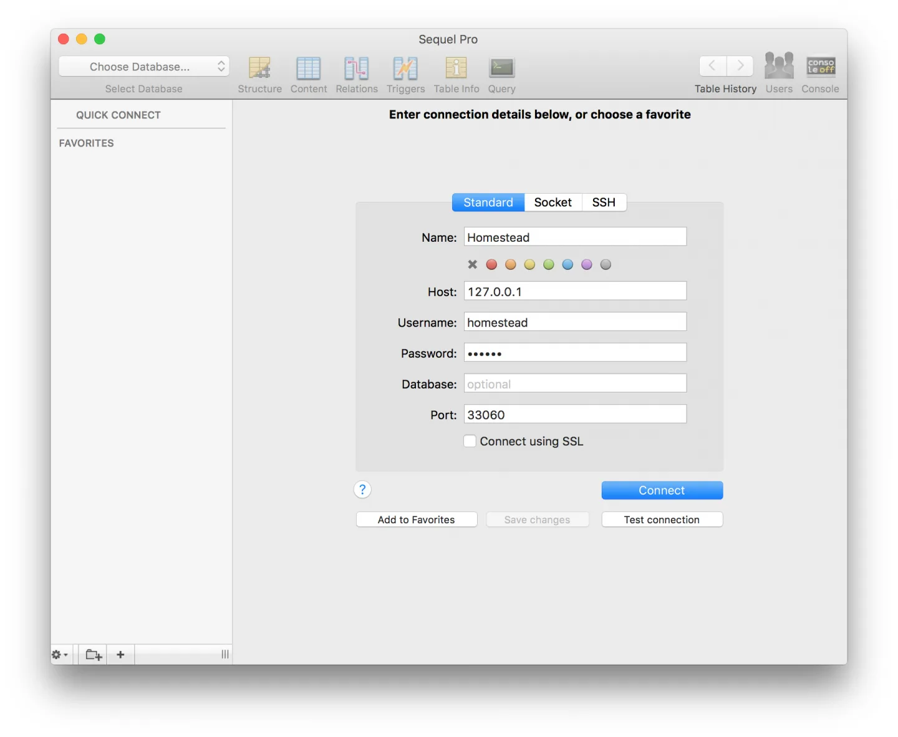
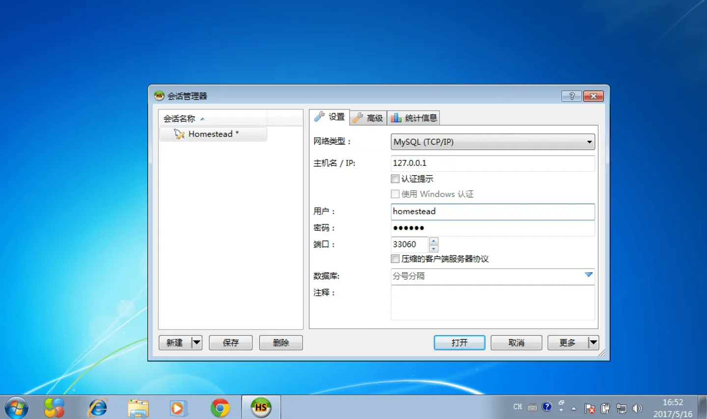
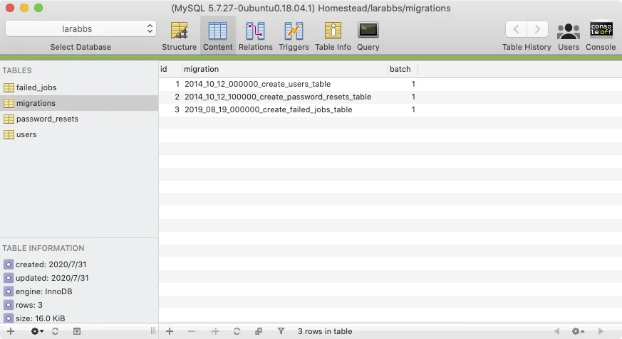
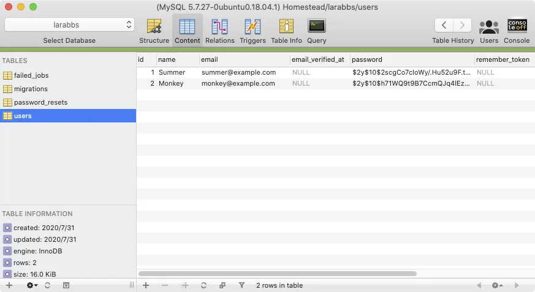

# 3.5. 数据库视图管理工具

原文链接：https://learnku.com/courses/laravel-intermediate-training/9.x/database-view-management-tools/12483

## 数据库工具选择

开发时，我们的应用使用的是 Homestead 虚拟机里的 MySQL 数据库。我们已经知道如何使用命令行链接 MySQL 终端来查看数据库情况，为了更方便调试和查看数据，我们需要在主机中安装 MySQL 数据库视图工具，然后连接到 虚拟机里的 MySQL 数据库服务器。

Homestead 虚拟机里的 MySQL 数据库服务器连接方式为：

- Host: `127.0.0.1`

- Port: `33060`

- User: `homestead`

- Pass: `secret`

>

注意此处使用了 VirtualBox 虚拟机的『端口转发』功能，Homestead 脚本默认将本机端口 33060 转发到虚拟机里的 3306 端口。所以，只要我们连接本机的 33060 端口，即可读取虚拟机中的 MySQL 数据库。（3306 是默认的 MySQL 端口）

接下来详细讲下 Mac 和 Win 平台下的 MySQL 数据库查看工具的安装。

### 1. Mac OS

在 Mac 上，我们可以通过安装 [Sequel Ace](https://github.com/Sequel-Ace/Sequel-Ace) （ [百度盘下载](https://pan.baidu.com/s/1slWENqH) ）来进行数据库的一些操作，如查阅数据或删除数据。Sequel Ace 是一款开源的数据库软件，非常容易使用。

打开 Sequel Ace 并进行如下的设置，Password 一栏需要填写 Homestead 的默认数据库密码：`secret`。

接着，点击 `Test connection` 测试连接。测试通过后点击 `Add to Favorites` 收藏此设置。最后，点击 `Connect` 按钮即可连接到 Homestead 数据库。

### 2. Windows

如果你是使用 Windows 机器进行开发，推荐使用  [HeidiSQL](http://www.heidisql.com)（ [百度盘下载](https://pan.baidu.com/s/1jH6o5sa#list/path=%2F)  ）。连接信息从上面读取。

## 查看数据库

因为我已经执行了 `php artisan migrate` 命令，此命令执行了 `database/migrations` 文件夹里的两个迁移文件：

- 2014_10_12_000000_create_users_table.php

- 2014_10_12_100000_create_password_resets_table.php

- 2019_08_19_000000_create_failed_jobs_table.php

所以我们可以看到：

选择 `users` 表，可以看到我们刚刚注册的用户：

