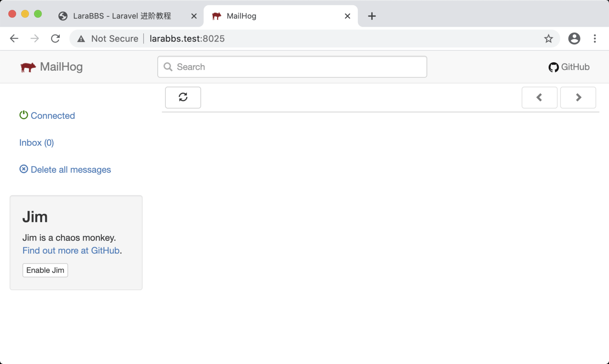
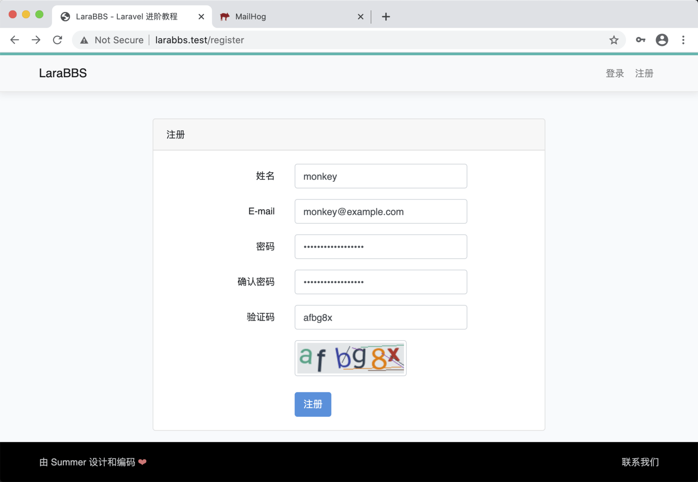
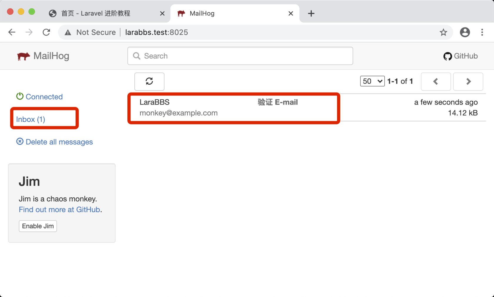
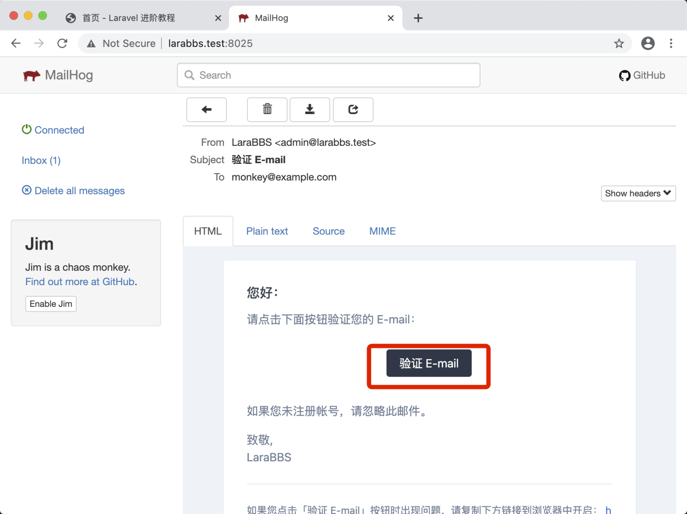

# 3.6. 邮箱认证

原文链接：https://learnku.com/courses/laravel-intermediate-training/9.x/email-verify/12484

## 邮箱认证

从产品设计上讲，『邮箱认证』能让我们有效地检验用户邮箱的真实性，后续网站可以利用这些真实邮箱来联系上用户，例如评论触发邮件通知，或者重要信件等。

另一方面，『邮箱认证』也会对不良用户起到很好的抑制，此类用户注册后会在网站上创建大量垃圾内容，认证其邮箱，提高了注册用户的难度，有效提高网站内容的品质。

我们将只允许邮箱认证通过的用户使用网站，未认证用户会被引导进入验证邮箱页面。

『邮箱认证』工作机制一般分两步：

1. 发送认证邮件 —— 将附带认证信息的『认证链接』发送到用户邮箱里；

2. 检测认证链接 —— 用户打开邮件，点击认证链接进入网站，程序检测 URL 中认证参数的合法性，并渲染对应的页面。

以上流程非常通用，Laravel 默认自带了这个功能，我们可以很方便地进行集成。

捋一下产品思路：

1. 用户注册成功后，给用户发送一个认证邮件；

2. 用户登录状态下，如邮箱未认证，重定向到提醒验证邮箱的页面中。

接下来让我们一起来动手开发吧。

## 修改 User 模型

接下来我们将修改 User 模型，将 Laravel 自带的邮箱认证功能集成到我们的程序中。

app/Models/User.php

```
.
.
.
use Illuminate\Auth\MustVerifyEmail as MustVerifyEmailTrait;

class User extends Authenticatable implements MustVerifyEmail
{
use HasApiTokens, HasFactory, Notifiable, MustVerifyEmailTrait;
.
.
.
```

注意我们修改了两个地方， `implements` MustVerifyEmail 和 MustVerifyEmailTrait。

代码详解：

```
use HasApiTokens, HasFactory, Notifiable, MustVerifyEmailTrait;
```

加载使用 `MustVerifyEmail` trait，打开 `vendor/laravel/framework/src/Illuminate/Auth/MustVerifyEmail.php` 文件，可以看到以下四个方法：

- `hasVerifiedEmail()` 检测用户 Email 是否已认证；

- `markEmailAsVerified()` 将用户标示为已认证；

- `sendEmailVerificationNotification()` 发送 Email 认证的消息通知，触发邮件的发送;

- `getEmailForVerification()` 获取发送邮件地址，提供这个接口允许你自定义邮箱字段。

得益于 PHP 的 trait 功能，User 模型在 `use` 以后，即可使用以上四个方法。

```
class User extends Authenticatable implements MustVerifyEmail
```

可以打开 `vendor/laravel/framework/src/Illuminate/Contracts/Auth/MustVerifyEmail.php` ，可以看到此文件为 PHP 的接口类，继承此类将确保 User 遵守契约，拥有上面提到的四个方法。

## 发送认证邮件

接下来我们来开发用户注册成功后，发送认证邮件的功能。目前我们使用了 Laravel 自带的 `RegisterController` ，控制器通过加载 `Illuminate\Foundation\Auth\RegistersUsers` trait 来引入框架的注册功能，此时我们打开此 trait 来翻阅源码并定位到 `register(Request $request)` 方法：

```
public function register(Request $request)
{
// 检验用户提交的数据是否有误
$this->validator($request->all())->validate();

// 创建用户同时触发用户注册成功的事件，并将用户传参
event(new Registered($user = $this->create($request->all())));

// 登录用户
$this->guard()->login($user);

// 调用钩子方法 `registered()`
if ($response = $this->registered($request, $user)) {
return $response;
}

// 按需返回 json 数据，否则重定向
return $request->wantsJson()
? new JsonResponse([], 201)
: redirect($this->redirectPath());
}
```

此方法处理了用户提交表单后的逻辑，我们把重点放在  `event(new Registered($user = $this->create($request->all())));`，这里使用了 Laravel 的事件系统，触发了 `Registered` 事件。

打开 `app/Providers/EventServiceProvider.php` 文件，此文件的 `$listen` 属性里我们可以看到注册了  `Registered` 事件的监听器：

```
protected $listen = [
Registered::class => [
SendEmailVerificationNotification::class,
],
];
```

打开 `SendEmailVerificationNotification` 类，阅读其源码：

vendor/laravel/framework/src/Illuminate/Auth/Listeners/SendEmailVerificationNotification.php

```
<?php

namespace Illuminate\Auth\Listeners;

use Illuminate\Auth\Events\Registered;
use Illuminate\Contracts\Auth\MustVerifyEmail;

class SendEmailVerificationNotification
{
/**
* 处理事件
*
* @param  \Illuminate\Auth\Events\Registered  $event
* @return void
*/
public function handle(Registered $event)
{
// 如果 user 是继承于 MustVerifyEmail 并且还未激活的话
if ($event->user instanceof MustVerifyEmail && ! $event->user->hasVerifiedEmail()) {
// 发送邮件认证消息通知（认证邮件）
$event->user->sendEmailVerificationNotification();
}
}
}
```

可以看出 Laravel 默认已经为我们设置了邮件发送的逻辑，接下来我们来测试一下。

## 开始测试

测试之前，先访问  [larabbs.test:8025/](http://larabbs.test:8025/) ：



这是 Homestead 内置的 [MailHog](https://github.com/mailhog/MailHog) 软件，方便我们开发 Laravel 时对邮件发送的监控。

.env 文件中修改 Email 相关设置如下来开启 MailHog：

```
MAIL_MAILER=smtp
MAIL_HOST=localhost
MAIL_PORT=1025
MAIL_USERNAME=null
MAIL_PASSWORD=null
MAIL_ENCRYPTION=null
MAIL_FROM_ADDRESS=admin@larabbs.test
```

>

注意：使用 Laravel Sail 请将上面 MAIL_HOST 的值设置为 `mailhog`。如果你使用本机安装的 Mailhog ，以上配置请参照这篇文章 —— [翻译：Laravel 如何连接本机安装的 mailhog？](https://learnku.com/laravel/t/65782) 。

接下来浏览器访问  [larabbs.test/register](http://larabbs.test/register) ，填写表单并注册一个测试用户：



注册成功后，访问 [larabbs.test:8025/](http://larabbs.test:8025/) 查看 MailHog ：



可见邮件成功发送，点击进入查看邮件内容：



复制以上的激活链接，先不要到浏览器访问，后续课程会用到。

## Git 代码版本控制

接着让我们将本次更改纳入版本控制中：

```
$ git add -A
$ git commit -m "邮箱认证"
```
