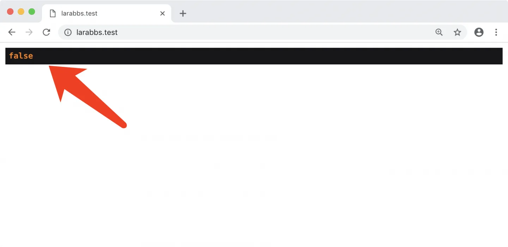
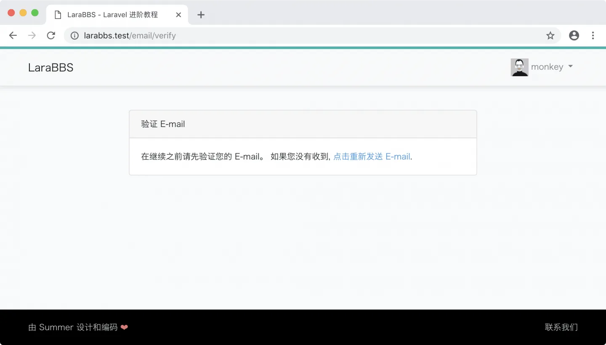
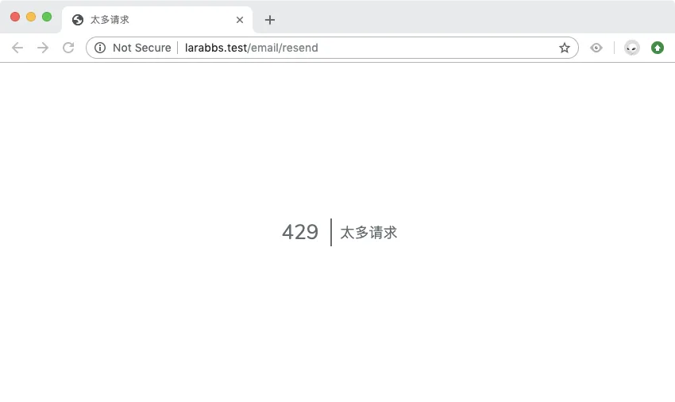
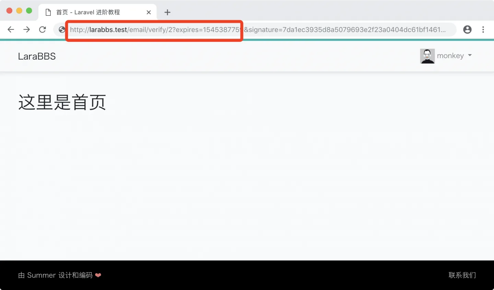

# 3.7. 强制用户认证

原文链接：https://learnku.com/courses/laravel-intermediate-training/9.x/force-user-authentication/12485

## 强制用户认证

我们希望用户认证邮箱后，才能使用网站。

首先我们来验证下当前登录的用户是否是已经认证过的，做个小测试：

app/Http/Controllers/PagesController.php

```
<?php

namespace App\Http\Controllers;

use Illuminate\Http\Request;

class PagesController extends Controller
{
public function root()
{
dd(\Auth::user()->hasVerifiedEmail());
return view('pages.root');
}
}
```

刷新页面可以看到：



>

注意： 如出现报错，请先登录。

`false` 代表着还未激活，跟我们预想的一样，接下来我们检出还原 `PagesController`：

```
$ git checkout app/Http/Controllers/PagesController.php
```

## EnsureEmailIsVerified 中间件

接下来我们将使用 [Laravel 中间件](https://learnku.com/docs/laravel/9.x/middleware) 来过滤用户的所有请求，如果用户未认证的话，就跳转到邮件认证提醒的页面中。中间件是 Laravel 中开发经常使用的功能，此处我们先混个脸熟，后面章节我们会有详细讲解的篇幅。

可以使用以下命令来新建一个中间件：

```
$ php artisan make:middleware EnsureEmailIsVerified
```

打开生成的文件并代入以下内容：

app/Http/Middleware/EnsureEmailIsVerified.php

```
<?php

namespace App\Http\Middleware;

use Closure;
use Illuminate\Http\Request;

class EnsureEmailIsVerified
{
public function handle(Request $request, Closure $next)
{
// 三个判断：
// 1. 如果用户已经登录
// 2. 并且还未认证 Email
// 3. 并且访问的不是 email 验证相关 URL 或者退出的 URL。
if ($request->user() &&
! $request->user()->hasVerifiedEmail() &&
! $request->is('email/*', 'logout')) {

// 根据客户端返回对应的内容
return $request->expectsJson()
? abort(403, 'Your email address is not verified.')
: redirect()->route('verification.notice');
}

return $next($request);
}
}
```

接下来注册中间件，注册的时机确保在 `StartSession` 后面即可：

app/Http/Kernel.php

```
<?php
.
.
.
protected $middlewareGroups = [
'web' => [
\App\Http\Middleware\EncryptCookies::class,
\Illuminate\Cookie\Middleware\AddQueuedCookiesToResponse::class,
\Illuminate\Session\Middleware\StartSession::class,
// \Illuminate\Session\Middleware\AuthenticateSession::class,
\Illuminate\View\Middleware\ShareErrorsFromSession::class,
\App\Http\Middleware\VerifyCsrfToken::class,
\Illuminate\Routing\Middleware\SubstituteBindings::class,
\App\Http\Middleware\EnsureEmailIsVerified::class,      // <<--- 只需添加这一行
],
.
.
.
}
```

刷新页面，即可看到认证提醒，并且除了我们上面代码中设置的 URL 外都会进入此页面：



内置邮箱认证还有个小功能，当你点击多次『重新发送 Email』后，系统会自动做限额处理，可以有效防止用户消耗太多资源：



限额次数可在 app/Http/Controllers/Auth/VerificationController.php 文件中的这一行配置：

```
$this->middleware('throttle:6,1')->only('verify', 'resend');
```

## 测试一下

找到我们在日志里获取到的 URL ，黏贴浏览器里访问，我们将可以再次访问到首页：



邮箱认证成功后，没有 提示，这个比较突兀，下个文章里我们将会对此进行优化。

## 代码版本

开始下一节之前，我们先来为代码做下版本标记：

```
$ git add .
$ git commit -m "强制用户认证"
```
