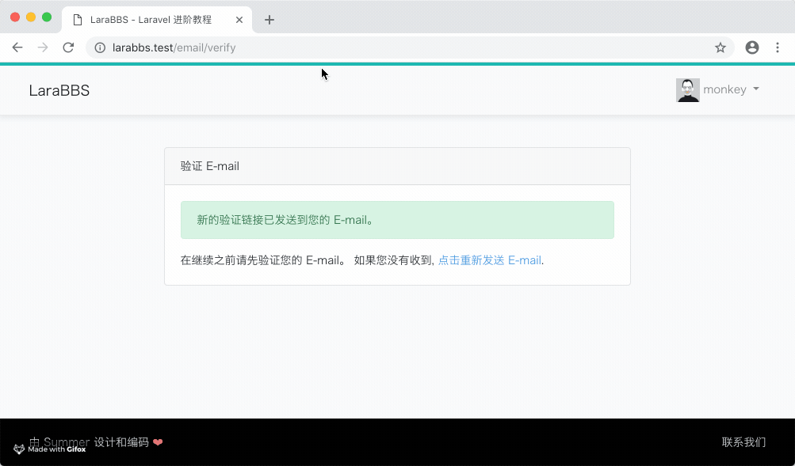
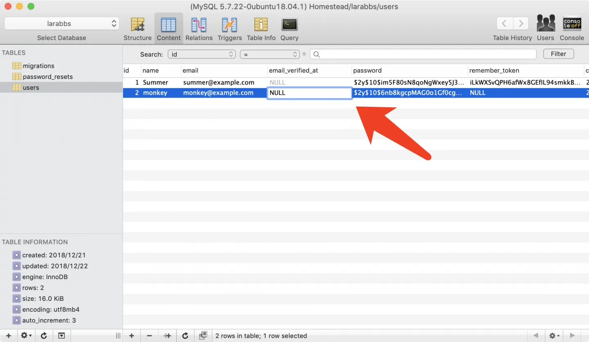
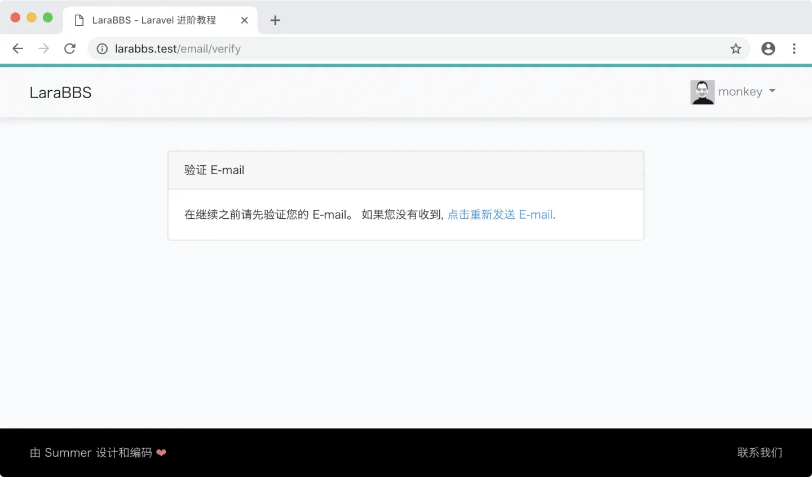
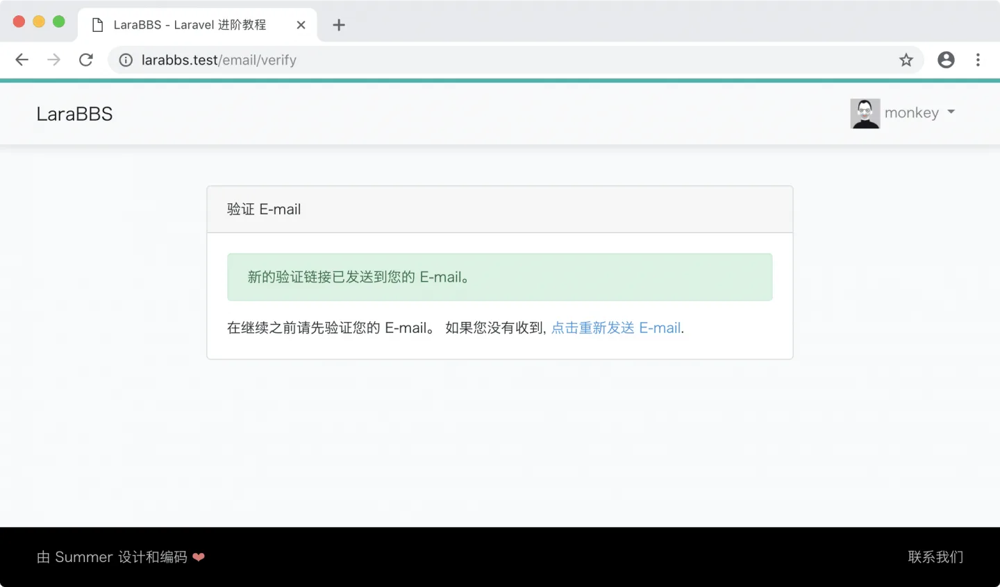
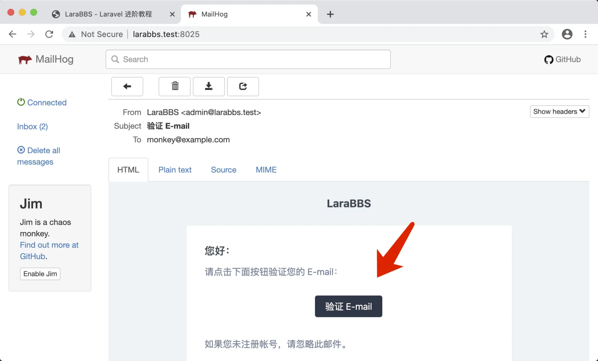
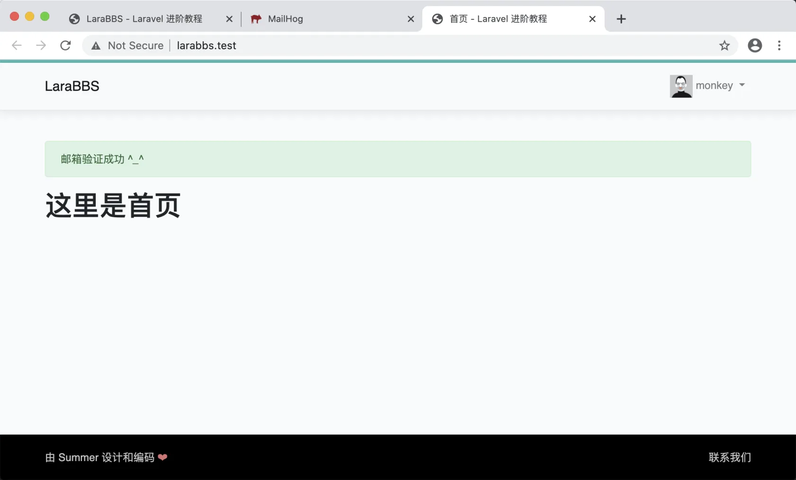

# 3.8. 认证后的提示

原文链接：https://learnku.com/courses/laravel-intermediate-training/9.x/tips-after-certification/12486

## 消息提示

在上一节中我们开发了邮件认证功能，不过还有一点瑕疵 —— 认证成功后，没有消息提醒，感觉很突兀。如下：



本节课我们来对此问题进行优化。

## 阅读源码

打开 `VerificationController` ，此控制器处理所有邮件认证相关逻辑：

app/Http/Controllers/Auth/VerificationController.php

```
<?php

namespace App\Http\Controllers\Auth;

use App\Http\Controllers\Controller;
use App\Providers\RouteServiceProvider;
use Illuminate\Foundation\Auth\VerifiesEmails;

class VerificationController extends Controller
{
    use VerifiesEmails;

    protected $redirectTo = RouteServiceProvider::HOME;

    public function __construct()
    {
        $this->middleware('auth');
        $this->middleware('signed')->only('verify');
        $this->middleware('throttle:6,1')->only('verify', 'resend');
    }
}
```

源码解析：

构建函数里使用了三个中间件，并且使用了中间件简称，这些简称是在 `app/Http/Kernel.php` 中的 `$routeMiddleware` 属性里做了定义，以下是三个中间件调用的解释：

```bash
$this->middleware('auth');
```

设定了所有的控制器动作都需要登录后才能访问。

```bash
$this->middleware('signed')->only('verify');
```

设定了 只有  `verify` 动作使用 `signed` 中间件进行认证， `signed` 中间件是一种由框架提供的很方便的 URL 签名认证方式，此中间件的更多说明请见 [Laravel 5.6 新功能 —— 路由签名](https://learnku.com/laravel/t/9404/laravel-56-new-function-routing-signature) 。

```bash
$this->middleware('throttle:6,1')->only('verify', 'resend');
```

对 `verify` 和 `resend` 动作做了频率限制，`throttle` 中间件是框架提供的访问频率限制功能，`throttle` 中间件会接收两个参数，这两个参数决定了在给定的分钟数内可以进行的最大请求数。 在这个例子中，我们限定了这两个动作访问频率是 1 分钟内不能超过 6 次。

## VerifiesEmails Trait

控制器中：

```
use VerifiesEmails;
```

在 Laravel 的注册登录系统里面，一般都使用 PHP 的 Trait 机制来将提前设定好的功能注入到控制器里。在此控制器中，我们可以看到使用了 `VerifiesEmails` Trait ，打开此文件查看源码：

vendor/laravel/ui/auth-backend/VerifiesEmails.php

```
<?php

namespace Illuminate\Foundation\Auth;

use Illuminate\Auth\Access\AuthorizationException;
use Illuminate\Auth\Events\Verified;
use Illuminate\Http\JsonResponse;
use Illuminate\Http\Request;

trait VerifiesEmails
{
use RedirectsUsers;

/**
* 显示认证邮件提醒页面
*/
public function show(Request $request)
{
return $request->user()->hasVerifiedEmail()
? redirect($this->redirectPath())
: view('auth.verify');
}

/**
* 处理认证成功后的业务逻辑，请注意签名认证发生在 `signed` 中间件里，
* 在 VerificationController 的 __construct 方法里做了设定
*/
public function verify(Request $request)
{
if (! hash_equals((string) $request->route('id'), (string) $request->user()->getKey())) {
throw new AuthorizationException;
}

if (! hash_equals((string) $request->route('hash'), sha1($request->user()->getEmailForVerification()))) {
throw new AuthorizationException;
}

if ($request->user()->hasVerifiedEmail()) {
return $request->wantsJson()
? new JsonResponse([], 204)
: redirect($this->redirectPath());
}

if ($request->user()->markEmailAsVerified()) {
event(new Verified($request->user()));
}

if ($response = $this->verified($request)) {
return $response;
}

return $request->wantsJson()
? new JsonResponse([], 204)
: redirect($this->redirectPath())->with('verified', true);
}

/**
* 提供一个钩子，有需要的话，可扩展自定义的验证逻辑
*/
protected function verified(Request $request)
{
//
}

/**
* 重新发送用户认证邮件
*/
public function resend(Request $request)
{
if ($request->user()->hasVerifiedEmail()) {
return $request->wantsJson()
? new JsonResponse([], 204)
: redirect($this->redirectPath());
}

$request->user()->sendEmailVerificationNotification();

return $request->wantsJson()
? new JsonResponse([], 202)
: back()->with('resent', true);
}
}
```

每个动作的作用上面代码中已做了注释，请注意看 `verify` 方法里这一段：

```
if ($request->user()->markEmailAsVerified()) {
event(new Verified($request->user()));
}
```

如果用户能够成功设置为已认证的话，触发事件 `Verified` 并将用户传参。这里使用了 Laravel 的事件系统。

## Laravel 事件系统

Laravel 事件是一套简单的观察者实现，能够订阅和监听应用中发生的各种事件。事件系统为应用各个方面的解耦提供了非常棒的解决方案，因为单个事件可以拥有多个互不依赖的监听器。

在我们这个场景中，用户认证成功后触发了 `Verified` 事件，我们对其进行监听即可加入我们想要的逻辑。此时也许有同学要问，为何不直接修改 `vendor/laravel/ui/auth-backend/VerifiesEmails.php` 文件即可？因为此文件是 Laravel 框架自带的，本地修改后，无法纳入版本控制系统里，也无法同步到线上或者其他环境。所以正确的方式，是对 `Verified` 事件进行监听。

应用的事件监听需要在 `EventServiceProvider` 里注册：

app/Providers/EventServiceProvider.php

```
<?php

.
.
.

class EventServiceProvider extends ServiceProvider
{
    /**
    * The event listener mappings for the application.
    *
    * @var array
    */
    protected $listen = [
        .
        .
        .
        \Illuminate\Auth\Events\Verified::class => [
            \App\Listeners\EmailVerified::class,
        ],
    ];

    .
    .
    .
}
```

这种键值对应的写法，可以让单个事件对应多个监听器，这里我们的事件是 `\Illuminate\Auth\Events\Verified` ，监听器是 `\App\Listeners\EmailVerified` 。`Listeners` 文件夹是约定俗成的监听器命名，接下来我们使用命令行来生成此监听器：

```bash
$ php artisan event:generate
```

以上命令会为我们生成 `app/Listeners/EmailVerified.php` 文件，稍作修改：

```
<?php

namespace App\Listeners;

use Illuminate\Auth\Events\Verified;
use Illuminate\Queue\InteractsWithQueue;
use Illuminate\Contracts\Queue\ShouldQueue;

class EmailVerified
{
public function handle(Verified $event)
{
// 会话里闪存认证成功后的消息提醒
session()->flash('success', '邮箱验证成功 ^_^');
}
}
```

## 开始测试

事件监听器已经部署好，接下来我们测试一下。

为了测试方便，我们先手工更改数据，将用户还原到注册成功后的状态。打开数据库客户端，定位到当前登录用户，修改 `email_verified_at` 字段为 `NULL`：



刷新页面会跳转至认证提醒页：



点击『点击重新发送 E-mail.』链接发送认证邮件：



访问 [larabbs.test:8025/](http://larabbs.test:8025/) 打开最新的邮件，点击验证 Email：



认证成功，即可看到提示：



## Git 代码版本控制

接着让我们将本次更改纳入版本控制中：

```bash
$ git add -A
$ git commit -m "认证后的消息提醒"
```
