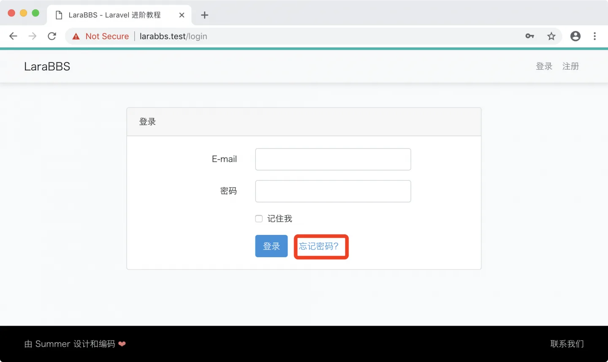
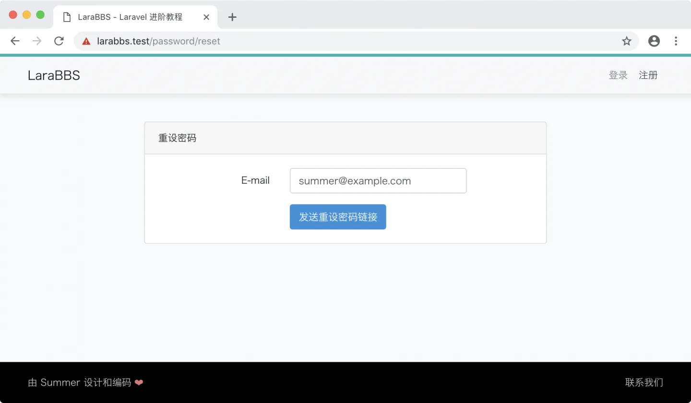
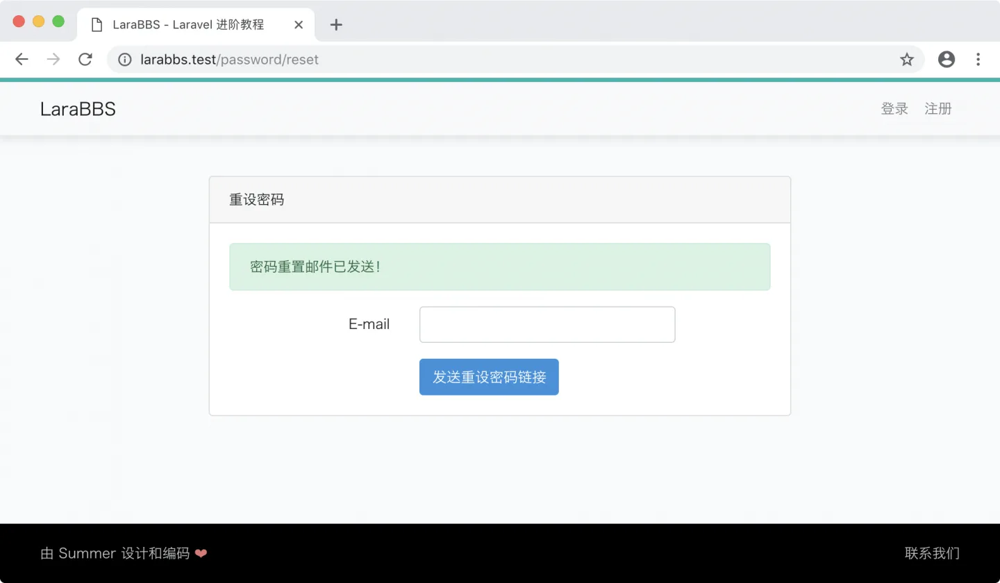
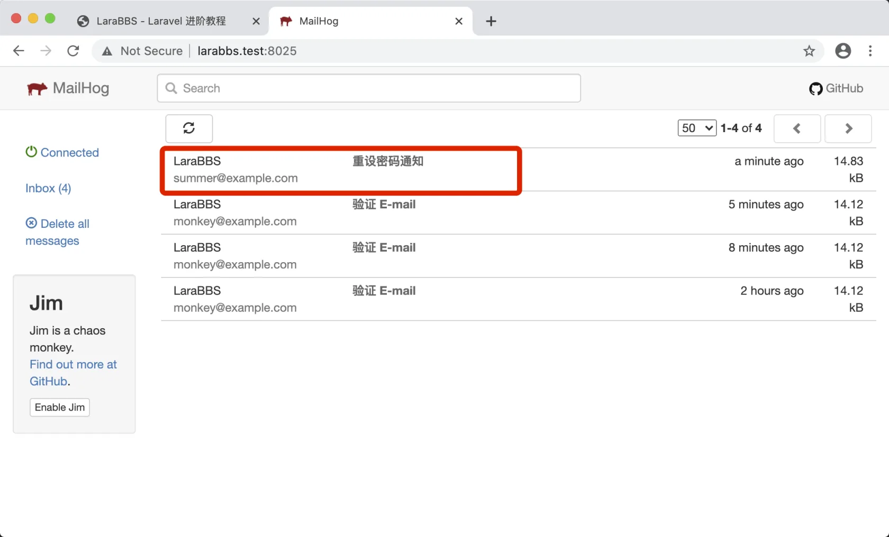
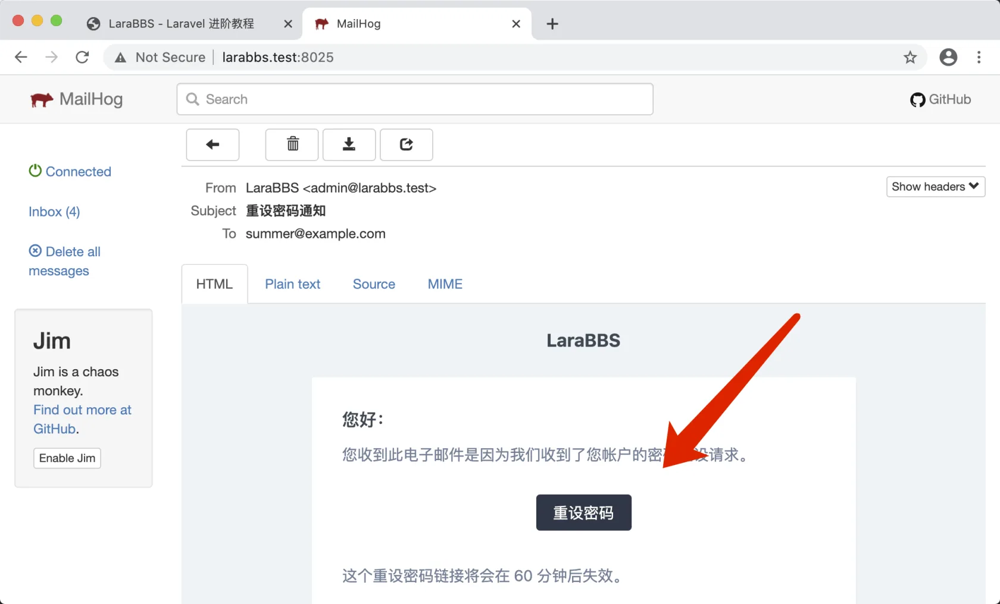
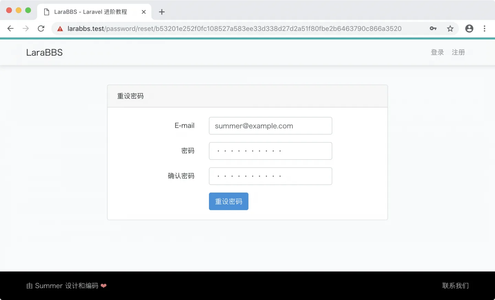
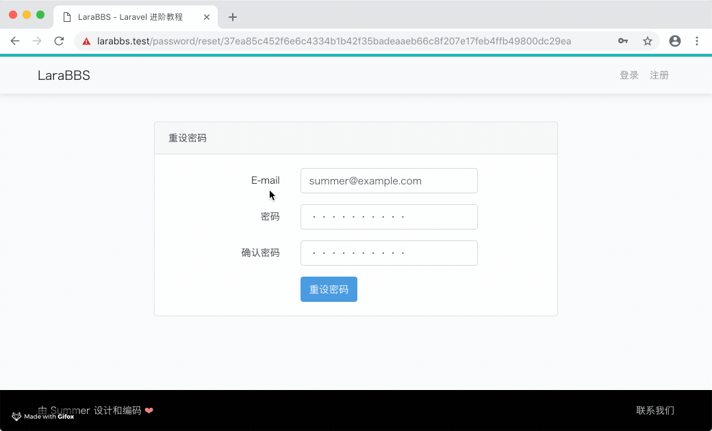
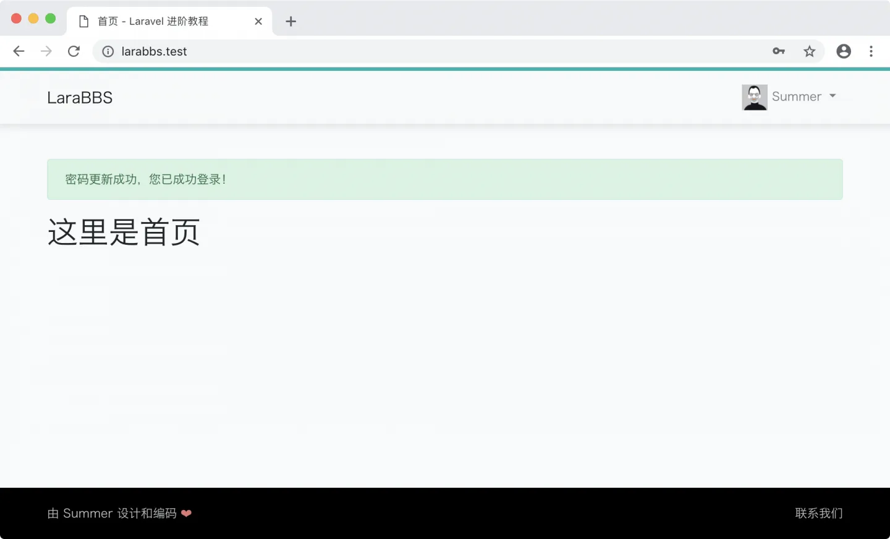

# 3.9. 密码重置

原文链接：https://learnku.com/courses/laravel-intermediate-training/9.x/password-reset/12487

## 找回密码

这节课我们来完善找回密码的逻辑。目前我们使用的是 `make auth` 生成的认证系统，原理是在控制器 `ResetPasswordController` 里使用 `ResetsPasswords` Trait 来集成框架功能。

本节课我们先来走一遍流程，看会出现哪些问题，并对这些问题进行修复。

## 开始之前

本节课我们仍然使用 Summer 用户来做演示，演示之前我们需要激活一下，否则会被强制跳转到认证邮箱提醒页面。

进入 Tinker：

```bash
$ php artisan tinker
```

利用 `markEmailAsVerified()` 方法：

```bash
>>> App\Models\User::find(1)->markEmailAsVerified();
=> true
```

确认一下 `email_verified_at` 是否不为 `NULL`：

```bash
>>> App\Models\User::find(1)
=> App\Models\User {#2947
id: 1,
name: "summer",
email: "summer@example.com",
email_verified_at: "2022-03-06 09:30:07",
#password: "$2y$10$/C.AwjP10LAcsMCR/fAis.XanTkpgKsrqu.svZaqKIjNtD86UfRjq",
#remember_token: null,
created_at: "2022-03-05 19:33:18",
updated_at: "2022-03-06 09:30:07",
}
```

## 开始测试

点击导航栏里的登录按钮进入登录页面：



点击『忘记密码？』链接进入重设密码页面，写入邮箱：



提交：



此时系统会发送找回密码的邮件，打开 [larabbs.test:8025/](http://larabbs.test:8025/) 查看发送的邮件：



查看邮件并点击箭头指向的按钮：



填写信息：



并提交：



发现了一个问题，直接跳转，虽然成功了，但是没有消息提示，很突兀，与邮件认证同样的问题。

## 分析源码

路由文件 web.php 中定义负责处理更改的动作是 `ResetPasswordController` 里的 `reset()` 方法：

```
Route::post('password/reset', 'Auth\ResetPasswordController@reset')->name('password.update');
```

打开 `Auth\ResetPasswordController` ，未发现 `reset()` 方法，根据我们之前的经验，应该在其加载的 Trait `ResetsPasswords` 里，打开此文件查看源码：

vendor/laravel/ui/auth-backend/ResetsPasswords.php

```
<?php

.
.
.

trait ResetsPasswords
{
.
.
.
// 处理 重设密码的逻辑
public function reset(Request $request)
{
// 验证用户提交的表单内容
$request->validate($this->rules(), $this->validationErrorMessages());

// 尝试重置用户的密码，成功的话会更新数据库里的密码，否则会
// 解析并将错误返回。
$response = $this->broker()->reset(
$this->credentials($request), function ($user, $password) {
$this->resetPassword($user, $password);
}
);

// 如果重置成功，我们会调用 sendResetResponse 方法重定向到程序主页上，
// 失败的话调用 sendResetFailedResponse 返回并附带错误信息
return $response == Password::PASSWORD_RESET
? $this->sendResetResponse($request, $response)
: $this->sendResetFailedResponse($request, $response);
}
.
.
.
protected function sendResetResponse(Request $request, $response)
{
if ($request->wantsJson()) {
return new JsonResponse(['message' => trans($response)], 200);
}

return redirect($this->redirectPath())
->with('status', trans($response));
}
.
.
.
}
```

从代码以及其中的注释中可看出，成功时候调用了 `sendResetResponse()` 方法，可惜此方法内的逻辑不是我们想要的。我们需要在表单提交成功后，设置闪存信息，再重定向到首页。

## 解决方案

我们可以利用 PHP 里 Trait 的加载机制，在控制器中重写  `sendResetResponse()` 方法：

app/Http/Controllers/Auth/ResetPasswordController.php

```
<?php

namespace App\Http\Controllers\Auth;

use App\Http\Controllers\Controller;
use App\Providers\RouteServiceProvider;
use Illuminate\Foundation\Auth\ResetsPasswords;
use Illuminate\Http\Request;

class ResetPasswordController extends Controller
{
    use ResetsPasswords;

    /**
    * 重置成功后的跳转
    */
    protected $redirectTo = RouteServiceProvider::HOME;

    public function __construct()
    {
        $this->middleware('guest');
    }

    protected function sendResetResponse(Request $request, $response)
    {
        session()->flash('success', '密码更新成功，您已成功登录！');
        return redirect($this->redirectPath());
    }
}
```

重写 `sendResetResponse()` 的逻辑后，重新走一遍上面的找回密码的流程。当新密码表单提交后，即可看到我们温馨的消息提醒：



## Git 代码版本控制

接着让我们将本次更改纳入版本控制中：

```bash
$ git add -A
$ git commit -m "找回密码成功消息提示"
```
