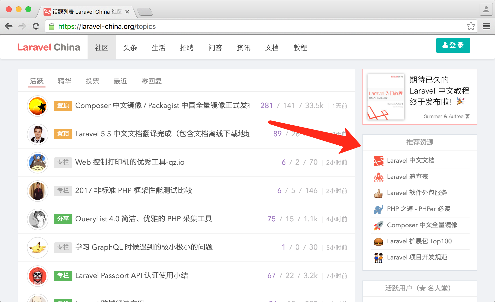
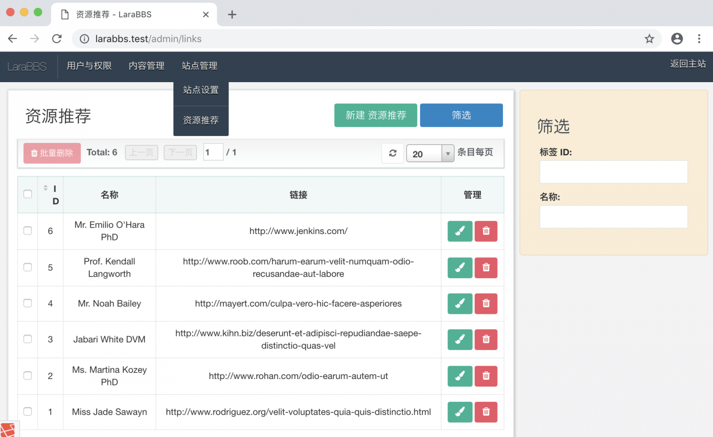
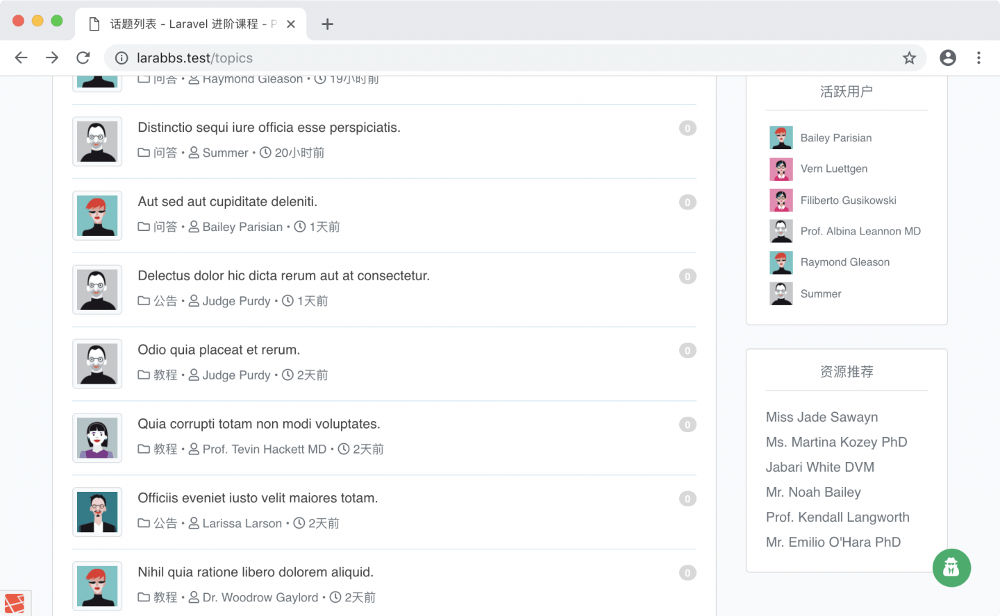
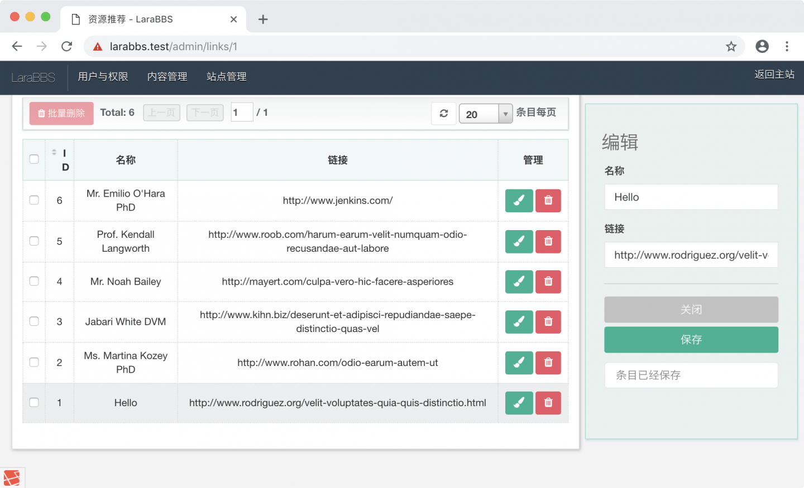
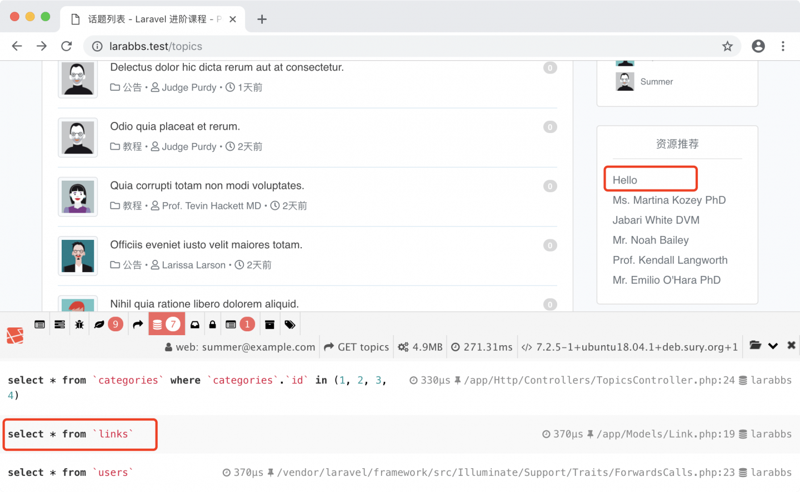
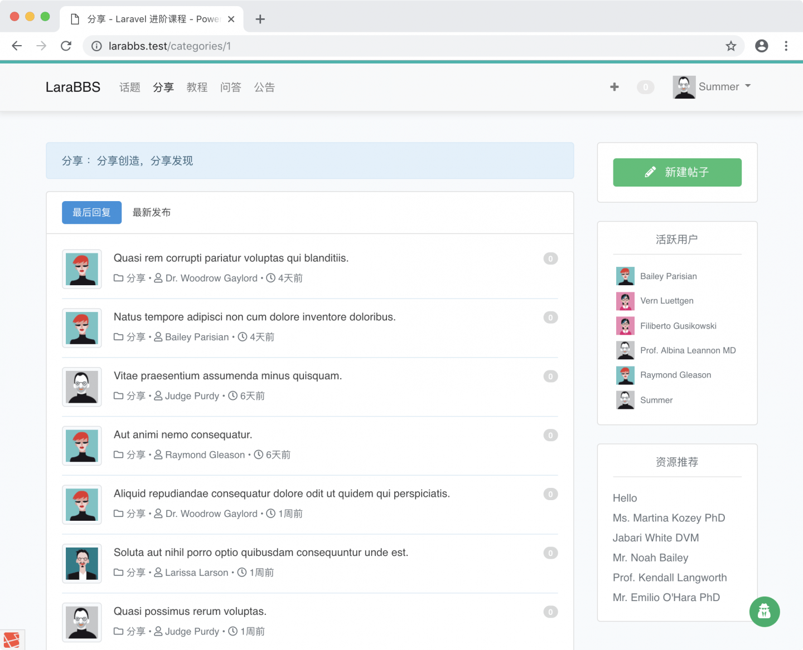

# 9.2. 边栏资源推荐

原文链接：https://learnku.com/courses/laravel-intermediate-training/9.x/sidebar-resource-recommendation/12536

## 资源推荐



接下来我们将开发右边栏的资源推荐区块，并允许站长在后台对此块内容进行编辑。因为推荐资源数据属于极少修改的数据，我们还会使用缓存来为加速读取。

## 1. 生成数据模型

我们为资源推荐模型取名 `Link` ，使用命令行新建模型，顺便创建数据库迁移：

```
$ php artisan make:model Link -m
```

修改数据库迁移文件为以下：

{timestamp}_create_links_table

```
.
.
.
public function up()
{
Schema::create('links', function (Blueprint $table) {
$table->increments('id');
$table->string('title')->comment('资源的描述')->index();
$table->string('link')->comment('资源的链接')->index();
$table->timestamps();
});
}

public function down()
{
Schema::dropIfExists('links');
}
.
.
.
```

执行数据库迁移生成表结构：

```
$ php artisan migrate
```

基于过去的经验，我们知道还需要定义模型的 `$fillable` 字段，否则将无法更新数据：

app/Models/Link.php

```
<?php

namespace App\Models;

use Illuminate\Database\Eloquent\Factories\HasFactory;
use Illuminate\Database\Eloquent\Model;

class Link extends Model
{
use HasFactory;

protected $fillable = ['title', 'link'];
}
```

## 2. 生成假数据

### 第一步：生成数据工厂

```
$ php artisan make:factory LinkFactory
```

修改为以下：

database/factories/LinkFactory.php

```
<?php

namespace Database\Factories;

use Illuminate\Database\Eloquent\Factories\Factory;

class LinkFactory extends Factory
{
public function definition()
{
return [
'title' => $this->faker->name,
'link' => $this->faker->url,
];
}
}
```

### 第二步：生成填充类

```
$ php artisan make:seeder LinksTableSeeder
```

修改为以下：

database/seeders/LinksTableSeeder.php

```
<?php

namespace Database\Seeders;

use Illuminate\Database\Seeder;
use App\Models\Link;

class LinksTableSeeder extends Seeder
{
public function run()
{
Link::factory()->times(6)->create();
}
}
```

### 第三步：注册 DatabaseSeeder

新增调用：

database/seeders/DatabaseSeeder.php

```
<?php

namespace Database\Seeders;

use Illuminate\Database\Seeder;

class DatabaseSeeder extends Seeder
{
public function run()
{
$this->call(UsersTableSeeder::class);
$this->call(TopicsTableSeeder::class);
$this->call(RepliesTableSeeder::class);
$this->call(LinksTableSeeder::class);
}
}
```

### 第四步：重新生成数据

刷新数据库，然后重新生成数据：

```
$ php artisan migrate:refresh --seed
```

## 3. 资源链接管理后台

后台『站点管理』子菜单下新增 `links` 入口：

config/administrator.php

```
<?php

return array(
.
.
.
'menu' => [
'用户与权限' => [
'users',
'roles',
'permissions',
],
'内容管理' => [
'categories',
'topics',
'replies',
],
'站点管理' => [
'settings.site',
'links',
],
],
.
.
.
);

```

新建模型配置信息：

config/administrator/links.php

```
<?php

use App\Models\Link;
use Illuminate\Support\Facades\Auth;

return [
'title'   => '资源推荐',
'single'  => '资源推荐',

'model'   => Link::class,

// 访问权限判断
'permission'=> function()
{
// 只允许站长管理资源推荐链接
return Auth::user()->hasRole('Founder');
},

'columns' => [
'id' => [
'title' => 'ID',
],
'title' => [
'title'    => '名称',
'sortable' => false,
],
'link' => [
'title'    => '链接',
'sortable' => false,
],
'operation' => [
'title'  => '管理',
'sortable' => false,
],
],
'edit_fields' => [
'title' => [
'title'    => '名称',
],
'link' => [
'title'    => '链接',
],
],
'filters' => [
'id' => [
'title' => '标签 ID',
],
'title' => [
'title' => '名称',
],
],
];
```

因为我们只允许站长查看，所以请登录 1 号用户 Summer，并访问后台，即可看到『资源推荐』的数据：



## 4. 页面渲染

控制器里调用，右边栏是话题列表显示，故修改 `index()` 方法：

app/Http/Controllers/TopicsController.php

```
<?php
.
.
.
use App\Models\Link;

class TopicsController extends Controller
{
.
.
.
public function index(Request $request, Topic $topic, User $user, Link $link)
{
$topics = $topic->withOrder($request->order)
->with('user', 'category')  // 预加载防止 N+1 问题
->paginate(20);
$active_users = $user->getActiveUsers();
$links = $link->getAllCached();

return view('topics.index', compact('topics', 'active_users', 'links'));
}
.
.
.
}
```

使用 Link 前，需要对其进行引入操作。`index()` 方法的第四个参数用来实例化 `$link` 变量，并调用 `getAllCached()` 方法，此方法我们还未定义，接下来前往 Link 模型中编写此方法，此方法返回的数据是缓存过的，所有 `links` 数据表里的数据：

app/Models/Link.php

```
<?php

namespace App\Models;

use Illuminate\Database\Eloquent\Factories\HasFactory;
use Illuminate\Support\Facades\Cache;

class Link extends Model
{
use HasFactory;

protected $fillable = ['title', 'link'];

public $cache_key = 'larabbs_links';
protected $cache_expire_in_seconds = 1440 * 60;

public function getAllCached()
{
// 尝试从缓存中取出 cache_key 对应的数据。如果能取到，便直接返回数据。
// 否则运行匿名函数中的代码来取出 links 表中所有的数据，返回的同时做了缓存。
return Cache::remember($this->cache_key, $this->cache_expire_in_seconds, function(){
return $this->all();
});
}
}
```

接下来修改边栏模板：

resources/views/topics/_sidebar.blade.php

```
.
.
.

@if (count($links))
<div class="card mt-4">
<div class="card-body pt-2">
<div class="text-center mt-1 mb-0 text-muted">资源推荐</div>
<hr class="mt-2 mb-3">
@foreach ($links as $link)
<a class="d-flex mt-1 text-decoration-none" href="{{ $link->link }}">
<div class="media-body">
<span class="media-heading text-muted">{{ $link->title }}</span>
</div>
</a>
@endforeach
</div>
</div>
@endif
```

刷新页面即可看到我们的资源推荐列表：



尝试在后台修改链接的内容，然后查看页面，发现资源推荐并未发生修改：



这是因为我们做了缓存，页面读取的是缓存里的信息，而后台更新的是数据库里的数据。

## 5. 自动缓存更新

### 第一步：新建监控器

我们可以对模型变更进行监听，当发生模型修改时，清空对应 `$cache_key` 的缓存数据。

接下来新建模型监控器：

app/Observers/LinkObserver.php

```
<?php

namespace App\Observers;

use App\Models\Link;
use Illuminate\Support\Facades\Cache;

class LinkObserver
{
// 在保存时清空 cache_key 对应的缓存
public function saved(Link $link)
{
Cache::forget($link->cache_key);
}
}
```

### 第二步：注册监控器

手动添加模型监控器时，需要到 `AppServiceProvider` 中注册：

app/Providers/AppServiceProvider.php

```
<?php
.
.
.
class AppServiceProvider extends ServiceProvider
{
.
.
.
/**
* Bootstrap any application services.
*
* @return void
*/
public function boot()
{
\App\Models\User::observe(\App\Observers\UserObserver::class);
\App\Models\Reply::observe(\App\Observers\ReplyObserver::class);
\App\Models\Topic::observe(\App\Observers\TopicObserver::class);
\App\Models\Link::observe(\App\Observers\LinkObserver::class);

}
}
```

### 第三步：再尝试一遍

后台测试修改标题并保持，刷新话题列表页即可看到数据更新了，并且页面多出来一条 SQL 请求：



## 6 分类话题列表

分类话题列表页使用侧边栏，我们需要在分类控制器中将『资源链接』数据传入模板中：

app/Http/Controllers/CategoriesController.php

```
<?php
.
.
.
use App\Models\Link;

class CategoriesController extends Controller
{
public function show(Category $category, Request $request, Topic $topic, User $user, Link $link)
{
// 读取分类 ID 关联的话题，并按每 20 条分页
$topics = $topic->withOrder($request->order)
->where('category_id', $category->id)
->with('user',  'category')  // 预加载防止 N+1 问题
->paginate(20);
// 活跃用户列表
$active_users = $user->getActiveUsers();
// 资源链接
$links = $link->getAllCached();
// 传参变量到模板中
return view('topics.index', compact('topics', 'category', 'active_users', 'links'));
}
}
```

注意顶部引入 Link 类，`show()` 方法新增 `$link` 参数实体调用，调用 `getAllCached()` 获取缓存好的数据，并将 `$links` 传入模板中。

随便访问一个分类话题列表，即可看到右边栏的推荐资源：



## Git 版本控制

下面把代码纳入到版本管理：

```
$ git add -A
$ git commit -m "侧边栏链接"
```
