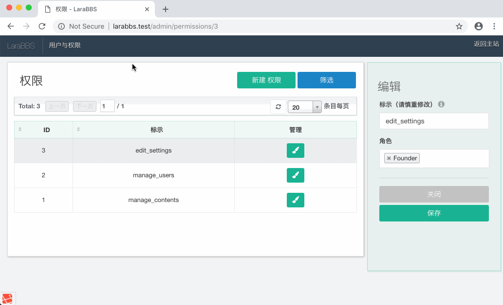
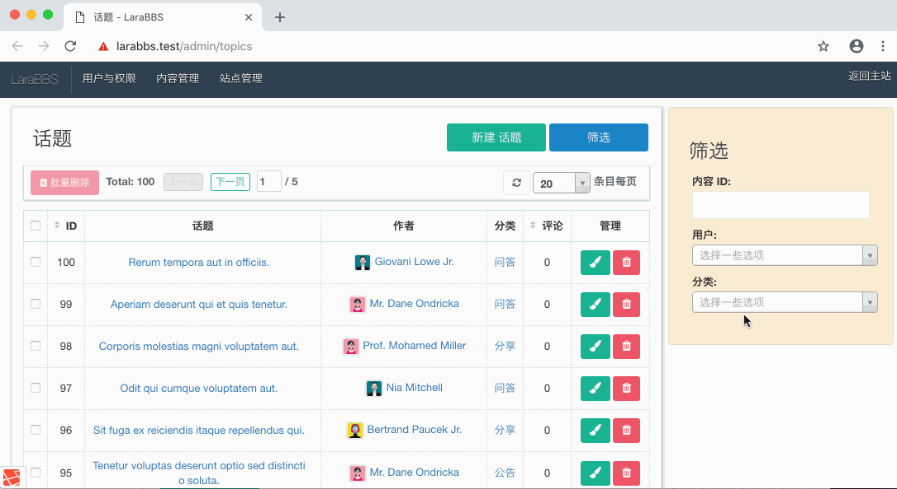
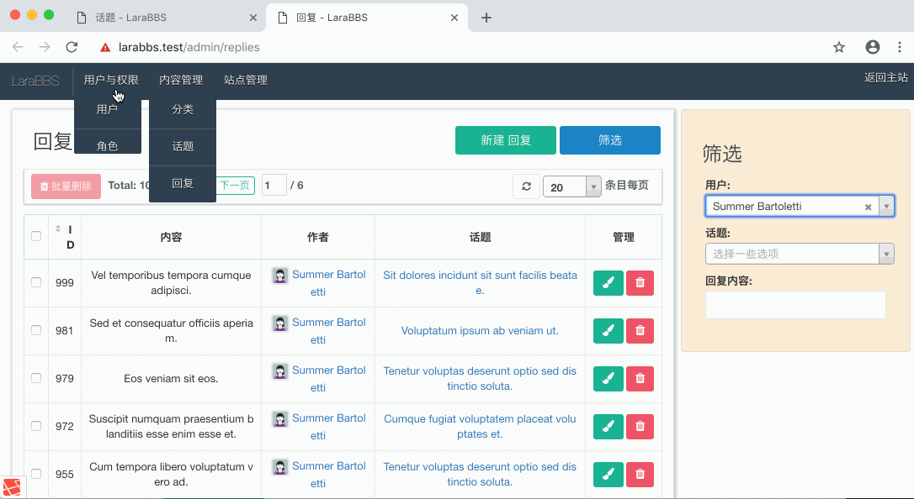

# 9.3. 防止数据损坏

原文链接：https://learnku.com/courses/laravel-intermediate-training/9.x/delete-user/12537

## 数据损坏



上图是我们在开发『内容管理』后台时，出现的错误：

>

Trying to get property of non-object

原因如下：

>

这是数据损坏所致 —— 我们删除了用户，却没有删除用户发布的话题，此部分话题变成了遗留数据。话题列表中渲染到这些遗留数据时，因为不存在作者，却取作者的 avatar 头像属性，故报错。

接下来我们将修复此错误。

## 两种方法

要避免这类错误的发生，只需要在关联数据删除时，基于业务逻辑做联动删除即可。例如删除话题时，将所属的回复删除；或者是删除用户时，将用户发布过的话题和回复删除。

从实现的机制来看，可以有分以下两种类型：

- 代码监听器 —— 利用 [Eloquent 监控器](https://learnku.com/docs/laravel/9.x/eloquent#observers) 的 `deleted` 事件连带删除，好处是灵活、扩展性强，不受底层数据库约束，坏处是当删除时不添加监听器，就会出现漏删；

- 外键约束 —— 利用 MySQL 自带的外键约束功能，好处是数据一致性强，基本上不会出现漏删，坏处是有些数据库不支持，如 SQLite。

如果使用的是 MySQL 或者其分支，我们一般会选择『外键约束』的方式来实现。当然，如果业务上有特殊的逻辑，就会优先考虑代码监听器的灵活性。

## 添加外键约束

我们需要添加三个外键约束：

1. 当用户删除时，删除其发布的话题；

2. 当用户删除时，删除其发布的回复；

3. 当话题删除时，删除其所属的回复；

新建数据库迁移类：

```
$ php artisan make:migration add_references
```

使用以下代码替换：

database/migrations/{timestamp}_add_references.php

```
.
.
.
public function up()
{
Schema::table('topics', function (Blueprint $table) {

// 当 user_id 对应的 users 表数据被删除时，删除词条
$table->foreign('user_id')->references('id')->on('users')->onDelete('cascade');
});

Schema::table('replies', function (Blueprint $table) {

// 当 user_id 对应的 users 表数据被删除时，删除此条数据
$table->foreign('user_id')->references('id')->on('users')->onDelete('cascade');

// 当 topic_id 对应的 topics 表数据被删除时，删除此条数据
$table->foreign('topic_id')->references('id')->on('topics')->onDelete('cascade');
});
}

public function down()
{
Schema::table('topics', function (Blueprint $table) {
// 移除外键约束
$table->dropForeign(['user_id']);
});

Schema::table('replies', function (Blueprint $table) {
$table->dropForeign(['user_id']);
$table->dropForeign(['topic_id']);
});
}
.
.
.
```

运行迁移：

```
$ php artisan migrate
```

## 开始测试

### 1. 定位信息

后台筛选 10 号用户的话题和帖子信息：



### 2. 删除用户

保持窗口打开，新开窗口导航到管理用户列表里，删除 10 号用户，然后再刷新这些列表

：

## Git 版本控制

下面把代码纳入到版本管理：

```
$ git add -A
$ git commit -m "联动删除"
```
