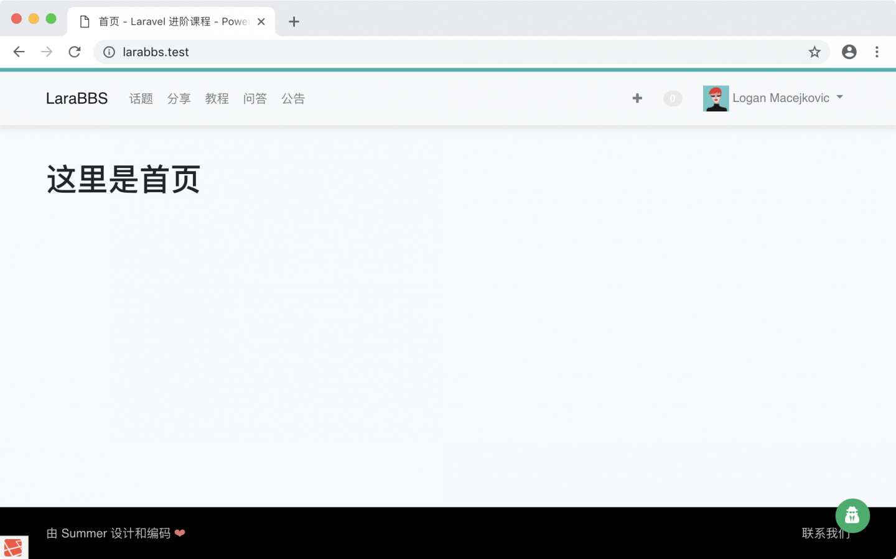
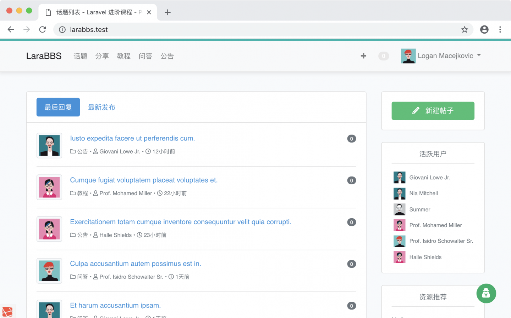
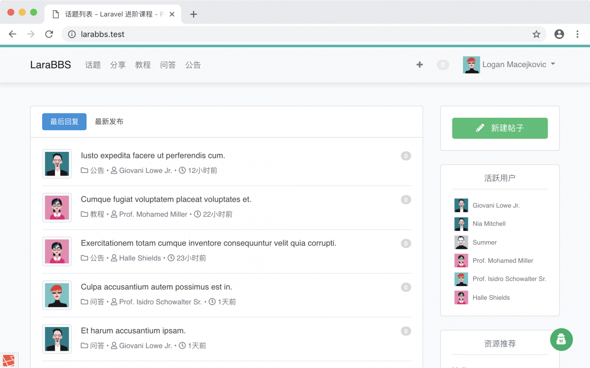

# 9.5. 站点首页

原文链接：https://learnku.com/courses/laravel-intermediate-training/9.x/site-home-page/12539

## 站点首页

现在我们的首页还是一个接近空白的页面：



接下来我们将 `/` 路由直接使用话题列表来渲染。

## 修改路由

打开 `routes/web.php` 文件，修改文件里的第一行：

```
Route::get('/', 'PagesController@root')->name('root');
```

改为：

```
Route::get('/', 'TopicsController@index')->name('root');
```

再次刷新页面：



样式有些问题，那是因为我们的话题列表页面是使用『路由专属样式类』区分的，新增路由样式类到原有的样式上即可。

寻找以下：

resources/sass/app.scss

```
.
.
.
/* Topic Index Page */
.topics-index-page, .categories-show-page {
.
.
.
}
.
.
.
```

修改为以下：

resources/sass/app.scss

```
.
.
.
/* Topic Index Page */
.topics-index-page, .categories-show-page, .root-page {
.
.
.
}
.
.
.
```

样式编译完成后，即可看到正常的话题列表：



## Git 版本控制

下面把代码纳入到版本管理：

```
$ git add -A
$ git commit -m "首页话题列表"
```
