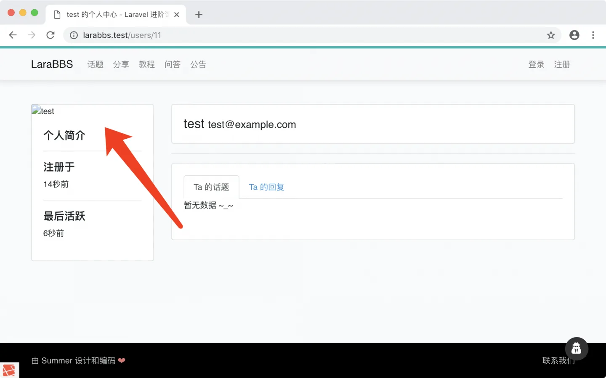
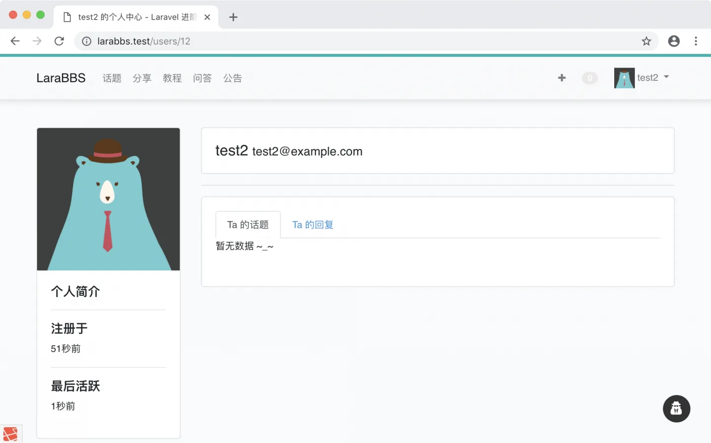

# 9.6. 用户默认头像

原文链接：https://learnku.com/courses/laravel-intermediate-training/9.x/user-default-avatar/12540

## 用户默认头像

目前通过我们的站点注册页面加入的用户，默认是没有头像的：



接下来我们将解决此问题。

## 模型监控器

我们将使用模型监控器来实现此功能，在用户数据即将入库之前，将为 `avatar` 字段设置一张默认的头像：


app/Observers/UserObserver.php

```
<?php

namespace App\Observers;

use App\Models\User;

class UserObserver
{
public function saving(User $user)
{
// 这样写扩展性更高，只有空的时候才指定默认头像
if (empty($user->avatar)) {
$user->avatar = 'https://cdn.learnku.com/uploads/images/201710/30/1/TrJS40Ey5k.png';
}
}
}
```

注册成功后：



## Git 版本控制

下面把代码纳入到版本管理：

```
$ git add -A
$ git commit -m "注册用户默认头像"
```
