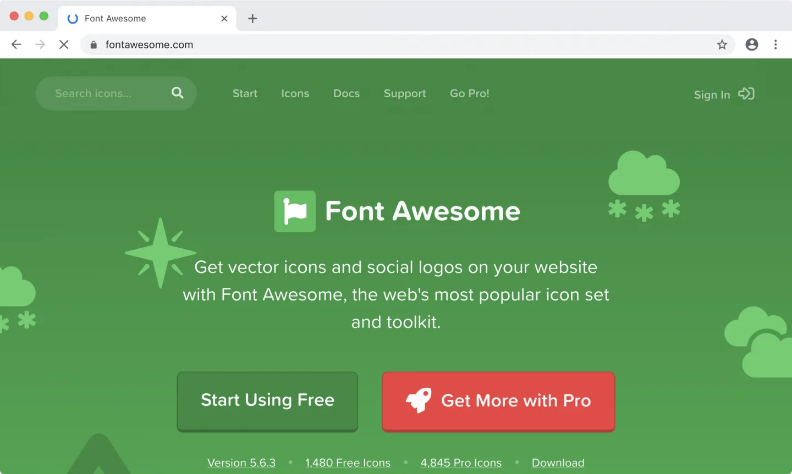
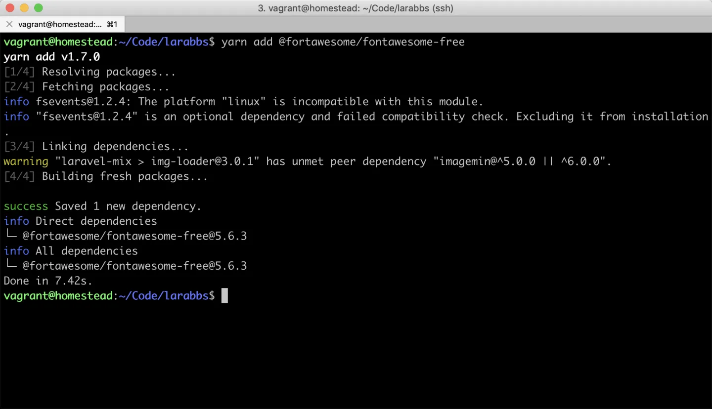
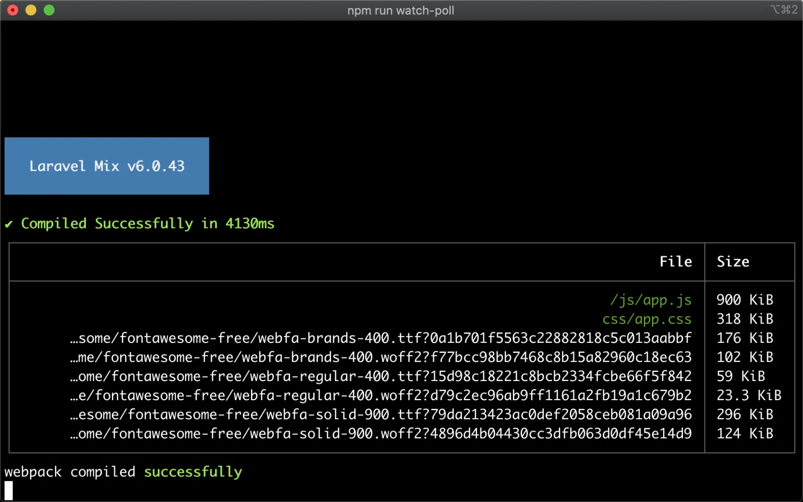

# 2.10. 字体图标

原文链接：https://learnku.com/courses/laravel-intermediate-training/9.x/font-icon/12478



本项目我们将使用 [Font Awesome](https://fontawesome.com/) 来作为字体图标库。Font Awesome 提供了可缩放的矢量图标，允许我们使用 CSS 所提供的所有特性对它们进行更改，包括：大小、颜色、阴影或者其它任何支持的效果。

## 1. 安装

```bash
$ yarn add @fortawesome/fontawesome-free
```

输出：



打开 `package.json` 可以看到新增了这一行依赖：

package.json

```
{
.
.
.

"dependencies": {
"@fortawesome/fontawesome-free": "^5.6.3"
}
}
```

>

注意： 版本号不一致请忽略。

## 2. 载入

我们还需要在样式中载入：

resources/sass/app.scss

```
// Variables
@import 'variables';

// Bootstrap
@import '~bootstrap/scss/bootstrap';

// Fontawesome
@import '~@fortawesome/fontawesome-free/scss/fontawesome';
@import '~@fortawesome/fontawesome-free/scss/regular';
@import '~@fortawesome/fontawesome-free/scss/solid';
@import '~@fortawesome/fontawesome-free/scss/brands';

/* universal */
.
.
.
```

## 3. 编译

运行 mix 编译命令：

```bash
$ npm run watch-poll
```

能看到类似以下的输出即可：



## Git 代码版本控制

接着让我们将本次更改纳入版本控制中：

```bash
$ git add -A
$ git commit -m "增加字体图标"
```
