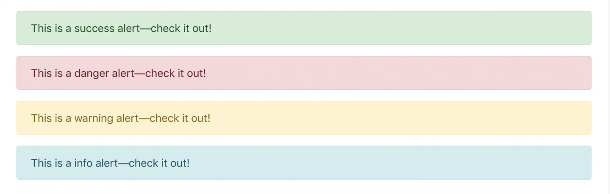
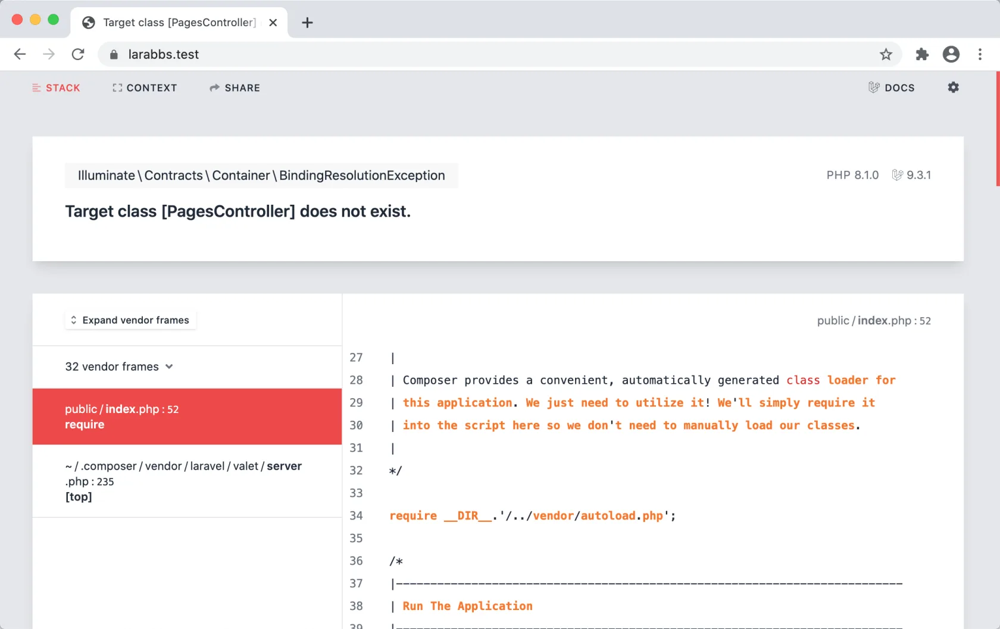
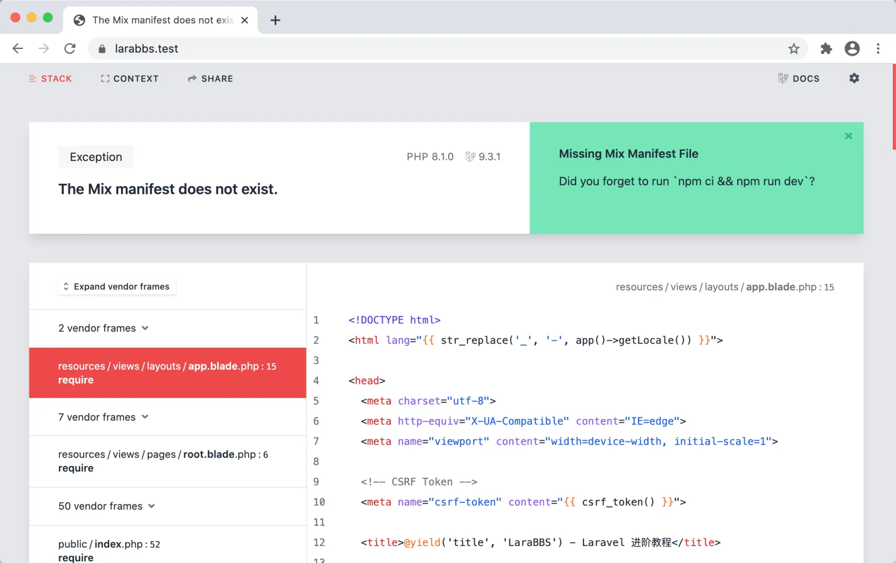

# 2.7. 基础布局

原文链接：https://learnku.com/courses/laravel-intermediate-training/9.x/base-layout/12476

## 基础布局

在教程开始之前，我们需要为我们的项目构建一个基础的页面布局，布局文件统一存放在 `resources/views/layouts` 文件夹中，布局涉及的文件如下：

- app.blade.php —— 主要布局文件，项目的所有页面都将继承于此页面；

- _header.blade.php —— 布局的头部区域文件，负责顶部导航栏区块；

- _footer.blade.php —— 布局的尾部区域文件，负责底部导航区块；

## 主要布局文件

我们先创建主要布局文件：

resources/views/layouts/app.blade.php

```
<!DOCTYPE html>
<html lang="{{ str_replace('_', '-', app()->getLocale()) }}">

<head>
<meta charset="utf-8">
<meta http-equiv="X-UA-Compatible" content="IE=edge">
<meta name="viewport" content="width=device-width, initial-scale=1">

<!-- CSRF Token -->
<meta name="csrf-token" content="{{ csrf_token() }}">

<title>@yield('title', 'LaraBBS') - Laravel 进阶教程</title>

<!-- Styles -->
<link href="{{ mix('css/app.css') }}" rel="stylesheet">

</head>

<body>
<div id="app" class="{{ route_class() }}-page">

@include('layouts._header')

<div class="container">

@include('shared._messages')

@yield('content')

</div>

@include('layouts._footer')
</div>

<!-- Scripts -->
<script src="{{ mix('js/app.js') }}"></script>
</body>

</html>
```

`app()->getLocale()` 获取的是 `config/app.php` 中的 `locale` 选项，因为我们在前面章节中设置了 `'locale' => 'zh_CN'`, 所以在此处使用 `str_replace()` 函数将 `_` 替换为 `-`，最终输出的值为 `zh-CN`。

```
<meta name="csrf-token" content="{{ csrf_token() }}">
```

`csrf-token` 标签是为了方便前端的 JavaScript 脚本获取 CSRF 令牌。

`@yield('title', 'LaraBBS')` 继承此模板的页面，如果没有定制 `title` 区域的话，就会自动使用第二个参数 `LaraBBS` 作为标题前缀。

`mix('css/app.css')` 会根据 `webpack.mix.js` 的逻辑来生成 CSS 文件链接。

```
<div id="app" class="{{ route_class() }}-page">
```

`route_class()` 是我们自定义的辅助方法，我们还需要在 `helpers.php` 文件中添加此方法：

app/helpers.php

```
<?php

use Illuminate\Support\Facades\Route;

function route_class()
{
return str_replace('.', '-', Route::currentRouteName());
}
```

此方法会将当前请求的路由名称转换为 CSS 类名称，作用是允许我们针对某个页面做页面样式定制。在后面的章节中会用到。

```
@include('layouts._header')
```

加载顶部导航区块的子模板。

```
@yield('content')
```

占位符声明，允许继承此模板的页面注入内容。

```
@include('layouts._footer')
```

加载页面尾部导航区块的子模板。页面的『顶部导航』和『尾部导航』子模板并不存在，接下来由我们来创建这两个模板。

## 顶部导航

resources/views/layouts/_header.blade.php

```
<nav class="navbar navbar-expand-lg navbar-light bg-light navbar-static-top">
<div class="container">
<!-- Branding Image -->
<a class="navbar-brand " href="{{ url('/') }}">
LaraBBS
</a>
<button class="navbar-toggler" type="button" data-bs-toggle="collapse" data-bs-target="#navbarSupportedContent" aria-controls="navbarSupportedContent" aria-expanded="false" aria-label="Toggle navigation">
<span class="navbar-toggler-icon"></span>
</button>

<div class="collapse navbar-collapse justify-content-between" id="navbarSupportedContent">
<!-- Left Side Of Navbar -->
<ul class="navbar-nav">

</ul>

<!-- Right Side Of Navbar -->
<ul class="navbar-nav navbar-right">
<!-- Authentication Links -->
<li class="nav-item"><a class="nav-link" href="#">登录</a></li>
<li class="nav-item"><a class="nav-link" href="#">注册</a></li>
</ul>
</div>
</div>
</nav>
```

注册登录链接我们将在后面章节中修改。

## 底部导航

创建文件：

resources/views/layouts/_footer.blade.php

```
<footer class="footer">
<div class="container">
<p class="float-start">
由 <a href="http://weibo.com/u/1837553744?is_hot=1" target="_blank">Summer</a> 设计和编码 <span style="color: #e27575;font-size: 14px;">❤</span>
</p>

<p class="float-end"><a href="mailto:name@email.com">联系我们</a></p>
</div>
</footer>
```

>

注：请将 `Summer` 修改为你自己的常用名和链接，为自己的作品署名。

## 消息提醒

resources/views/shared/_messages.blade.php

```
@foreach (['danger', 'warning', 'success', 'info'] as $msg)
@if(session()->has($msg))
<div class="flash-message">
<p class="alert alert-{{ $msg }}">
{{ session()->get($msg) }}
</p>
</div>
@endif
@endforeach
```

后面我们往闪存里写入：

```
session()->flash('success', 'This is a success alert—check it out!');
session()->flash('danger', 'This is a danger alert—check it out!');
session()->flash('warning', 'This is a warning alert—check it out!');
session()->flash('info', 'This is a info alert—check it out!');
```

即可在顶部导航栏下显示对应状态的消息提醒：



## 首页展示

### 1. 创建控制器

我们将使用控制器 `PagesController` 来处理所有自定义页面的逻辑，并使用 `root()` 方法来处理首页的展示。接下来执行以下命令新建控制器：

```bash
$ php artisan make:controller PagesController
```

将会生成以下文件：

app/Http/Controllers/PagesController.php

```
<?php

namespace App\Http\Controllers;

use Illuminate\Http\Request;

class PagesController extends Controller
{
    //
}
```

我们新增 `root()` 方法：

app/Http/Controllers/PagesController.php

```
<?php

namespace App\Http\Controllers;

use Illuminate\Http\Request;

class PagesController extends Controller
{
    public function root()
    {
        return view('pages.root');
    }
}
```

### 2. 视图

控制器 `root()` 方法中加载了视图 `pages.root`，目前我们还没有此视图文件，前往创建：

resources/views/pages/root.blade.php

```
@extends('layouts.app')
@section('title', '首页')

@section('content')
<h1>这里是首页</h1>
@stop
```

Laravel 自带一个主页视图 `welcome.blade.php`，既然我们已经自定义了主页视图，即可将废弃的主页视图删除：

```bash
$ rm resources/views/welcome.blade.php
```

### 3. 绑定路由

接下来绑定下路由，将 `web.php` 里的内容替换为以下：

routes/web.php

```
<?php

use Illuminate\Support\Facades\Route;

Route::get('/', 'PagesController@root')->name('root');
```

打开浏览器尝试访问 [larabbs.test/](http://larabbs.test/) ：



报错是 PagesController 类未找到。

我们还需要前往路由的服务提供者类中设置命名空间：

app/Providers/RouteServiceProvider.php

```
<?php
.
.
.
class  RouteServiceProvider  extends  ServiceProvider
{
    .
    .
    .
    protected  $namespace =  'App\\Http\\Controllers'; // 添加这一行
    .
    .
    .
}
```

将此文件中这段代码：

```
Route::middleware('web')
->group(base_path('routes/web.php'));
```

修改为：

```
Route::middleware('web')
->namespace($this->namespace)
->group(base_path('routes/web.php'));
```

以上代码将使用 `$namespace` 作为 `routes/web.php` 路由文件中的命名前缀，这样允许我们在路由中使用简短的 `Class@Method` 格式。

再次浏览器尝试访问 [larabbs.test/](http://larabbs.test/) ：



这个异常是因为我们在 `resources/views/layouts/app.blade.php` 中使用 `mix()` 方法，而还未运行 Laravel Mix 进行编译，找不到 `mix-manifest.json` 文件，所以报错，我们将在下一节解决此问题。

## Git 代码版本控制

接着让我们将该文件加入到版本控制中：

```bash
$ git add -A
$ git commit -m "基础页面结构"
```
