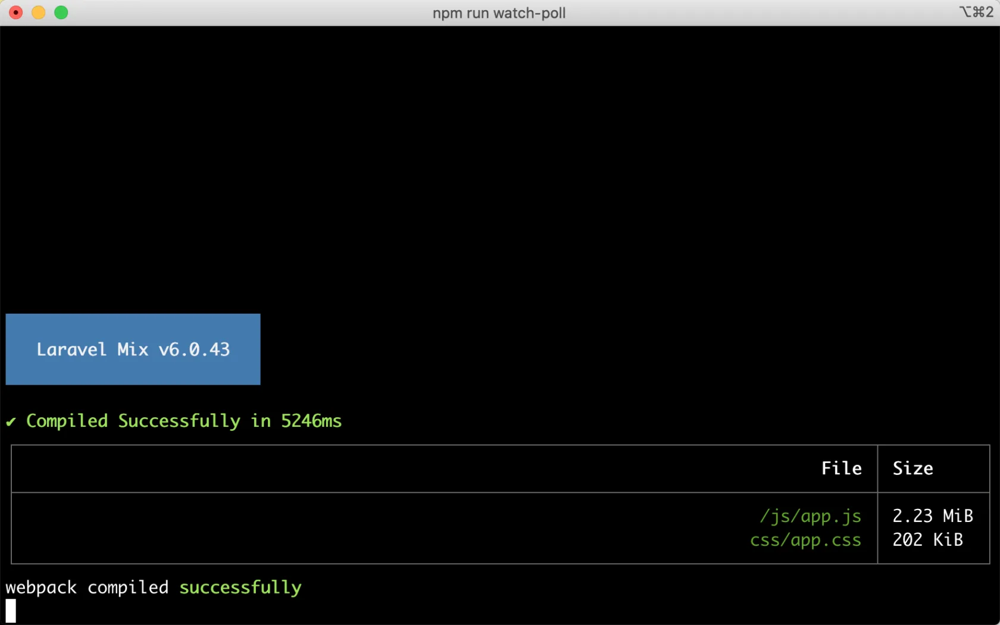
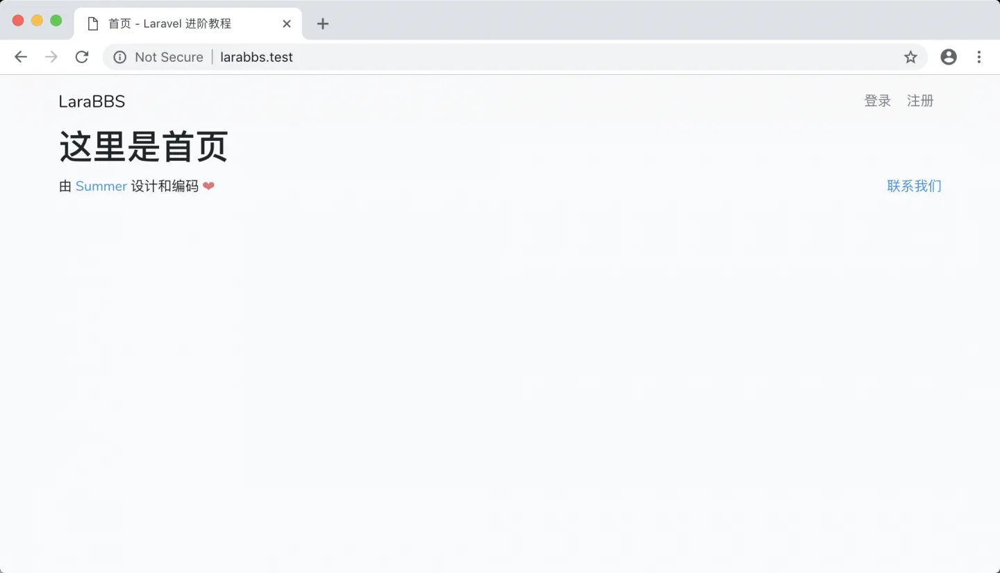
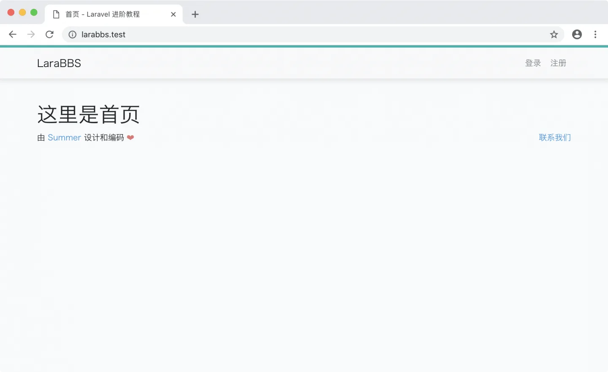
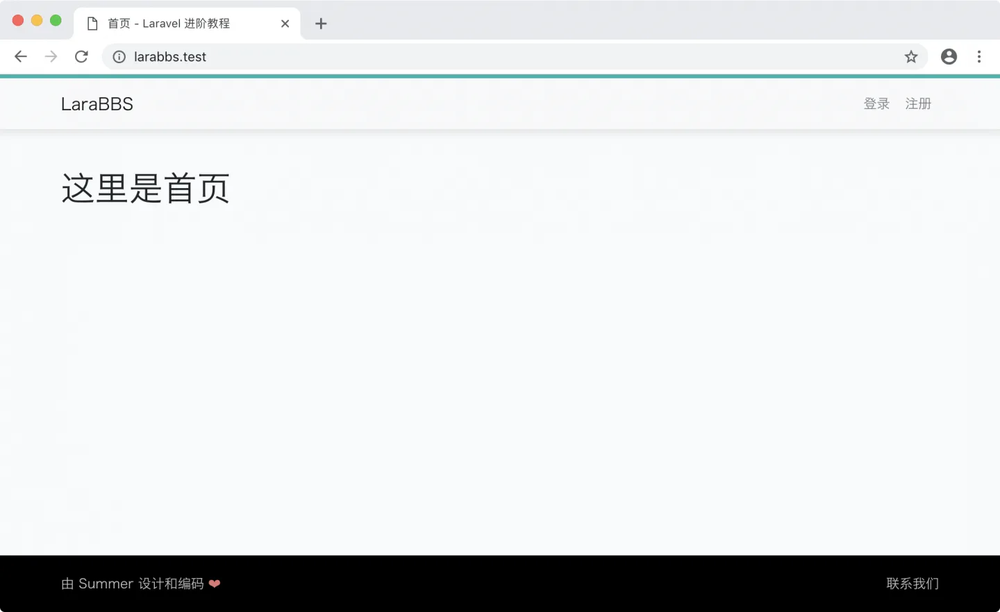

# 2.8. 样式调整

原文链接：https://learnku.com/courses/laravel-intermediate-training/9.x/style-adjustment/12548

## 前置说明

如果你在这一节卡住，一两个小时都解决不了问题，请看 [这篇文章](https://learnku.com/courses/laravel-intermediate-training/9.x/skip-front-end-code)。

## 样式调整

### 集成 Bootstrap

Laravel 项目中使用 Bootstrap 前端框架，需要先执行以下命令：

```bash
$ composer require laravel/ui:3.4.5 --dev
```

`composer require` 是用来安装扩展包使用的命令，参数 `--dev` 是指定此扩展包只在开发环境中使用。

上面的命令安装完成后，使用以下命令来引入 Bootstrap ：

```bash
$ php artisan ui bootstrap
```

以上命令做了以下事情：

1. 在 npm 依赖配置文件 `package.json` 中引入 `bootstrap`、`jquery`、`popper.js` 作为依赖；

2. 修改 `resources/js/bootstrap.js` ，在此文件中初始化 Bootstrap UI 框架的 JS 部分；

3. 修改 `resources/sass/app.scss` 以加载 Bootstrap 的样式文件；

4. 新增 `resources/sass/_variables.scss` 样式配置文件。

### 运行 Laravel Mix

Laravel Mix 一款前端任务自动化管理工具，使用了工作流的模式对制定好的任务依次执行。Mix 提供了简洁流畅的 API，让你能够为你的 Laravel 应用定义 Webpack 编译任务。Mix 支持许多常见的 CSS 与 JavaScript 预处理器，通过简单的调用，你可以轻松地管理前端资源。

使用 Mix 很简单，首先你需要使用以下命令安装 npm 依赖即可。我们将使用 Yarn 来安装依赖，在这之前，因为国内的网络原因，我们还需为 NPM 和 Yarn 配置安装加速：

```bash
$ npm config set registry=https://registry.npm.taobao.org
$ yarn config set registry https://registry.npm.taobao.org
```

使用 Yarn 安装依赖：

```bash
$ SASS_BINARY_SITE=http://npm.taobao.org/mirrors/node-sass yarn
```

在 yarn 命令前添加 `SASS_BINARY_SITE=http://npm.taobao.org/mirrors/node-sass` 的目的是告诉 yarn 到淘宝的镜像去下载 node-sass 二进制文件。

安装成功后，运行以下命令即可：

```bash
$ npm run watch-poll
```

会报错：

```bash
$ npm run watch-poll

> @ watch-poll /Users/summer/Code/weibo
> mix watch -- --watch-options-poll=1000

Additional dependencies must be installed. This will only take a moment.

Running: yarn add resolve-url-loader@^5.0.0 --dev

Finished. Please run Mix again.
.
.
.
```

按照指示安装 `resolve-url-loader`：

```bash
$ yarn add resolve-url-loader@^5.0.0 --dev
```

再次运行 `watch-poll` 命令：

```bash
$ npm run watch-poll
```

`watch-poll` 会在你的终端里持续运行，监控 `resources` 文件夹下的资源文件是否有发生改变。在 `watch-poll` 命令运行的情况下，一旦资源文件发生变化，Webpack 会自动重新编译。

>

注意：在后面的课程中，我们需要保证 `npm run watch-poll` 一直处在执行状态中。

正常运行的界面应类似：



此时再次刷新即可看到页面正常显示：



样式有点奇怪，接下来我们优化下。

### 优化页首

resources/sass/app.scss

```
// Variables
@import 'variables';

// Bootstrap
@import '~bootstrap/scss/bootstrap';

/* universal */

body {
font-family: Helvetica, "Microsoft YaHei", Arial, sans-serif;
font-size: 14px;
}

/* header */

.navbar-static-top {
border-color: #e7e7e7;
background-color: #fff;
box-shadow: 0px 1px 11px 2px rgba(42, 42, 42, 0.1);
border-top: 4px solid #00b5ad;
border-bottom: 1px solid #e8e8e8;
margin-bottom: 40px;
margin-top: 0px;
}
```

设置了全局字体，还有顶部导航栏的阴影，效果如下：



### 页脚固定

resources/sass/app.scss

```
.
.
.

/* Sticky footer styles */
html {
position: relative;
min-height: 100%;
}

body {
/* Margin bottom by footer height */
margin-bottom: 60px;
}

.footer {
position: absolute;
bottom: 0;
width: 100%;
/* Set the fixed height of the footer here */
height: 60px;
background-color: #000;

.container {
padding-right: 15px;
padding-left: 15px;

p {
margin: 19px 0;
color: #c1c1c1;

a {
color: inherit;
}
}
}
}
```

页脚效果：



至此，我们完成了基础页面结构的构建。

## 代码版本

本节功能开发完毕。开始下一节之前，先来为代码做下版本标记：

```bash
$ git add .
$ git commit -m "样式调整"
```
