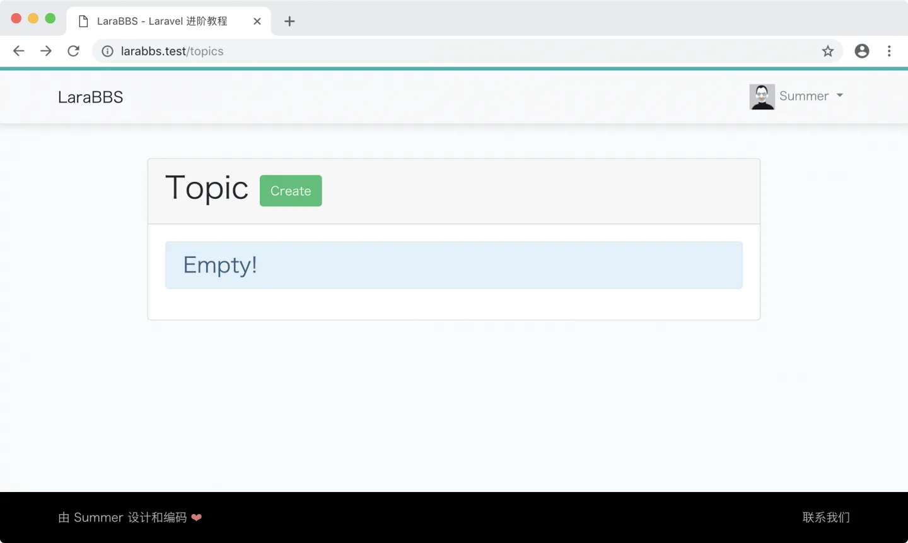
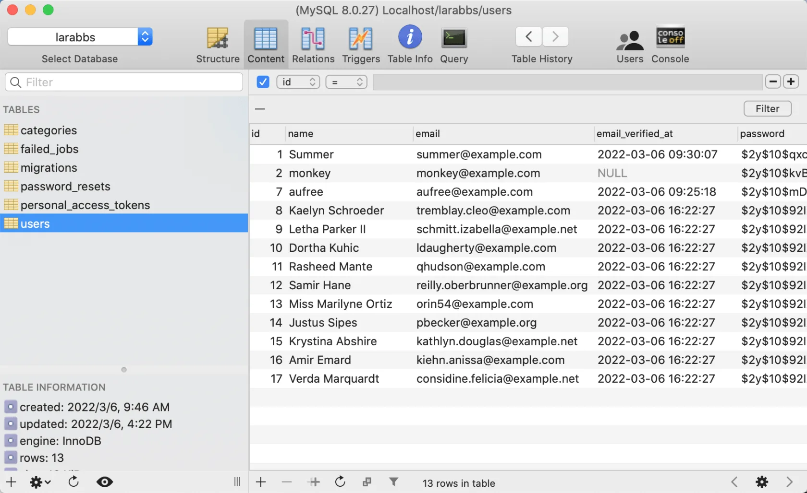
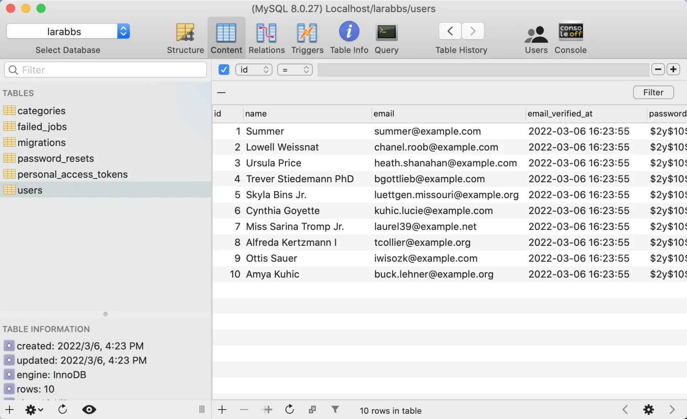
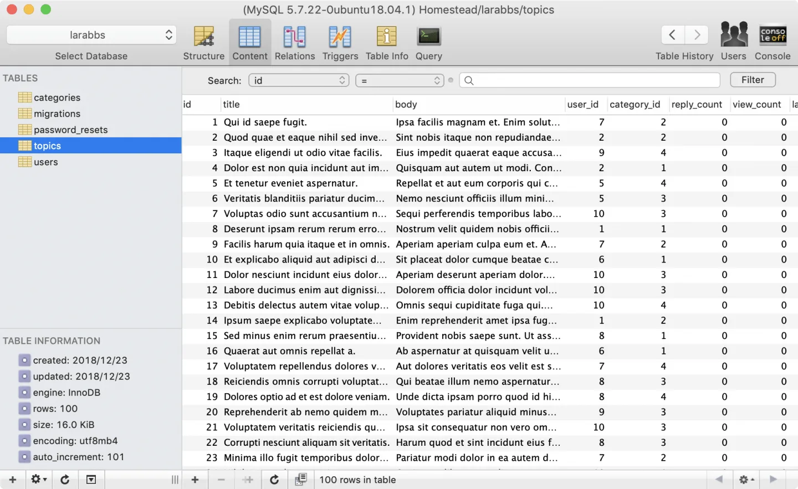
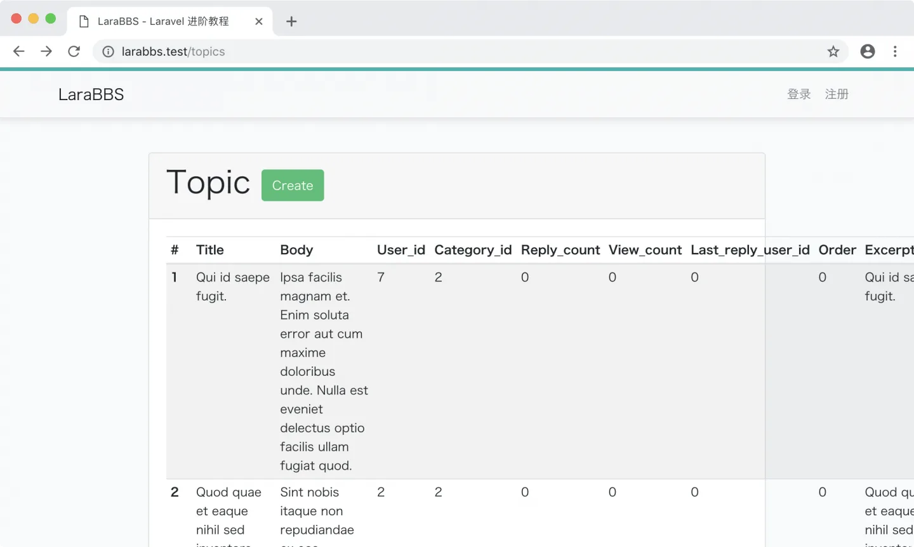

# 5.4. 假数据填充

原文链接：https://learnku.com/courses/laravel-intermediate-training/9.x/seeding-data/12501

## 假数据填充

目前我们数据库中的帖子数据为空，因此 [话题列表页面](http://larabbs.test/topics) 如下：



在开始开发话题列表之前，我们需要一些假数据来辅助，假数据生成逻辑如下：

- 填充 10 条用户数据，作为话题的作者使用；

- 100 条话题数据，这样我们就能测试分页功能；

- 填充话题时分类随机；

- 填充话题时作者随机。

## 一、填充用户数据

话题数据中需使用『用户数据』作为话题作者，有依赖关系，故我们先填充用户数据。

用户的假数据填充涉及到以下几个文件：

1. 数据模型 User.php

2. 用户的数据工厂 database/factories/UserFactory.php

3. 用户的数据填充 database/seeders/UsersTableSeeder.php

4. 注册数据填充 database/seeders/DatabaseSeeder.php

数据模型在前面章节中已定制过，此处无需修改，接下来我们从 UserFactory 开始。

### 1. 用户的数据工厂

Laravel 框架自带了 UserFactory.php 作为示例文件：

database/factories/UserFactory.php

```
<?php

namespace Database\Factories;

use Illuminate\Database\Eloquent\Factories\Factory;
use Illuminate\Support\Str;

class UserFactory extends Factory
{
public function definition()
{
return [
'name' => $this->faker->name(),
'email' => $this->faker->unique()->safeEmail(),
'email_verified_at' => now(),
'password' => '$2y$10$92IXUNpkjO0rOQ5byMi.Ye4oKoEa3Ro9llC/.og/at2.uheWG/igi', // password
'remember_token' => Str::random(10),
];
}

public function unverified()
{
return $this->state(function (array $attributes) {
return [
'email_verified_at' => null,
];
});
}
}
```

我们需要增加用户头像和 `introduction` 用户简介字段的填充，代码如下：

database/factories/UserFactory.php

```
<?php

namespace Database\Factories;

use Illuminate\Database\Eloquent\Factories\Factory;
use Illuminate\Support\Str;

class UserFactory extends Factory
{
public function definition()
{
// 用户的默认头像
$avatars = [
'https://cdn.learnku.com/uploads/images/201710/14/1/s5ehp11z6s.png',
'https://cdn.learnku.com/uploads/images/201710/14/1/Lhd1SHqu86.png',
'https://cdn.learnku.com/uploads/images/201710/14/1/LOnMrqbHJn.png',
'https://cdn.learnku.com/uploads/images/201710/14/1/xAuDMxteQy.png',
'https://cdn.learnku.com/uploads/images/201710/14/1/ZqM7iaP4CR.png',
'https://cdn.learnku.com/uploads/images/201710/14/1/NDnzMutoxX.png',
];

return [
'name' => $this->faker->name,
'email' => $this->faker->unique()->safeEmail,
'email_verified_at' => now(),
'password' => '$2y$10$92IXUNpkjO0rOQ5byMi.Ye4oKoEa3Ro9llC/.og/at2.uheWG/igi', // password
'remember_token' => Str::random(10),
'introduction' => $this->faker->sentence(),
'avatar' => $this->faker->randomElement($avatars),
];
}

public function unverified()
{
return $this->state(function (array $attributes) {
return [
'email_verified_at' => null,
];
});
}
}
```

[Faker](https://github.com/fzaninotto/Faker) 是一个假数据生成库，`sentence()` 是 faker 提供的 API ，随机生成『小段落』文本。我们用来填充 `introduction` 个人简介字段。

### 2. 用户数据填充

使用以下命令生成数据填充文件：

```
$ php artisan make:seed UsersTableSeeder
```

修改文件如以下：

database/seeders/UsersTableSeeder.php

```
<?php

namespace Database\Seeders;

use Illuminate\Database\Seeder;
use App\Models\User;

class UsersTableSeeder extends Seeder
{
public function run()
{
// 生成数据集合
User::factory()->count(10)->create();

// 单独处理第一个用户的数据
$user = User::find(1);
$user->name = 'Summer';
$user->email = 'summer@example.com';
$user->avatar = 'https://cdn.learnku.com/uploads/images/201710/14/1/ZqM7iaP4CR.png';
$user->save();
}
}
```

#### 代码讲解

`User::factory()` 是模型方法，当我们在模型里使用 trait  `HasFactory` 时会注入此方法。返回的是模型工厂类实例，对应加载 `UserFactory.php` 类。

`count(10)` 指定生成模型的数量，此处我们只需要生成 10 个用户数据。

### 3. 注册数据填充

接下来注册数据填充类：

database/seeders/DatabaseSeeder.php

```
<?php

namespace Database\Seeders;

use Illuminate\Database\Seeder;

class DatabaseSeeder extends Seeder
{
public function run()
{
$this->call(UsersTableSeeder::class);
// $this->call(TopicsTableSeeder::class);
}
}
```

### 4. 测试一下

使用以下命令运行迁移文件：

```
$ php artisan db:seed
```

查看数据库：



数一下发现有 11 个用户，你的应该和我不一样，因为我们之前开发注册了一些用户。我们并不想要这些数据。我们需要能删除 `users` 表数据，并重新生成填充数据的命令：

```
$ php artisan migrate:refresh --seed
```

Laravel 的 `migrate:refresh` 命令会回滚数据库的所有迁移，并运行 `migrate` 命令，`--seed` 选项会同时运行 `db:seed` 命令。

执行以后可以看到我们想要的效果：



>

注：开发时尽量不要手动往数据库里写入内容，因为类似于 `migrate:refresh` 这种操作是很频繁的，如果你想要数据库里有一些数据，请使用数据填充功能。这样做除了能被纳入版本控制以外，另一个好处是能让你不需要依赖数据库里的数据，这在团队协作中尤其重要，因为队友很多时候不是和你使用同一个数据库。希望同学们尽早养成好习惯。

## 二、填充话题数据

用户数据已经准备好，接下来我们处理话题数据填充。话题的假数据填充涉及到以下几个文件：

1. 数据模型 Topic.php

2. 话题的数据工厂 database/factories/TopicFactory.php

3. 话题的数据填充 database/seeders/TopicsTableSeeder.php

4. 注册数据填充 database/seeders/DatabaseSeeder.php

代码生成器已经为我们生成了 1、2、3 所需要的文件，并且自动在 DatabaseSeeder 中加入了 TopicsTableSeeder 的调用。

### 1. 数据模型

接下来我们先看看数据模型文件：

app/Models/Topic.php

```
<?php

namespace App\Models;

use Illuminate\Database\Eloquent\Factories\HasFactory;

class Topic extends Model
{
use HasFactory;

protected $fillable = ['title', 'body', 'user_id', 'category_id', 'reply_count', 'view_count', 'last_reply_user_id', 'order', 'excerpt', 'slug'];
}
```

可以看到生成器已经为我们自动写入 `$fillable` 允许填充字段数组，这里我们先不做更改。

### 2. 话题的数据工厂

接下来看 `TopicFactory`，此文件定义了每一份 `Topic` 假数据的生成规则：

database/factories/TopicFactory.php

```
<?php

namespace Database\Factories;

use App\Models\Topic;
use Illuminate\Database\Eloquent\Factories\Factory;

class TopicFactory extends Factory
{
protected $model = Topic::class;

public function definition()
{
return [
// $this->faker->name,
];
}
}
```

让我们对生成的模型工厂文件进行修改，修改后如下：

database/factories/TopicFactory.php

```
<?php

namespace Database\Factories;

use App\Models\Topic;
use Illuminate\Database\Eloquent\Factories\Factory;

class TopicFactory extends Factory
{
protected $model = Topic::class;

public function definition()
{
$sentence = $this->faker->sentence();

return [
'title' => $sentence,
'body' => $this->faker->text(),
'excerpt' => $sentence,
'user_id' => $this->faker->randomElement([1, 2, 3, 4, 5, 6, 7, 8, 9, 10]),
'category_id' => $this->faker->randomElement([1, 2, 3, 4]),
];
}
}

```

我们使用 `sentence()` 随机生成『小段落』文本用以填充 `title` 标题字段和 `excerpt` 摘录字段。`text()` 方法会生成大段的随机文本，此处我们来填充话题的 `body` 内容字段。两个时间的填充逻辑请仔细阅读代码注释。

### 3. 话题的数据填充

完成 TopicFactory 数据工厂的定制后，接下来我们开始书写填充部分的逻辑：

database/seeders/TopicsTableSeeder.php

```
<?php

namespace Database\Seeders;

use Illuminate\Database\Seeder;
use App\Models\Topic;

class TopicsTableSeeder extends Seeder
{
public function run()
{
Topic::factory()->count(100)->create();
}
}
```

### 4. 注册数据填充

我们需要将 DatabaseSeeder.php 中 TopicsTableSeeder 调用的注释去掉：

database/seeders/DatabaseSeeder.php

```
<?php

namespace Database\Seeders;

use Illuminate\Database\Seeder;

class DatabaseSeeder extends Seeder
{
public function run()
{
$this->call(UsersTableSeeder::class);
$this->call(TopicsTableSeeder::class);
}
}
```

请注意 `run()` 方法里的顺序，我们先生成用户数据，再生出话题数据。

## 三、执行数据填充命令

一切准备就绪，接下来开始调用数据填充命令，将假数据写入数据库。我们只需要 10 个测试用户，而此时我们数据库里已经有 10 个用户，故使用：

```
$ php artisan migrate:refresh --seed
```

执行成功后查看数据库：



浏览器打开话题列表页面 —— [larabbs.test/topics](http://larabbs.test/topics) ：



可以看到有数据了，但是页面非常凌乱，不用担心，我们将在下一章节中对此页面进行定制。

## Git 版本控制

下面把代码纳入到版本管理：

```
$ git add -A
$ git commit -m "填充用户和话题数据"
```
