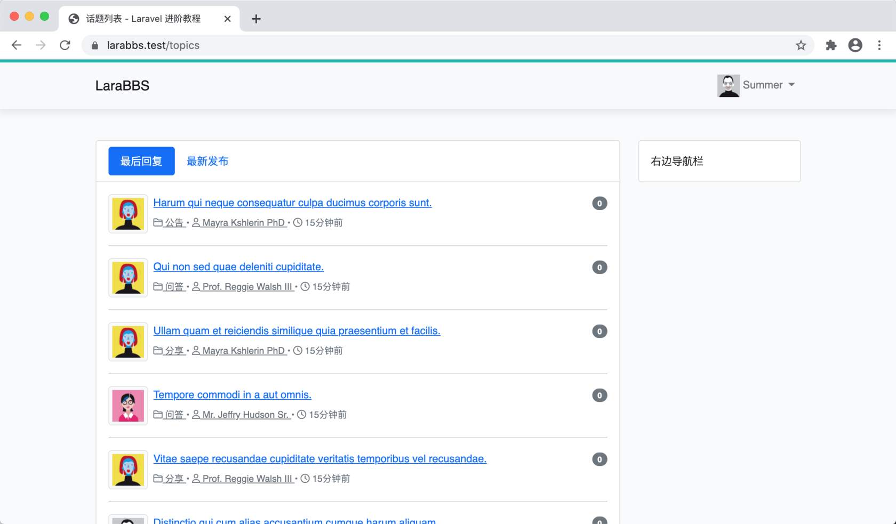
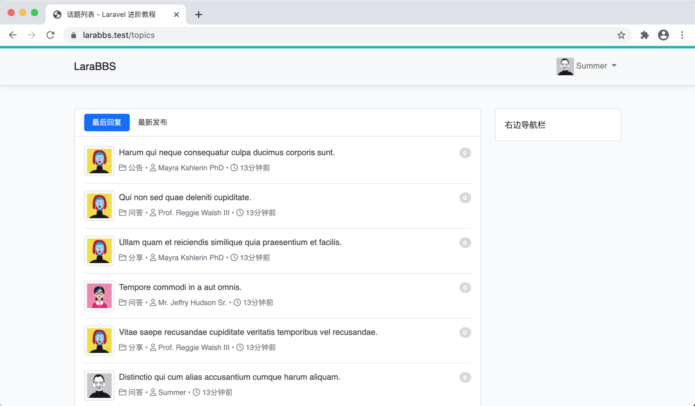
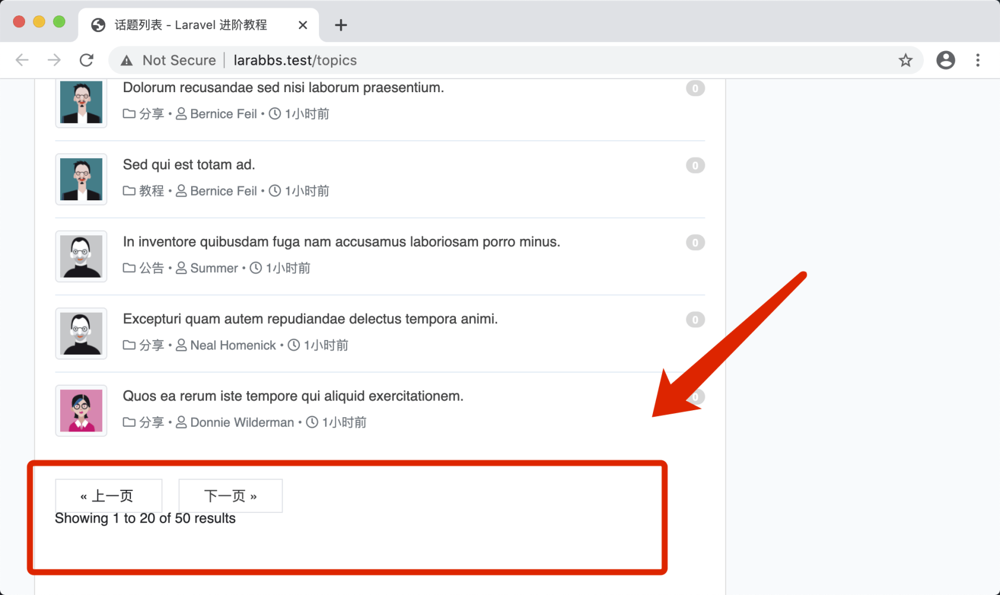
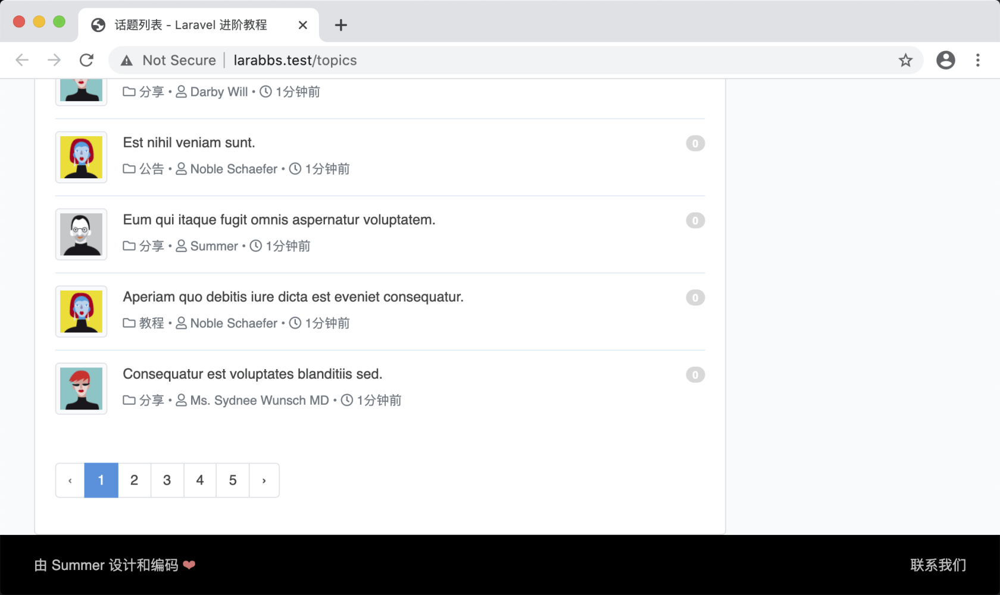
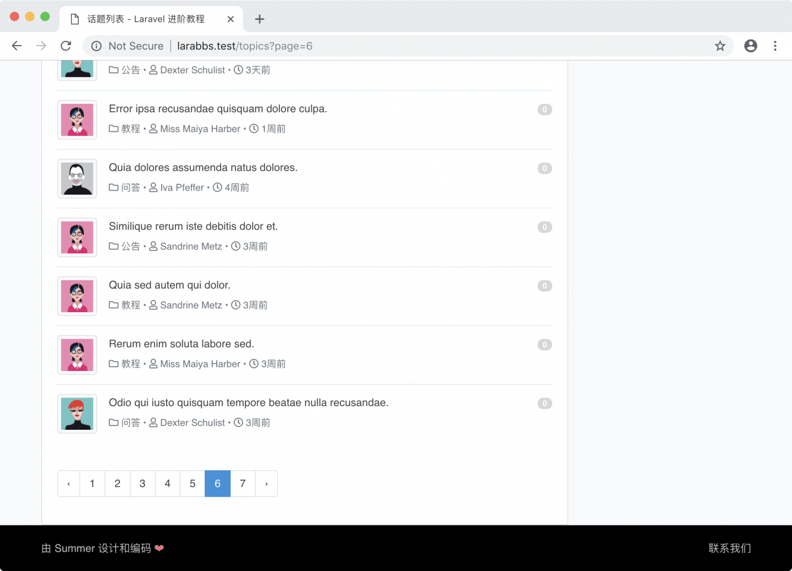
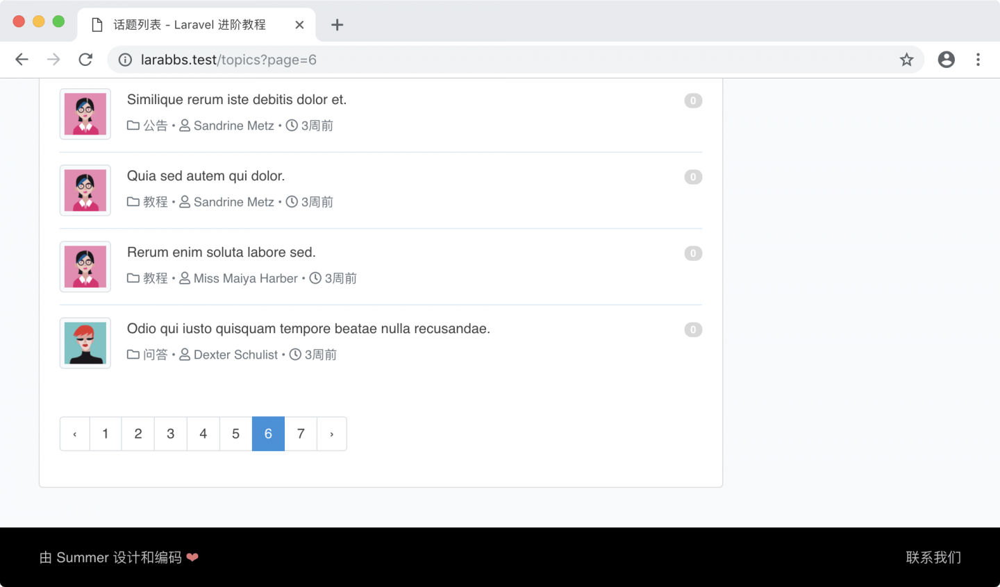

# 5.5. 话题列表页面

原文链接：https://learnku.com/courses/laravel-intermediate-training/9.x/topic-index-page/12502

## 说明

上一章节中，我们往数据库里填充了 10 个用户和100 条话题数据，本章节中我们将开发帖子列表页面，为这些话题数据提供访问的入口。

## 模型关联

开始之前，我们需要对 Topic 数据模型进行修改，新增 `category` 和 `user` 的模型关联：

- `category`—— 一个话题属于一个分类；

- `user` —— 一个话题属于一个作者。

这两个关联都「从属」关系，一般我们使用 [一对一](https://learnku.com/docs/laravel/9.x/eloquent-relationships#one-to-one) 对应关系来表示，使用 `belongsTo()` 方法来实现，代码如下：

app/Models/Topic.php

```
<?php

namespace App\Models;

use Illuminate\Database\Eloquent\Factories\HasFactory;

class Topic extends Model
{
use HasFactory;

protected $fillable = [
'title', 'body', 'user_id', 'category_id', 'reply_count',
'view_count', 'last_reply_user_id', 'order', 'excerpt', 'slug',
];

public function category()
{
return $this->belongsTo(Category::class);
}

public function user()
{
return $this->belongsTo(User::class);
}
}
```

有了以上的关联设定，后面开发中我们可以很方便地通过 `$topic->category`、`$topic->user` 来获取到话题对应的分类和作者。

## 页面嵌套

接下来开始修改话题列表页面：

resources/views/topics/index.blade.php

```
@extends('layouts.app')

@section('title', '话题列表')

@section('content')

<div class="row mb-5">
<div class="col-lg-9 col-md-9 topic-list">
<div class="card ">

<div class="card-header bg-transparent">
<ul class="nav nav-pills">
<li class="nav-item"><a class="nav-link active" href="#">最后回复</a></li>
<li class="nav-item"><a class="nav-link" href="#">最新发布</a></li>
</ul>
</div>

<div class="card-body">
{{-- 话题列表 --}}
@include('topics._topic_list', ['topics' => $topics])
{{-- 分页 --}}
<div class="mt-5">
{!! $topics->appends(Request::except('page'))->render() !!}
</div>
</div>
</div>
</div>

<div class="col-lg-3 col-md-3 sidebar">
@include('topics._sidebar')
</div>
</div>

@endsection
```

后面章节中，我们将会对列表增加排序功能，排序功能使用了 URL 传参来实现，这里使用分页中 `appends()` 方法可以使 URI 中的请求参数得到继承。

为了方便管理，话题列表被放置于子模板中：

resources/views/topics/_topic_list.blade.php

```
@if (count($topics))
<ul class="list-unstyled">
@foreach ($topics as $topic)
<li class="d-flex">
<div class="">
<a href="{{ route('users.show', [$topic->user_id]) }}">
user->avatar }}" title="{{ $topic->user->name }}">
</a>
</div>

<div class="flex-grow-1 ms-2">

<div class="mt-0 mb-1">
<a href="{{ route('topics.show', [$topic->id]) }}" title="{{ $topic->title }}">
{{ $topic->title }}
</a>
<a class="float-end" href="{{ route('topics.show', [$topic->id]) }}">
<span class="badge bg-secondary rounded-pill"> {{ $topic->reply_count }} </span>
</a>
</div>

<small class="media-body meta text-secondary">

<a class="text-secondary" href="#" title="{{ $topic->category->name }}">
<i class="far fa-folder"></i>
{{ $topic->category->name }}
</a>

<span> • </span>
<a class="text-secondary" href="{{ route('users.show', [$topic->user_id]) }}" title="{{ $topic->user->name }}">
<i class="far fa-user"></i>
{{ $topic->user->name }}
</a>
<span> • </span>
<i class="far fa-clock"></i>
<span class="timeago" title="最后活跃于：{{ $topic->updated_at }}">{{ $topic->updated_at->diffForHumans() }}</span>
</small>

</div>
</li>

@if ( ! $loop->last)
<hr>
@endif

@endforeach
</ul>

@else
<div class="empty-block">暂无数据 ~_~ </div>
@endif
```

>

注：注意上面多了一些类似写法 `<i class="far fa-clock"></i>`，这是我们载入的 Font Awesome 字体图标库的写法，更多图标请 [前往其官方文档](https://fontawesome.com/icons)。

右边栏：

resources/views/topics/_sidebar.blade.php

```
<div class="card ">
<div class="card-body">
右边导航栏
</div>
</div>
```

刷新页面：



## 样式优化

>

注意：修改之前请确保 `npm run watch-poll` 处在运行中。

基于 Bootstrap 默认的样式，我们只需要做下微调：

resources/sass/app.scss

```
.
.
.

/* Topic Index Page */
.topics-index-page {
.topic-list {
.nav>li>a {
position: relative;
display: block;
padding: 5px 14px;
font-size: 0.9em;
}

a {
color: #444444;
text-decoration: none;
}

.meta {
font-size: 0.9em;
color: #b3b3b3;

a {
color: #b3b3b3;
}
}

.badge {
background-color: #d8d8d8!important;
}

hr {
margin-top: 12px;
margin-bottom: 12px;
border: 0;
border-top: 1px solid #979da0;
}
}
}
```

再次刷新页面：



## 分页使用 bootstrap

查看页面底部的分页：



会发现样式错乱，这是因为默认 Laravel 分页没有使用 Bootstrap ，我们只需要在 AppServiceProvider 中设置使用 Bootstrap 即可：

app/Providers/AppServiceProvider.php

```
<?php
.
.
.
class AppServiceProvider extends ServiceProvider
{
.
.
.

public function boot()
{
.
.
.

\Illuminate\Pagination\Paginator::useBootstrap();
}
}
```

再次刷新：



样式恢复正常。

## 样式微调

另外我们还注意到页脚和内容黏在一起：



再次对样式进行优化：

resources/sass/app.scss

```
.
.
.

/* Add container and footer space */
#app > div.container {
margin-bottom: 100px;
}

```

刷新页面看效果：



## Git 版本控制

下面把代码纳入到版本管理：

```
$ git add -A
$ git commit -m "话题列表页面"
```
