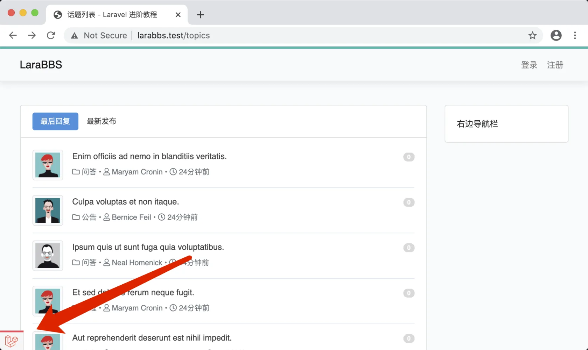
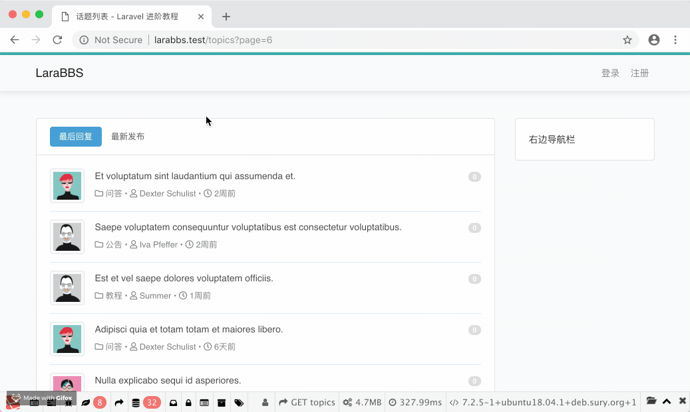
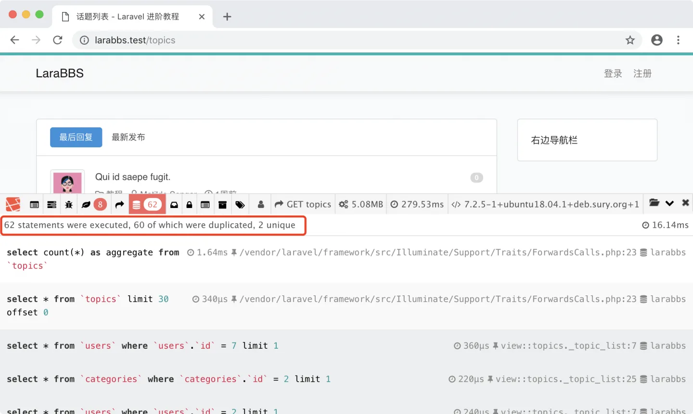
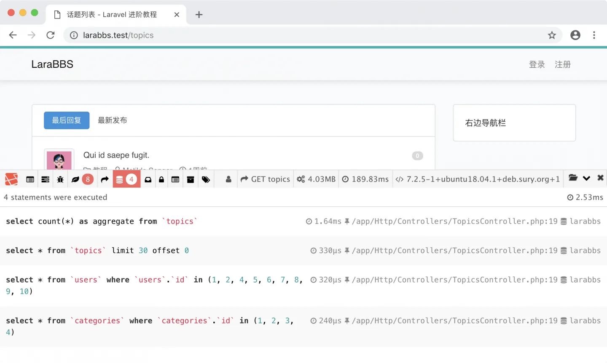
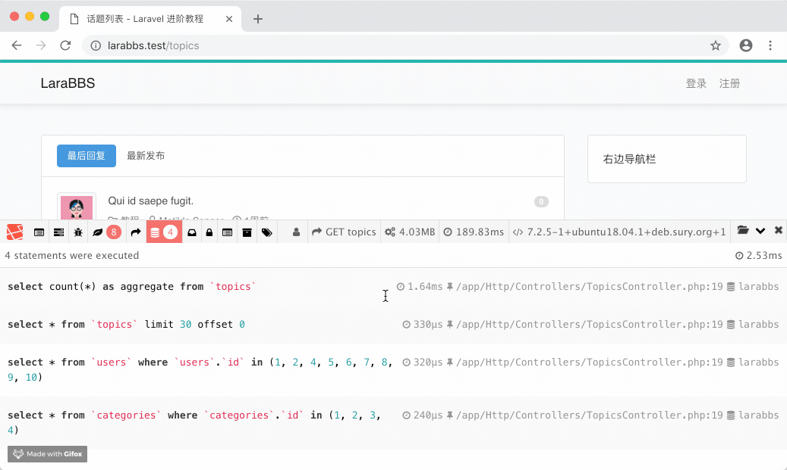

# 5.6. 性能优化

原文链接：https://learnku.com/courses/laravel-intermediate-training/9.x/improve-performance/12503

## 页面调优

此刻我们的页面存在很大的 性能隐患，为了能更直观地看到问题，我们先安装  Laravel 开发者工具类 - [laravel-debugbar](https://github.com/barryvdh/laravel-debugbar)。

### 安装 Debugbar

使用 Composer 安装：

```
$ composer require "barryvdh/laravel-debugbar:~3.6" --dev
```

以上命令，版本限定符 `~` 意味着我们希望安装 `>= 3.6` 并且 `< 4.0` 的版本，例如 `3.6.1`、 `3.11.3`、 `3.8`。根据语义化版本的定义，次版本号的变化是新增功能，所以 API 是稳定的，也就是可以安全更新的。

什么是语义化版本？

版本格式：主版本号.次版本号.修订号，如 `1.0.1`, `3.2.39`。版本号递增规则如下：

- 主版本号：当你做了不兼容的 API 修改

- 次版本号：当你做了向下兼容的功能性新增

- 修订号：当你做了向下兼容的问题修正。

另外，先行版本号及版本编译信息可以加到 `主版本号.次版本号.修订号` 的后面，作为延伸。

一般我们使用 3 个部分来表示一个版本，例如：1.4.23，1 为主版本号，4 为次版本号，23 为修订号或者补丁版本号。先行版本如 `1.0.0-alpha1` 这样在后面添加修饰符号来表示。

最后 Composer 安装时 `--dev` 参数是指明只在 开发环境 中使用，这样上线代码到 生产环境 时，我们可使用 `composer install --no-dev` 命令来排除这些扩展包的安装。

生成配置文件，存放位置 `config/debugbar.php`：

```
$ php artisan vendor:publish --provider="Barryvdh\Debugbar\ServiceProvider"
```

打开 `config/debugbar.php`，将 `enabled` 的值设置为：

```
'enabled' => env('APP_DEBUG', false),
```

修改完以后, Debugbar 分析器的启动状态将由 `.env`文件中 `APP_DEBUG` 值决定。

刷新列表页面即可看到我们的开发者工具栏：



### N +1 问题

如图点击以下按钮，可看到整个页面执行了 33 条查询语句，往下滚动可以看到很多请求都是重复的：



Laravel 的默认分页是 15 条信息，如果我们在控制器中修改 `paginate(30)` 显示条目为 30 的话：

app/Http/Controllers/TopicsController.php

```
<?php
.
.
.
class TopicsController extends Controller
{
.
.
.
public function index()
{
$topics = Topic::paginate(30);
return view('topics.index', compact('topics'));
}
.
.
.
}
```

可以看到现在的 SQL 查询数量为 62，是之前的两倍：



>

提示：62 statements were executed, 60 of which were duplicated, 2 unique
意为：总共有 62 条语句执行了，其中 60 条是重复的。

以上的问题就是 N+1 问题，不仅是 Laravel 中，所有的 ORM 关联数据读取中都存在此问题，新手很容易踩到坑。进而导致系统变慢，然后拖垮整个系统。

N+1 一般发生在关联数据的遍历时。在 `resources/views/topics/_topic_list.blade.php` 模板中，我们对 `$topics` 进行遍历，为了方便解说，我们将此文件里的代码精简为如下：

```
@if (count($topics))

<ul class="media-list">
@foreach ($topics as $topic)
.
.
.
{{ $topic->user->name }}
.
.
.
{{ $topic->category->name }}
.
.
.
@endforeach
</ul>

@else
<div class="empty-block">暂无数据 ~_~ </div>
@endif
```

为了读取 `user` 和 `category`，每次的循环都要查一下 `users` 和 `categories` 表，在本例子中我们查询了 30 条话题数据，那么最终我需要执行的查询语句就是 30 * 2 + 1 =  61 条语句。如果我第一次查询出来的是 N 条记录，那么最终需要执行的 SQL 语句就是 N+1 次。

## 如何解决 N + 1 问题？

我们可以通过 Eloquent 提供的 [预加载功能](https://learnku.com/docs/laravel/9.x/eloquent-relationships#eager-loading) 来解决此问题：

app/Http/Controllers/TopicsController.php

```
<?php
.
.
.
class TopicsController extends Controller
{
.
.
.
public function index()
{
$topics = Topic::with('user', 'category')->paginate(30);
return view('topics.index', compact('topics'));
}
.
.
.
}
```

方法 `with()` 提前加载了我们后面需要用到的关联属性 `user` 和 `category`，并做了缓存。后面即使是在遍历数据时使用到这两个关联属性，数据已经被预加载并缓存，因此不会再产生多余的 SQL 查询：



上图可以看到优化完成后，我们的 SQL 查询数量瞬间减少到只有 4 条，相应的，页面的响应时间也减少了三分之一。

## 最小化开发者工具类

我们可以通过以下方法将 Laravel 开发者工具类最小化，使其变得很不显眼，后续开发大家可以按需调整：



## Git 版本控制

下面把代码纳入到版本管理：

```
$ git add -A
$ git commit -m "修复 N+1 问题"
```
