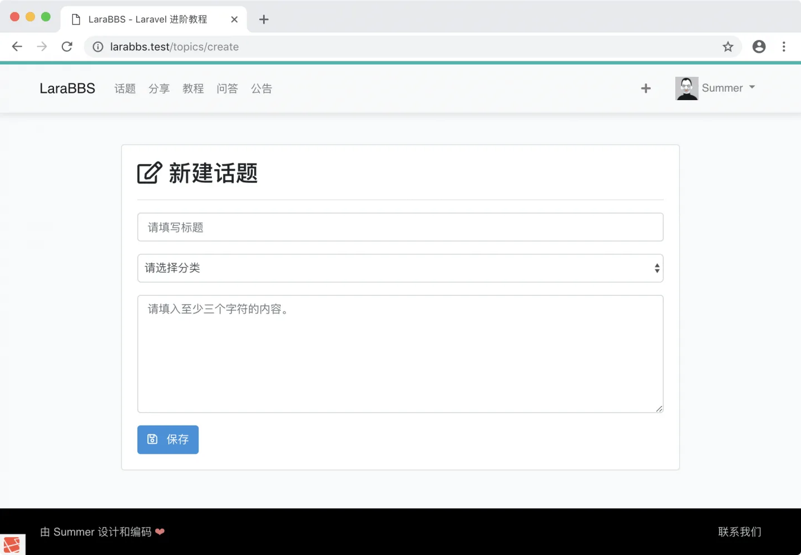
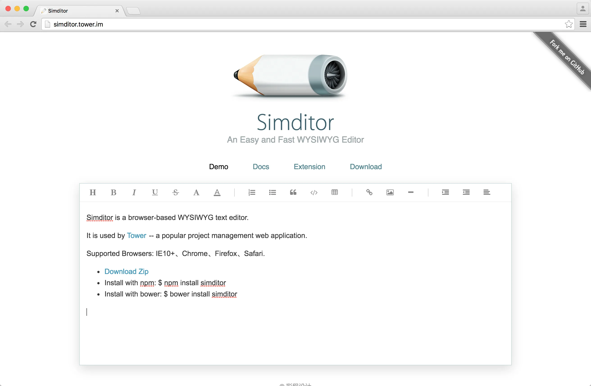
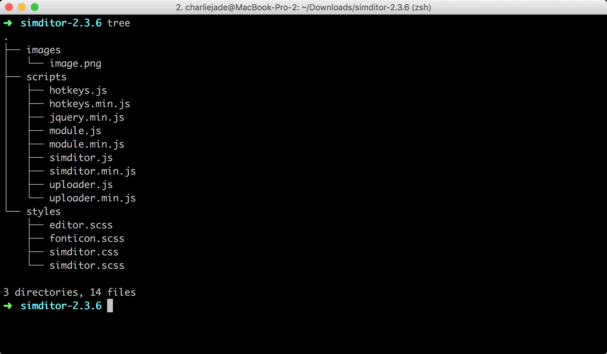
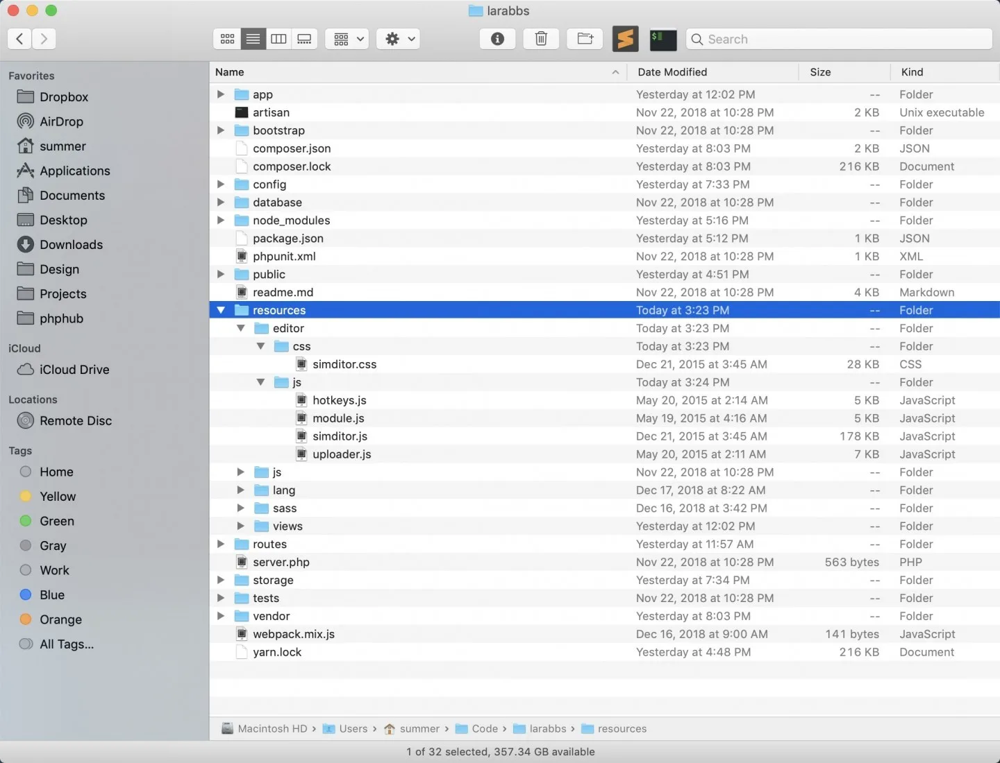
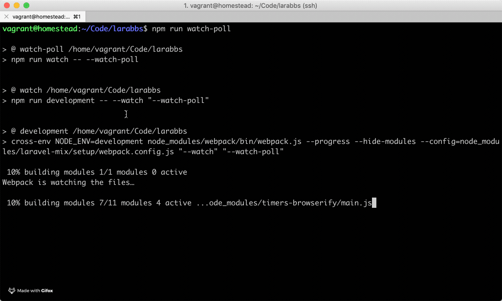
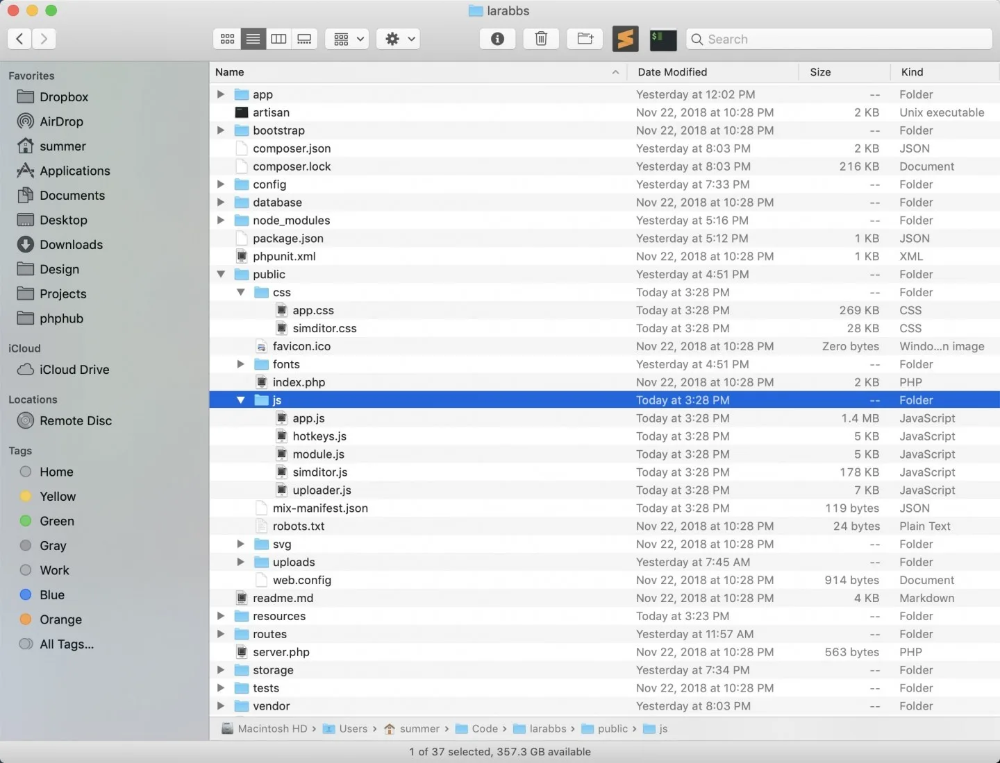
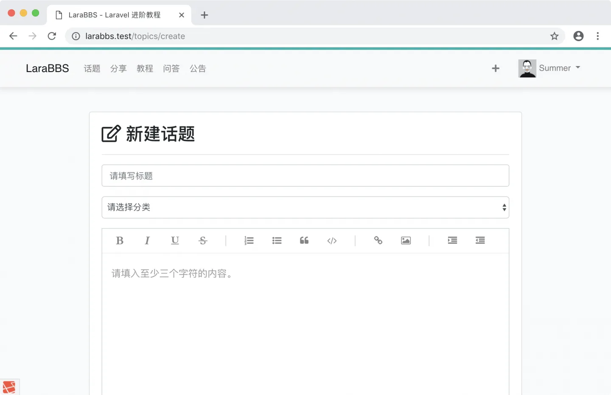
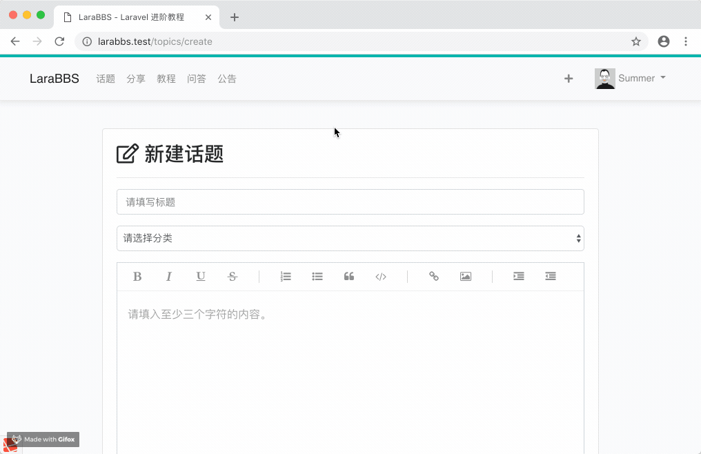

# 6.2. 编辑器优化

原文链接：https://learnku.com/courses/laravel-intermediate-training/9.x/editor/12509

## 编辑器优化



目前我们撰写文字只是一个简单的文本框，接下来我们将装上编辑器来提高用户体验。

## Simditor



[Simditor](https://simditor.tower.im/) 是 tower.im 团队的开源编辑器。

## 1. 下载 Simditor

开始之前，先 [点击此处下载 Simditor](https://github.com/mycolorway/simditor/releases/download/v2.3.6/simditor-2.3.6.zip) ，下载完成后解压到文件夹 `simditor-2.3.6` ，内容如下：



## 2. 集成到项目中

接下来新建以下两个文件夹：

- resources/editor/css

- resources/editor/js

或者可以使用以下命令：

```
$ mkdir -p resources/editor/css
$ mkdir -p resources/editor/js
```

将下载的 `simditor.css` 放置于 `resources/editor/css` 文件夹，将 `hotkeys.js`, `module.js`, `simditor.js`, `uploader.js` 四个文件放置于 `resources/editor/js` 文件夹中，如下：



文件放置成功后，我们需要修改 Mix 的配置信息，我们要将编辑器的 CSS 和 JS 文件复制到 `public` 文件夹下，这样我们才能通过浏览器读取这些文件。我们可以使用 [Mix](https://learnku.com/docs/laravel/9.x/mix) 的 `copyDirectory` 方法来实现：

webpack.mix.js

```
const mix = require('laravel-mix');

mix.js('resources/js/app.js', 'public/js')
.sass('resources/sass/app.scss', 'public/css')
.version()
.copyDirectory('resources/editor/js', 'public/js')
.copyDirectory('resources/editor/css', 'public/css');
```

因为修改了配置信息，我们需要重启 `npm run watch-poll`，在命令行窗口内，使用快捷键 `Ctrl + C` 即可退出，然后再次运行 `npm run watch-poll` 即可：



编译完成后，打开文件夹，应可以看到成功复制的文件：



## 3. 加载 jQuery

simditor 使用到了 jQuery ，先来安装：

```
$ yarn add jquery
```

接下来修改：

resources/js/bootstrap.js

```
window._ = require('lodash');

try {

// 加载 jQuery
window.$ = window.jQuery = require('jquery');

require('bootstrap');
} catch (e) {}
```

## 4. 加载和渲染

Simditor 的样式和脚本文件只需要在帖子创建页面中使用，出于性能考虑，我们将只在话题创建页面中加载这些文件。

首先我们需要在主要布局文件中种下锚点 `styles` 和 `scripts`，注意下面的两个 `@yield` 的使用：

resources/views/layouts/app.blade.php

```
.
.
.
<!-- Styles -->
<link href="{{ mix('css/app.css') }}" rel="stylesheet">

@yield('styles')

</head>

<body>
.
.
.

<!-- Scripts -->
<script src="{{ mix('js/app.js') }}"></script>

@yield('scripts')

</body>
</html>
```

接下来是页面调用，文件的最后面加上：

resources/views/topics/create_and_edit.blade.php

```
.
.
.

@section('styles')
<link rel="stylesheet" type="text/css" href="{{ asset('css/simditor.css') }}">
@stop

@section('scripts')
<script type="text/javascript" src="{{ asset('js/module.js') }}"></script>
<script type="text/javascript" src="{{ asset('js/hotkeys.js') }}"></script>
<script type="text/javascript" src="{{ asset('js/uploader.js') }}"></script>
<script type="text/javascript" src="{{ asset('js/simditor.js') }}"></script>

<script>
$(document).ready(function() {
var editor = new Simditor({
textarea: $('#editor'),
});
});
</script>
@stop
```

刷新页面即可看到我们的编辑器：



查看页面源代码，也可以看到我们加载的 CSS 和 JS 文件：



## Git 版本控制

下面把代码纳入到版本管理：

```
$ git add -A
$ git commit -m "WYSIWYG 编辑器"
```
