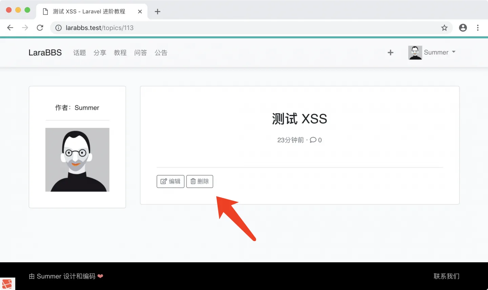
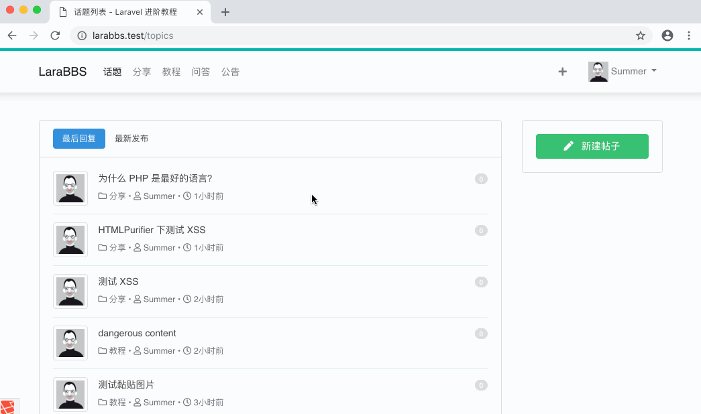

# 6.7. 删除帖子

原文链接：https://learnku.com/courses/laravel-intermediate-training/9.x/topics-delete/12514

## 帖子删除

接下来我们开发帖子的删除功能：



## 1. 权限控制

我们将只允许作者删除话题，需要修改下授权策略类里的 `destroy()` 方法：

app/Policies/TopicPolicy.php

```
<?php
.
.
.

class TopicPolicy extends Policy
{
    .
    .
    .

    public function destroy(User $user, Topic $topic)
    {
        return $topic->user_id == $user->id;
    }
}
```

发现我们一直在重复：

```bash
$topic->user_id == $user->id
```

并且此代码的可读性不高，我们可以优化一下：

app/Models/User.php

```
<?php
.
.
.
public function isAuthorOf($model)
{
return $this->id == $model->user_id;
}
}
```

重构下 TopicPolicy，代码阅读起来顺口多了：

app/Policies/TopicPolicy.php

```
<?php

namespace App\Policies;

use App\Models\User;
use App\Models\Topic;

class TopicPolicy extends Policy
{
    public function update(User $user, Topic $topic)
    {
        return $user->isAuthorOf($topic);
    }

    public function destroy(User $user, Topic $topic)
    {
        return $user->isAuthorOf($topic);
    }
}
```

### 代码调用

代码生成器已经为我们书写好了调用，我们只需检查确认 `authorize()` 方法的调用，并修改下提示信息：

app/Http/Controllers/TopicsController.php

```
<?php
.
.
.
class TopicsController extends Controller
{
    .
    .
    .
    public function destroy(Topic $topic)
    {
        $this->authorize('destroy', $topic);
        $topic->delete();

        return redirect()->route('topics.index')->with('success', '成功删除！');
    }
    .
    .
    .
}
```

## 2. 构建删除表单

我们也需要对编辑和删除按钮增加显示条件，只有当用户有权限操作时才显示。我们可以很方便地利用 Laravel 授权策略提供的 `@can` Blade 命令，在 Blade 模板中做授权判断。因为我们的 `update` 和 `destroy` 的授权条件是一致的，故此处使用 `update` 的授权判断即可：

resources/views/topics/show.blade.php

```
.
.
.

@can('update', $topic)
<div class="operate">
<hr>
<a href="{{ route('topics.edit', $topic->id) }}" class="btn btn-outline-secondary btn-sm" role="button">
<i class="far fa-edit"></i> 编辑
</a>
<form action="{{ route('topics.destroy', $topic->id) }}" method="post"
style="display: inline-block;"
onsubmit="return confirm('您确定要删除吗？');">
{{ csrf_field() }}
{{ method_field('DELETE') }}
<button type="submit" class="btn btn-outline-secondary btn-sm">
<i class="far fa-trash-alt"></i> 删除
</button>
</form>
</div>
@endcan
.
.
.
```

## 3. 测试一下

1. 找不属于当前用户发布的文章，查看下权限；

2. 点击删除按钮，取消；

3. 点击删除按钮，确定删除。



## Git 版本控制

下面把代码纳入到版本管理：

```bash
$ git add -A
$ git commit -m "用户可以删除自己发的话题"
```
