# 4.2. 编辑个人资料

原文链接：https://learnku.com/courses/laravel-intermediate-training/9.x/edit-personal-data/12490

## 编辑个人资料

接下来我们将一起开发用户编辑资料的功能，用户可以编辑自己的资料，并查看结果。

## 新增字段

查看用户表相关的迁移文件：

database/migrations/2014_10_12_000000_create_users_table.php

```
.
.
.
public function up()
{
Schema::create('users', function (Blueprint $table) {
$table->id();
$table->string('name');
$table->string('email')->unique();
$table->timestamp('email_verified_at')->nullable();
$table->string('password');
$table->rememberToken();
$table->timestamps();
});
}
.
.
.
```

以上是 `users` 表里的所有字段，作为 [个人中心页面](http://larabbs.test/users/1)，可以看出我们还缺少『头像』和『个人简介』字段：

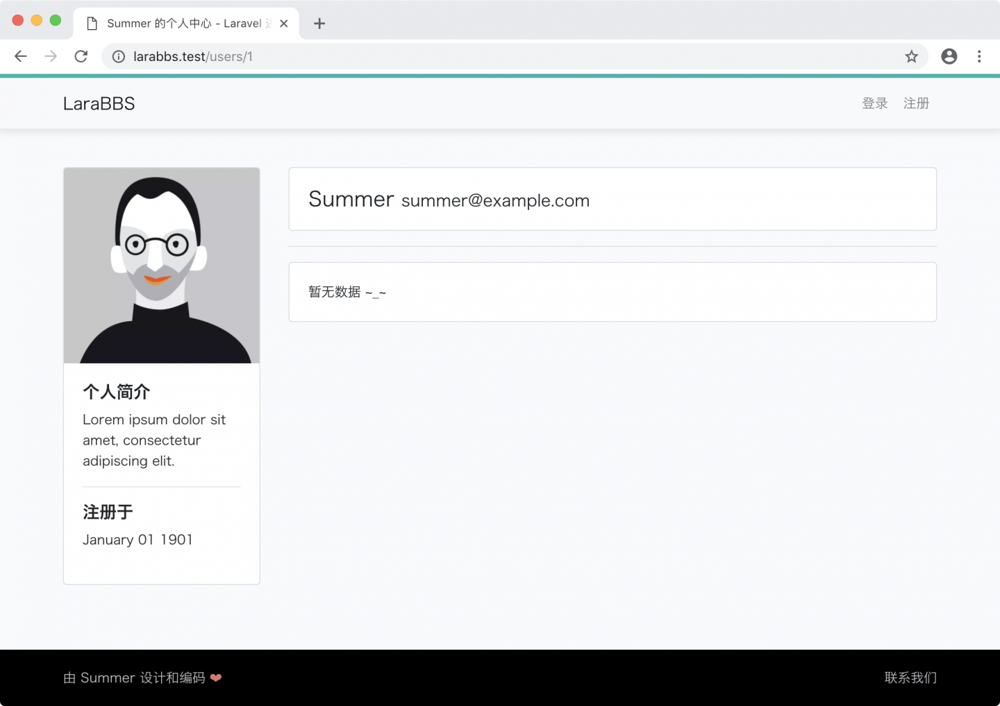

接下来我们使用 Laravel 自带的命令来新建迁移文件。由于我们进行的是字段添加操作，因此在命名迁移文件时需要加上前缀，遵照如 `add_column_to_table` 这样的命名规范，并在生成迁移文件的命令中设置 `--table` 选项，用于指定对应的数据库表。最终的生成命令如下：

```
$ php artisan make:migration add_avatar_and_introduction_to_users_table --table=users
```

接下来我们来设计字段的类型和属性。

我们会将头像的图片以文件形式放置于服务器上，然后将路径字符串存储于数据库中，所以我们需要用到 `string` 类型，用户注册并未提供头像上传功能，因此我们还需要将字段设置为 `nullable`，意为允许空字符串。

个人简介字段存储的是短文本内容，此处我们也选择使用 `string` 类型，同样的我们也允许用户设置空的简介。现在让我们来为新增的迁移文件加上这两个字段：

database/migrations/[timestamp]_add_avatar_and_introduction_to_users_table.php

```
.
.
.
public function up()
{
Schema::table('users', function (Blueprint $table) {
$table->string('avatar')->nullable();
$table->string('introduction')->nullable();
});
}

public function down()
{
Schema::table('users', function (Blueprint $table) {
$table->dropColumn('avatar');
$table->dropColumn('introduction');
});
}
}
```

接着我们还需要运行迁移，将字段加入到用户表中：

```
$ php artisan migrate
```

打开数据库查看工具，即可看到我们新添加的两个字段：

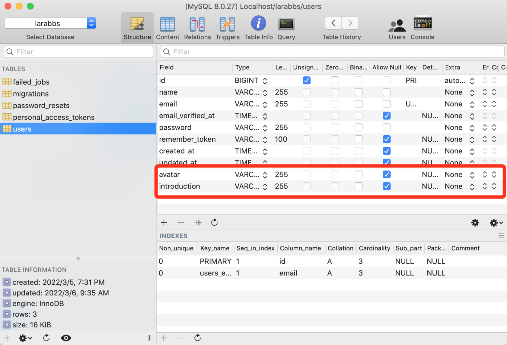

## 增加入口

接下来我们需要增加一个页面链接入口，让登录用户可以很方便地进入到自己的『资料编辑页面』：

resources/views/layouts/_header.blade.php

```
.
.
.
<div class="dropdown-menu" aria-labelledby="navbarDropdown">
<a class="dropdown-item" href="{{ route('users.show', Auth::id()) }}">个人中心</a>
<a class="dropdown-item" href="{{ route('users.edit', Auth::id()) }}">编辑资料</a>
<div class="dropdown-divider"></div>
<a class="dropdown-item" id="logout" href="#">
<form action="{{ route('logout') }}" method="POST">
{{ csrf_field() }}
<button class="btn btn-block btn-danger" type="submit" name="button">退出</button>
</form>
</a>
</div>
.
.
.
```

我们在顶部导航里新增了『编辑资料』的链接：

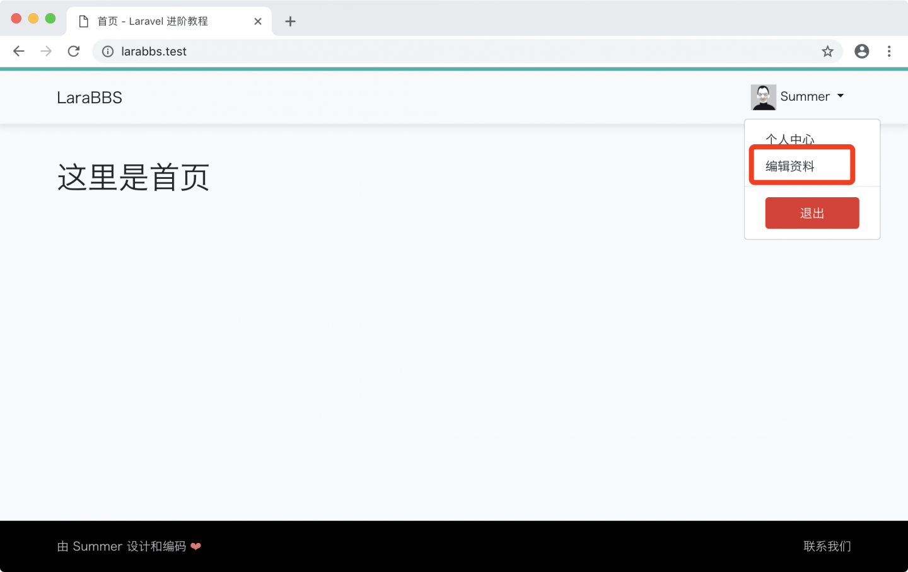

点击此链接：


```
Method App\Http\Controllers\UsersController::edit does not exist.
```

未找到控制器方法。我们需要前往 `UsersController` 控制器里创建 `edit()` 方法：

app/Http/Controllers/UsersController.php

```
.
.
.
public function edit(User $user)
{
return view('users.edit', compact('user'));
}
}
```

`edit()` 方法接受 `$user` 用户作为传参，也就是说当 URL 是 [larabbs.test/users/1/edit](http://larabbs.test/users/1/edit) 时，读取的是 ID 为 1 的用户。这里使用的是与 `show()` 方法一致的 [『隐性路由模型绑定』](https://learnku.com/docs/laravel/9.x/routing#%E9%9A%90%E5%BC%8F%E7%BB%91%E5%AE%9A) 开发范式。

`view()` 方法加载了 `resources/views/users/edit.blade.php`  模板，并将用户实例作为变量传置于模板中。

## 页面模板

此时我们再次刷新页面：

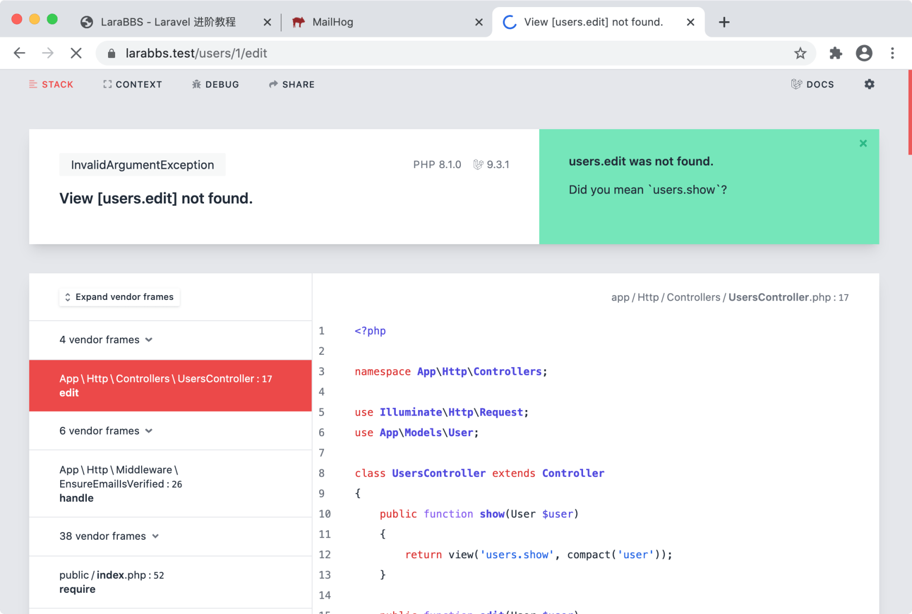

```
View [users.edit] not found.
```

这是视图文件未找到的错误。接下来我们来创建此视图文件：

resources/views/users/edit.blade.php

```
@extends('layouts.app')

@section('content')

<div class="container">
<div class="col-md-8 offset-md-2">

<div class="card">
<div class="card-header">
<h4>
<i class="glyphicon glyphicon-edit"></i> 编辑个人资料
</h4>
</div>

<div class="card-body">
<form action="{{ route('users.update', $user->id) }}" method="POST" accept-charset="UTF-8">
<input type="hidden" name="_method" value="PUT">
<input type="hidden" name="_token" value="{{ csrf_token() }}">

<div class="mb-3">
<label for="name-field">用户名</label>
<input class="form-control" type="text" name="name" id="name-field" value="{{ old('name', $user->name) }}" />
</div>
<div class="mb-3">
<label for="email-field">邮 箱</label>
<input class="form-control" type="text" name="email" id="email-field" value="{{ old('email', $user->email) }}" />
</div>
<div class="mb-3">
<label for="introduction-field">个人简介</label>
<textarea name="introduction" id="introduction-field" class="form-control" rows="3">{{ old('introduction', $user->introduction) }}</textarea>
</div>
<div class="well well-sm">
<button type="submit" class="btn btn-primary">保存</button>
</div>
</form>
</div>
</div>
</div>
</div>

@endsection
```

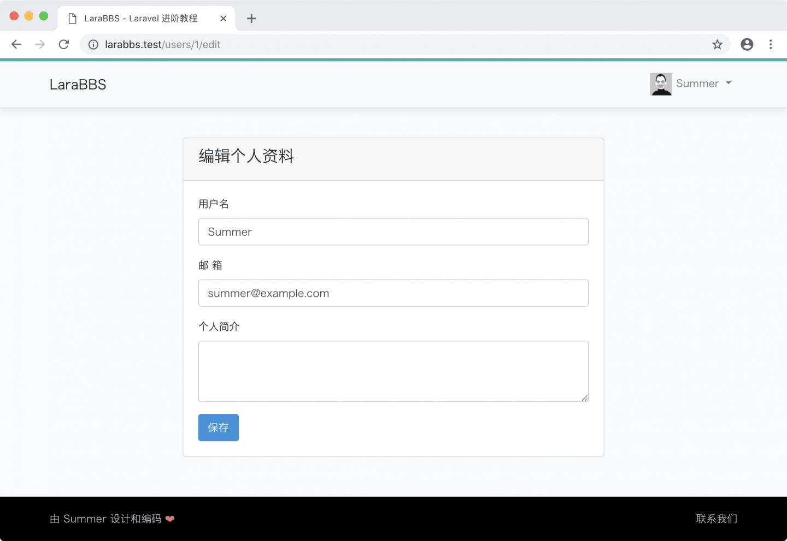

## 更新用户信息

在编辑页面的 「个人简介」 框里随便填写内容，然后点击『保存』按钮，会出现：

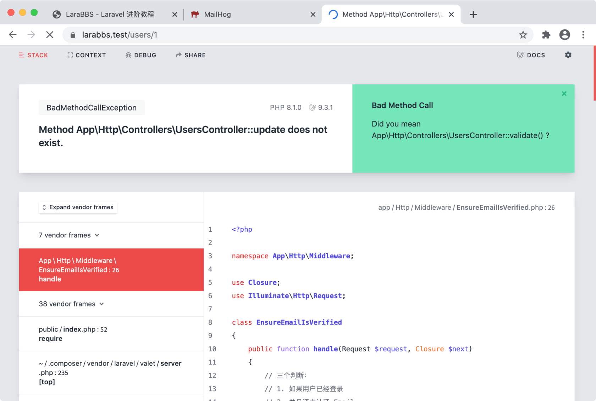

这是我们还未编写处理表单提交的方法，接下来我们先创建此方法：

app/Http/Controllers/UsersController.php

```
<?php
.
.
.
use App\Http\Requests\UserRequest;

class UsersController extends Controller
{
.
.
.

public function update(UserRequest $request, User $user)
{
$user->update($request->all());
return redirect()->route('users.show', $user->id)->with('success', '个人资料更新成功！');
}
}
```

1. 顶部引入 UserRequest：

```
use App\Http\Requests\UserRequest;
```

1. `update()` 方法中我们使用了『表单请求验证』（FormRequest）来验证用户提交的数据。

### 表单请求 UserRequest

[表单请求验证（FormRequest）](https://learnku.com/docs/laravel/9.x/validation#form-request-validation) 是 Laravel 框架提供的用户表单数据验证方案，此方案相比手工调用 `validator` 来说，能处理更为复杂的验证逻辑，更加适用于大型程序。在本课程中，我们将统一使用表单请求验证来处理表单验证逻辑。

接下来我们创建 UserRequest ，使用以下命令：

```
$ php artisan make:request UserRequest
```

执行成功后会生成以下文件：

app/Http/Requests/UserRequest.php

```
<?php

namespace App\Http\Requests;

use Illuminate\Foundation\Http\FormRequest;

class UserRequest extends FormRequest
{
public function authorize()
{
return false;
}

public function rules()
{
return [
//
];
}
}
```

表单请求验证（FormRequest）的工作机制，是利用 Laravel 提供的依赖注入功能，在控制器方法，如上面我们的 `update()` 方法声明中，传参 UserRequest。这将触发表单请求类的自动验证机制，验证发生在 UserRequest 中，并使用此文件中方法 `rules()` 定制的规则，只有当验证通过时，才会执行 控制器 `update()` 方法中的代码。否则抛出异常，并重定向至上一个页面，附带验证失败的信息。

`authorize()` 方法是表单验证自带的另一个功能 —— 权限验证，本课程中我们不会使用此功能，关于用户授权，我们将会在后面章节中使用更具扩展性的方案，此处我们 `return true;` ，意味所有权限都通过即可。

接下来我们需要定制 `rules()` 方法，如下：

app/Http/Requests/UserRequest.php

```
<?php

namespace App\Http\Requests;

use Illuminate\Foundation\Http\FormRequest;
use Auth;

class UserRequest extends FormRequest
{
public function authorize()
{
return true;
}

public function rules()
{
return [
'name' => 'required|between:3,25|regex:/^[A-Za-z0-9\-\_]+$/|unique:users,name,' . Auth::id(),
'email' => 'required|email',
'introduction' => 'max:80',
];
}
}
```

`rules()` 方法内，对三个字段设置了不同的验证规则，下面分别讲解下：

- name.required —— 验证的字段必须存在于输入数据中，而不是空。[详见文档](https://learnku.com/docs/laravel/9.x/validation#required)

- name.between —— 验证的字段的大小必须在给定的 min 和 max 之间。[详见文档](https://learnku.com/docs/laravel/9.x/validation#betweenminmax)

- name.regex —— 验证的字段必须与给定的正则表达式匹配。[详见文档](https://learnku.com/docs/laravel/9.x/validation#regexpattern)

- name.unique —— 验证的字段在给定的数据库表中必须是唯一的。[详见文档](https://learnku.com/docs/laravel/9.x/validation#uniquetablecolumnexceptidColumn)

- email.required —— 同上

- email.email —— 验证的字段必须符合 e-mail 地址格式。[详见文档](https://learnku.com/docs/laravel/9.x/validation#email)

- introduction.max —— 验证中的字段必须小于或等于 value。[详见文档](https://learnku.com/docs/laravel/9.x/validation#maxvalue)

接下来测试下，在用户名那输入一个字符串，然后点击保存：

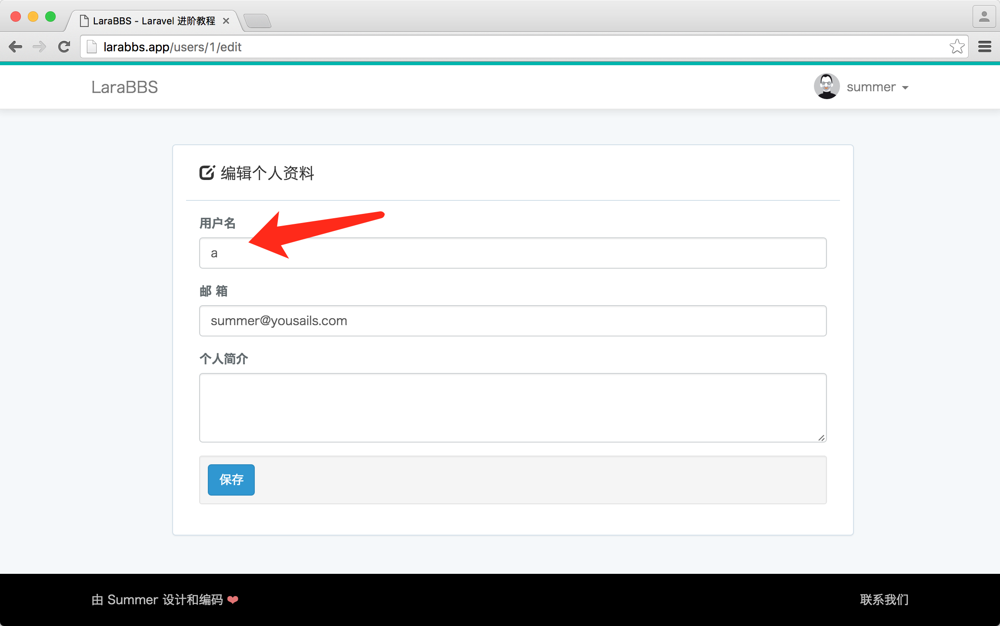

页面刷新了，不过什么都没发生，其实这是因为 UserRequest 验证不通过，带着错误提示跳转回来了，不过因为我们未对错误提示进行处理，所以什么都没发生。接下来我们创建 `_error.blade.php` 文件来渲染错误提示：

resources/views/shared/_error.blade.php

```
@if (count($errors) > 0)
<div class="alert alert-danger">
<div class="mt-2"><b>有错误发生：</b></div>
<ul class="mt-2 mb-2">
@foreach ($errors->all() as $error)
<li><i class="glyphicon glyphicon-remove"></i> {{ $error }}</li>
@endforeach
</ul>
</div>
@endif
```

并在表单中加载（只添加一行 `@include('shared._error')` ）：

resources/views/users/edit.blade.php

```
.
.
.

<div class="card-body">
<form action="{{ route('users.update', $user->id) }}" method="POST" accept-charset="UTF-8">
<input type="hidden" name="_method" value="PUT">
<input type="hidden" name="_token" value="{{ csrf_token() }}">

@include('shared._error')

<div class="mb-3">
.
.
.
```

此时我们再次前往 [larabbs.test/users/1/edit](http://larabbs.test/users/1/edit) 继续刚才的测试：

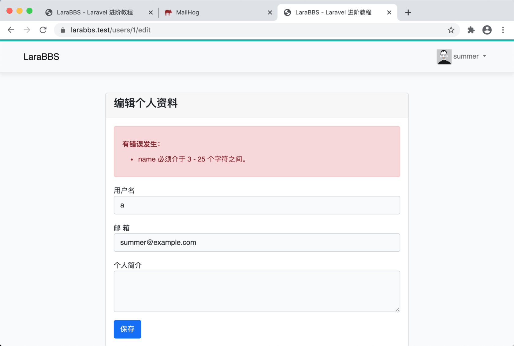

此处有一个地方可以优化，错误显示的是 `name` 未显示中文。我们需要自定义表单的提示信息，修改 UserRequest，新增方法 `messages()`：

app/Http/Requests/UserRequest.php

```
.
.
.
public function messages()
{
return [
'name.unique' => '用户名已被占用，请重新填写',
'name.regex' => '用户名只支持英文、数字、横杠和下划线。',
'name.between' => '用户名必须介于 3 - 25 个字符之间。',
'name.required' => '用户名不能为空。',
];
}
}
```

`messages()` 方法是 表单请求验证（FormRequest）一个很方便的功能，允许我们自定义具体的消息提醒内容，键值的命名规范 —— 字段名 + 规则名称，对应的是消息提醒的内容。效果如下：

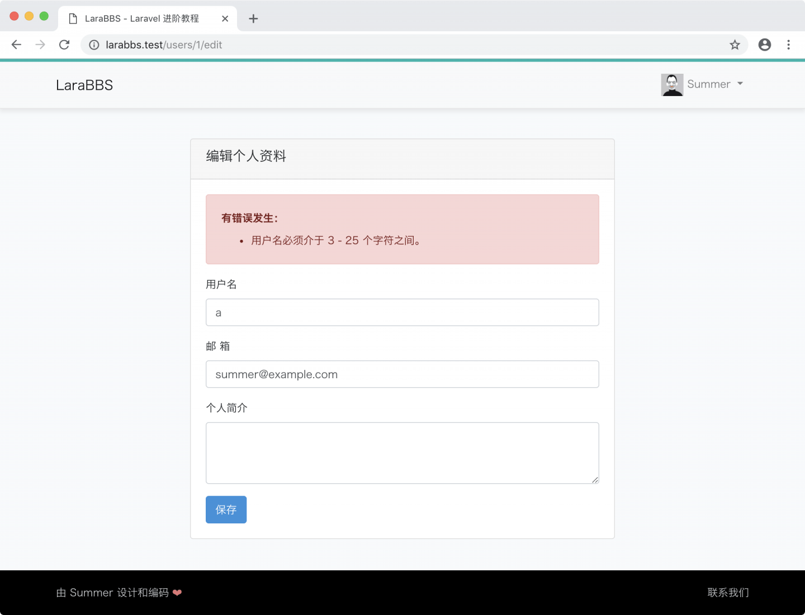

再次测试下编辑资料功能，请在『个人简介』里填入乔老爷子的座右铭作为测试内容 —— `Stay hungry, stay foolish.`，点击保存按钮：

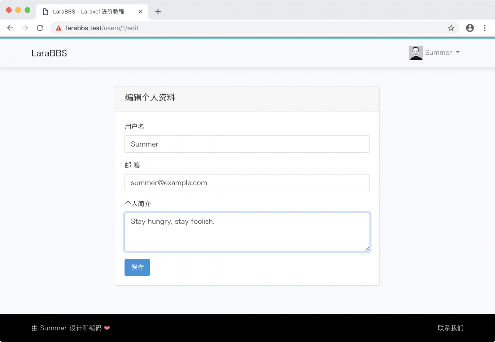

结果：

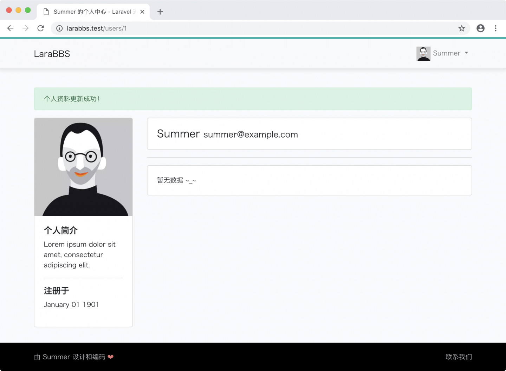

## Git 代码版本管理

接下来把代码纳入到版本管理，为下一节做好准备：

```
$ git add -A
$ git commit -m "编辑个人资料"
```
