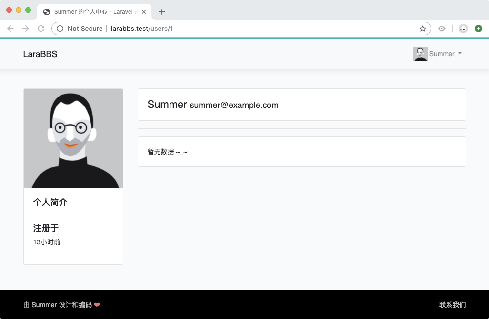
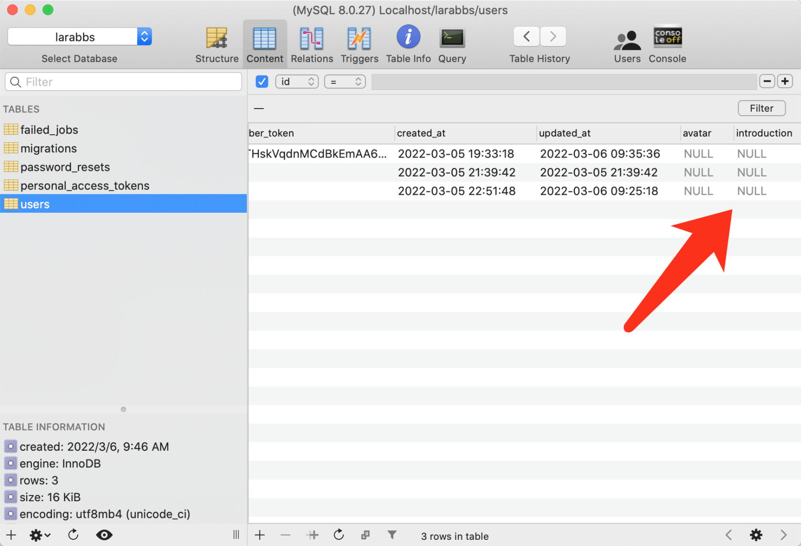
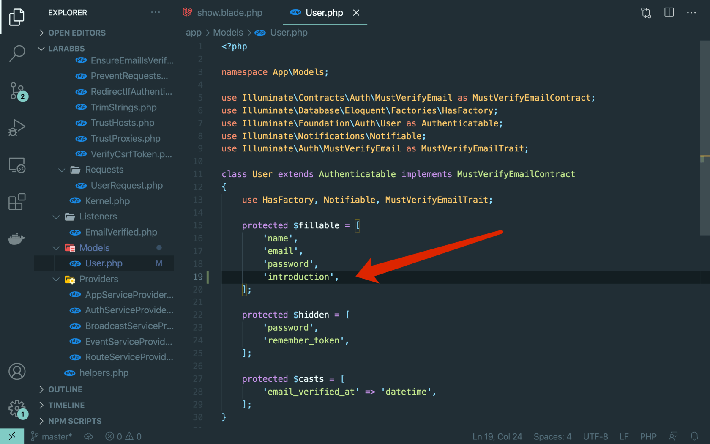
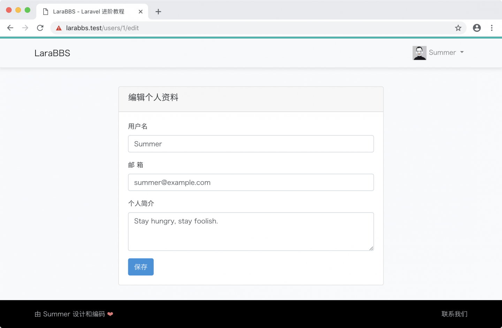
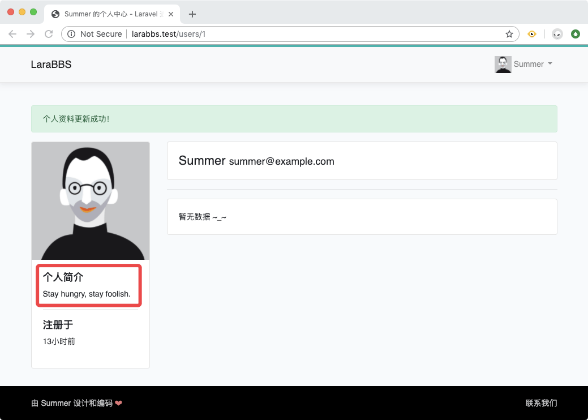
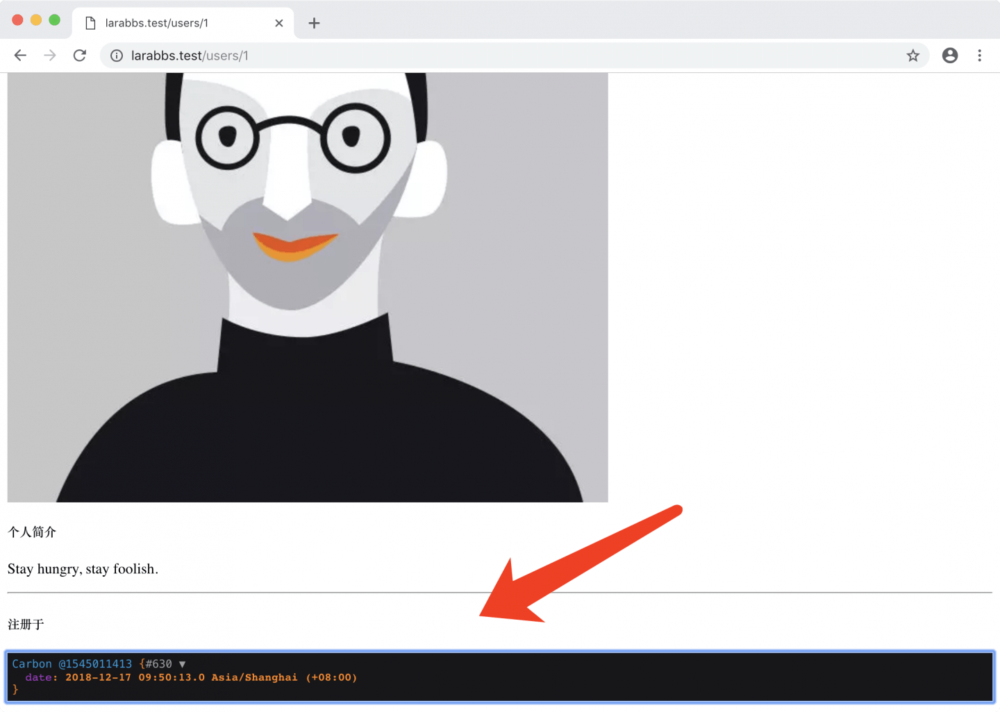

# 4.3. 显示个人资料

原文链接：https://learnku.com/courses/laravel-intermediate-training/9.x/show-profile/12491

## 内容嵌套

上一节更新了个人简介，接下来我们将在个人中心里显示出来：

resources/views/users/show.blade.php

```
.
.
.
<div class="card-body">
<h5><strong>个人简介</strong></h5>
<p>{{ $user->introduction }}</p>
<hr>
<h5><strong>注册于</strong></h5>
<p>{{ $user->created_at->diffForHumans() }}</p>
</div>
.
.
.
```

源码解读：

1. `$user->introduction` 是调用上面我们新添加的字段；

2. `$user->created_at->diffForHumans()` 时间戳友好的输出。

刷新页面看效果：



## 1. 个人简介为空

个人简介居然为空，我们明明在最后一次测试中填入内容了，并且也显示成功更新。让我们用数据库工具瞧一瞧是否有内容：



数据库里也是空的，所以很明显，刚刚数据并没有更新成功。

经过一番调试以后，原来是因为我们没有在 `User.php` 模型文件中，将 `introduction` 字段添加至 `$fillable` 属性中。`$fillable` 属性的作用是防止用户随意修改模型数据，只有在此属性里定义的字段，才允许修改，否则更新时会被忽略。我们只需请按下图新增字段即可：



再次测试填写简介 `Stay hungry, stay foolish.`：



成功显示：



## 2. Carbon

在 Laravel 中，时间戳 `created_at` 和 `updated_at` 作为模型属性被调用时，都会自动转换为 `Carbon` 对象，下面我们使用 Laravel 自带的 `dd()` 辅助函数验证一下：

resources/views/users/show.blade.php

```
.
.
.
<div class="card-body">
<h5><strong>个人简介</strong></h5>
<p>{{ $user->introduction }}</p>
<hr>
<h5><strong>注册于</strong></h5>
{{ dd($user->created_at) }}
<p>{{ $user->created_at->diffForHumans() }}</p>
</div>
.
.
.
```

打印出来的结果：



[Carbon](https://github.com/briannesbitt/Carbon) 是 PHP 知名的日期和时间操作扩展，Laravel 框架中使用此扩展来处理时间、日期相关的操作。`diffForHumans` 是 `Carbon` 对象提供的方法，提供了可读性更佳的日期展示形式。

最后请记得打开 resources/views/users/show.blade.php 去掉我们刚刚新增的 `dd()` 测试信息。

## Git 代码版本管理

接下来把代码纳入到版本管理：

```
$ git add -A
$ git commit -m "显示个人资料"
```
