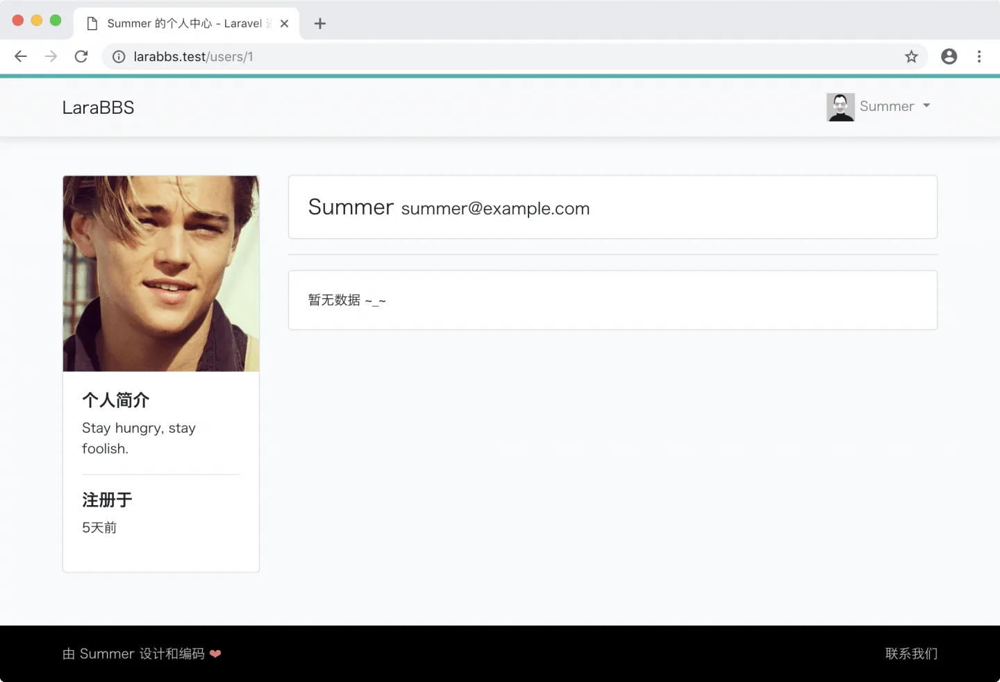
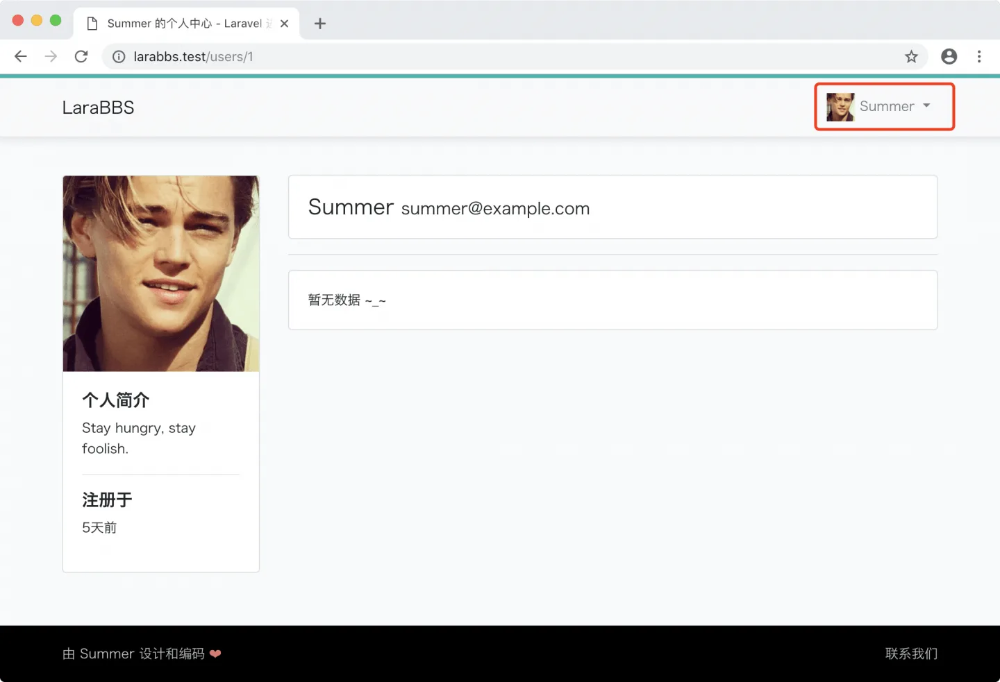

# 4.5. 显示头像

原文链接：https://learnku.com/courses/laravel-intermediate-training/9.x/show-avatar/12493

## 显示头像

目前我们有两个地方用到用户头像，第一个是个人空间，第二个是顶部导航栏。

修改个人空间，将头像的 `src` 属性修改为 `{{ $user->avatar }}`：

resources/views/users/show.blade.php

```
.
.
.
<div class="card ">
avatar }}" alt="{{ $user->name }}">
<div class="card-body">
.
.
.
```

看效果：



接下来修改顶部导航：

resources/views/layouts/_header.blade.php

```
.
.
.
<a class="nav-link dropdown-toggle" href="#" id="navbarDropdown" role="button" data-bs-toggle="dropdown" aria-haspopup="true" aria-expanded="false">
avatar }}" class="img-responsive img-circle" width="30px" height="30px">
{{ Auth::user()->name }}
</a>
.
.
.
```

查看效果：



## Git 代码版本控制

接着让我们将本次更改纳入版本控制中：

```bash
$ git add -A
$ git commit -m "显示头像"
```
