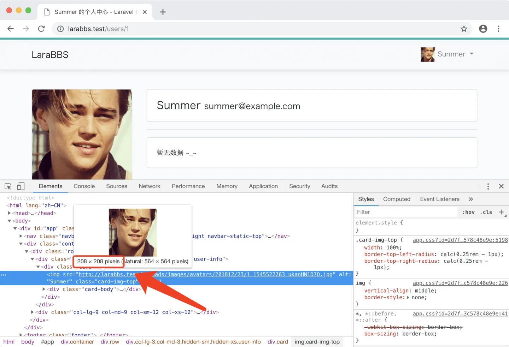
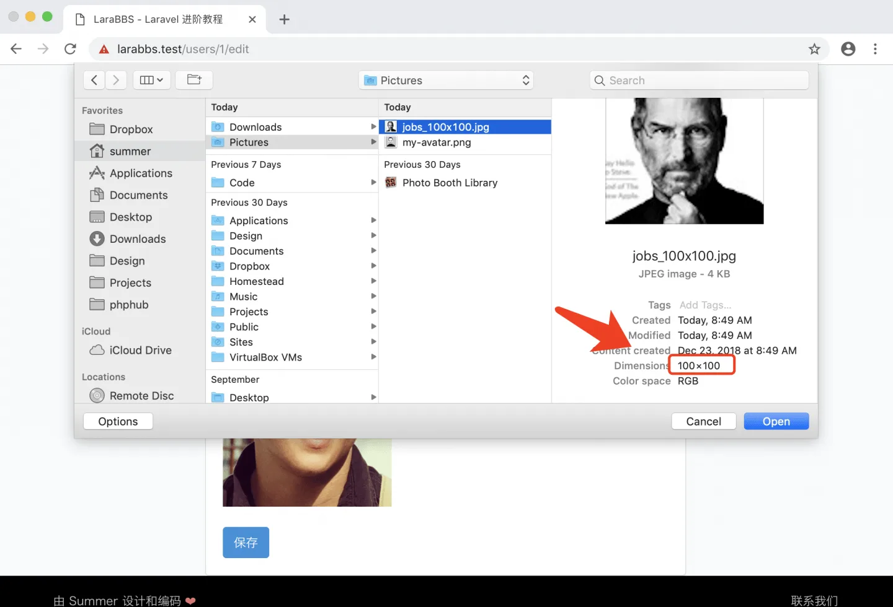
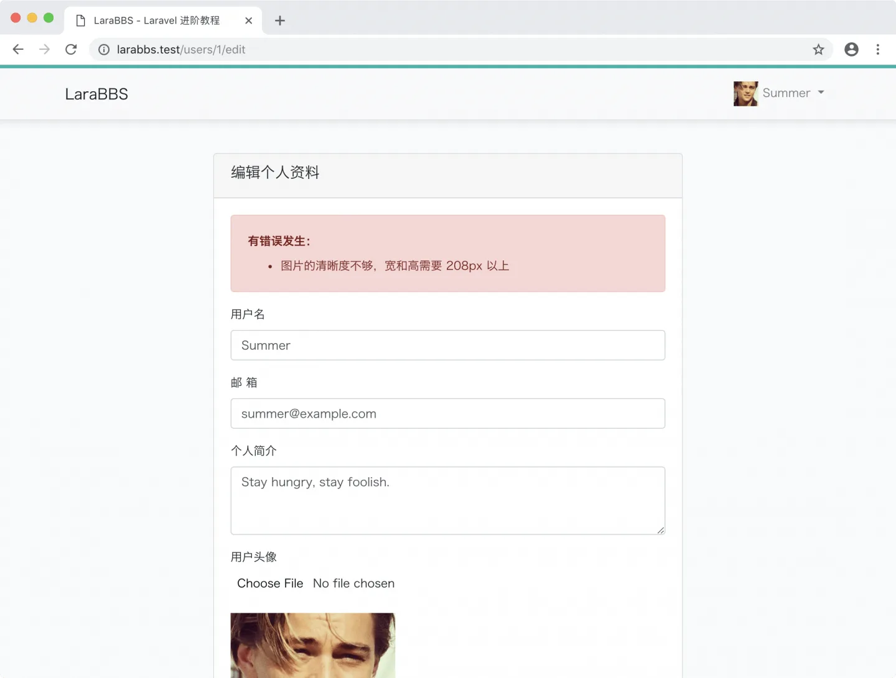

# 4.6. 限制头像分辨率

原文链接：https://learnku.com/courses/laravel-intermediate-training/9.x/limit-avatar/12494

## 图片验证

当用户上传分辨率太小的图片时，会影响网站的美观，所以我们需要对图片的分辨率大小加以限制。得益于 Laravel 强大的表单验证功能，我们只需要在 `UserRequest` 中增加图片验证规则即可：

app/Http/Requests/UserRequest.php

```
<?php

namespace App\Http\Requests;

use Illuminate\Foundation\Http\FormRequest;
use Auth;

class UserRequest extends FormRequest
{
    public function authorize()
    {
        return true;
    }

    public function rules()
    {
        return [
            'name' => 'required|between:3,25|regex:/^[A-Za-z0-9\-\_]+$/|unique:users,name,' . Auth::id(),
            'email' => 'required|email',
            'introduction' => 'max:80',
            'avatar' => 'mimes:png,jpg,gif,jpeg|dimensions:min_width=208,min_height=208',
        ];
    }

    public function messages()
    {
        return [
            'avatar.mimes' =>'头像必须是 png, jpg, gif, jpeg 格式的图片',
            'avatar.dimensions' => '图片的清晰度不够，宽和高需要 208px 以上',
            'name.unique' => '用户名已被占用，请重新填写',
            'name.regex' => '用户名只支持英文、数字、横杠和下划线。',
            'name.between' => '用户名必须介于 3 - 25 个字符之间。',
            'name.required' => '用户名不能为空。',
        ];
    }
}
```

1. `rules()` 方法中新增了图片比例验证规则 [dimensions](https://learnku.com/docs/laravel/9.x/validation#rule-dimensions) ，仅允许上传宽和高都大于 208px 的图片；

2. `messages()` 方法中新增了头像出错时的提示信息。

宽和高等于 208px 是怎么得到呢？调出  [Chrome 开发者工具](https://jingyan.baidu.com/article/20095761c1414acb0721b4bd.html) 进行源代码查看，鼠标放置于图片链接时，即可看到图片尺寸：



接下来让我们来测试一下：

1. 访问 [资料编辑页面](http://larabbs.test/users/1/edit)  ；

2. 点击 『choose file』 按钮，选择一张尺寸小于 208px 的图片（可以用 [这张图片](https://cdn.learnku.com/uploads/images/202203/06/1/LfDz29Aq7h.png)）：



1. 点击『保存』按钮提交表单：



如上图可以看到我们自定义的错误消息提示。

## Git 代码版本控制

接着让我们将本次更改纳入版本控制中：

```bash
$ git add -A
$ git commit -m "限制头像分辨率"
```
