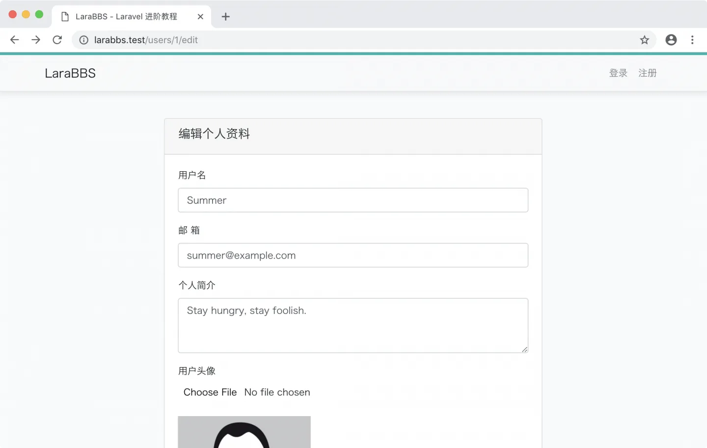
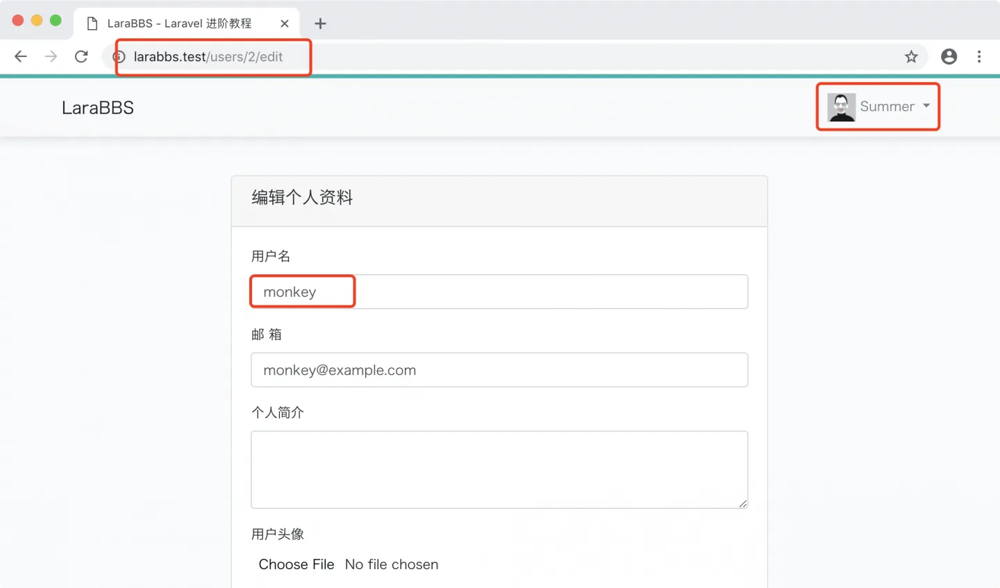
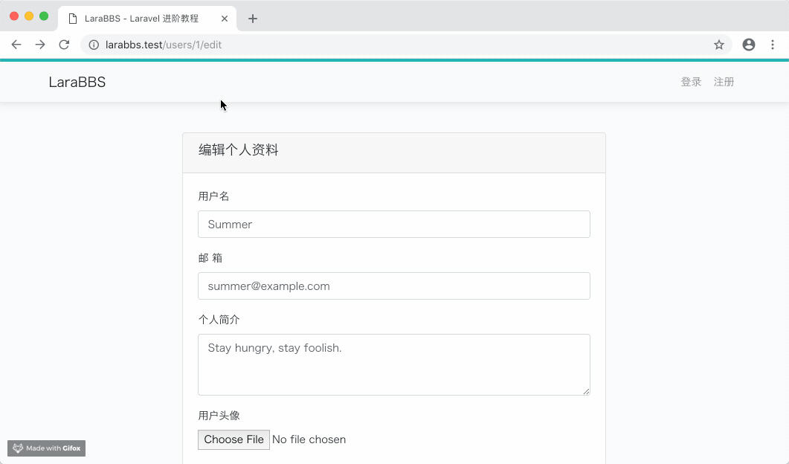
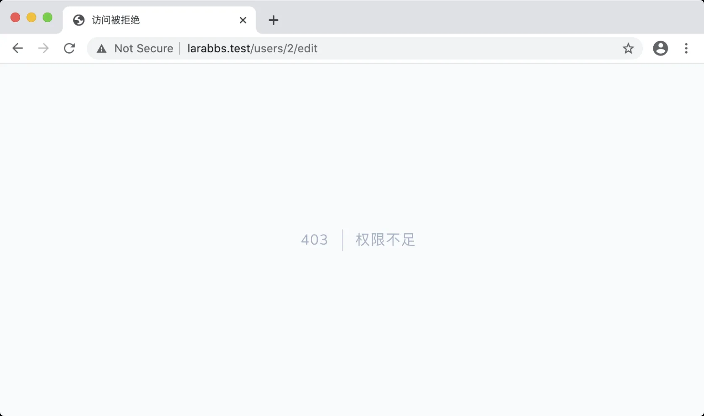

# 4.8. 授权访问

原文链接：https://learnku.com/courses/laravel-intermediate-training/9.x/access-control/12496

## 问题说明

现在的应用存在两个巨大的安全隐患：

1. 未登录用户可以访问 `edit` 和 `update` 动作，如果你退出登录，以游客身份访问 [larabbs.test/users/1/edit](http://larabbs.test/users/1/edit) ：



1. 登录用户可以更新其它用户的个人信息，登录 Summer 用户然后访问 Monkey 用户的编辑资料页面 [larabbs.test/users/2/edit](http://larabbs.test/users/2/edit) ：



登录状态的 1 号用户 Summer 居然可以访问 2 号用户 Monkey 的个人编辑页面，甚至是修改内容。

接下来让我们针对这两个安全隐患进行修复。

## 限制游客访问

[Laravel 中间件 (Middleware)](https://learnku.com/docs/laravel/8.x/middleware) 为我们提供了一种非常棒的过滤机制来过滤进入应用的 HTTP 请求，例如，当我们使用 Auth 中间件来验证用户的身份时，可能会有以下两种情况：

- 如果用户未通过身份验证，则 Auth 中间件会把用户重定向到登录页面。

- 如果用户通过了身份验证，则 Auth 中间件会通过此请求并接着往下执行。

Laravel 框架默认为我们内置了一些中间件，例如身份验证、CSRF 保护等。所有的中间件文件都被放在项目的 `app/Http/Middleware` 文件夹中。

接下来让我们使用 Laravel 提供身份验证（Auth）中间件来过滤未登录用户的 `edit`, `update` 动作：

app/Http/Controllers/UsersController.php

```
<?php
.
.
.
class UsersController extends Controller
{
public function __construct()
{
$this->middleware('auth', ['except' => ['show']]);
}
.
.
.
}
```

`__construct` 是 PHP 的构造器方法，当一个类对象被创建之前该方法将会被调用。我们在 `__construct` 方法中调用了 `middleware` 方法，该方法接收两个参数，第一个为中间件的名称，第二个为要进行过滤的动作。

我们通过 `except` 方法来设定 指定动作 不使用 Auth 中间件进行过滤，意为 —— 除了此处指定的动作以外，所有其他动作都必须登录用户才能访问，类似于黑名单的过滤机制。相反的还有 `only` 白名单方法，将只过滤指定动作。

我们提倡在控制器 Auth 中间件使用中，首选 `except` 方法，这样的话，当你新增一个控制器方法时，默认是安全的，此为最佳实践。

Laravel 提供的 Auth 中间件在过滤指定动作时，如该用户未通过身份验证（未登录用户），将会被重定向到登录页面：



## 用户只能编辑自己的资料

在完成对未登录用户的限制之后，接下来我们要限制的是已登录用户的操作。当 id 为 1 的用户去尝试更新 id 为 2 的用户信息时，我们应该返回一个 403 禁止访问的异常。在 Laravel 中可以使用 [授权策略 (Policy)](https://learnku.com/docs/laravel/8.x/authorization#policies) 来对用户的操作权限进行验证，在用户未经授权进行操作时将返回 403 禁止访问的异常。

### 1. 创建授权策略类

我们可以使用以下命令来生成一个名为 `UserPolicy` 的授权策略类文件，用于管理用户模型的授权。

```
$ php artisan make:policy UserPolicy
```

所有生成的授权策略文件都会被放置在 `app/Policies` 文件夹下。

让我们为默认生成的用户授权策略添加 `update` 方法，用于用户更新时的权限验证。

app/Policies/UserPolicy.php

```
<?php

namespace App\Policies;

use App\Models\User;
use Illuminate\Auth\Access\HandlesAuthorization;

class UserPolicy
{
use HandlesAuthorization;

public function update(User $currentUser, User $user)
{
return $currentUser->id === $user->id;
}
}
```

`update` 方法接收两个参数，第一个参数默认为当前登录用户实例，第二个参数则为要进行授权的用户实例。当两个 id 相同时，则代表两个用户是相同用户，用户通过授权，可以接着进行下一个操作。如果 id 不相同的话，将抛出 403 异常信息来拒绝访问。

使用授权策略需要注意以下两点：

1. 我们并不需要检查 `$currentUser` 是不是 NULL。未登录用户，框架会自动为其 所有权限 返回 `false`；

2. 调用时，默认情况下，我们 不需要 传递当前登录用户至该方法内，因为框架会自动加载当前登录用户（接着看下去，后面有例子）；

### 2. 注册授权策略

Laravel 提供两种注册授权策略的方式，第一种是手动指定，第二种是 Laravel 5.8 新增功能 —— 自动授权注册。方便起见，我们会使用第二种。

自动授权默认会假设 Model 模型文件直接存放在 `app` 目录下，鉴于我们已将模型存放目录修改为 `app/Models`，接下来还需自定义自动授权注册的规则，修改 `boot()` 方法：

app/Providers/AuthServiceProvider.php

```
<?php
.
.
.
class AuthServiceProvider extends ServiceProvider
{
.
.
.
public function boot()
{
$this->registerPolicies();
// 修改策略自动发现的逻辑
Gate::guessPolicyNamesUsing(function ($modelClass) {
// 动态返回模型对应的策略名称，如：// 'App\Model\User' => 'App\Policies\UserPolicy',
return 'App\Policies\\'.class_basename($modelClass).'Policy';
});
}
}
```

授权策略定义完成之后，我们便可以在控制器中使用 `authorize` 方法来检验用户是否授权。默认的 `App\Http\Controllers\Controller` 控制器基类包含了 Laravel 的 `AuthorizesRequests` trait。此 trait 提供了 `authorize` 方法，它可以被用于快速授权一个指定的行为，当无权限运行该行为时会抛出 HttpException。`authorize` 方法接收两个参数，第一个为授权策略的名称，第二个为进行授权验证的数据。

我们需要为 `edit` 和 `update` 方法加上这行：

```
$this->authorize('update', $user);
```

>

这里 `update` 是指授权类里的 `update` 授权方法，`$user` 对应传参 `update` 授权方法的第二个参数。正如上面定义 `update` 授权方法时候提起的，调用时，默认情况下，我们 不需要 传递第一个参数（也就是当前登录用户）至该方法内，因为框架会 自动 加载当前登录用户。

书写的位置如下：

app/Http/Controllers/UsersController.php

```
<?php

namespace App\Http\Controllers;
.
.
.
class UsersController extends Controller
{
.
.
.

public function edit(User $user)
{
$this->authorize('update', $user);
return view('users.edit', compact('user'));
}

public function update(UserRequest $request, ImageUploadHandler $uploader, User $user)
{
$this->authorize('update', $user);
$data = $request->all();

if ($request->avatar) {
$result = $uploader->save($request->avatar, 'avatars', $user->id, 416);
if ($result) {
$data['avatar'] = $result['path'];
}
}

$user->update($data);
return redirect()->route('users.show', $user->id)->with('success', '个人资料更新成功！');
}
}
```

## 开始测试

代码布置完毕，接下来开始测试。

登录 ID 为 1 的 Summer 用户，然后访问 2 号用户的修改资料页面 —— [larabbs.test/users/2/edit](http://larabbs.test/users/2/edit) ，系统将会拒绝访问：



## Git 版本控制

下面把代码纳入到版本管理：

```
$ git add -A
$ git commit -m "授权访问"
```
