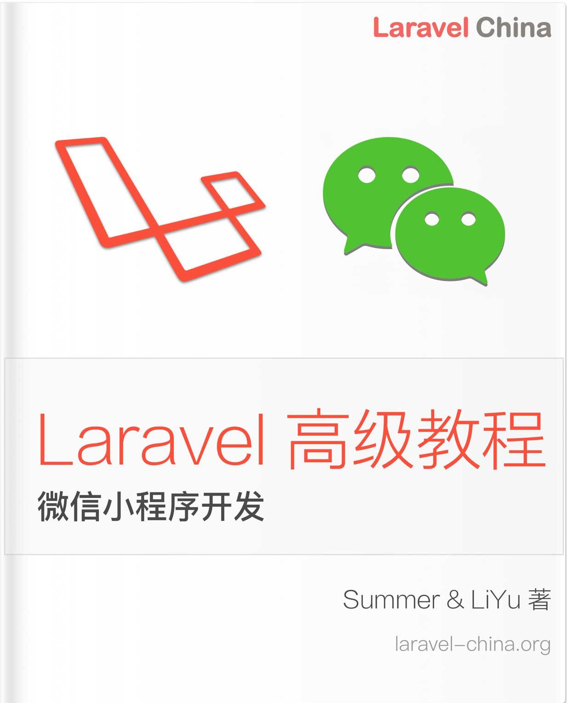

# 1.1. 序言

原文链接：https://learnku.com/courses/laravel-weapp/1.7/preface/1421

本教程最新版为 [2.1](https://learnku.com/courses/laravel-weapp/2.1)，当前版本已放弃维护，请阅读最新版本！

## Laravel 高级教程

本书是 Laravel 教程系列的第四本，前三本分别是：

- 第一本 [《Laravel 入门教程 - 从零到部署上线》](https://learnku.com/laravel/t/3383)

- 第二本 [《Laravel 进阶课程 - 从零开始构建论坛系统...](https://learnku.com/laravel/t/6592)

- 第三本 [《Laravel 教程 - 实战构架 API 服务器》](https://learnku.com/laravel/t/7657)

本书主要专注于以下开发场景：

>

从零开始开发 LaraBBS 项目的 微信小程序端。

在第二本进阶课程构建的项目 [LaraBBS](https://github.com/summerblue/larabbs) 以及第三本教程构建的 API 基础上，我们将一起开发以下微信小程序功能：

- 小程序个人账户申请；

- WePY 框架及 WeUI 的使用；

- 登录及 Token 刷新、删除；

- 手机注册及用户绑定；

- 个人详情页及个人资料修改；

- 话题列表，分类切换；

- 回复的发布、删除及列表；

- 消息通知 Badge 提示；

- 用户权限；

- 小程序发布。

通过学习本教程，你将学到 ——  WePY 快速开发小程序、WeUI 的使用、ES 7 中 Async / Await 的使用、Token 的缓存刷新及删除等技术概念。课程中所教授的技术方案，我们已经利用其为客户开发过不少的商业应用，所以你学到不是一个简单的『玩具项目』，而是一个经受过实战考验的商业解决方案。

我们沿用前三个课程的传统教学方法，利用线索式的行文方式，带你一步步从项目的创建，到小程序的发布，熟悉整个小程序的开发流程。让你在最短时间内，即可将微信小程序开发技能收入囊中，让你做好技术储备，保持竞争力。

## 学习建议

本书是系列课程的第四本，如果你是新手，并且学习目标是成为 Laravel 全栈工程师，我们强烈建议你先认真学习第一本书和第二本，掌握 Laravel 基础知识。因为本系列课程的设计核心是一步步把你从 Laravel 新手培养为 Laravel 高级工程师，每一本都是一个不同的阶段，所以一些基础知识在前面书籍中讲解过，这此处我们将不会再次浪费篇幅进行讲解。当然，如果你是有经验的开发者，你也可以选择跳过前面两本教程。

无论是新手还是有经验的开发者，我们都强烈建议学习第三本教程，因为我们会利用第三本教程开发出来的 API 完成一个微信小程序的个人应用，同时会调整部分接口。学习并了解整个项目接口的开发思路，会更有利于本教程的学习。

如果你没有前面基本课程的学习经验，独立学习本课程也是完全没问题的。本课程是基于 线索式 教授方式，每一步的操作都记录详尽，你只要认真按照本课程的指示操作下去，课程结束后就能开发出来你的第一个微信小程序。

## 目标用户

编程新手

学习过本系列的其他三套课程，有一定编程基础，通过本课程来积累项目经验。

Laravel / PHP 工程师

有一定经验的 Web 开发工程师，通过本课程提供的微信小程序开发实战练习，来快速上手小程序的开发工作。在完成本课程的学习后，你将会对小程序的开发有系统性的认识。

Web 开发工程师

你将不仅仅学到小程序的开发技巧，还能探析到后端开发者构建 API 的基本流程，这有助于你对小程序开发的全面认识。学完本课程后，如果你有兴趣，可以继续学习前面三套课程，从这里开始成长你的后端开发技能。

## 本书特色

- 现代化工作流 - 微信小程序开发的日常流程，包括Git 工作流、GitHub 使用等；

- 注重实战 - 所用工具、开发流程、编码理念都是工程师每日编码必备；

- 最佳实践 - 代码中加入许多最佳实践，从一开始就养成好的编码习惯；

- 刻意练习 - 一步一步构建一个完整的项目，整书一个线索，轻松上手，一气呵成。

## 体验小程序

本教程完成的小程序已经发布，微信扫描下方二维码即可体验：

## 版权声明

本书《Laravel 微信小程序开发》版权归作者 liyu001989 和 Summer 所有。

本书受版权法保护，任何组织或个人不得以任何形式分发或做商业使用。

>

更多评论请看： [社区讨论帖](https://learnku.com/laravel/t/10318/weapp) 。
