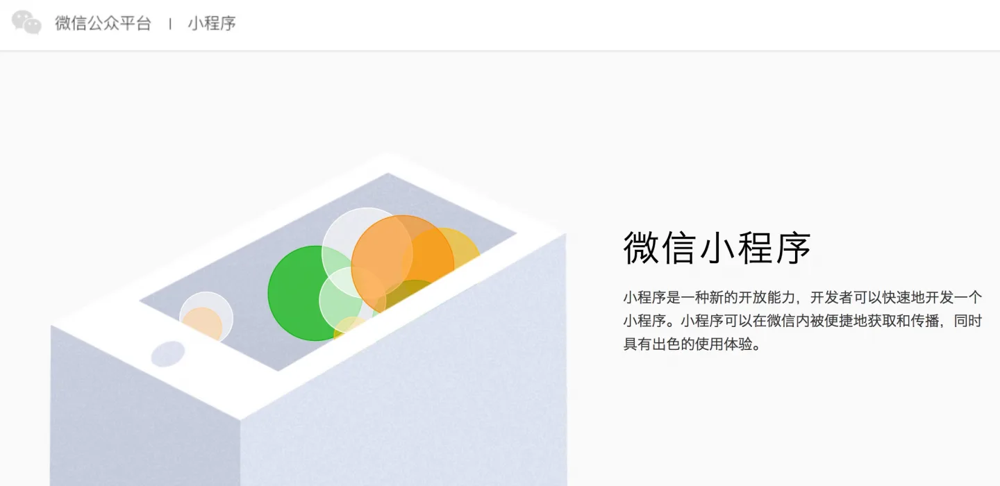

# 1.3. 关于微信小程序开发

原文链接：https://learnku.com/courses/laravel-weapp/1.7/weapp/1423

本教程最新版为 [2.1](https://learnku.com/courses/laravel-weapp/2.1)，当前版本已放弃维护，请阅读最新版本！

## 什么是微信小程序？

微信小程序，简称小程序，英文名 WeApp，是一种不需要下载安装即可使用的应用，它实现了应用“触手可及”的梦想，用户扫一扫或搜一下即可打开应用（仅在微信中使用）。

内测时间 2016 年 9 月 21 日，发布时间 2017 年 1 月 9 日。全面开放申请后，主体类型为企业、政府、媒体、其他组织或个人的开发者，均可申请注册小程序。

至 2017 下半年，小程序官方正式公告，开放了更多的入口，个人开发者可以申请注册，公众号菜单可以直接点开，移动App可以直接分享，小程序越来越开放了！

## 微信小程序的应用场景？

移动端从产品和开发选择上，我们一般有以下两种方案：

- 原生应用（iOS 、安卓等）；

- 手机网页（我们常说的 HTML5）。

小程序的用户体验和可编程接口上，比 iOS 和安卓的原生应用差，但是却比网页强太多，是介于原生应用程序和手机网页之间的一种解决方案。微信小程序作为轻型应用，很有可能会是未来移动互联网应用的主要形式，它的特点是小而快，小程序目的主要还是解决小应用的问题，重点在于灵活、快捷、用完即走。微信小程序虽然是一个年轻的平台，但是其基于微信月活超 10 亿的巨大社交网络上，发展前景非常可观。我所在的专业提供技术服务的公司里，最近一年就遇到了大量的小程序开发需求。

下面是几种比较有价值的小程序应用场景：

1、O2O服务小程序

以餐馆为例，对他们来说做一个原生 APP 相对不现实，而现在消费者只需扫描二维码，就可以接入小程序，立马就能看见菜单，从而完成点菜，购物等交易。不仅如此，消费过后还会留存用户信息，相当于微信直接给商家对接了会员体系，然后通过微信轻松地了解用户的消费习惯、偏好，针对性地做推荐、诱导购买、会员优惠等。

2、公众号+小程序

对自媒体来说，小程序的玩法远超我们想象。

首先公众号的变现方式有了更多的可能，除了贴片广告，用小程序开展教育培训也是一种可能；用程序代替H5进行营销推广也是比较可行的一种模式。最值得期待的是，公众号+小程序做电商，本来很多公众号做电商变现，有了小程序之后对公众号来说更加方便了。

而企业号则可以把小程序作为一个入口，再把流量引回公众号。

3、 工具类小程序

工具类的小程序最适用的场景应该是"刚需""低频"，当用户没有安装 App，也不想安装 APP，但又想体验在线预订，不想排队，不想支付现金的时候，工具类的小程序就能发挥它的最大价值了，比如到了汽车站、到了酒店前台的用户没有安装APP的用户也能通过小程序达到目的。

4、生活服务类小程序

生活服务类小程序虽然和工具类很相似，但生活服务类的小程序应用场景要丰富一些，

使用频率也会比工具类的高，最主要的特点是"及时"，当用户想知道今天的天气，想知道此刻的路况，想知道下一班公交几点来，就会有点开小程序的欲望。

>

以上是小程序 早期 比较有价值的使用场景，不过随着用户使用习惯的慢慢养成，小程序将会成为未来移动互联网应用的主要形式，就是说相对于浏览器站点、客户端 APP 的一种存在。

## 为什么我们需要学习小程序？

作为一个后端程序员，职业规划上，不能仅限于 API 工程师，超越自己的舒适区，尝试完整开发一个小程序，将会使你的 API 架构能力更加优秀。这有点像『全栈工程师』的概念，熟练全栈开发的工程师，应用架构能力就是要比技能单一的后端工程师强。一般来讲的 Web 全栈工程师是服务器后端 + 前端，而微信小程序，就是我们新的『前端』。另一方面，有了一定的小程序的开发经验，开阔了视野，在随后的职业生涯上，如果遇到职业变更，你的选项也会广。
