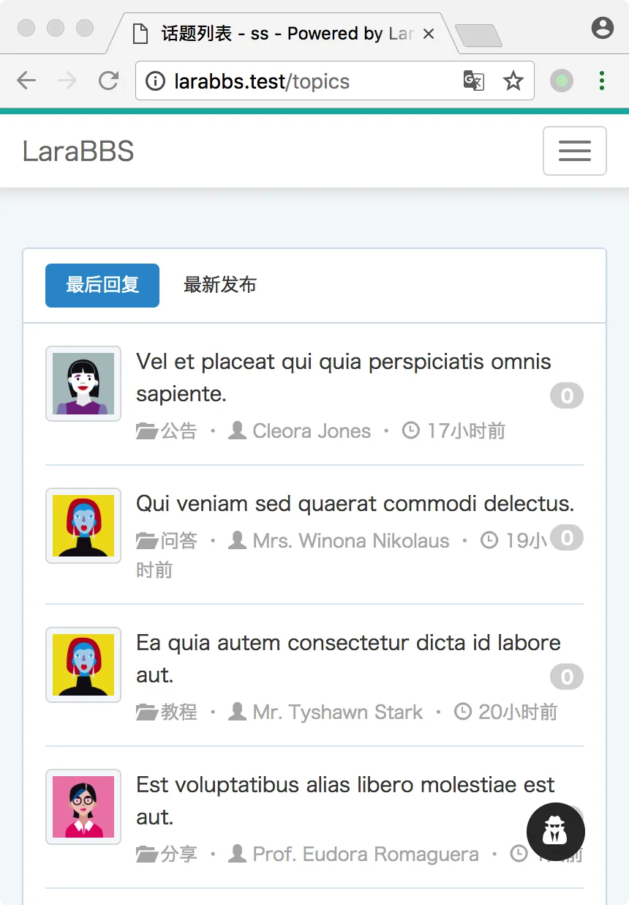
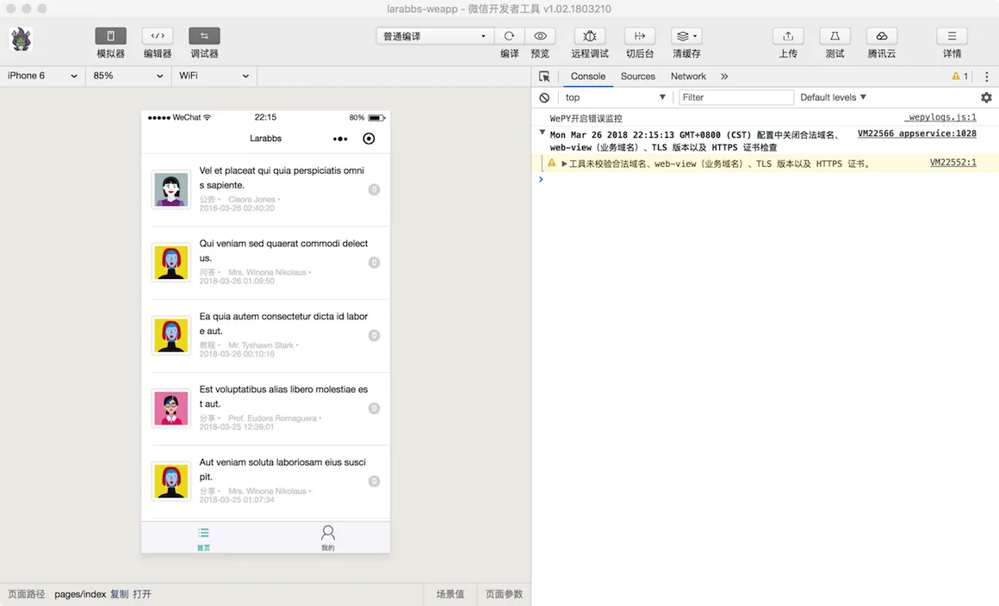
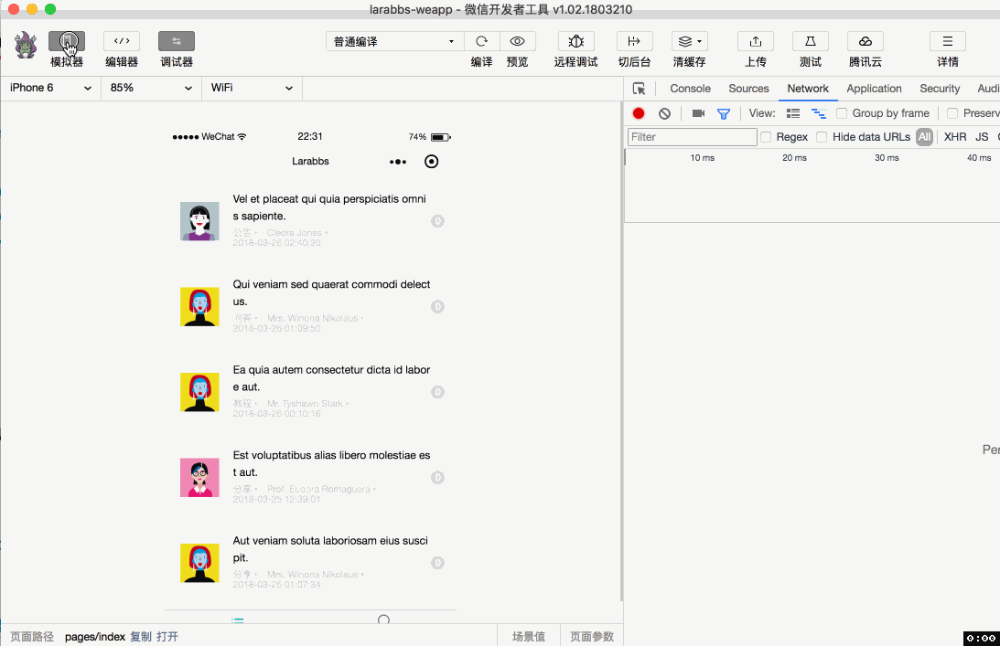
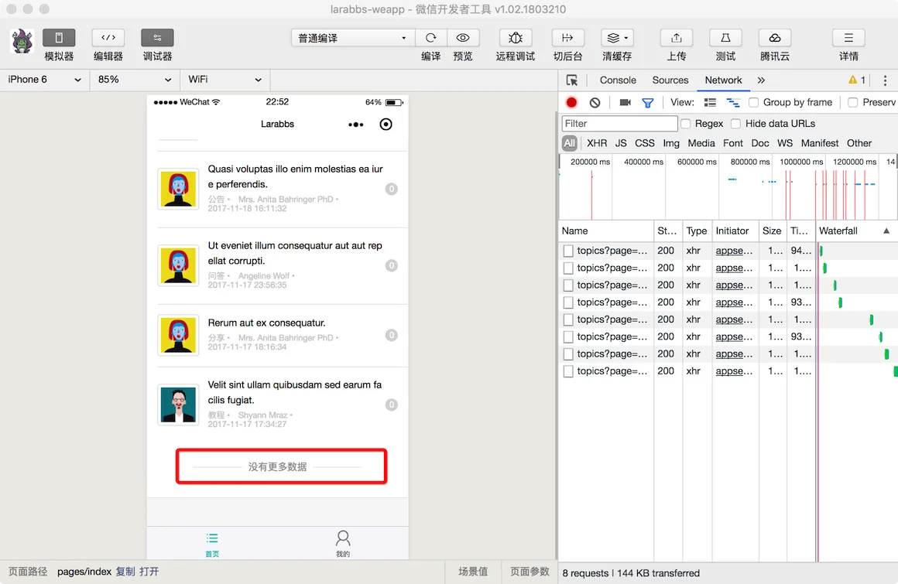

# 7.1. 话题列表

原文链接：https://learnku.com/courses/laravel-weapp/1.7/topic-list/1469

本教程最新版为 [2.1](https://learnku.com/courses/laravel-weapp/2.1)，当前版本已放弃维护，请阅读最新版本！

## 话题列表

这一章节我们来完成话题列表页面，也就是小程序的首页。

## 调整目录结构

现在的首页地址为 `pages/index.wpy`，我们也并没有按照功能进行区分，以后的 `话题详情`，`某个用户话题列表` 等页面，都可以同首页一起，按功能放在 `topics` 目录中，下面我们来调整页面结构：

1.

创建 `topics` 目录，并移动 `index.wpy` 到 `topics` 目录中：

```
$ cd ~/Code/larabbs-weapp
$ mkdir src/pages/topics
$ mv src/pages/index.wpy src/pages/topics/index.wpy
```

2.

修改 `app.wpy` 文件：

src/app.wpy

```
.
.
.
config = {
pages: [
'pages/topics/index',
'pages/users/me',
'pages/users/edit',
'pages/auth/login',
'pages/auth/register'
],
.
.
.
tabBar: {
.
.
.
pagePath: 'pages/topics/index',
text: '首页',
.
.
.
```

修改 `pages` 中的页面路径；修改 `tabbar` 中 `首页` 的页面路径。

## 修改页面

首先我们需要设计一下小程序首页的结构，可以参考一下 Larabbs 的页面结构。



我们需要显示如下内容：

- 话题—— 标题、分类名称、最后更新时间、回复总数；

- 话题用户 —— 头像，用户名。

### 页面结构

首先我们增加页面样式及布局：

src/pages/topics/index.wpy

```
<style lang="less">
.weui-media-box__info__meta {
margin: 0;
font-size: 12px;
}
.topic-info {
margin-top: 5px;
}
.topic-title {
white-space: normal;
font-size: 14px;
}
.avatar {
padding: 4px;
border: 1px solid #ddd;
border-radius: 4px;
width: 50px;
height: 50px;
}
.reply-count {
background-color: #d8d8d8;
float: right;
}
</style>
<template>
<view class="page">
<view class="page__bd">
<view class="weui-panel weui-panel_access">
<view class="weui-panel__bd">
<repeat for="{{ topics }}" key="id" index="index" item="topic">
<navigator url="" class="weui-media-box weui-media-box_appmsg" hover-class="weui-cell_active">
<view class="weui-media-box__hd weui-media-box__hd_in-appmsg">
<image class="weui-media-box__thumb avatar" src="{{ topic.user.avatar }}" />
</view>
<view class="weui-media-box__bd weui-media-box__bd_in-appmsg">
<view class="weui-media-box__title topic-title">{{ topic.title }}</view>

<view class="weui-media-box__info topic-info">
<view class="weui-media-box__info__meta">{{ topic.category.name }} • </view>
<view class="weui-media-box__info__meta">{{ topic.user.name }} • </view>
<view class="weui-media-box__info__meta">{{ topic.updated_at }}</view>
</view>
</view>
<view class="weui-badge reply-count">{{ topic.reply_count }}</view>
</navigator>
</repeat>
</view>
</view>
</view>
</view>
</template>
<script>
import wepy from 'wepy'
import api from '@/utils/api'

export default class TopicIndex extends wepy.page {
data = {
// 话题数据
topics: [],
// 当前分页
page: 1
}
// 获取话题数据
async getTopics(page = 1) {
try {
// 请求话题列表接口
let topicsResponse = await api.request({
url: 'topics',
data: {
page: page,
include: 'user,category'
}
})
let topics = topicsResponse.data.data
// 将数据合并到 this.topics
this.topics = this.topics.concat(topics)
this.$apply()
} catch (err) {
wepy.showModal({
title: '提示',
content: '服务器错误，请联系管理员'
})
}
}
async onLoad() {
this.getTopics()
}
}
</script>

```

首先我们封装了 `getTopics` 方法，获取话题列表：

- 因为我们需要显示用户及分类的信息，所以增加了参数 `include=user,category`，同时获取话题相关的用户及分类数据；

- `getTopics` 方法请求接口获取到话题数据后，使用 `this.topics = this.topics.concat(topics)` 重新设置 `topics` 数据，因为 concat 方法可以合并两个数组，这样方便我们不断添加合并数据到 `topics` 中。

我们在页面首次加载的时候调用 `getTopics` 方法获取话题列表，也就是在 `onLoad` 方法中，该事件只会触发一次，切换到其他页面后返回并不会再次触发。



打开开发者工具会看到上面的样子，最后更新时间暂时直接显示了 `updated_at`。

## 下拉刷新

接下来我们实现下拉刷新功能，首先需要增加 [enablePullDownRefresh](https://developers.weixin.qq.com/miniprogram/dev/api/pulldown.html) 配置，允许页面可以下拉，注意程序中需要业务逻辑执行完了之后调用 `wepy.stopPullDownRefresh()` 停止当前页面的下拉刷新。

src/pages/toipcs/index.wpy

```
.
.
.
export default class TopicIndex extends wepy.page {
config = {
enablePullDownRefresh: true
}
.
.
.
```

设置了 `enablePullDownRefresh` 为 `true` 后，用户下拉后便会触发 `onPullDownRefresh` 方法，下面来定义这个方法：

src/pages/toipcs/index.wpy

```
.
.
.
async getTopics(page = 1, reset = false) {
try {
// 请求话题列表接口
let topicsResponse = await api.request({
url: 'topics',
data: {
page: page,
include: 'user,category'
}
})
let topics = topicsResponse.data.data
// 如果传入参数 reset 为true，则覆盖 topics
this.topics = reset ? topics : this.topics.concat(topics)
this.$apply()
} catch (err) {
console.log(err)
wepy.showModal({
title: '提示',
content: '服务器错误，请联系管理员'
})
}
}
.
.
.
async onPullDownRefresh() {
this.page = 1
await this.getTopics(1, true)
wepy.stopPullDownRefresh()
}
.
.
.
```

修改 `getTopics` 方法，增加一个参数 `reset`， 是否重置话题数据，如果为 true 则直接赋值  `this.topics`，为 false 则合并话题数据。因为下拉刷新其实是重置话题数据，所以调用时使用 `this.getTopics(1, true)`。最后调用 `stopPullDownRefresh` 停止刷新。



## 加载更多

当滑动到页面最底部的时候，页面应该自动加载下一页的内容，显示更多的数据，这时候只需要定义 [onReachBottom](https://developers.weixin.qq.com/miniprogram/dev/framework/app-service/page.html) 页面上拉触底事件的处理函数即可：

src/pages/toipcs/index.wpy

```
.
.
.
</repeat>
<view class="weui-loadmore weui-loadmore_line" wx:if="{{ noMoreData }}">
<view class="weui-loadmore__tips weui-loadmore__tips_in-line">没有更多数据</view>
</view>
.
.
.
data = {
topics: [],
page: 1,
noMoreData: false
}
async getTopics(page = 1, reset = false) {
try {
let topicsResponse = await api.request({
url: 'topics',
data: {
page: page,
include: 'user,category'
}
})
let topics = topicsResponse.data.data
// 如果传入参数 reset 为true，则覆盖 topics
this.topics = reset ? topics : this.topics.concat(topics)

let pagination = topicsResponse.data.meta.pagination

// 根据分页设置是否还有更多数据
if (pagination.current_page === pagination.total_pages) {
this.noMoreData = true
}
this.$apply()
} catch (err) {
console.log(err)
wepy.showModal({
title: '提示',
content: '服务器错误，请联系管理员'
})
}
}
.
.
.
async onPullDownRefresh() {
this.noMoreData = false
this.page = 1
await this.getTopics(1, true)
wepy.stopPullDownRefresh()
}
async onReachBottom () {
// 如果没有更多内容，直接返回
if (this.noMoreData) {
return
}
this.page = this.page + 1
await this.getTopics(this.page)
this.$apply()
}
.
.
.
```

1. 首先我们页面中增加了一个 `view` 用来显示已经到最后一页没有数据的提示；

2. 接着新增一个数据 `是否有更多内容` （ noMoreData ） 默认为 false， `getTopics` 方法中当 `pagination.current_page === pagination.total_pages` 也就是当前页等于总页数的时候，设置 `noMoreData` 为 true，也就是已经没有更多内容了；

3. 最后增加 `onReachBottom` 方法，页面滚动到底端的时候会触发，如果 `noMoreData` 为 true 则直接返回，否则将页数 page 加 1，然后获取下一页的话题数据；

4. 同时下拉刷新的方法 `onPullDownRefresh` 中需要重置 `noMoreData` 为 false。



打开开发者工具，滑动到底端应该就会自动加载下一页了，如果加载到没有数据了则会显示『没有更多数据』。

## 代码版本控制

```
$ cd ~/Code/larabbs-weapp
$ git add -A
$ git commit -m 'page index'
```
