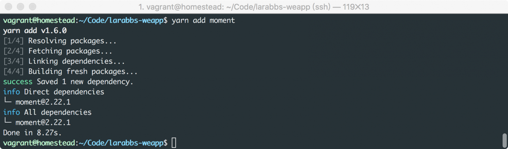
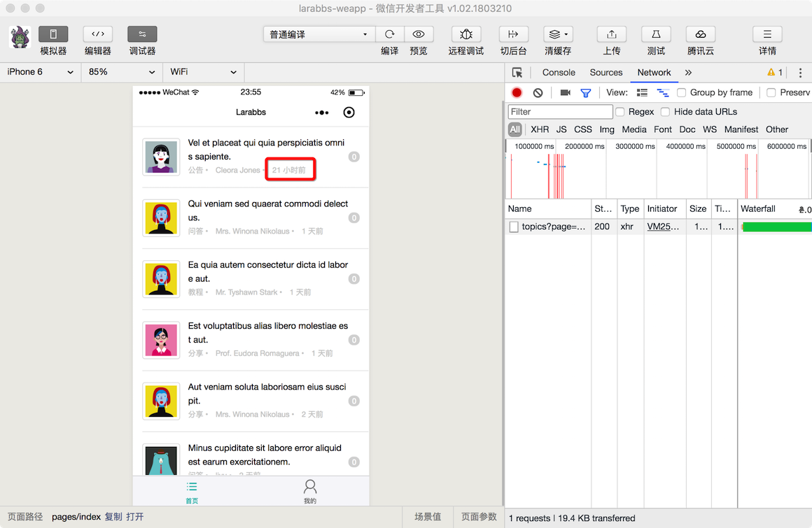

# 7.2. 使用 Moment.js

原文链接：https://learnku.com/courses/laravel-weapp/1.7/using-momentjs/1600

本教程最新版为 [2.1](https://learnku.com/courses/laravel-weapp/2.1)，当前版本已放弃维护，请阅读最新版本！

## 优化最后更新时间

上一节的话题列表中，话题的 `更新时间` 我们直接使用了话题的 `updated_at` 属性，更好的显示方式为 `x 分钟前`，`x 小时前`。在 PHP 中我们可以使用 [Carbon](http://carbon.nesbot.com/docs/#api-localization) 的 `diffForHumans` 方法格式化时间，小程序中我们也需要一个类似的工具。[Moment.js](http://momentjs.cn/) 就是这样一个处理时间的工具，下面我们来安装并使用它。

很多人可能第一时间想到的解决方案是修改接口，让接口默认将时间格式化为 `x 分钟前`，这样虽说能解决问题，但是十分不推荐，因为：

1. 接口不应该知道客户端需要如何显示数据，接口只需要做到数据统一，时间应该返回统一的格式；

2. 接口是独立的，不会与页面耦合，不应该因为客户端的显示需求而修改接口。

### 安装 Moment.js

首先需要安装 Moment.js：

```
$ cd ~/Code/larabbs-weapp
$ yarn add moment
```



### 封装工具方法

时间格式化应该封装成一个工具方法，放在一个工具文件中，我们可以在 `utils` 目录中，创建 `util.js` 文件，将一些工具方法封装在该文件中，类似于 Laravel 的辅助方法。

```
$ touch src/utils/util.js
```

修改 `utils.js`：

src/utils/util.js

```
import moment from 'moment'
import 'moment/locale/zh-cn'

const diffForHumans = (date, format='YYYYMMDD H:mm:ss') => {
moment.locale('zh-cn')
return moment(date, format).fromNow()
}

export default {
diffForHumans
}

```

我们封装了一个方法 `diffForHumans`，使用了中文的语言包，通过 `moment` 的 `fromNow`，格式化时间。

### 调整代码

src/pages/toipcs/index.wpy

```
.
.
.
<view class="weui-media-box__info__meta">{{ topic.user.name }} • </view>
<view class="weui-media-box__info__meta">{{ topic.updated_at_diff }}</view>
.
.
.
import api from '@/utils/api'
import util from '@/utils/util'
.
.
.
async getTopics(page = 1, reset = false) {
.
.
.
let topics = topicsResponse.data.data
topics.forEach(function (topic) {
topic.updated_at_diff = util.diffForHumans(topic.updated_at)
})
.
.
.
}
}
```

引入工具 `util.js`，在 `getTopics` 方法中我们使用 `forEach`，将每个话题数据中增加 `updated_at_diff` 属性，属性值为 `updated_at` 格式化后的结果，最终在页面中显示 `updated_at_diff`。



打开页面查看结果，可以正确显示最后更新时间。

## 代码版本控制

```
$ cd ~/Code/larabbs-weapp
$ git add -A
$ git commit -m 'add moment.js'
```
