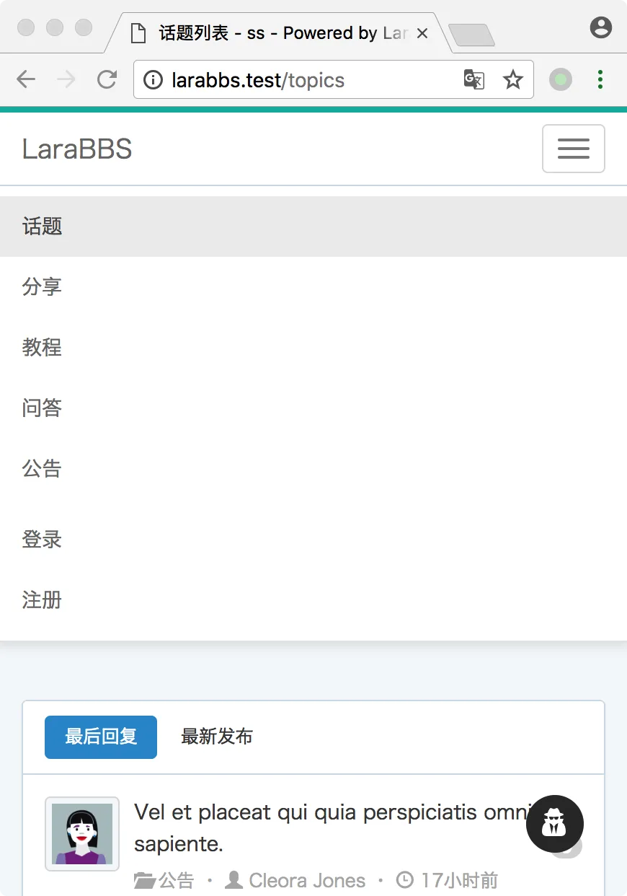
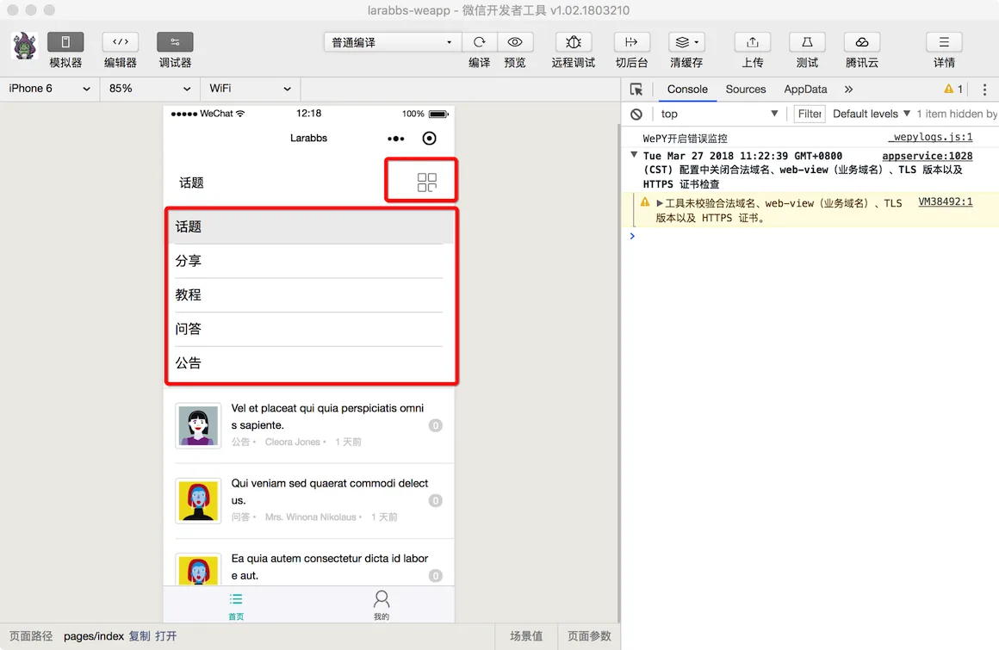
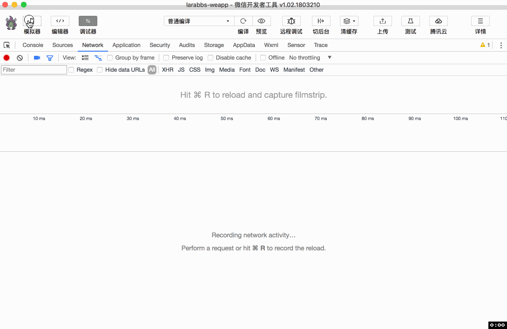

# 7.3. 话题分类

原文链接：https://learnku.com/courses/laravel-weapp/1.7/topic-classification/1577

本教程最新版为 [2.1](https://learnku.com/courses/laravel-weapp/2.1)，当前版本已放弃维护，请阅读最新版本！

## 话题分类

话题是有分类的，可以按照分类切换话题，同样我们可以参考 Larabbs 的操作界面，完成小程序功能。



## 获取分类

首先需要获取所有的分类，并缓存下来：

src/pages/toipcs/index.wpy

```
.
.
.
data = {
topics: [],
page: 1,
noMoreData: false,
categories: []
}
.
.
.
async getCategories() {
// 从缓存中获取分类数据
let categories = wepy.getStorageSync('categories')

if (!categories) {
try {
let categoriesResponse = await api.request('categories')
// 请求成功将数据添加至缓存
if (categoriesResponse.statusCode === 200) {
categories = categoriesResponse.data.data
wepy.setStorageSync('categories', categories)
}
} catch (err) {
wepy.showModal({
title: '提示',
content: '服务器错误，请联系管理员'
})
}
}

this.categories = categories
this.$apply()
}
async onLoad() {
this.getTopics()
this.getCategories()
}
.
.
.
```

首先增加方法 `getCategories`，先从缓存中获取分类 `wepy.getStorageSync('categories')`，如果没有则请求一次服务器接口，获取分类并缓存下来。在页面首次加载 `onLoad` 事件处理方法中调用 `getCategories`。

## 调整页面

首先去 [iconfont](http://www.iconfont.cn/)  找一个合适的分类图标，命名为 category.png


放在 `src/images/` 目录中。

src/pages/toipcs/index.wpy

```
.
.
.
/*分类*/
.weui-flex {
align-items: center;
}
.weui-cells {
margin-top: 0;
opacity: 0;
transition: .3s;
&:before, &:after {
display: none;
}
&_show {
opacity: 1;
}
}
.weui-cell {
&:before {
right: 15px;
}
}
.category-list__item {
margin: 10px 0;
background-color: #FFFFFF;
border-radius: 2px;
overflow: hidden;
&:first-child {
margin-top: 0;
}
}
.category-list__item_selected {
background-color: #eeeeee;
}
.category-list__img {
width: 30px;
height: 30px;
}

.category-list__item-hd {
padding: 20px;
transition: opacity .3s;
&_show {
opacity: .4;
}
}
.category-list__item-bd {
height: 0;
overflow: hidden;
&_show {
height: auto;
}
}
</style>
<template>
<view class="page">
<view class="category-list__item">
<view class="weui-flex category-list__item-hd" @tap="toggle">
<view class="weui-flex__item page-title">{{ currentCategory.name || '话题' }}</view>
<image class="category-list__img" src="/images/category.png"></image>
</view>

<view class="category-list__item-bd {{ categoryOpen ? 'category-list__item-bd_show' : '' }}">
<view class="weui-cells {{ categoryOpen ? 'weui-cells_show' : '' }}">
<view @tap="changeCategory()" class="weui-cell weui-cell_access {{ !currentCategory.id ? 'category-list__item_selected' : '' }}">
<view class="weui-cell__bd">话题</view>
</view>
<repeat for="{{ categories }}" item="category" key="id">
<view @tap="changeCategory({{ category.id }})" class="weui-cell weui-cell_access {{ currentCategory.id == category.id ? 'category-list__item_selected' : '' }}">
<view class="weui-cell__bd">{{ category.name }}</view>
</view>
</repeat>
</view>
</view>
</view>

.
.
.
data = {
topics: [],
page: 1,
noMoreData: false,
categories: [],
categoryOpen: false,
currentCategory: {}
}
computed = {
currentCategoryId () {
return this.currentCategory.id || 0
}
}
.
.
.
async getTopics(page = 1, reset = false) {
try {
let topicsResponse = await api.request({
url: 'topics',
data: {
// 分页
page: page,
// 选中的分类id
category_id: this.currentCategoryId,
include: 'user,category'
}
})
.
.
.
}
.
.
.
methods = {
toggle () {
this.categoryOpen = !this.categoryOpen
},
async changeCategory (id = 0) {
// 点击以后关闭下拉列表
this.categoryOpen = false
// 点击当前已选类型直接返回
if (Number(id) === this.currentCategoryId) {
return
}
// 重置是否有更多数据及分页
this.noMoreData = false
this.page = 1
// 找到选中的分类
this.currentCategory = id ? this.categories.find(category => category.id === id) : {}
this.$apply()
await this.getTopics(1, true)
}
}
.
.
.
```

需要实现的功能有 ：

1. 下拉展示所有分类；

2. 切换分类，点击分类重新请求接口，获取对应分类的话题，下拉刷新和上拉加载更多时，需要以当前选择的分类为条件。

先打开开发者工具，来看一下页面效果，然后再分析代码逻辑：



### 下拉展示分类

顶部 style 中增加了一些分类需要的样式，我们用到了 Less 的样式嵌套功能，不用太过深入研究 Less 语法，这些样式都是从 [wepy-weui-demo](https://learnku.com/courses/laravel-weapp/1459/install-weui) 例子中拷贝过来的，以后有需要的样式或者功能都可以参考这个例子。我们默认分类的第一个为 `话题`，对应没有选择分类的情况。

data 中定义了 `categoryOpen` 用来控制分类列表是否展示，`<view class="weui-flex category-list__item-hd" @tap="toggle">` ，点击顶部的功能条会触发 `toggle` 方法。该方法定义在了 `methods` 中，只是切换 `categoryOpen` 为相反的值，从而控制分类列表。

### 切换分类

每个分类都绑定了点击事件 `@tap="changeCategory({{ category.id }})"`， 点击后会都会调用 `changeCategory` 方法，传入的参数为当前分类的 id。我们利用 `this.categories.find(category => category.id === id)` 根据当前传入的 id 从所有分类中找到选中的分类，并赋值给 `currentCategory` 属性。

增加了一个 `computed` 的方法 `currentCategoryId`，意思是需要计算的属性，当使用 `this.currentCategoryId` 时便会调用该方法，得到返回结果。我们增加 `currentCategoryId` 方法，用来获取当前分类的 id，没有分类则返回 0。

最后，再次修改 `getTopics` 方法，api 请求的时候增加参数  `category_id: this.currentCategoryId,`，这样请求接口时都会附带上当前选中的分类 id。

## 开发者工具调试



## 代码版本控制

```bash
$ cd ~/Code/larabbs-weapp
$ git add -A
$ git commit -m 'index add  categories'
```
