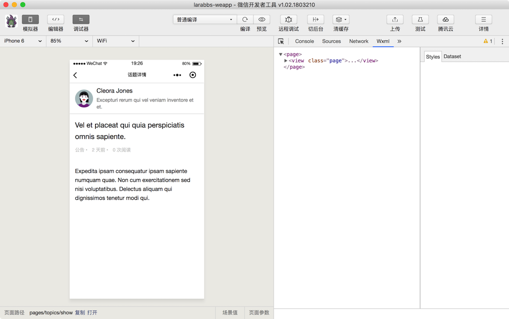
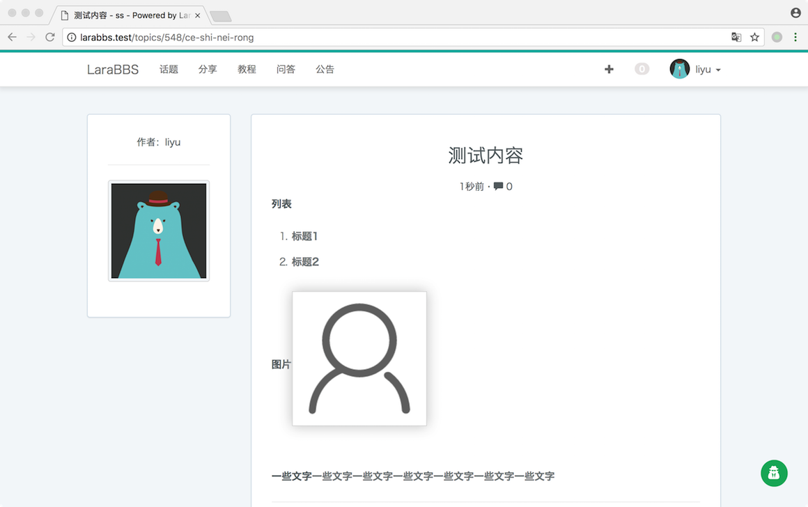
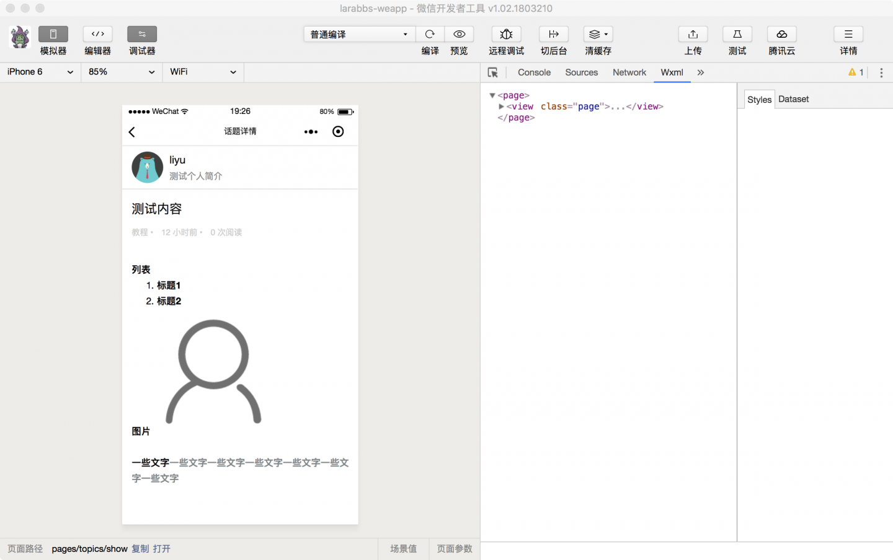

# 7.4. 话题详情

原文链接：https://learnku.com/courses/laravel-weapp/1.7/topic-details/1472

本教程最新版为 [2.1](https://learnku.com/courses/laravel-weapp/2.1)，当前版本已放弃维护，请阅读最新版本！

## 话题详情

前面几节课程我们完成了话题列表，点击每个话题，需要跳转到话题详情页面，展示话题内容，这一节我们就来完成话题详情页面。

## 创建页面

```
$ cd ~/Code/larabbs-weapp
$ touch src/pages/topics/show.wpy
```

在 `app.wpy` 中注册页面：

src/app.wpy

```
pages: [
'pages/topics/index',
'pages/topics/show',
'pages/users/me',
'pages/users/edit',
'pages/auth/login',
'pages/auth/register'
],
```

## 增加链接

src/pages/topics/index.wpy

```
.
.
.
<repeat for="{{ topics }}" key="id" index="index" item="topic">
<navigator url="/pages/topics/show?id={{ topic.id }}" class="weui-media-box weui-media-box_appmsg" hover-class="weui-cell_active">
.
.
.
</navigator>
.
.
.
```

在列表页面每个话题的 `navigator` 标签中增加链接：`/pages/topics/show?id={{ topic.id }}`。注意我们在每个连接中都增加了参数 id，这样页面详情中就可以获取这个参数。

## 调整页面

src/pages/topics/show.wpy

```
<style lang="less">
page{
background-color: #FFFFFF;
}
.avatar-wrap {
position: relative;
margin-right: 10px;
}
.avatar {
width: 50px;
height: 50px;
display: block;
border-radius: 50%;
}
.topic-title {
padding: 15px;
}
</style>
<template>
<view class="page">
<view class="page__bd">
<view class="weui-cells weui-cells_after-title">
<navigator class="weui-cell">
<view class="weui-cell__hd avatar-wrap">
<image class="avatar" src="{{ topic.user.avatar }}"/>
</view>
<view class="weui-cell__bd">
<view>{{ topic.user.name }}</view>
<view class="page__desc">{{ topic.user.introduction }}</view>
</view>
</navigator>
</view>
<view class="topic-title">
<view class="page__title">{{ topic.title }}</view>
<view class="weui-media-box__info topic-info">
<view class="weui-media-box__info__meta">{{ topic.category.name }} • </view>
<view class="weui-media-box__info__meta">{{ topic.updated_at_diff }} • </view>
<view class="weui-media-box__info__meta">{{ topic.reply_count }} 次回复</view>
</view>
</view>
<view class="weui-article">
<rich-text nodes="{{ topic.body }}" bindtap="tap"></rich-text>
</view>
</view>
</view>
</template>
<script>
import wepy from 'wepy'
import api from '@/utils/api'
import util from '@/utils/util'

export default class TopicShow extends wepy.page {
config = {
navigationBarTitleText: '话题详情'
}
data = {
// 话题数据
topic: null
}
// 获取话题数据
async getTopic(id) {
try {
let topicResponse = await api.request({
url: 'topics/' + id,
data: {
include: 'user,category'
}
})
let topic = topicResponse.data

// 格式化 updated_at
topic.updated_at_diff = util.diffForHumans(topic.updated_at)

this.topic = topic
this.$apply()
} catch (err) {
console.log(err)
wepy.showModal({
title: '提示',
content: '服务器错误，请联系管理员'
})
}
}
onLoad(options) {
this.getTopic(options.id)
}
}
</script>

```

在 `onLoad` 方法中，可以获取当前页面所调用的 query 参数，设置第一个参数为 options 后，`options.id` 就是我们在链接中设置的 `id`，获取 `id` 后调用 `getTopic` 方法。`getTopic` 请求话题详情接口，并赋值 `topic` 属性。

在 LaraBBS 中最后保存在数据库中的话题内容为 HTML，所以直接使用小程序提供的 [rich-text](https://developers.weixin.qq.com/miniprogram/dev/component/rich-text.html) 组件即可：`<rich-text nodes="{{ topic.body }}" bindtap="tap"></rich-text>`。

## 开发者工具调试

打开一个已有的测试数据查看页面。


去 Larabbs 中发布一个测试话题，填入一些内容：


回到小程序中查看刚才发布的话题，页面显示基本一致。


## 代码版本控制

```
$ cd ~/Code/larabbs-weapp
$ git add -A
$ git  commit -m 'page topic show'
```
