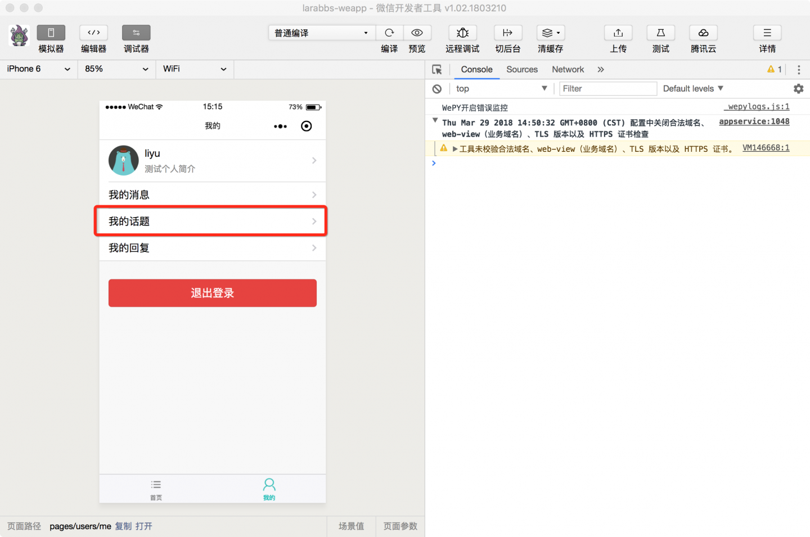
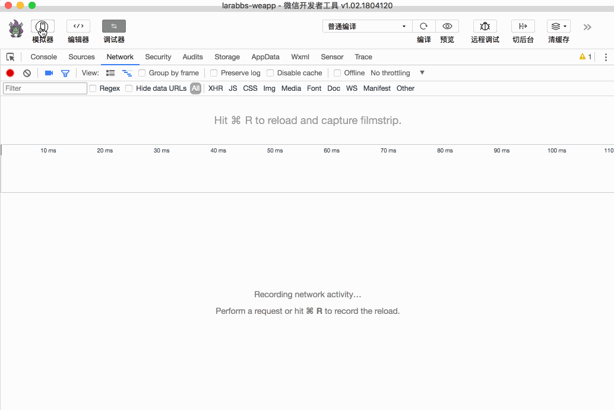

# 7.5. 用户发布的话题

原文链接：https://learnku.com/courses/laravel-weapp/1.7/modify-the-topic/1470

本教程最新版为 [2.1](https://learnku.com/courses/laravel-weapp/2.1)，当前版本已放弃维护，请阅读最新版本！

## 用户发布的话题

除了首页的话题列表，我们还有可能查看某个用户发布的所有话题：



同话题列表一样，该页面也需要下拉刷新，上拉加载更多等功能，能不能跟首页的代码共用话题列表的逻辑呢？这一节我们将封装一个话题列表的组件，方便多个页面调用。

## 封装组件

组件统一放在 `src/components` 目录中，首先来创建一个话题列表组件 `topicList`。

```
$ cd ~/Code/larabbs-weapp
$ touch src/components/topicList.wpy
```

src/components/topicList.wpy

```
<style lang="less">
.weui-media-box__info__meta {
margin: 0;
font-size: 12px;
}
.topic-info {
margin-top: 5px;
}
.topic-title {
white-space: normal;
font-size: 14px;
}
.avatar {
padding: 4px;
border: 1px solid #ddd;
border-radius: 4px;
width: 50px;
height: 50px;
}
.reply-count {
background-color: #d8d8d8;
float: right;
}
</style>
<template>
<view class="weui-panel weui-panel_access">
<view class="weui-panel__bd">
<repeat for="{{ topics }}" wx:key="id" index="index" item="topic">
<navigator url="/pages/topics/show?id={{ topic.id }}" class="weui-media-box weui-media-box_appmsg" hover-class="weui-cell_active">
<view class="weui-media-box__hd weui-media-box__hd_in-appmsg">
<image class="weui-media-box__thumb avatar" src="{{ topic.user.avatar }}" />
</view>
<view class="weui-media-box__bd weui-media-box__bd_in-appmsg">
<view class="weui-media-box__title topic-title">{{ topic.title }}</view>

<view class="weui-media-box__info topic-info">
<view class="weui-media-box__info__meta">{{ topic.category.name }} • </view>
<view class="weui-media-box__info__meta">{{ topic.user.name }} • </view>
<view class="weui-media-box__info__meta">{{ topic.updated_at_diff }}</view>
</view>
</view>
<view class="weui-badge reply-count">{{ topic.reply_count }}</view>
</navigator>
</repeat>
<view class="weui-loadmore weui-loadmore_line" wx:if="{{ noMoreData }}">
<view class="weui-loadmore__tips weui-loadmore__tips_in-line">没有更多数据</view>
</view>
</view>
</view>
</template>
<script>
import wepy from 'wepy'
import util from '@/utils/util'
import api from '@/utils/api'

export default class TopicList extends wepy.component {
data = {
// 话题数据
topics: [],
// 有没有更多数据
noMoreData: false,
// 是否在加载中
isLoading: false
}
props = {
// 父页面传入，请求参数
syncData: {
type: Object,
default: {}
},
// 父页面传入，请求url
syncUrl: {
type: String,
default: 'topics'
}
}
//  获取话题数据
async getTopics(reset = false) {
if (!this.syncData.page) {
this.syncData.page = 1
}

this.syncData.include = 'user,category'
try {
// 请求接口，传入参数
let topicsResponse = await api.request({
url: this.syncUrl,
data: this.syncData
})

if (topicsResponse.statusCode === 200) {
let topics = topicsResponse.data.data

// 格式化updated_at
topics.forEach(function (topic) {
topic.updated_at_diff = util.diffForHumans(topic.updated_at)
})
// 如果传入参数 reset 为true，则覆盖 topics
this.topics = reset ? topics : this.topics.concat(topics)

let pagination = topicsResponse.data.meta.pagination

// 根据分页设置是否还有更多数据
if (pagination.current_page === pagination.total_pages) {
this.noMoreData = true
}
this.$apply()
}

return topicsResponse
} catch (err) {
console.log(err)
wepy.showModal({
title: '提示',
content: '服务器错误，请联系管理员'
})
}
}
// 加载更多
async loadMore () {
// 如果没有更多数据，或者正在加载，直接返回
if (this.noMoreData || this.isLoading) {
return
}
// 开始请求之前设置 isLoading 为true
this.isLoading = true
this.syncData.page = this.syncData.page + 1
await this.getTopics()

// 开始结束后设置 isLoading 为 false
this.isLoading = false
this.$apply()
}
// 重新加载
async reload() {
this.noMoreData = false
this.syncData.page = 1
return await this.getTopics(true)
}
}
</script>

```

组件这个概念你可能有点陌生，但是其实组件的写法同页面基本相同，有以下几点区别：

- 组件中声明的组件实例继承的是 `wepy.component`；

- 不能设置 `config`；

- 可以与页面共用 `onLoad` 生命周期函数，触发是会先触发组件的 `onLoad` 再触发页面的 `onLoad`。

组件的代码基本也和首页的逻辑相同，只是多了 `props` 属性，我们会在 `props` 中定义父组件可传入的数据，例如上面的代码中定义了：

- syncData —— 接口请求参数；

- syncUrl —— 接口请求 URL。

`getTopics` 方法则根据  `syncData` 和 `syncUrl` 两个数据请求话题接口。可以这么理解，什么地方要使用 `TopicList` 组件，他就必须将上面两个数据传给这个组件，该如何传递这个数据，先不着急，下面的课程中会讲。

最下面定义的两个方法 `loadMore` 加载更多和 `reload` 重新加载，对应着上拉加载更多和下拉刷新。因为 `onReachBottom` 和 `onPullDownRefresh` 两个事件不会传入组件，所以需要在父页面触发。

组件定义好了，下面我们看看该如何使用这个组件。

## 增加用户话题列表页

先增加用户话题列表页面：

```
$ cd ~/Code/larabbs-weapp
$ touch src/pages/topics/userIndex.wpy
```

注册页面：

src/app.wpy

```
.
.
.
pages: [
'pages/topics/index',
'pages/topics/show',
'pages/topics/userIndex',
'pages/users/me',
'pages/users/edit',
'pages/auth/login',
'pages/auth/register'
],
.
.
.
```

修改页面内容：
src/pages/topics/userIndex.wpy

```
<template>
<view class="page">
<view class="page__bd">
<topiclist :syncData.sync="requestData" :syncUrl.sync="requestUrl"></topiclist>
</view>
</view>
</template>
<script>
import wepy from 'wepy'
import topicList from '@/components/topicList'

export default class UserIndex extends wepy.page {
config = {
navigationBarTitleText: 'Ta 发布的话题',
enablePullDownRefresh: true
}
data = {
requestData: {},
requestUrl: null
}
components = {
topiclist: topicList
}
onLoad(options) {
this.requestUrl = 'users/' + options.user_id + '/topics'
// 组件数据改变，也需要调用 this.$apply()
this.$apply()
// 调用组件 reload 方法
this.$invoke('topiclist', 'reload')
}
// 下拉刷新
async onPullDownRefresh() {
// 调用组件 reload 方法
await this.$invoke('topiclist', 'reload')
wepy.stopPullDownRefresh()
}
// 上拉加载更多
onReachBottom () {
// 调用组件 loadMore 方法
this.$invoke('topiclist', 'loadMore')
}
}
</script>

```

组件的用法：

1. 在页面中引入组件 `import topicList from '@/components/topicList'`；

2. 在 components 中定义要使用的组件 `topiclist: topicList`  注意定义的组件名只能是小写；

3. 定义好组件后，我们就可以在模板中使用了 `<topiclist :syncData.sync="requestData" :syncUrl.sync="requestUrl"></topiclist>`。调用组件的时候会动态传给组件两个数据 `syncData` 和 `syncUrl`，对应着 data 中的 `requestData` 和 `requestUrl`。注意我们增加了 `.sync` 后缀，这样在父页面中数据改变了，会同步修改组件中的数据。也就是父页面中的 `requestData` 改变了，组件中的 `syncData` 会同时改变。

4. 父页面中接收 `onPullDownRefresh` 和 `onReachBottom` 两个事件后，主动使用 [this.$invoke](https://tencent.github.io/wepy/document.html#/?id=%E7%BB%84%E4%BB%B6%E9%80%9A%E4%BF%A1%E4%B8%8E%E4%BA%A4%E4%BA%92) 来触发组件中的方法，第一个参数是组件名，第二个参数是组件内部的方法。

## 修改首页

因为新增了组件，也可以简化首页的代码。

src/pages/topics/index.wpy

```
<style lang="less">
/*分类*/
.weui-flex {
align-items: center;
}
.weui-cells {
margin-top: 0;
opacity: 0;
transition: .3s;
&:before, &:after {
display: none;
}
&_show {
opacity: 1;
}
}
.weui-cell {
&:before {
right: 15px;
}
}
.category-list__item {
margin: 10px 0;
background-color: #FFFFFF;
border-radius: 2px;
overflow: hidden;
&:first-child {
margin-top: 0;
}
}
.category-list__item_selected {
background-color: #eeeeee;
}
.category-list__img {
width: 30px;
height: 30px;
}

.category-list__item-hd {
padding: 20px;
transition: opacity .3s;
&_show {
opacity: .4;
}
}
.category-list__item-bd {
height: 0;
overflow: hidden;
&_show {
height: auto;
}
}
</style>
<template>
<view class="page">
<view class="category-list__item">
<view class="weui-flex category-list__item-hd" @tap="toggle">
<view class="weui-flex__item page-title">{{ currentCategory.name || '话题' }}</view>
<image class="category-list__img" src="/images/category.png"></image>
</view>

<view class="category-list__item-bd {{ categoryOpen ? 'category-list__item-bd_show' : '' }}">
<view class="weui-cells {{ categoryOpen ? 'weui-cells_show' : '' }}">
<view @tap="changeCategory()" class="weui-cell weui-cell_access {{ !currentCategory.id ? 'category-list__item_selected' : ''}}">
<view class="weui-cell__bd">话题</view>
</view>
<view @tap="changeCategory({{ category.id }})" class="weui-cell weui-cell_access {{ currentCategory.id == category.id ? 'category-list__item_selected' : ''}}" wx:for="{{ categories }}" wx:for-item="category" wx:key="id">
<view class="weui-cell__bd">{{ category.name }}</view>
</view>
</view>
</view>
</view>
<view class="page__bd">
<!-- 使用 topiclist，传入 requestData 数据 -->
<topiclist :syncData.sync="requestData"></topiclist>
</view>
</view>
</template>
<script>
import wepy from 'wepy'
import api from '@/utils/api'
import topicList from '@/components/topicList'

export default class TopicIndex extends wepy.page {
config = {
enablePullDownRefresh: true
}
data = {
topics: [],
categories: [],
categoryOpen: false,
currentCategory: {},
requestData: {}
}
// 使用 topicList 组件
components = {
topiclist: topicList
}
computed = {
// 当前选中的分类id
currentCategoryId () {
return this.currentCategory.id || 0
}
}
// 获取分类数据
async getCategories() {
let categories = wepy.getStorageSync('categories')

if (!categories) {
try {
let categoriesResponse = await api.request('categories')
if (categoriesResponse.statusCode === 200) {
categories = categoriesResponse.data.data
// 缓存到 sotrage 中
wepy.setStorageSync('categories', categories)
}
} catch (err) {
wepy.showModal({
title: '提示',
content: '服务器错误，请联系管理员'
})
}
}

this.categories = categories
this.$apply()
}
onLoad() {
// 获取分类数据
this.getCategories()
// 调用组件的 reload 方法
this.$invoke('topiclist', 'reload')
}
async onPullDownRefresh() {
// 调用组件的 reload 方法
await this.$invoke('topiclist', 'reload')
wepy.stopPullDownRefresh()
}
onReachBottom () {
// 调用组件的 loadMore 方法
this.$invoke('topiclist', 'loadMore')
}
methods = {
// 切换分类列表展示
toggle () {
this.categoryOpen = !this.categoryOpen
},
// 选择分类重新加载
async changeCategory (id = 0) {
this.currentCategory = id ? this.categories.find(category => category.id === id) : {}
this.categoryOpen = false
this.$apply()
this.requestData.category_id = this.currentCategoryId

// 调用组件的 reload 方法
this.$invoke('topiclist', 'reload')
}
}
}
</script>

```

去掉了一些样式，模板中去掉了话题的代码，直接使用 `topiclist` 组件，代码逻辑基本同上一步的 `用户话题列表页`。只是在首页中我们需要处理分类的切换，因为有 `.sync` 修饰符，所以切换分类后直接设置 `this.requestData.category_id` 然后调用 `this.$invoke('topiclist', 'reload')` 即可。

## 修改我的页面

`我的` 页面中 `我的话题` 同样需要增加链接，跳转到话题列表页面，注意这是增加了判断，当 `user` 数据有值时，也就是用户登录后，才赋值链接。

src/pages/users/me.wpy

```
.
.
.
<navigator class="weui-cell weui-cell_access" url="{{ user ? '/pages/topics/userIndex?user_id='+ user.id : '' }}">
<view class="weui-cell__bd" url="">
<view class="weui-cell__bd">我的话题</view>
</view>
<view class="weui-cell__ft weui-cell__ft_in-access"></view>
</navigator>
.
.
.
```

## 开发者工具调试

话题列表显示正常，可切换分类，我的话题链接可以打开新页面，显示所有我发布的话题：


## 代码版本控制

```
$ cd ~/Code/larabbs-weapp
$ git add -A
$ git commit -m 'topicList component'
```
