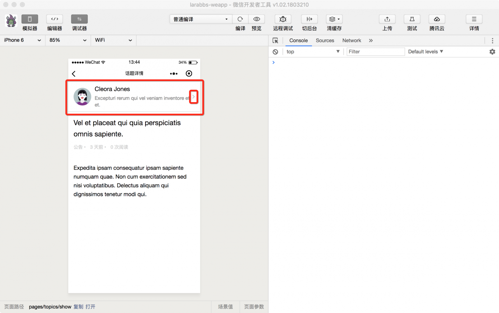
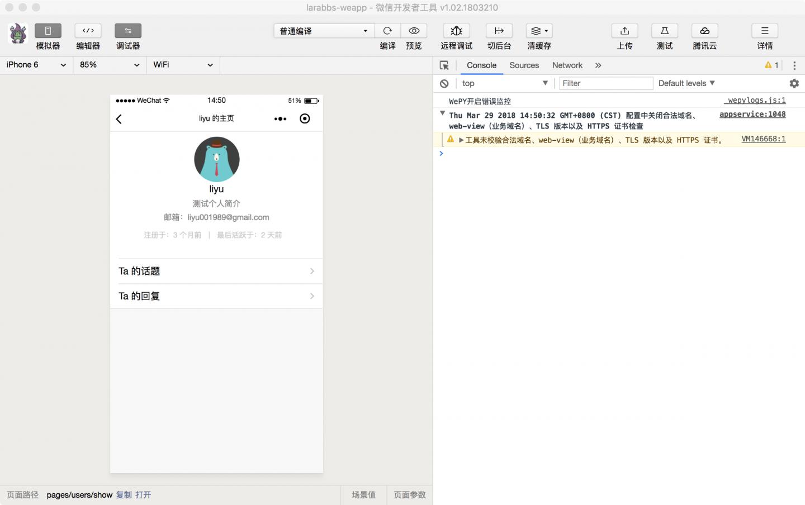

# 7.6. 用户详情

原文链接：https://learnku.com/courses/laravel-weapp/1.7/topic-user-details/1581

本教程最新版为 [2.1](https://learnku.com/courses/laravel-weapp/2.1)，当前版本已放弃维护，请阅读最新版本！

## 用户详情

话题详情中可以看到发布者的头像和姓名，我们应该可以点击用户，进去用户的详情页面，查看更多发布者的信息，这一节我们来增加链接，显示某个用户的详情。



## Larabbs 用户详情接口

由于我们需要获取某个用户的详情，上一本教程中并未实现该接口，所以我们增加一个 `用户详情接口`，有了上一本教程的基础，增加一个接口十分方便。

### 增加路由

routes/api.php

```
.
.
.
// 删除token
$api->delete('authorizations/current', 'AuthorizationsController@destroy')
->name('api.authorizations.destroy');
// 用户详情
$api->get('users/{user}', 'UsersController@show')
->name('api.users.show');
.
.
.
```

### 修改 Controller

app/Http/Controllers/Api/UsersController.php

```
.
.
.
public function show(User $user)
{
return $this->response->item($user, new UserTransformer());
}
.
.
.
```

只需要上面两步即可，现在我们可以通过 `/api/users/:user_id` 获取某个用户的详情了。

## 用户详情页面

### 注册页面

```
$ cd ~/Code/larabbs-weapp
$ touch src/pages/users/show.wpy
```

配置中增加 `pages/users/show`。

src/app.wpy

```
.
.
.
pages: [
'pages/topics/index',
'pages/topics/show',
'pages/topics/userIndex',
'pages/users/me',
'pages/users/edit',
'pages/users/show',
'pages/auth/login',
'pages/auth/register'
],
.
.
.
```

### 添加链接

在话题详情顶部的用户信息增加链接：

/src/pages/topics/show.wpy

```
<view class="weui-cells weui-cells_after-title">
<navigator class="weui-cell" url="/pages/users/show?id={{ topic.user.id }}" open-type="redirect">
<view class="weui-cell__hd avatar-wrap">
<image class="avatar" src="{{ topic.user.avatar }}"/>
</view>
<view class="weui-cell__bd">
<view>{{ topic.user.name }}</view>
<view class="page__desc">{{ topic.user.introduction }}</view>
</view>

<!-- 向右的箭头 -->
<view class="weui-cell__ft weui-cell__ft_in-access"></view>
</navigator>
</view>
```

页面中我们增加了一个向右的箭头 `<view class="weui-cell__ft weui-cell__ft_in-access"></view>` 告知用户是个链接，增加跳转地址  `url="/pages/users/show?id={{ topic.user.id }}"`，传入参数 id 为 话题用户的 id。

注意这里 navigator 的使用，我们增加了参数 `open-type="redirect"`。open-type 有以下几种可选的值：

| 值
| 说明

| navigate
| 保留当前页面，跳转到应用内的某个页面

| redirect
| 关闭当前页面，跳转到应用内的某个页面

| reLaunch
| 关闭所有页面，打开到应用内的某个页面

| switchTab
| 跳转到 tabBar 页面，并关闭其他所有非 tabBar 页面

由于小程序页面有层数限制，目前打开的页面最多只能有 5 层，用户到话题详情页的入口有多个，比如主页，某个用户的话题列表等，所以为了避免有层数问题无法打开页面，在话题详情页打开用户详情的时候，我们选择关闭当前页面，跳转到用户详情页。

### 修改页面

src/pages/users/show.wpy

```
<style lang="less">
.center {
display: flex;
justify-content: center;
align-items: center;
}
.avatar {
width: 80px;
height: 80px;
display: block;
border-radius: 50%;
}
.logout {
margin-top: 30px;
}
.introduction {
font-size: 13px;
color: #888888;
}
.user-links {
margin-top: 20px;
}
</style>
<template>
<view class="page">
<view class="page__bd" >
<view class="weui-cells weui-cells_after-title">
<view class="weui-cell">
<view class="weui-cell__bd ">
<view class="center"><image class="avatar" src="{{ user.avatar }}"/></view>
<view class="center">{{ user.name }}</view>
<view class="page__desc center" wx:if="{{ user.introduction }}">{{ user.introduction }}</view>
<view class="page__desc center" wx:if="{{ user.email }}">邮箱：{{ user.email }}</view>
<view class="weui-media-box__info center">
<view class="weui-media-box__info__meta">注册于：{{ user.created_at_diff }}</view>
<view class="weui-media-box__info__meta weui-media-box__info__meta_extra">最后活跃于：{{ user.last_actived_at_diff }}</view>
</view>
</view>
</view>

<navigator class="weui-cell weui-cell_access user-links" url="/pages/topics/userIndex?user_id={{ user.id }}">
<view class="weui-cell__bd">
<view class="weui-cell__bd">Ta 的话题</view>
</view>
<view class="weui-cell__ft weui-cell__ft_in-access"></view>
</navigator>
<navigator class="weui-cell weui-cell_access" url="">
<view class="weui-cell__bd" url="">
<view class="weui-cell__bd">Ta 的回复</view>
</view>
<view class="weui-cell__ft weui-cell__ft_in-access"></view>
</navigator>
</view>
</view>
</view>
</template>

<script>
import wepy from 'wepy'
import api from '@/utils/api'
import util from '@/utils/util'

export default class UserShow extends wepy.page {
data = {
// 用户数据
user: null
}
async onLoad(options) {
try {
let userResponse = await api.request('users/' + options.id)

if (userResponse.statusCode === 200) {
this.user = userResponse.data

// 格式化注册时间
this.user.created_at_diff = util.diffForHumans(this.user.created_at)
// 格式化最后活跃时间
this.user.last_actived_at_diff = util.diffForHumans(this.user.last_actived_at)

this.$apply()

// 动态设置页面标题
wepy.setNavigationBarTitle({
title: this.user.name + ' 的主页'
})
}
} catch (err) {
console.log(err)
wepy.showModal({
title: '提示',
content: '服务器错误，请联系管理员'
})
}
}
}
</script>

```

页面根据传入的参数请求接口获取用户信息，使用 `util.diffForHumans` 格式化了用户的注册时间和最后活跃时间。因为用户姓名我们是接口请求之后才能获取，如果想在页面标题中显示 'xxx 的主页'，则需要调用小程序接口 [setNavigationBarTitle](https://developers.weixin.qq.com/miniprogram/dev/api/ui.html#wxsettopbartextobject) 动态设置 `NavigationBar` 的内容。

## 开发者工具调试



## 代码版本控制

### larabbs

```
$ cd ~/Code/larabbs
$ git add -A
$ git commit -m 'users show'
```

### larabbs-weapp

```
$ cd ~/Code/larabbs-weapp
$ git add -A
$ git commit -m 'pages user show'
```
