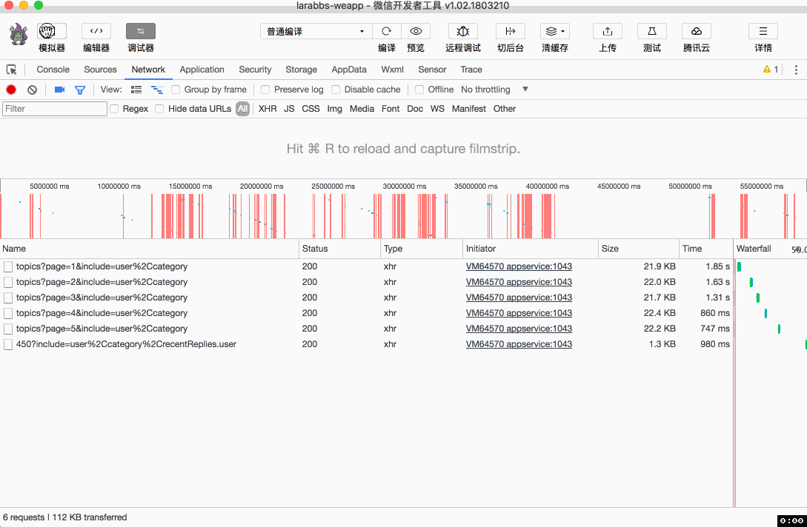
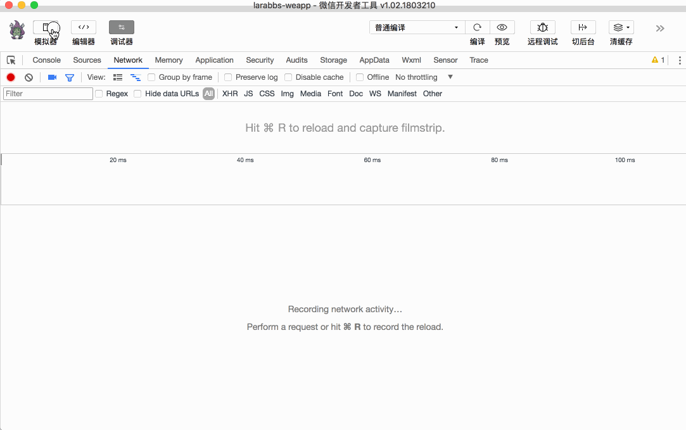

# 7.7. 删除话题

原文链接：https://learnku.com/courses/laravel-weapp/1.7/deleting-the-topic/1471

本教程最新版为 [2.1](https://learnku.com/courses/laravel-weapp/2.1)，当前版本已放弃维护，请阅读最新版本！

## 删除话题

这一章的最后我们来增加删除话题的功能。

## 添加按钮

首先需要增加一个按钮来删除话题，可以放在 `话题详情` 页面中，修改 `话题详情` 页面：

src/pages/topics/show.wpy

```
.
.
.
<view class="weui-article">
<rich-text nodes="{{ topic.body }}" bindtap="tap"></rich-text>

<button wx:if="{{ canDelete }}" @tap="deleteTopic" class="weui-btn mini-btn" type="default" size="mini">删除</button>
</view>
.
.
.
```

上面的代码：

1. 话题详情页面的内容下面，增加一个删除按钮；

2. 通过 `canDelete` 控制按钮是否显示；

3. 绑定了点击事件 `@tap="deleteTopic"`，点击后调用 `deleteTopic` 方法。

src/pages/topics/show.wpy

```
.
.
.
data = {
// 话题数据
topic: null,
// 当前登录用户
user: null
}
// 计算的属性
computed = {
// 是否可以删除话题
canDelete() {
if (!this.topic || !this.user) {
return false
}
// 当前用户是话题的发布者
return this.user.id === this.topic.user_id
}
}
.
.
.
async onLoad(options) {
await this.getTopic(options.id)
// 获取当前登录用户
this.user = await this.$parent.getCurrentUser()
this.$apply()
}
.
.
.
```

`canDelete` 我们通过 computed 计算属性控制，onLoad 时调用 `this.$parent.getCurrentUser()` 获取当前登录用户并赋值给当前页面的 `user` 属性。`canDelete` 方法中，如果未获取话题数据或者用户未登录，则不显示删除按钮；如果话题的发布者是当前用户的话，显示删除按钮。

>

我们还未引入角色权限，暂时只判断发布者，之后的课程会对该逻辑进行优化。

这里为什么不在 `canDelete` 中直接使用 `this.$parent.getCurrentUser()` 获取当前用户，而是需要在 `onLoad` 中先获取并赋值给 `user` 呢？因为 WePY 加载机制的问题，计算属性中如果有 `await` 的异步处理，会与预期不符，这里大家只需要做个了解，避免出现这样的使用。

## 删除逻辑

修改话题详情页面，增加删除逻辑：
src/pages/topics/show.wpy

```
.
.
.
methods = {
async deleteTopic() {
// 删除确认
let res = await wepy.showModal({
title: '确认删除',
content: '您确认删除该话题吗',
confirmText: '删除',
cancelText: '取消'
})

// 用户点击取消后返回
if (!res.confirm) {
return
}

// 调用接口删除话题
let deleteResponse = await api.authRequest({
url: 'topics/' + this.topic.id,
method: 'DELETE'
})

// 删除成功，给出提示
if (deleteResponse.statusCode === 204) {
wepy.showToast({
title: '删除成功',
icon: 'success'
})

// 2 秒后返回上一页
setTimeout(function() {
wepy.navigateBack()
}, 2000)
}
}
}
.
.
.
```

分析一下代码逻辑：

1. `methods` 中增加 `deleteTopic` 方法，首先删除操作都是危险操作，一定要弹出提示，确认是否删除；

2. 用户确认后调用删除接口，调用成功后，提示删除成功；

3. 最后我们使用了 JS 的 `setTimeout` 方法，在指定的毫秒数后调用函数，第一个参数是回调的函数，第二个参数是毫秒数，这里我们定义了 2 秒后调用 `navigateBack` 返回上一页。

## 开发者工具调试

可以正确的调用接口删除话题：



## 删除后刷新列表页面

可以成功删除话题了，但是当页面返回时，上一页的话题列表中时，页面并未刷新，依然有已经删除了的话题，我们需要进一步的优化，解决这个问题。

我们打开一个新页面的时候，可以在 URL 中增加参数来传递数据，但是 `话题列表` 页面是一个已经打开的页面，如何在返回这个页面的时候传递参数，告诉这个页面该重新获取数据呢？

解决方法大致分为两种：

1. 利用全局变量或缓存，增加变量，返回页面后在 onShow 方法获取数据；

2. 引入订阅、广播等机制传递数据。

这里我们选择第一种 `全局变量` 的方式。

### 添加全局变量

src/app.wpy

```
.
.
.
globalData = {
refreshPages: []
}
checkRefreshPages (route, callback) {
let refreshIndex = this.globalData.refreshPages.indexOf(route)
if (refreshIndex === -1) {
return
}

this.globalData.refreshPages.splice(refreshIndex, 1)
callback && callback()
}
.
.
.
```

在 `app.wpy` 中定义一个全局变量 `refreshPages`，是个数组，意思是需要刷新的页面，可以在页面的 onShow 方法中通过 `this.$parent.globalData.refreshPages` 获取或设置全局数据。

封装了 `checkRefreshPages` 方法，用来检测传入的页面路由是否在 `refreshPages` 数组中，如果存在，则将路由移除 `refreshPages`，并执行传入的回调方法。

下面我们来修改页面，使用这个全局变量和全局方法。

### 删除后设置刷新页面

修改话题详情的删除逻辑：

src/pages/topics/show.wpy

```
.
.
.
methods = {
async deleteTopic() {
.
.
.
if (deleteResponse.statusCode === 204) {
wepy.showToast({
title: '删除成功',
icon: 'success'
})

// 设置全局变量，控制列表刷新
let pages = this.getCurrentPages()
// 如果有上一页
if (pages.length > 1) {
// 检查所有已经打开的页面，如果是话题列表页面就记录下来
let refreshPages = []
pages.forEach((page) => {
// 已打开的页面中包换 话题列表 或 用户的话题列表
if (page.route === 'pages/topics/index' || page.route === 'pages/topics/userIndex') {
refreshPages.push(page.route)
}
})
this.$parent.globalData.refreshPages = this.$parent.globalData.refreshPages.concat(refreshPages)
this.$apply()
}

setTimeout(function() {
wepy.navigateBack()
}, 2000)
}
}
}
.
.
.
```

这里需要了解一下小程序提供的方法 `getCurrentPages()`，获取当前已经打开的页面，前面的课程中提到过，小程序打开的页面最多只能有 5 个，我们查看已打开的页面中，是否存在 `话题列表` 或者 `用户的话题列表` 页面，如果存在，把这两个页面的路由设置在 `refreshPages` 中，这样返回到列表页面的时候，前页面的路由如果在 `refreshPages` 中则需要重新获取数据。

### 检测全局变量并刷新

同时修改 `话题列表` 和 `用户的话题列表` 页面：

src/pages/topics/index.wpy
src/pages/topics/userIndex.wpy

```
.
.
.
onShow() {
this.$parent.checkRefreshPages(this.getCurrentPages().pop().route, () => {
this.$invoke('topiclist', 'reload')
})
}
.
.
.
```

在 `话题列表` 页面和 `用户的话题列表` 页面中都加入相同的代码，页面重新打开的时候，通过 `this.getCurrentPages().pop().route` 获取当前页面得路由，调用 `checkRefreshPages` 方法，如果当前页面需要刷新，则重新加载 `topiclist`。

### 开发者工具调试

我们测试一个复杂的场景，打开话题详情 => 用户详情 => 用户话题列表 =》 话题详情，这时已经打开的列表页面有 `话题列表` 和 `用户的话题列表` ，删除话题后，两个页面都应该刷新。



## 代码版本控制

```
$ cd ~/Code/larabbs-weapp
$ git add -A
$ git commit -m 'topic delete'
```
