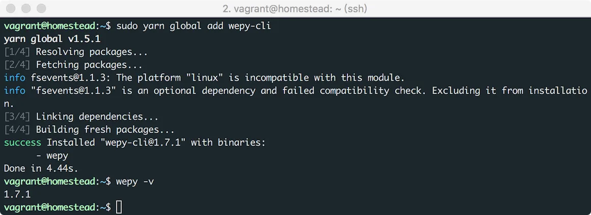
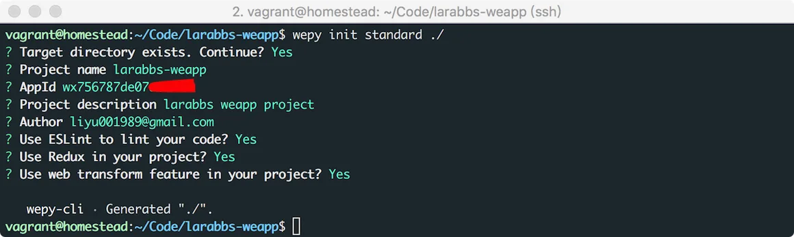
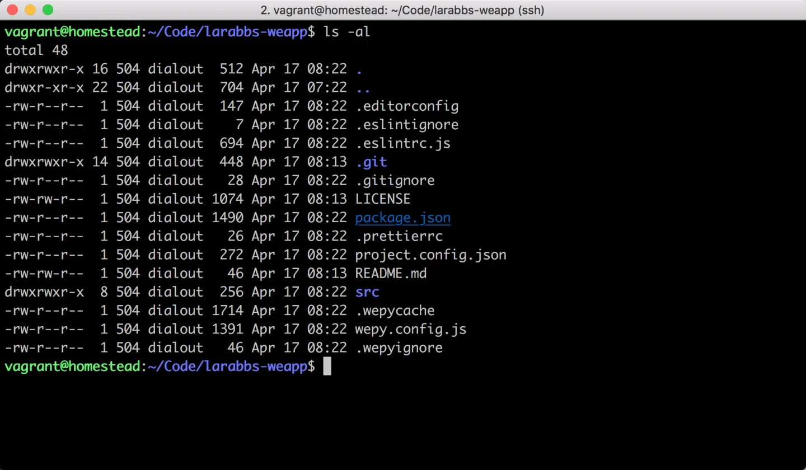
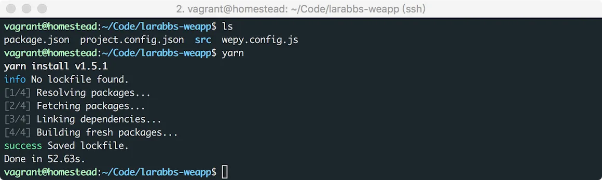
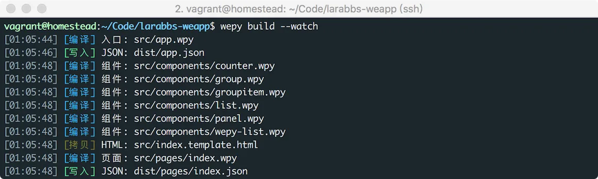
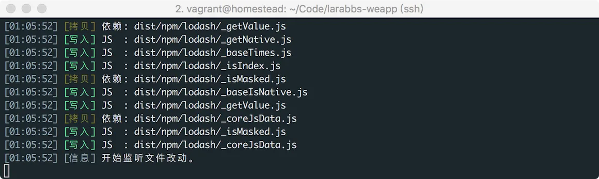
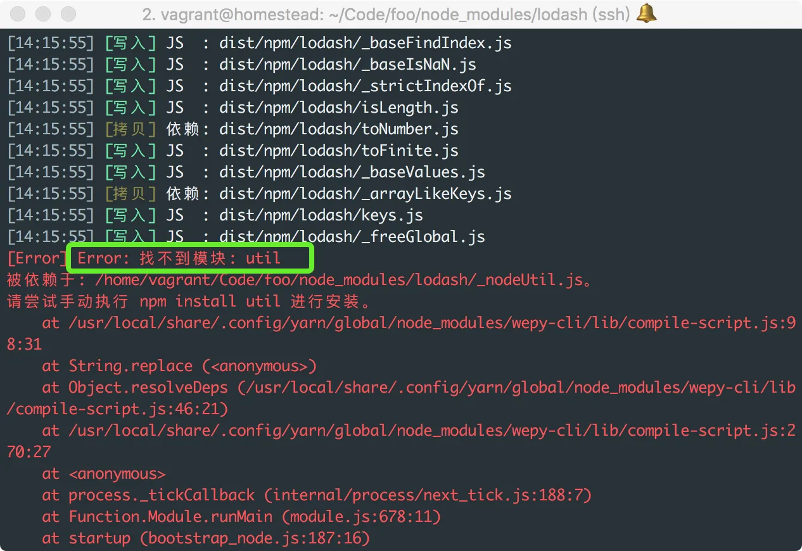
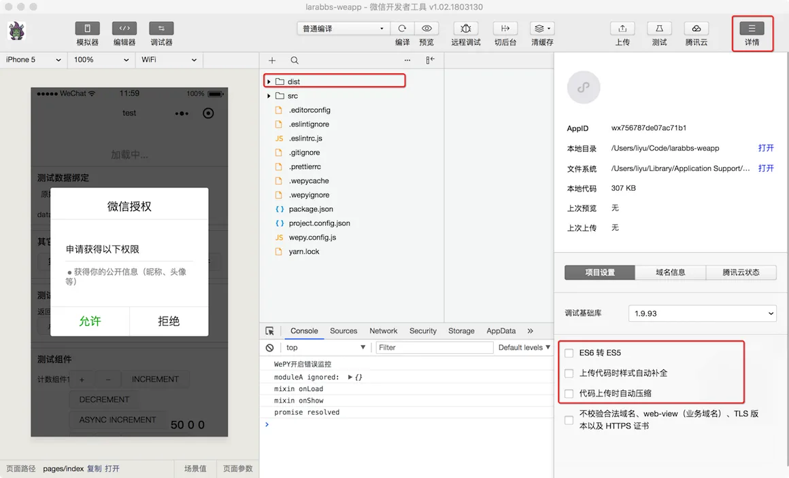

# 3.1. 初始化 WePY

原文链接：https://learnku.com/courses/laravel-weapp/1.7/install-wepy/1457

本教程最新版为 [2.1](https://learnku.com/courses/laravel-weapp/2.1)，当前版本已放弃维护，请阅读最新版本！

## 初始化 WePY

使用原生的方式开发小程序，需要四个文件的配置：

- .json ——配置文件；

- .wxml —— 模板文件，类似 HTML；

- .wxss —— 样式文件，类似 CSS；

- .js —— 交互逻辑。

如果你熟悉 Web 开发，那么不难想到 HTML，CSS，JS 文件之间的相互配合，使用原生的小程序开发比较繁琐，类比现在的 Web 开发，你会引入 Bootstrap 解决页面布局和样式；使用 MVVM 的 Vue/React/Angular 等前端框架；使用 Less/Sass 编写样式；使用 ES6/ES7 的新特性；使用组件化开发等等；你一定希望有一些好用的工具提升开发效率。那么对于小程序来说，有没有这样的工具呢？——首先我们需要了解的就是 WePY。

[WePY](https://tencent.github.io/wepy/) 是一个小程序组件化开发框架，开发风格接近 Vue.js，更贴近于 MVVM 架构模式，相比小程序原生开发要更加的方便快捷。

## 安装 wepy-cli

下面，我们来安装 WePY ，然后通过 WePY 初始化项目。

首先需要全局安装 `wepy-cli`：

```bash
$ sudo yarn global add wepy-cli
```



安装成功，通过命令 `wepy -v` 可以查看到目前版本为 `1.7.1`，`-v` 参数是 `--version` 的缩写。

## 初始化项目

我们使用 `wepy init standard` 来初始化项目，后面跟目录地址，我们这里选择 `larabbs-weapp` 目录

```bash
$ cd ~/Code/larabbs-weapp
$ wepy init standard ./
```

初始化是一个交互式命令行程序，请参考下图进行填写：



初始化项目完成，我们使用 `ls -al` 命令来看看生成了哪些文件：



WePY 文件结构简介：

| 文件夹名称 |
| --- |
| 类型 |
| 简介 |

| dist |
| --- |
| 目录 |
| 存放编译后的文件 |

| src |
| --- |
| 目录 |
| 源码文件 |

| src/app.wpy |
| --- |
| 目录 |
| 项目入口文件 |

| src/pages |
| --- |
| 目录 |
| 存放小程序页面 |

| src/components |
| --- |
| 目录 |
| 存放小程序组件 |

| src/mixins |
| --- |
| 目录 |
| 存放 Mixin 文件 |

| node_modules |
| --- |
| 目录 |
| NPM 依赖模块 |

| src/index.template.html |
| --- |
| 文件 |
| 模板页面html |

| wepy.config.js |
| --- |
| 文件 |
| 全局配置文件 |

| yarn.lock |
| --- |
| 文件 |
| 依赖列表，确保这个应用的副本使用相同版本的依赖 |

| package.json |
| --- |
| 文件 |
| 项目的 package 配置 |

| project.config.json |
| --- |
| 文件 |
| 开发者工具配置 |

| .wepyignore |
| --- |
| 文件 |
| WePY 忽略的文件 |

| .wepycache |
| --- |
| 文件 |
| WePY 缓存文件，防止在build时，重复build npm目录 |

| .prettierrc |
| --- |
| 文件 |
| prettier 配置文件 |

| .eslintrc.js |
| --- |
| 文件 |
| eslint 配置文件 |

| .eslintignore |
| --- |
| 文件 |
| eslint 忽略的文件 |

| .editorconfig |
| --- |
| 文件 |
| 编辑器配置文件 |

WePY 依赖于很多 `node` 包，接下来执行 `yarn` 安装这些包：

```bash
$ yarn
```



最后对项目进行编译，并持续监听代码变化：

```bash
$ wepy build --watch
```

>

使用 `npm run dev` 可以达到效果的目的，注意下面的课程中默认你已经开启一个命令行窗口，并执行该命令，持续监听文件变化，不再重复强调。在 Homestead 中运行 `watch` 可能会出现检测不到文件变化的情况，可以每次手动编译，也可以尝试在电脑中单独安装 `wepy-cli` 并运行 `watch`。



省略一些细节。


注意如果你遇到以下报错：



手动添加 util，删除 dist 目录后，重新编译即可：

```bash
$ yarn add util
$ rm -rf dist
$ wepy build --watch
```

打开开发者工具，查看项目：


`dist` 目录就是编译好的文件目录，点击右上角的 `详情`，可以看到开发者工具已经适配好 `WePY` 框架，默认将 `ES6 转 ES5`，`上传代码时样式自动补全`，`代码上传时自动压缩` 三个选项关闭，这里一定不要勾选这三个选项，否则调试的时候会报错。

WePY 已经为我们创建了一些示例代码，大家可以尝试一下做个了解。

>

注意：由于微信不再支持 getUserInfo 接口，使用该接口将不再出现授权弹窗，需要使用 `<button open-type="getUserInfo"></button>` 引导用户主动进行授权操作。示例代码中仍然在使用该接口，所以有可能你看不到上图中的授权框，不过不影响本教程的学习，之后的课程我们并未使用该接口。

## 代码版本控制

```bash
$ cd ~/Code/larabbs-weapp
$ git add -A
$ git commit -m 'wepy init'
```
