# 3.2. 基础页面结构

原文链接：https://learnku.com/courses/laravel-weapp/1.7/basic-structure/1458

本教程最新版为 [2.1](https://learnku.com/courses/laravel-weapp/2.1)，当前版本已放弃维护，请阅读最新版本！

## 基本结构

这一节我们来创建 `larabbs-weapp` 的基本结构。

## Tabbar

参考一下一般 APP 或者小程序的设计，例如美团：


底部需要有 Tabbar 作为不同功能的主入口，我们首先设计两个 Tabbar 入口，`首页` 和 `我的` 。

### 增加我的页面

上一节中已经介绍了 WePY 的目录结构，先不用深入理解每个目录，实践当中你会有更深入的理解，首先需要记住的是：

- 源码都需要放在 `src` 目录中；

- `src/app.wpy` 是项目的入口文件，相关的配置都会放在这个文件中；

- `src/pages` 目录中存放小程序的每个页面。

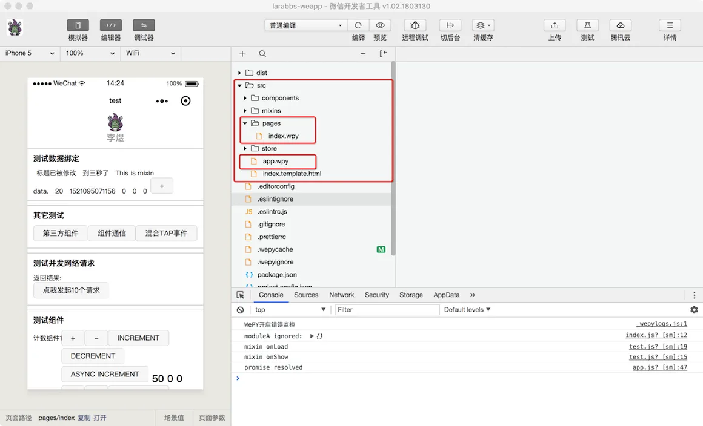

项目中已经存在了首页的文件 `src/pages/index.wpy`，现在我们来创建  `我的` 页面，并配置 Tabbar：

```
$ cd ~/Code/larabbs-weapp
$ touch src/pages/user.wpy
```

因为目前开发者工具还未支持 `.wpy` 文件，我们将使用 Sublime Text 打开刚才创建的文件，填入以下内容：

src/pages/user.wpy

```
<style>
</style>
<template>
<view class="container">
我的页面
</view>
</template>

<script>
import wepy from 'wepy'

export default class User extends wepy.page {}
</script>

```

WePY 的每个页面包含以下结构：

在 WePY 中每个页面对应着一个页面文件，样式，结构，配置，逻辑都在这一个页面中完成，相比原生开发要方便很多。如果你还是觉得有些模糊，只需要先记住在 `style` 标签中写页面样式，在 `template` 标签中写页面结构，在 `script` 标签中写页面配置和交互逻辑。

观察刚才创建的页面：

- style 中我们没有添加样式，暂时先为空；

- template 模板中只有简单的内容，这里注意一下写 HTML 的时候，经常会用到的标签是 `div`, `p`, `span`，但是小程序中的标签稍有不同，需要使用小程序定义的 [标签结构](https://developers.weixin.qq.com/miniprogram/dev/quickstart/basic/file.html#WXML-%E6%A8%A1%E6%9D%BF)，暂时理解为 `view` 标签对应着大家熟悉的 `div` 标签即可；

- script 中只有两行代码，第一行是引入 `wepy`，第二行则是输出了一个继承了 `wepy.page` 模块 User，小程序中的页面都需要继承 `wepy.page`。

>

注意文件最后是有一个换行的，由于我们使用了语法检测工具 [eslint](http://eslint.cn/)，所以要注意一些 [代码规范](http://eslint.cn/docs/rules/)，如果没有这个换行，可能会报错 `error  Newline required at end of file but not found  eol-last`。

### 理解 Import 和 Export

上面的代码中使用到了 Export/Import，对于不熟悉 JS 的同学可能会感到陌生，`export` 和 `import` 是构成模块功能主要的两个命令：

- export 命令用于规定模块的对外接口；

- import 命令用于输入其他模块提供的功能。

一个模块就是一个独立的文件。该文件内部的所有变量，外部无法获取。如果你希望外部能够读取模块内部的某个变量，就必须使用 `export` 关键字输出该变量；使用 `export` 命令定义了模块的对外接口以后，其他 JS 文件就可以通过 `import` 命令加载这个模块。

现在你需要记住的是 export 用于定义一个模块，import 用于引入一个模块，而在 WePY 中，每个页面文件都必须使用 [export default](http://es6.ruanyifeng.com/#docs/module%23export-default-%E5%91%BD%E4%BB%A4) 的方式，导出一个继承了 `wepy.page` 的类。

### 配置 Sublime Text 代码高亮

这是我们第一次编辑 `.wpy` 文件，默认情况下， Sublime Text 并不支持  `.wpy` 文件的高亮：

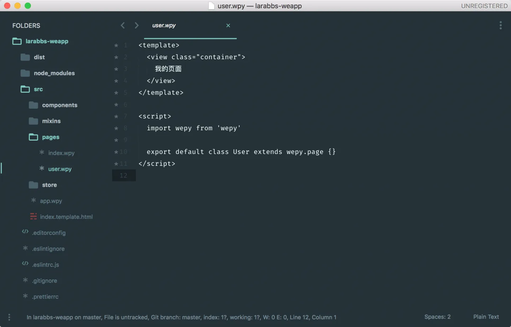

我们安装个 Sublime 扩展包 [vue-syntax-highlight](https://github.com/vuejs/vue-syntax-highlight)即可解决此问题，首先进入 Package Control 的安装页面（如果你还未安装，请见 [如何安装 Package Control](https://jingyan.baidu.com/article/1974b2896c9e90f4b1f7749e.html)）：

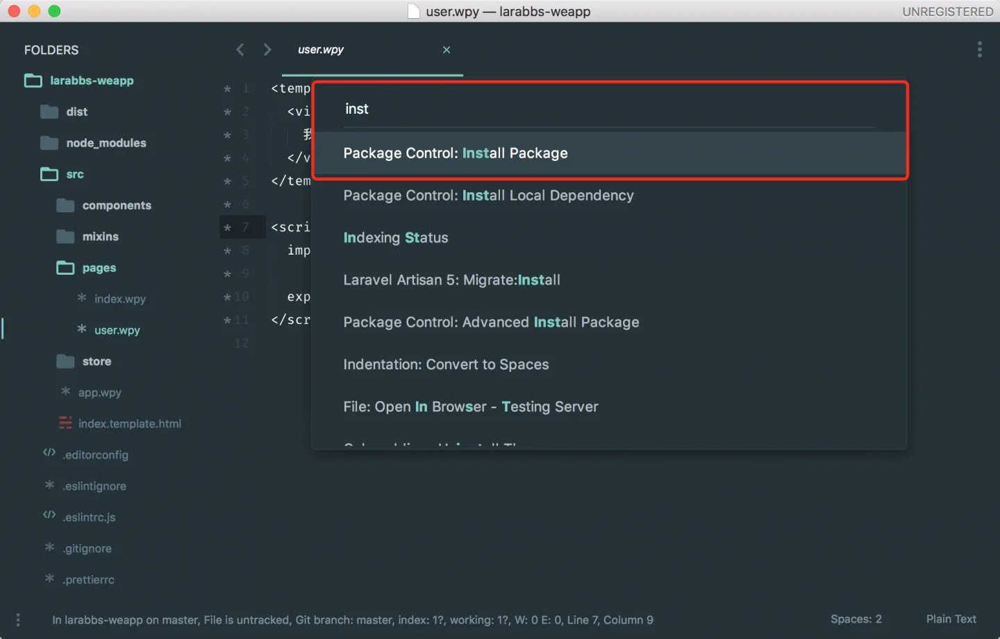

搜索下关键词 `vue syn` 即可自动补全 Vue.js 的代码高亮扩展包，此扩展包将会自动高亮  `.wpy`  后缀的文件：

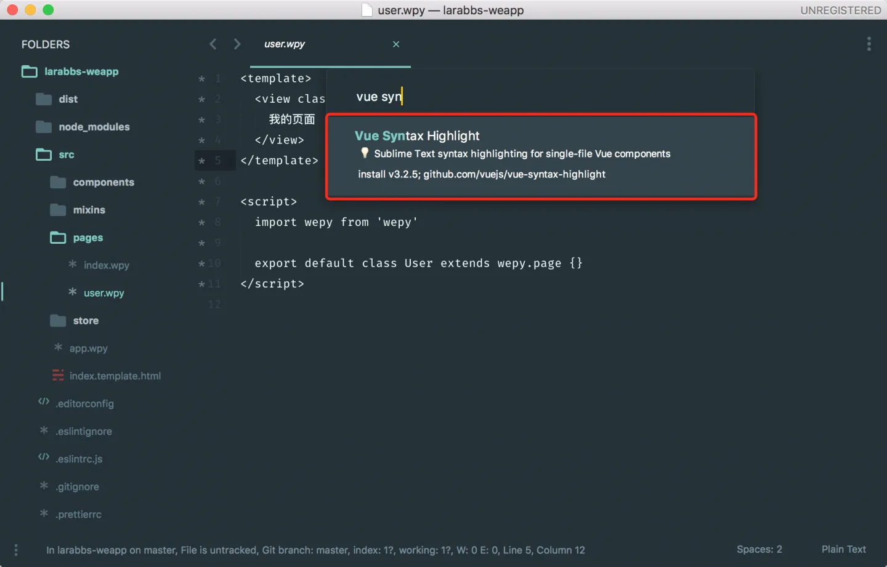

如果你未搜索到该扩展包，可以打开 Sublime 扩展包的目录，手动将扩展包下载至这个目录：

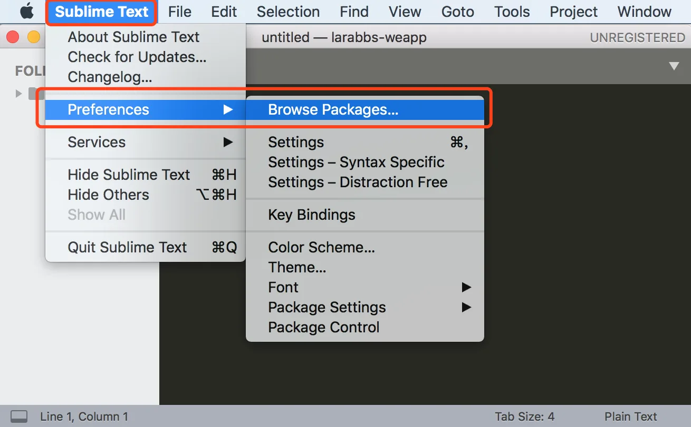

安装成功后关闭文件，并重新打开，即可看到代码高亮：

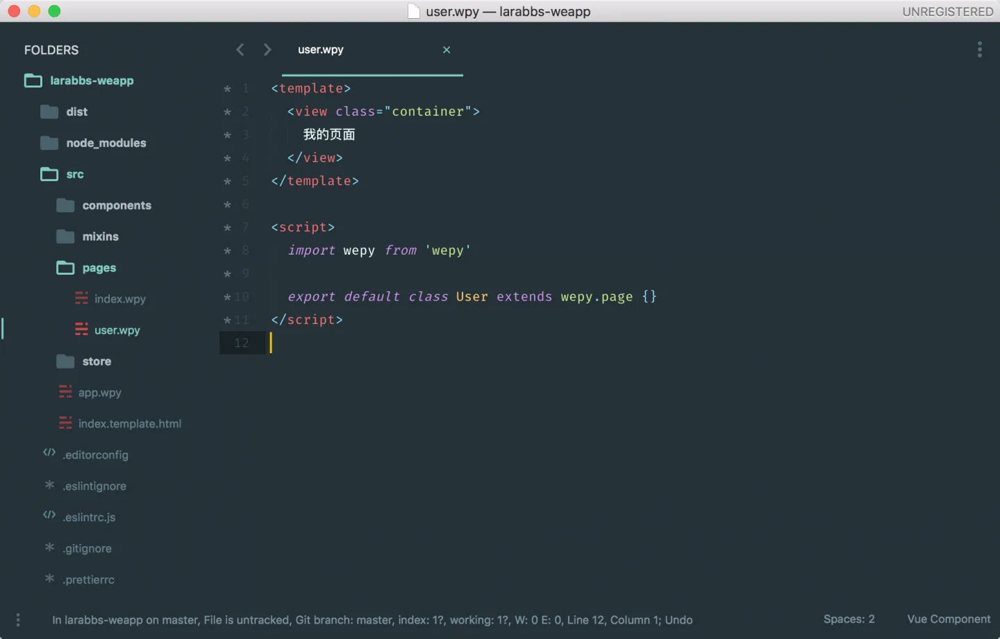

### 修改配置

Tabbar 在小程序中属于配置文件，需要定义在 `app.wpy` 中。

src/app.wpy

```
.
.
.
config = {
pages: [
'pages/index',
'pages/user'
],
window: {
backgroundTextStyle: 'light',
navigationBarBackgroundColor: '#fff',
navigationBarTitleText: 'WeChat',
navigationBarTextStyle: 'black'
},
tabBar: {
list: [{
pagePath: 'pages/index',
text: '首页'
}, {
pagePath: 'pages/user',
text: '我的'
}]
}
}
.
.
.
```

app.wpy 是项目的入口文件，全局的样式，配置，变量，方法等都会定义在该文件中；上述代码中定义的 `config` 对应这小程序的 [全局配置](https://developers.weixin.qq.com/miniprogram/dev/framework/config.html)。

本教程用到的主要配置有：

- pages —— 小程序页面，所有的页面都需要定义在此才会生效；

- window —— 默认页面的窗口表现，更多配置可以参考 [这里](https://developers.weixin.qq.com/miniprogram/dev/framework/config.html)。

- backgroundTextStyle —— 下拉 loading 的样式，仅支持 `dark/light`；

- navigationBarBackgroundColor ——导航栏背景颜色；

- navigationBarTitleText——导航栏标题文字内容；

- navigationBarTextStyle——导航栏标题颜色，仅支持 `black/white` 。

- tabBar —— 小程序标签栏（tabBar）的表现，只能配置最少 2 个、最多 5 个 tab，tab 按数组的顺序排序。

我们在 `pages` 配置中增加了 `pages/user` 页面，在 `tabBar` 配置，增加了`首页` 和 `我的` 页面的路径和标题。

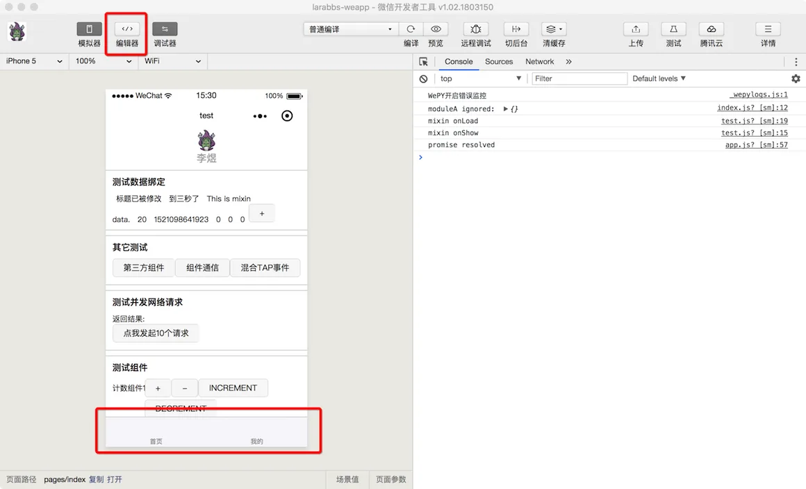

已经成功设置了底部的 Tabbar。

>

注意：如果你的页面没有改动，请在 `cd ~/Code/larabbs-weapp` 进入项目目录，并执行 `wepy build --watch` 进行页面构建，此命令会自动监控文件修改并触发编译，故请保持此命令的当前执行状态，不要关闭或退出。

这是由于我们在初始化 WePy 的时候选择了eslint，用来统一代码风格，如果不太清楚代码风格规范，会有很多报错，我们可以利用 `eslint` 自带的 `autofix` 功能修复。

首先，我们打开项目里面的 package.json，然后在scripts里增加一句:

```
"scripts": {
.
.
.
"test": "echo \"Error: no test specified\" && exit 1",
"eslint":"eslint --fix --ext .js,.wpy src"
},
```

保存后，回到命令行，只要改动了 `src` 里面所有 `js` 或 `wpy` 文件，运行 `npm run eslint` 就会修复不规范的代码。

### 增加图标

现在的 Tabbar 没有图标，点击切换过后也没有选中效果，我们还需要继续修改配置。

由于小程序 Tabbar 图标大小限制为40kb，建议尺寸为 81px * 81px，并且不支持网络图片，所以我们需要为 Tabbar 准备图片，选中和非选中一共需要 4 张图片。我们可以去 [iconfont](http://www.iconfont.cn/) 下载。

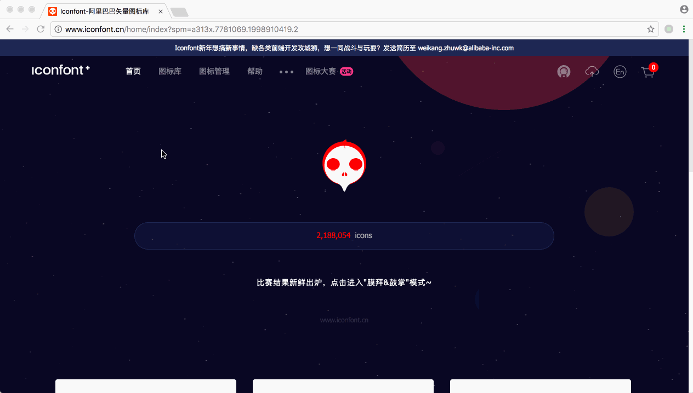

我们可以挑选自己喜欢的图标，修改颜色及尺寸，微信建议为 81px * 81px 的图片，我们可以下载后使用工具再次调整尺寸。

我为大家准备好了 4 张图片，请右键新窗口打开链接，并保存到本地：

| index.png |
| --- |
| index_selected.png |
| user.png |
| user_selected.png |

| 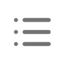 |
| --- |
| 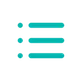 |
|  |
|  |

保存时按对应的名称保存这四张图片，在 `src` 目录中新建 `images` 目录：

```
$ mkdir src/images
```

将四张图片放在 `images` 目录中：

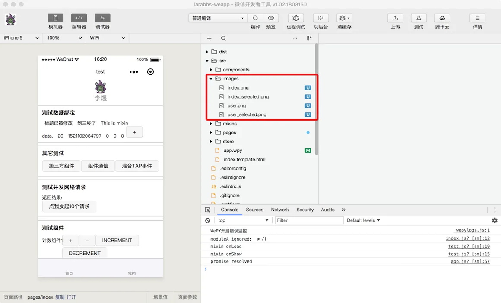

修改配置：

src/app.wpy

```
.
.
.
config = {
pages: [
'pages/index',
'pages/user'
],
window: {
backgroundTextStyle: 'light',
navigationBarBackgroundColor: '#fff',
navigationBarTitleText: 'WeChat',
navigationBarTextStyle: 'black'
},
tabBar: {
list: [{
pagePath: 'pages/index',
text: '首页',
iconPath: 'images/index.png',
selectedIconPath: 'images/index_selected.png'
}, {
pagePath: 'pages/user',
text: '我的',
iconPath: 'images/user.png',
selectedIconPath: 'images/user_selected.png'
}],
color: '#707070',
selectedColor: '#00b5ad'
}
}
.
.
.
```

我们为每个 tab 设置了图标 `iconPath` 和选中后的图标 `selectedIconPath`，并且设置了文字的颜色 `color` 和选中后的颜色 `selectedColor`。

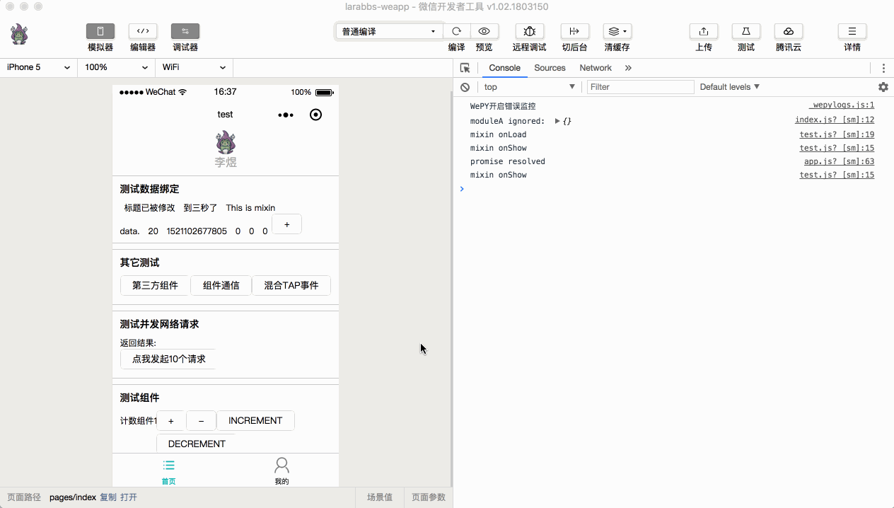

## 删除示例代码

将默认 `index.wpy` 里的内容替换为以下：

src/pages/index.wpy

```
<template>
<view class="container">
首页话题列表
</view>
</template>

<script>
import wepy from 'wepy'

export default class Index extends wepy.page {}
</script>
```

接下来删除 `app.wpy` 里的示例代码，修改后的完整代码如下：

src/app.wpy

```
<style lang="less">
.container {
height: 100%;
display: flex;
flex-direction: column;
align-items: center;
justify-content: space-between;
box-sizing: border-box;
}
</style>

<script>
import wepy from 'wepy'

export default class extends wepy.app {
config = {
pages: [
'pages/index',
'pages/user'
],
window: {
backgroundTextStyle: 'light',
navigationBarBackgroundColor: '#fff',
navigationBarTitleText: 'LaraBBS',
navigationBarTextStyle: 'black'
},
tabBar: {
list: [{
pagePath: 'pages/index',
text: '首页',
iconPath: 'images/index.png',
selectedIconPath: 'images/index_selected.png'
}, {
pagePath: 'pages/user',
text: '我的',
iconPath: 'images/user.png',
selectedIconPath: 'images/user_selected.png'
}],
color: '#707070',
selectedColor: '#00b5ad'
}
}

constructor () {
super()
this.use('requestfix')
}

onLaunch() {
}
}
</script>
```

在 `app.wpy` 最顶部定义了一些样式 `<style lang="less">`，定义在这里的属于全局样式。

注意 `lang` 属性使用了 `less`，Less 同 Sass 一样，是对 CSS 的扩充，使得 CSS 的开发，变得简单和可维护。`WePY` 框架支持的样式编译器有：`Less`，`Sass` 和 `Styus`，大家不必花费太多时间深入学习，了解概念即可。下面的课程中我们都统一使用 `Less` ，但是并不会使用过多 Less 的功能，大家完全可以当做 CSS 来使用。

## 代码版本控制

```
$ cd ~/Code/larabbs-weapp
$ git add -A
$ git commit -m 'add tabbar'
```
