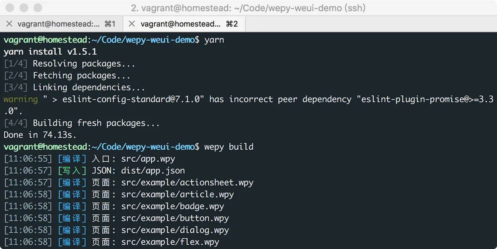
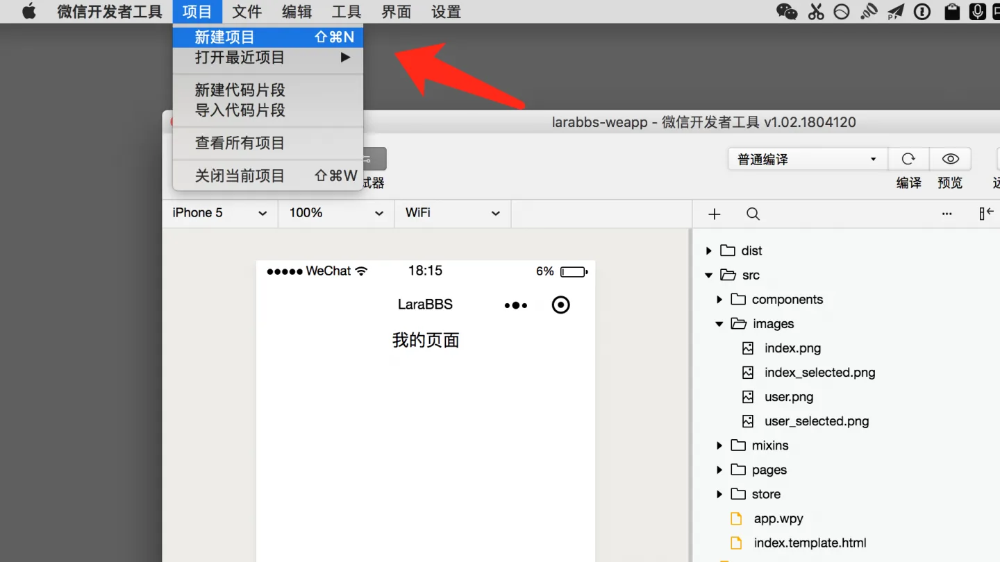
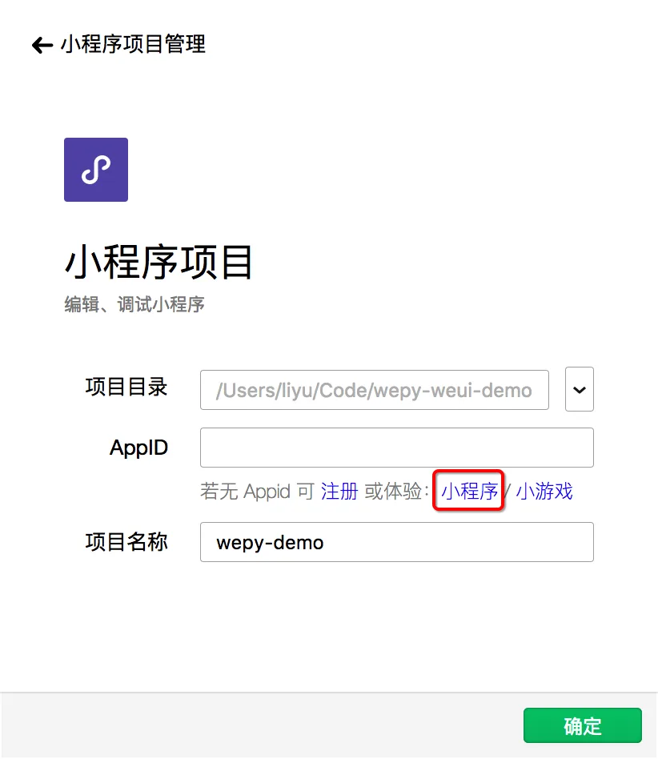
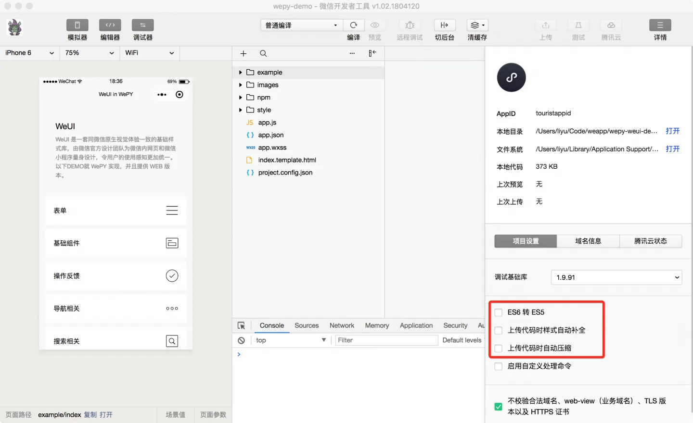
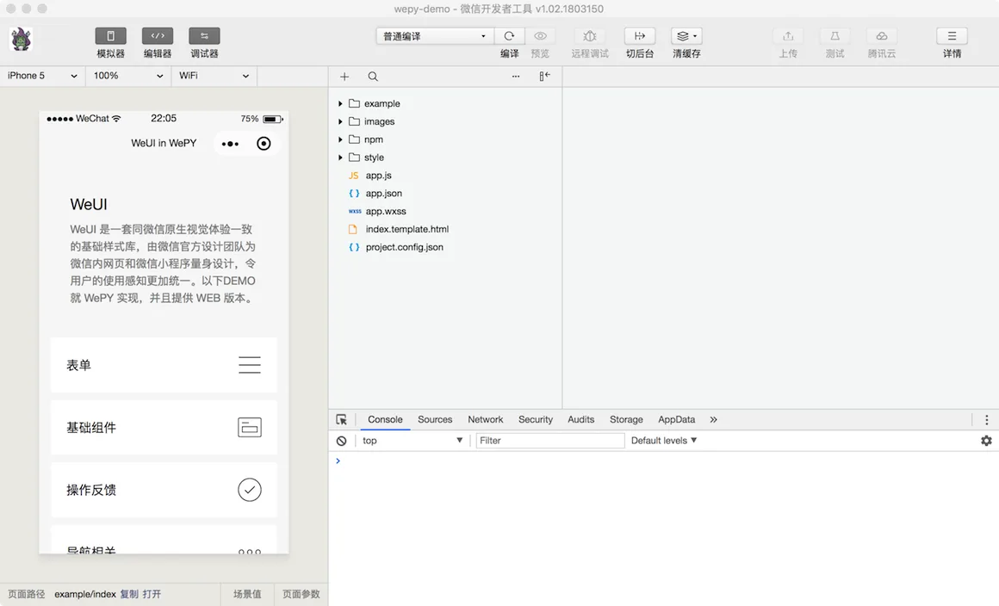
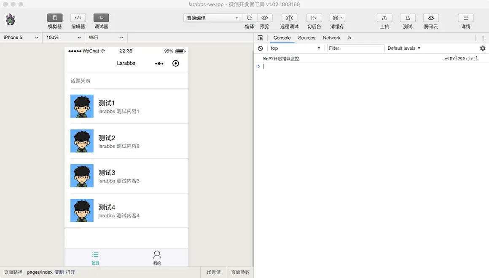
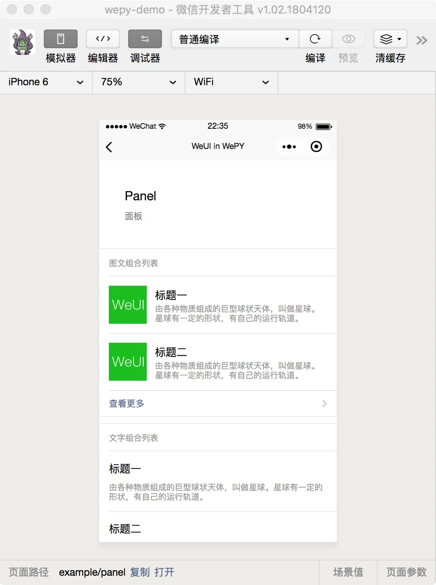
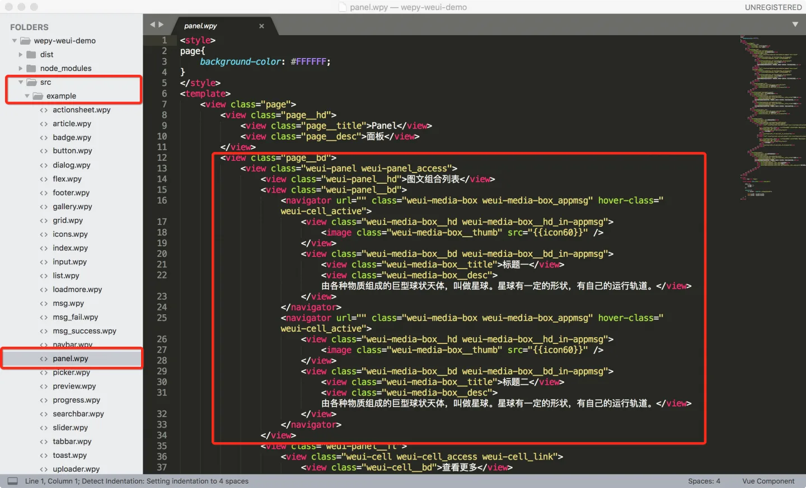

# 3.3. 安装 WeUI

原文链接：https://learnku.com/courses/laravel-weapp/1.7/install-weui/1459

本教程最新版为 [2.1](https://learnku.com/courses/laravel-weapp/2.1)，当前版本已放弃维护，请阅读最新版本！

## WeUI

[WeUI](https://github.com/Tencent/weui) 是一套同微信原生视觉体验一致的基础样式库，由微信官方设计团队为微信 Web 开发量身设计，可以令用户的使用感知更加统一，当然也有小程序版本的 [WeUI](https://github.com/Tencent/weui-wxss)，这一节我们来了解 WeUI 的使用。

## 安装 WeUI

### 下载 Demo

我们使用了 WePY 框架，那么 WePY 如何使用 WeUI 呢，[这里](https://github.com/wepyjs/wepy-weui-demo) 有一个官方推荐的例子供大家参考，我们先将这个项目导入开发者工具。

```
$ cd ~/Code
$ git clone git@github.com:wepyjs/wepy-weui-demo.git
```

同样我们需要安装 Node 包以及编译：

```
$ cd wepy-weui-demo
$ yarn
$ wepy build
```

>

如果 `yarn` 命令运行报错，可以尝试 `yarn install --no-bin-links`。



接下来微信开发者工具，选择『新建项目』：



弹出新建项目引导框:



注意这里的项目目录需要选择 `/wepy-weui-demo/dist` 目录，AppID 可以不用填，选体验 `小程序`即可，点击确定添加。

点开右上角的 `详情` 按钮，确保 `ES6 转 ES5`，`上传代码时样式自动补全`，`上传代码时自动压缩` 这三个配置为不勾选。


最终你应该看到下面的界面：


不用具体看这个项目的代码，只需要大致了解 WeUI 即可。我们主要是使用项目中的样式目录 `style`。

```
$ cd ~/Code
$ cp -r wepy-weui-demo/src/style/ larabbs-weapp/src/style
```

### 引入样式文件

替换掉 `app.wpy` 文件中的 `style` 的部分：

src/app.wpy

```
<style lang="less">
@import 'style/weui.less';
page{
background-color: #F8F8F8;
font-size: 16px;
}
.page__hd {
padding: 40px;
}
.page__bd {
padding-bottom: 40px;
}
.page__bd_spacing {
padding-left: 15px;
padding-right: 15px;
}
.page__ft{
padding-bottom: 10px;
text-align: center;
}
.page__title {
text-align: left;
font-size: 20px;
font-weight: 400;
}
.page__desc {
margin-top: 5px;
color: #888888;
text-align: left;
font-size: 14px;
}
</style>

.
.
.
```

注意这里我们使用了 Less 的 `import` 功能，引入了 WeUI 的基础样式文件，所以只需要增加 `@import 'style/weui.less;` 就可以在所有的页面中使用 WeUI 了。同时我们增加了一些全局样式 `.page__*` ，方便全局使用。

## 增加测试代码

修改首页的代码：

src/pages/index.wpy

```
<template>
<view class="page__bd">
<view class="weui-panel weui-panel_access">
<view class="weui-panel__hd">话题列表</view>
<view class="weui-panel__bd">
<repeat for="{{ topics }}" key="id" index="index" item="topic">
<navigator url="" class="weui-media-box weui-media-box_appmsg" hover-class="weui-cell_active">
<view class="weui-media-box__hd weui-media-box__hd_in-appmsg">
<image class="weui-media-box__thumb" src="https://cdn.learnku.com/uploads/avatars/3995_1516760409.jpg?imageView2/1/w/200/h/200" />
</view>
<view class="weui-media-box__bd weui-media-box__bd_in-appmsg">
<view class="weui-media-box__title">{{ topic.title }}</view>
<view class="weui-media-box__desc">{{ topic.body }}</view>
</view>
</navigator>
</repeat>
</view>
</view>
</view>
</template>

<script>
import wepy from 'wepy'

export default class Index extends wepy.page {
// 可用于页面模板绑定的数据
data = {
topics: [{
id: 1,
title: '测试1',
body: 'larabbs 测试内容1'
}, {
id: 2,
title: '测试2',
body: 'larabbs 测试内容2'
}, {
id: 3,
title: '测试3',
body: 'larabbs 测试内容3'
}, {
id: 4,
title: '测试4',
body: 'larabbs 测试内容4'
}]
}
}
</script>

```

先打开开发者工具看一下页面：



上面的代码中需要学习的新知识点有：

- navigator 标签——可以理解为 HTML 中的 A 标签，`url` 属性用来定义要跳转到的页面，这里暂时还未定义。

- repeat 标签——是 `WePY` 框架定义的辅助标签，简化了小程序的 [wx:for](https://developers.weixin.qq.com/miniprogram/dev/framework/view/wxml/list.html)， `for="{{ topics }}" key="id" index="index" item="topic"` 例子中的  `for` 属性为要循环的数组，定义在下面的 data 中，`key` 用来指定列表中项目的唯一的标识符，`item` 是数组中当前元素的变量名。

这里有个数据绑定的概念大家需要了解，在对象的 `data` 中定义的所有数据都是可用于页面模板绑定的数据，这里我们定义了一个 `topics` 数据，定义好以后就可以在模板中使用 `{{ topics }}` 来循环这个数组了，`topics` 中有 4 个值，所以模板中 `repeat` 的部分会显示 4 个数据；模板中渲染的的 `{{ topics }}` 数据会自动与 `data` 中的 `topics` 数据绑定，当topics 被动态改变为 5 个值时，模板同时也会发生变化，显示 5 条数据。

观察模板你会发现我们使用了 `page__bd`，`weui-panel`，`weui-panel__hd` 这些样式，这些都是 WeUI 为我们定义好的样式，那么如何使用这些样式呢？其实你不必研究每个样式是怎么定义的，你只需要打开 `wepy-weui-demo` 找到你想用的样式，例如上面我们用到了 Panel 中的样式：



随后使用使用 Sublime 查看代码：



在 `wepy-weui-demo` 项目中的 `src/example` 目录中找到对应的文件 `panel.wpy`，复制过来合理修改即可，我们的目的就是使用 WeUI 的已有样式加快开发。

## 代码版本控制

```
$ cd ~/Code/larabbs-weapp
$ git add -A
$ git commit -m 'add WeUI'
```
