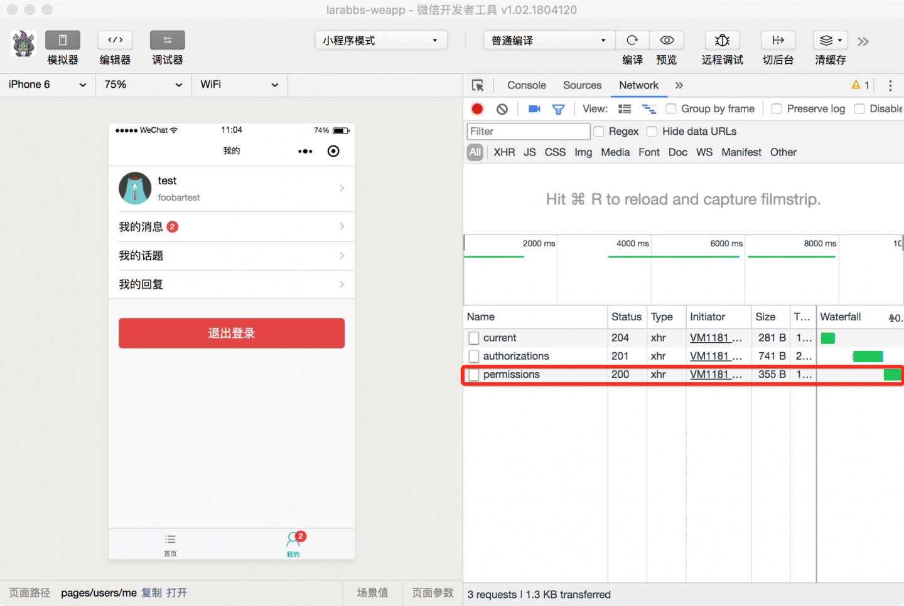
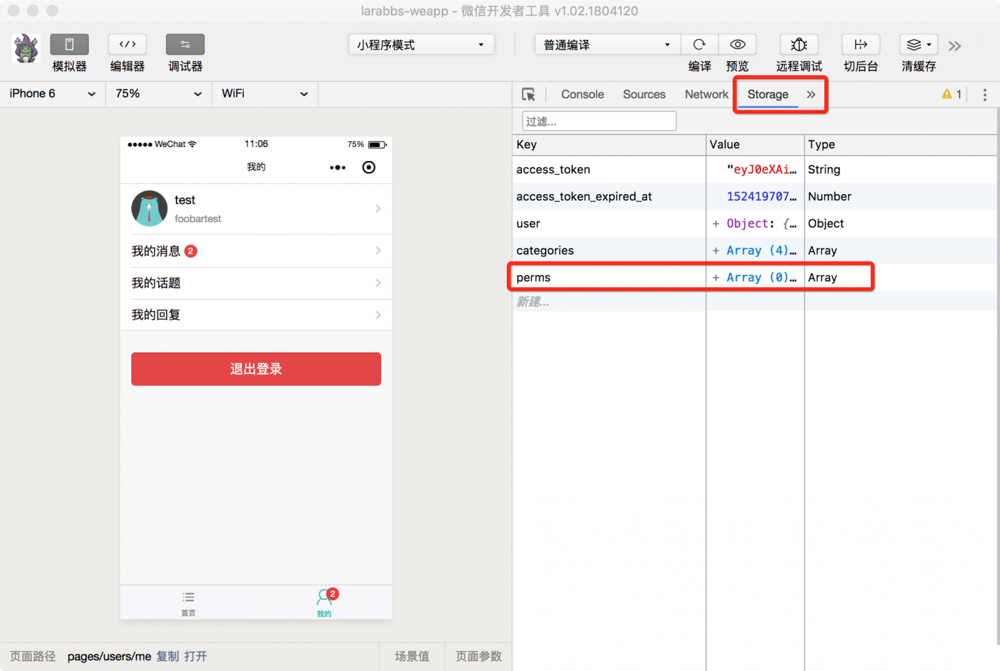

# 9.1. 用户权限

原文链接：https://learnku.com/courses/laravel-weapp/1.7/caching-user-rights/1574

本教程最新版为 [2.1](https://learnku.com/courses/laravel-weapp/2.1)，当前版本已放弃维护，请阅读最新版本！

## 用户权限

这一节我们将学习用户权限相关的内容，先来回忆一下 LaraBBS 中的角色和权限。

### 用户身份

在我们的 LaraBBS 项目里有以下几种用户身份：

- 游客 可以随便浏览页面，但是无法发布内容；

- 用户 能够发布内容，却只能管理自己的内容；

- 管理员 可以管理所有用户的内容，然而不能管理用户；

- 站长 拥有最高权限，可以管理所有内容，包括用户。

### 用户权限

根据以上设定，需要设置三个权限

- manage_contents 维护社区的内容

- manage_users 修改用户密码、删除用户等

- manage_settings 可以在后台管理站点相关的设置，如 SEO 设置、联系邮箱等

### 用户角色

设置两个角色

- 管理员 Maintainer  拥有 manage_contents 权限

- 站长 Founder  拥有 manage_contents， manage_users， manage_settings 权限

游客和用户没有角色；将 1 号用户指派为『站长』拥有所有权限；将 2 号用户设置为管理员，拥有 `manage_contents` 权限，帮助维护社区内容。

## 获取用户权限

对于小程序来说，目前只有 `删除话题`，`删除回复` 两个功能涉及到权限的判断，涉及到的权限是 `manage_contents`，为了方便判断，首先来封装一个全局方法。

src/app.wpy

```
.
.
.
// 获取权限
async getPerms() {
let perms = []

if (!this.checkLogin()) {
return perms
}

try {
let permsResponse = await api.authRequest('user/permissions', false)
// 请求成功，放入 storage 缓存中
if (permsResponse.statusCode === 200) {
perms = permsResponse.data.data
wepy.setStorageSync('perms', perms)
}
} catch (err) {
console.log(err)
wepy.showModal({
title: '提示',
content: '获取用户权限失败，可尝试重启小程序'
})
}

return perms
}
.
.
.
```

在 `app.wpy` 中封装一个全局的方法 `can`，用来判断用户是否有某个权限：

1. 用户未登录，直接返回；

2. 请求 `用户权限列表` 接口获取权限，请求成功后，缓存在 Storage 的 `perms` 中。

`getPerms` 是个全局的获取用户权限的方法，我们需要在几个合适的时机调用该方法，将用户权限缓存下来：

- 小程序启动完成后；

- 用户登录成功后；

- 用户注册成功后。

修改 app.wpy 中的 `onLaunch` 方法：
src/app.wpy

```
.
.
.
onLaunch() {
// 小程序启动，调用一起获取未读消息数
this.updateUnreadCount()
// 每隔 60 秒，调用一起获取未读消息数
setInterval(() => {
this.updateUnreadCount()
}, 60000)

// 获取用户权限
this.getPerms()
}
.
.
.
```

修改 login.wpy 登录成功后的逻辑：
src/pages/auth/login.wpy

```
.
.
.
// 表单提交
async submit() {
.
.
.
// 201 为登录正确，返回上一页
if (authResponse.statusCode === 201) {
// 获取用户权限
this.$parent.getPerms()
wepy.navigateBack()
}
.
.
.
}
// 页面打开事件
async onShow() {
.
.
.
// 登录成功返回上一页
if (authResponse.statusCode === 201) {
// 获取用户权限
this.$parent.getPerms()
wepy.navigateBack()
}
.
.
.
}
```

修改 register.wpy 注册成功后的逻辑：
src/pages/auth/register.wpy

```
.
.
.
// 表单提交
async submit (e) {
.
.
.
// 注册成功，记录token
if (registerResponse.statusCode === 201) {
.
.
.
// 获取用户权限
this.$parent.getPerms()

wepy.showToast({
title: '注册成功',
icon: 'success'
})
.
.
.
}
.
.
.
```

我们在登录成功后和注册成功后都会调用一次 `this.$parent.getPerms()` 获取用户权限并缓存下来。

退出登录后重新登录，应该会有网络请求获取权限：


查看 Storage 中数据，会有 `perms` 数据：


## 判断用户是否有权限

权限已经缓存了，我们还需要一个全局方法，可以帮助我们判断用户是否包含某个权限：

src/app.wpy

```
.
.
.
// 判断用户权限
can(targetPerm) {
if (!this.checkLogin()) {
return false
}

// 获取缓存中的权限
let perms = wepy.getStorageSync('perms') || []

// 判断权限中是否有目标权限
if (perms.find(perm => perm.name === targetPerm)) {
return true
}

return false
}
.
.
.
```

封装好了这个方法我们就可以在页面中使用 `this.$parent.can('manage_contents')` 判断用户是否可以管理内容了：

1. 未登录用户返回 false；

2. 获取缓存中的 perms 数据；

3. 使用 js 的 find 方法，查找 perms 是否包含 name 等于 `manage_contents` 的权限，找到返回true；

## 修改话题详情

src/pages/topics/show.wpy

```
.
.
.
// 计算的属性
computed = {
// 是否可以删除话题
canDelete() {
if (!this.topic || !this.user) {
return false
}
// 当前用户是话题的发布者 或 有管理内容权限
return (this.user.id === this.topic.user_id) || this.$parent.can('manage_contents')
}
}
.
.
.
```

之前的课程中，我们在话题详情中增加了 `canDelete` 方法判断用户是否可以删除话题，之前只是判断了用户是否为话题发布者，其实有 `manage_contents` 权限的用户也可以删除话题，修改判断为 `return (this.user.id === this.topic.user_id) || this.$parent.can('manage_contents')`。

## 修改回复列表

src/mixins/replyMixin.js

```

.
.
.
canDelete(user, reply) {
if (!user) {
return false
}

// 用户为回复发布者 或 有管理内容权限
return (reply.user_id === user.id) || this.$parent.can('manage_contents')
}
.
.
.
```

之前的课程我们在 replyMixin 中增加了 `canDelete` 方法只判断了用户是否为回复的发布者，现在增加条件是否有 `管理内容` 权限 `(reply.user_id === user.id) || this.$parent.can('manage_contents')`。

## 代码版本控制

```
$ cd ~/Code/larabbs-weapp
$ git add -A
$ git commit -m 'user perms'
```
