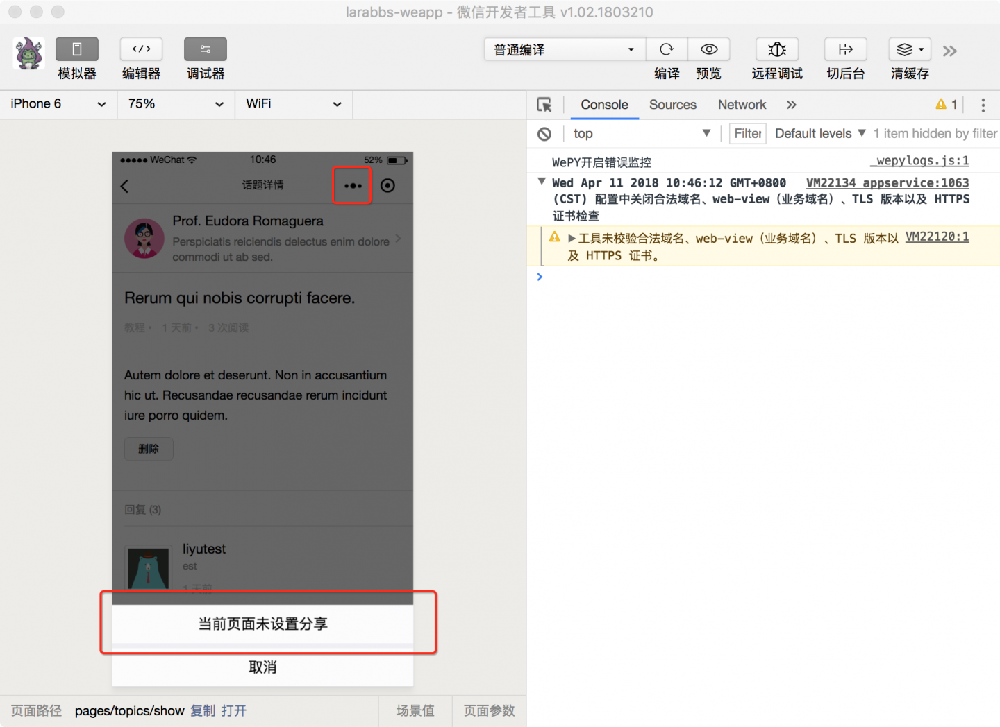
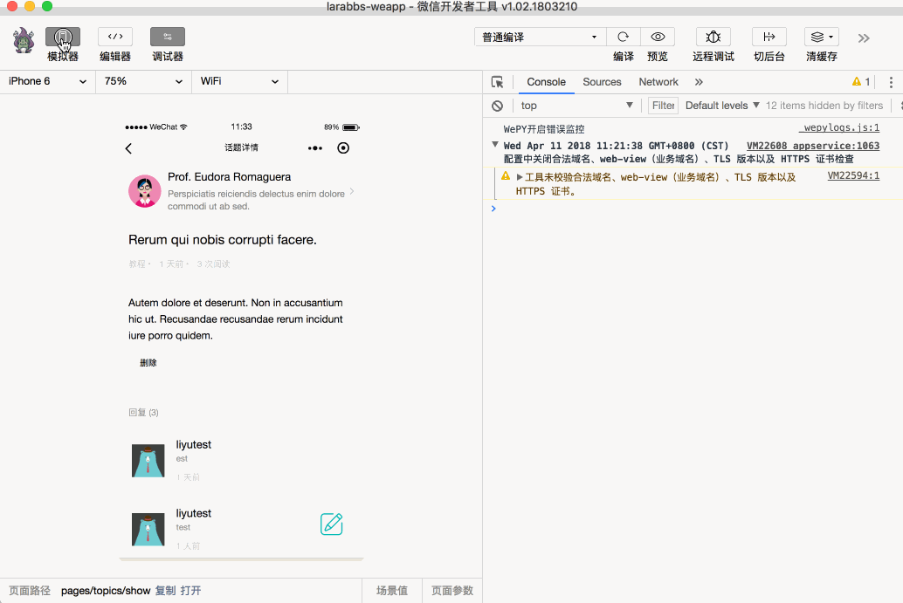
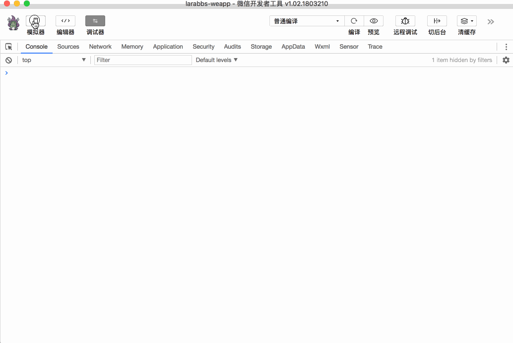

# 9.2. 页面分享

原文链接：https://learnku.com/courses/laravel-weapp/1.7/page-sharing/1580

本教程最新版为 [2.1](https://learnku.com/courses/laravel-weapp/2.1)，当前版本已放弃维护，请阅读最新版本！

## 页面分享

这一节我们来学习小程序的分享功能，将 `话题详情` 和 `用户详情` 分享转发给其他人。

小程序转发主要依赖 [onShareAppMessage](https://developers.weixin.qq.com/miniprogram/dev/api/share.html#onshareappmessageoptions) 这个方法，只有定义了该方法，右上角菜单才会显示『转发』 按钮。

`onShareAppMessage` 事件需要返回一个对象：

- title  —— 转发标题；

- path  —— 转发路径，分享后，点击进入的页面；

- imageUrl ——自定义图片路径；

- success —— 转发成功的回调函数；

- fail —— 转发失败的回调函数 ；

- complete —— 转发结束的回调函数。

因为转发成功后我们并没有相关的业务逻辑，所以我们主要使用 `title`, `path`, `imageUrl` 这三个参数。

## 话题详情分享

设置 `onShareAppMessage` 之前点击右上角的菜单，会提示『当前页面未设置分享』。



修改代码加入 `onShareAppMessage` 方法：
src/pages/topics/show.wpy

```
.
.
.
onShareAppMessage (res) {
return {
// 标题是话题标题
title: this.topic.title,
// 路径为话题详情路径
path: '/pages/topics/show?id=' + this.topic.id,
success: function(res) {
// 转发成功
console.log(res)
},
fail: function(res) {
// 转发失败
console.log(res)
}
}
}
.
.
.
```

这里我们定义标题为当前话题的标题，路径为话题详情路径。

打开开发者工具，进入详情，点击右上角的菜单，尝试转发：


## 用户详情分享

用户的详情页可以设置分享：

src/pages/users/show.wpy

```
.
.
.
onShareAppMessage (res) {
return {
// 标题为用户姓名
title: this.user.name,
// 路径为用户详情
path: '/pages/users/show?id=' + this.user.id,
// 图片为用户头像
imageUrl: this.user.avatar,
success: function(res) {
// 转发成功
console.log(res)
},
fail: function(res) {
// 转发失败
console.log(res)
}
}
}
.
.
.
```

用户详情中，我们返回了 `imageUrl` 参数，如果没有这个参数则默认使用页面截图，这里我们使用用户的头像作为分享图片。



## 代码版本控制

```
$ cd ~/Code/larabbs-weapp
$ git add -A
$ git commit -m 'page share'
```
