# 9.3. 小程序发布

原文链接：https://learnku.com/courses/laravel-weapp/1.7/small-program-release/1592

本教程最新版为 [2.1](https://learnku.com/courses/laravel-weapp/2.1)，当前版本已放弃维护，请阅读最新版本！

## 小程序发布

小程序的基本功能我们已经完成了，接下来要做的就是将小程序发布出去。

## 切换域名

我们一直使用 `http://larabbs.test` 访问本地的接口，发布小程序的时候首先需要切换到正式域名，我们可以利用环境变量 `NODE_ENV` 来解决。

其实 `WePY` 框架已经为我们准备好了测试及正式环境编译的脚本：

打开 `package.json` 我们会发现一些准备好的 `scripts`。

package.json

```
"scripts": {
"dev": "wepy build --watch",
"build": "cross-env NODE_ENV=production wepy build --no-cache",
"dev:web": "wepy build --output web",
"clean": "find ./dist -maxdepth 1 -not -name 'project.config.json' -not -name 'dist' | xargs rm -rf",
"test": "echo \"Error: no test specified\" && exit 1"
},
```

- 执行 `npm run dev` 相当于执行 `wepy build --watch`；

- 执行 `npm run build` 则会设置 `NODE_ENV=production` 然后在进行无缓存（--no-cache） 的 `build`。

在 `wepy.config.js` 中，可以通过`process.env.NODE_ENV` 拿到不同的环境变量值。WePY 文档中也给出了一些建议的 [方案](https://github.com/Tencent/wepy/wiki/WePY%E6%A0%B9%E6%8D%AE%E7%8E%AF%E5%A2%83%E5%8F%98%E9%87%8F%E6%9D%A5%E6%94%B9%E5%8F%98%E8%BF%90%E8%A1%8C%E6%97%B6%E7%9A%84%E5%8F%82%E6%95%B0)，我们使用 `replace` 实现。

假设我们正式上线的域名是 `https://weapp.laravel-china.org`。

>

`https://weapp.laravel-china.org` 这是我们准备的例子，你是无法直接使用的，如果你想上线自己的小程序，需要在自己的服务器上搭建 LaraBBS，同时备案域名。

安装生成环境编译需要的依赖：

```
$ yarn add wepy-plugin-replace  wepy-plugin-imagemin  wepy-eslint
```

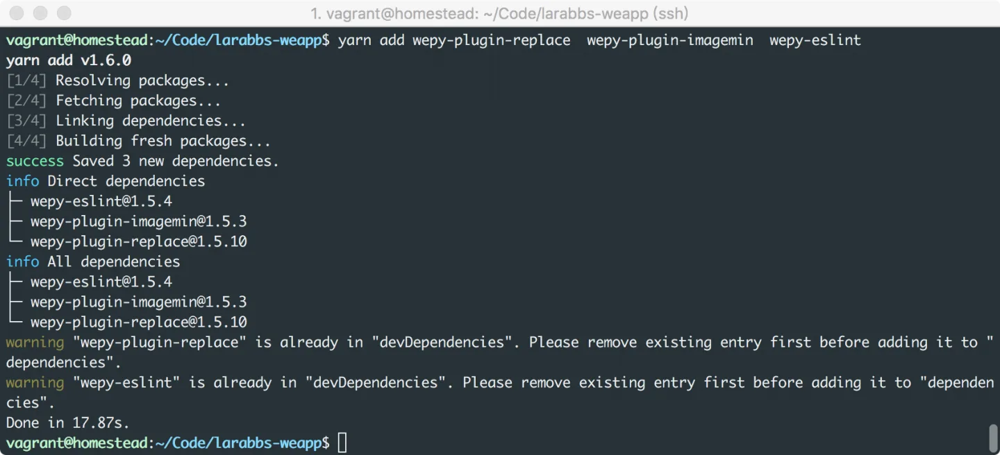

修改 wepy.config.js：

wepy.config.js

```
.
.
.
var prod = process.env.NODE_ENV === 'production';
.
.
.
plugins: {
replace: {
filter: /\.js$/,
config: {
find: /__BASE_URL__/g,
replace: prod ? "'https://weapp.laravel-china.org/api'" : "'http://larabbs.test/api'"
}
}
},
.
.
.
if (prod) {
// 压缩sass
// module.exports.compilers['sass'] = {outputStyle: 'compressed'}

// 压缩js
module.exports.plugins = {
uglifyjs: {
.
.
.
},
imagemin: {
.
.
.
},
replace: {
filter: /\.js$/,
config: {
find: /__BASE_URL__/g,
replace: prod ? "'https://weapp.laravel-china.org/api'" : "'http://larabbs.test/api'"
}
}
}
}
```

这里使用了 [wepy-plugin-replace](https://www.npmjs.com/package/wepy-plugin-replace) 插件，替换所有 JS 文件中的 `__BASE_URL__`，根据当前的环境，如果是生产环境 prod 等于 true，则使用 `https://weapp.laravel-china.org/api`，否则使用 `http://larabbs.test/api`。

现在我们可以在需要的地方直接使用 `__BASE_URL__` 作为服务器接口地址了：
src/utils/api.js

```
.
.
.
const host = __BASE_URL__
.
.
.
```

修改原本 host 值为 `__BASE_URL__` 即可，现在可以通过 `npm run dev`  和 `npm run build` 编译不同环境的代码了。

## 配置服务器域名

登录[微信公众平台](https://mp.weixin.qq.com/cgi-bin/bizlogin?action=validate&lang=zh_CN&account=liyularabbs%40gmail.com)，『进入设置』 -> 『开发设置』。
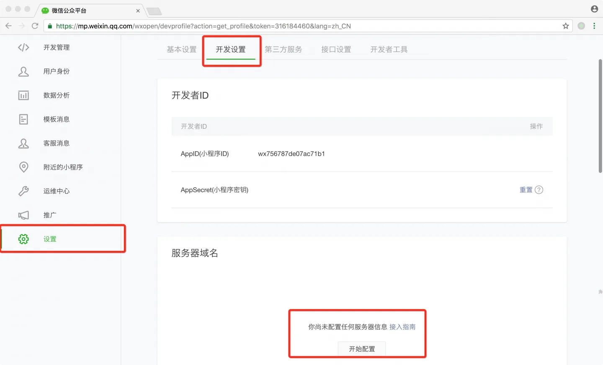

我们还没有设置服务器域名，点击开始配置。

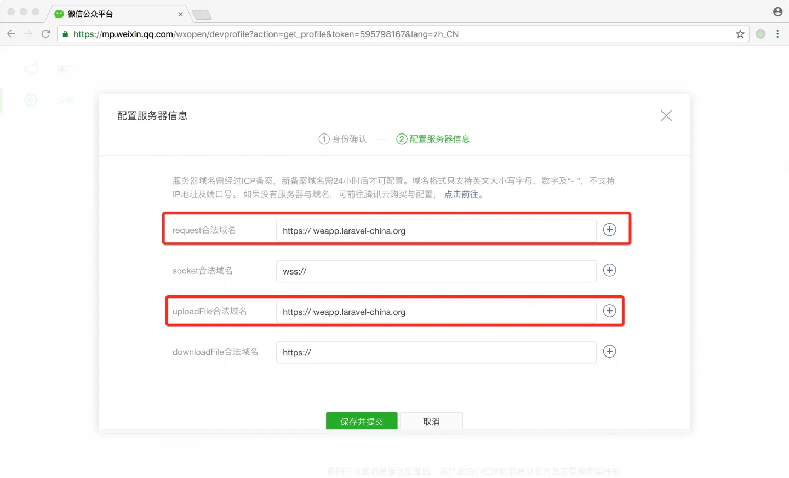

填入 `request合法域名` 和 `uploadFile合法域名`，注意这里微信要求我们域名必须使用 HTTPS，我们可以使用 [Certbot](https://certbot.eff.org/) 等工具制作。

## 上传代码

使用 `npm run  build` 编译好一个正式环境的小程序之后，就可以将代码上传至微信服务器了。

开发者工具的工具栏中有上传按钮。
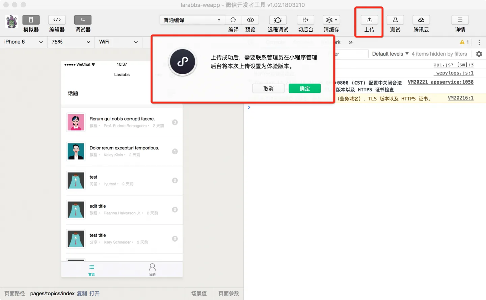

输入版本号以及项目备注后即可上传到微信服务器了。
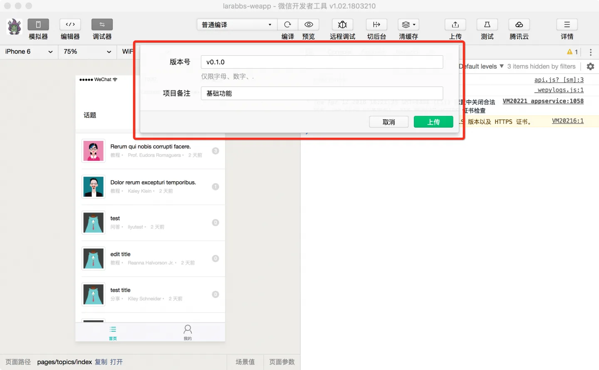

进入微信公众平台开发管理，可以在开发版本中看到刚才上传的代码了。
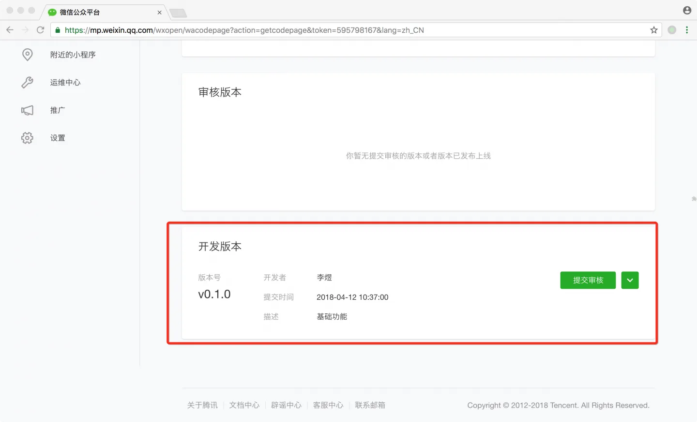

可以将当前版本设置为体验版本，这样就可以通过二维码分享给他人体验了。
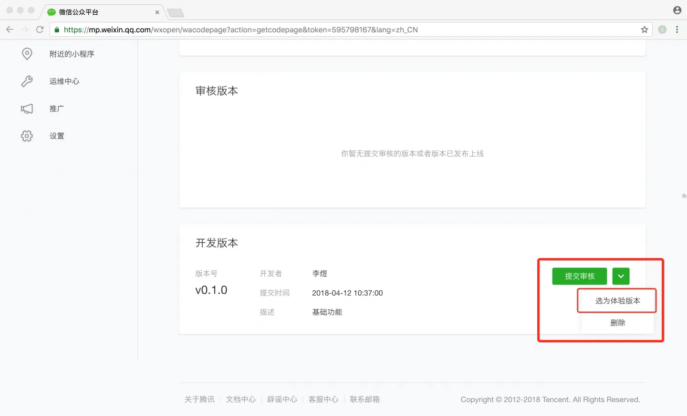
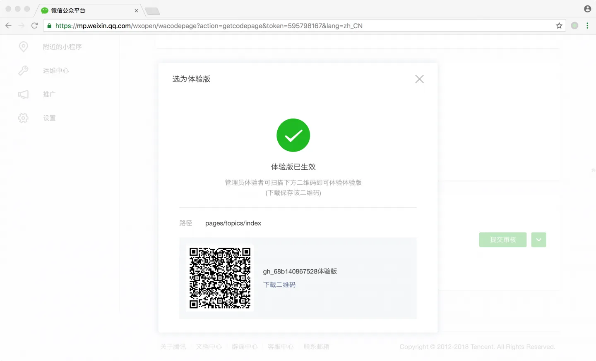

## 提交审核

上传好了版本之后，如果想正式发布，让其他人可以搜索到小程序，那么就需要提交审核，将小程序上线。

1.

填写小程序信息，登录[微信公众平台](https://mp.weixin.qq.com/cgi-bin/bizlogin?action=validate&lang=zh_CN&account=liyularabbs%40gmail.com)，进入首页，点击小程序信息后面的填写按钮：
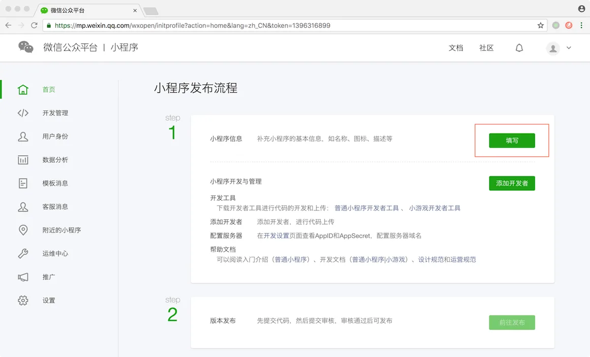

2.

填写小程序的信息包括名称，头像，介绍：
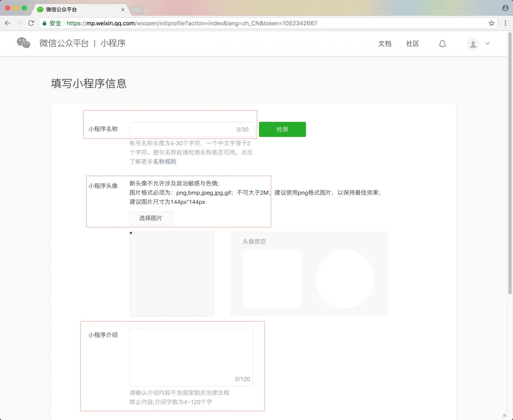

3.

填写完成后可以在 『设置』-> 『基本设置』 中看到填写的信息，可以再次修改，但是每个月有次数限制：
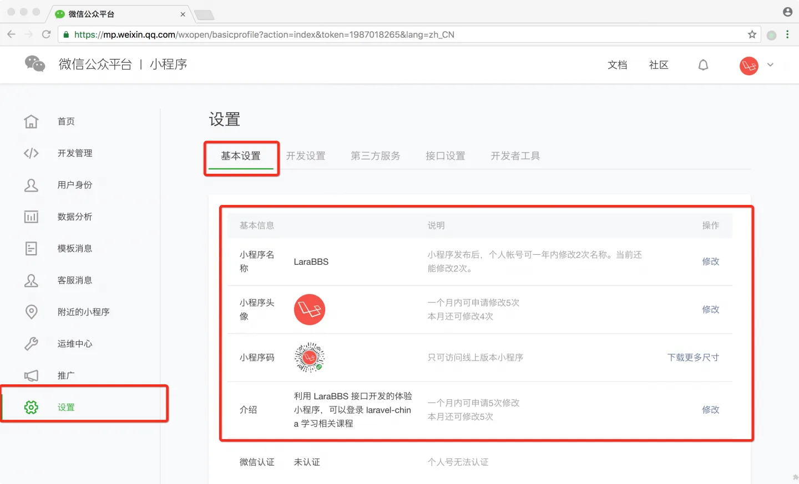

4.

上传了小程序，填写完小程序信息后，便可以进入 『开发管理』，将开发版本提交审核了：

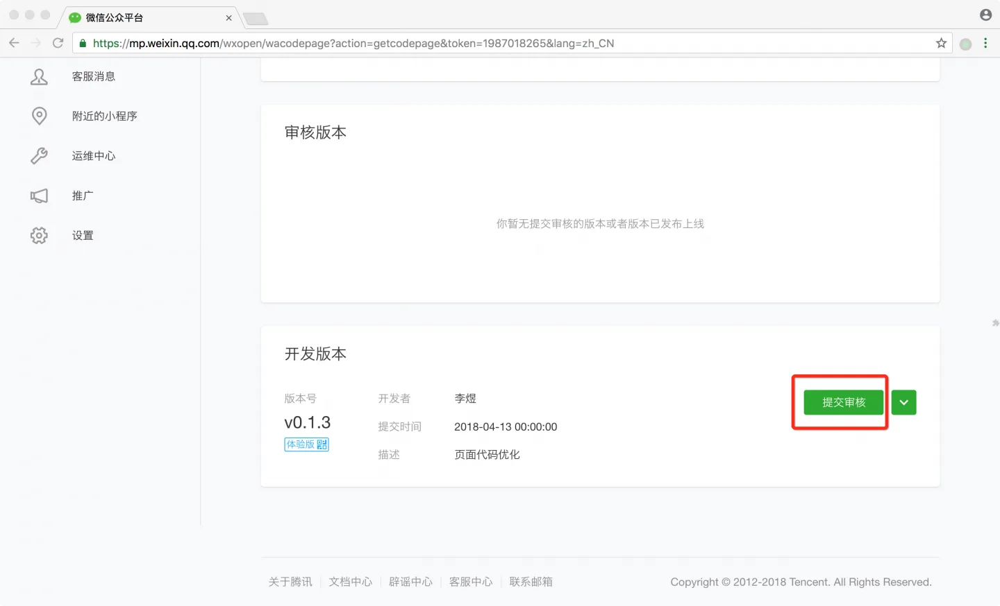

5.

点击提交审核，勾选已阅读规则，点击下一步：
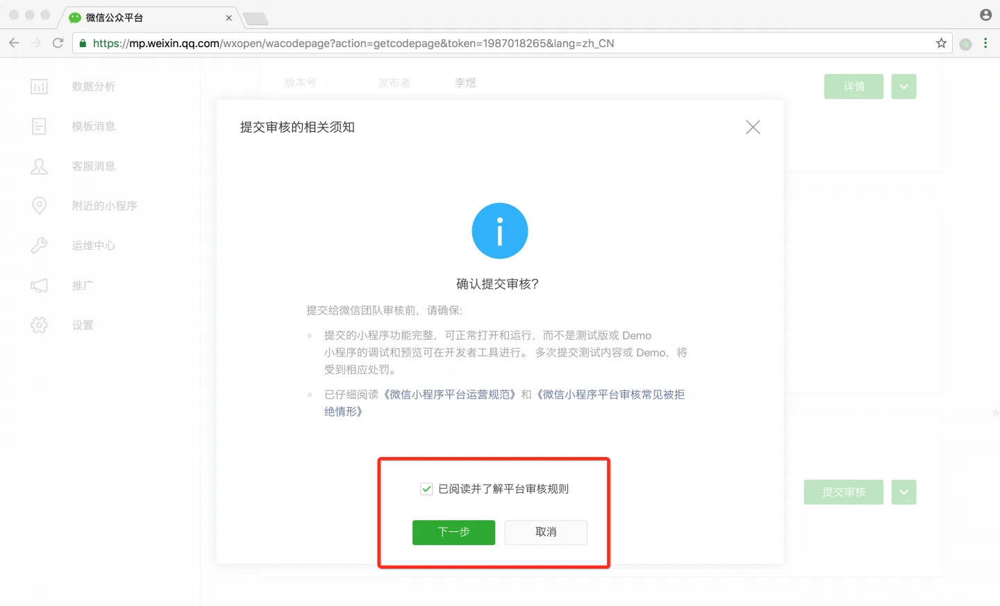

6.

添加一个功能页面，补充完整小程序相关的信息，如下图所示：
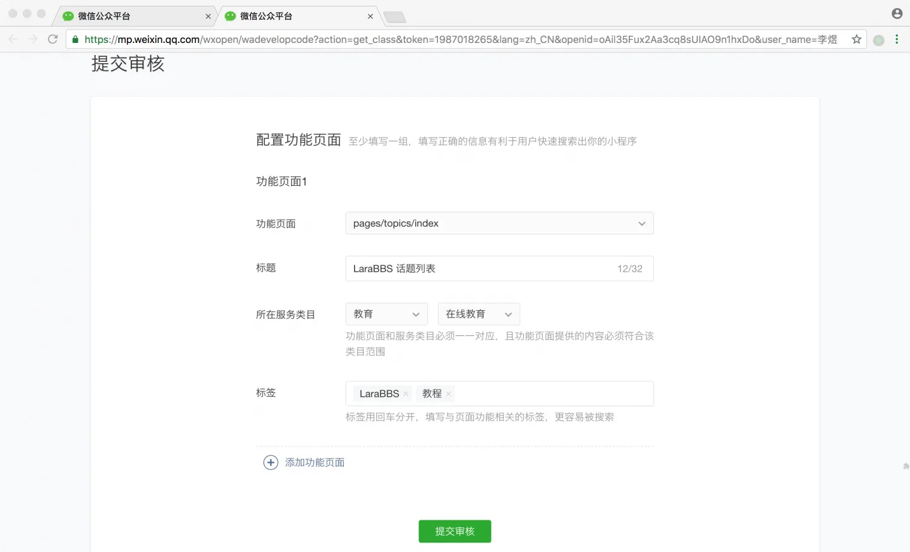

7.

提交审核成功：
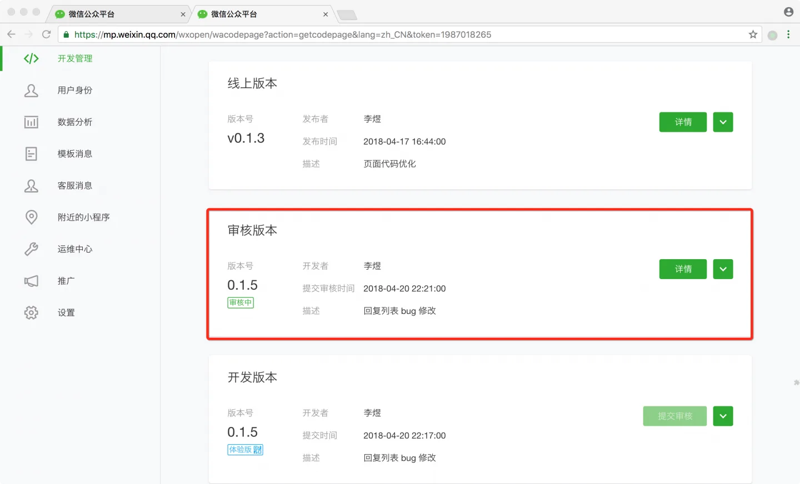

提交审核成功后就会在『开发管理』-> 『审核版本』中看到待审核的版本了，接下来就是等待微信审核了，首次审核周期根据经验大概 7 天以内；以后的小版本审核大概 2 日左右。

>

注意微信要求服务器域名需经过 ICP 备案，如果没有备案是审核不通过的。

## 代码版本控制

```
$ cd ~/Code/larabbs-weapp
$ git add -A
$ git commit -m 'switch env'
```
