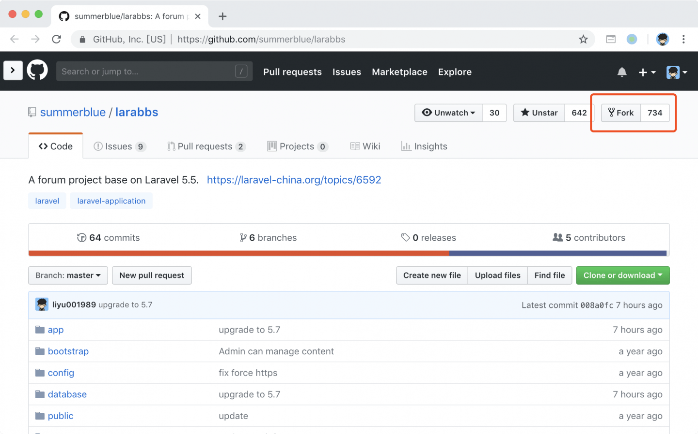
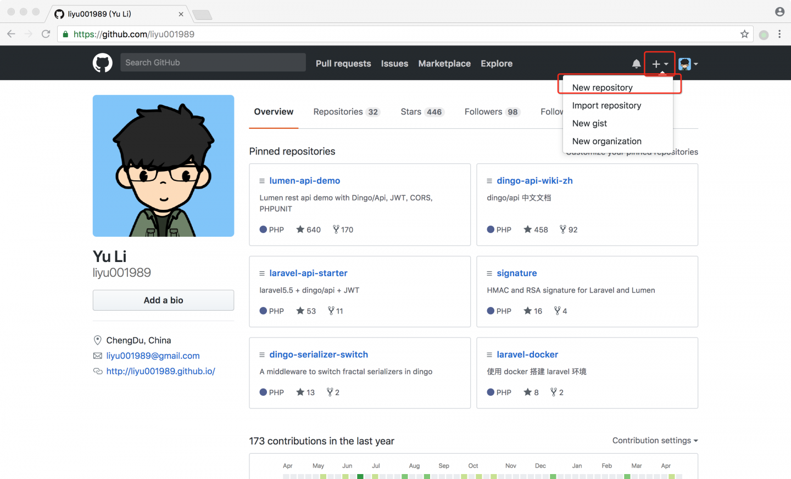
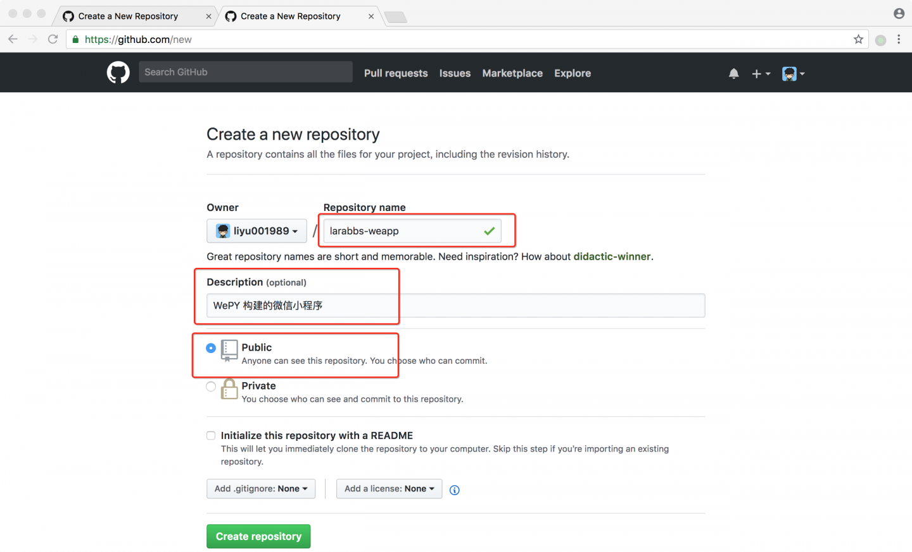
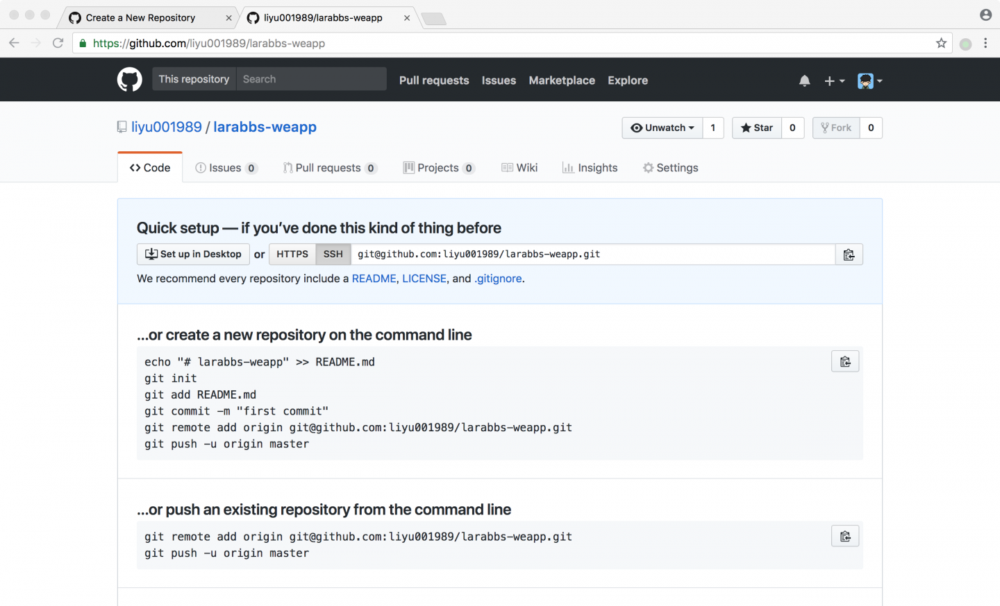

# 2.2. Git / GitHub 项目初始化

原文链接：https://learnku.com/courses/laravel-weapp/1.7/git-github-project-initialization/1599

本教程最新版为 [2.1](https://learnku.com/courses/laravel-weapp/2.1)，当前版本已放弃维护，请阅读最新版本！

## GitHub 项目初始化

在 github 上有一个自己的项目，这样有助于你学习使用 Github，也有助于进行接下来的练习，在本教程中我们需要两个项目：

- `LaraBBS` ——服务端项目；

- `LaraBBS-WEAPP` —— 小程序项目。

## 创建 LaraBBS 项目

[LaraBBS](https://github.com/summerblue/larabbs) 是系列教程中，一步步完成的论坛软件，其中包含如下几个分支：

- master —— 第二本教程完整的代码；

- api —— 第三本教程完整的代码；

- passport —— 第三本教程 Passport 部分代码；

- weapp —— 本教程全部代码。

我们需要从 `api` 分支开始本教程的学习，所以需要获取 `api` 分支的代码，并部署在本地，如果你已经购买并完成了上一本教程，那么你的 github 上应该有一个自己的 `larabbs` 项目，那么你可以跳过这一步。

如果你还没有项目，可以选择直接 fork 一份 [summer/larabbs](https://github.com/summerblue/larabbs)。



Fork 完成后，进入 Code 文件夹，克隆项目，注意请把下面的 `<username>` 替换为你的用户名：

```
$ cd ~/Code
$ git clone git@github.com:<username>/larabbs.git
```

切换到 LaraBBS 的 `L03_5.8` 分支：

```
$ cd larabbs
$ git checkout L03_5.8
```

>

如果你的在开发过程中遇到什么问题可以切换到 `weapp` 分支对比线上的完整代码：

$ git checkout -t origin/weapp

## 创建 LaraBBS-WEAPP 项目

1.

打开 Github 点击右上角的加号，选择创建新仓库。



2.

填写项目信息：

- 项目名称 —— larabbs-weapp；

- 项目描述 —— WePY 构建的微信小程序；

- 选择项目类型 —— Public （公开）。



提交表单新建一个 GitHub 代码仓库：


成功后你将得到一个空的 larabbs-weapp 仓库。

3.

克隆项目

注意替换下面的 `<username>` 为你自己的 `github` 用户名：

```
$ cd ~/Code
$ git clone git@github.com:<username>/larabbs-weapp.git
```

>

这是我们创建了一个空的项目，由于微信开发者工具添加新项目时需要保持目录为空的状态，所以不初始化 README 和 License，保持项目为空即可。
