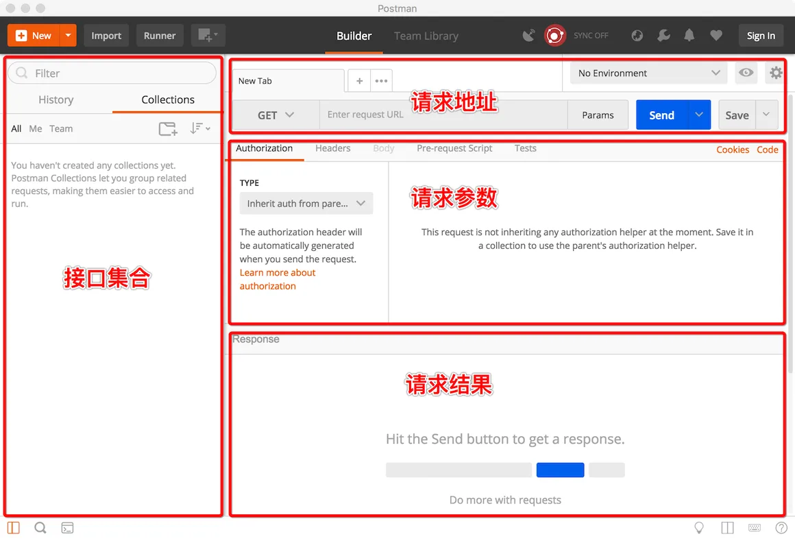
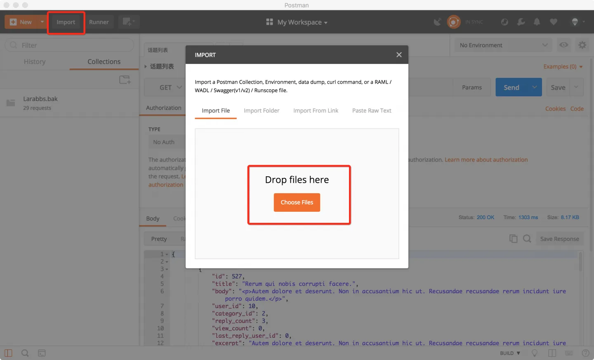
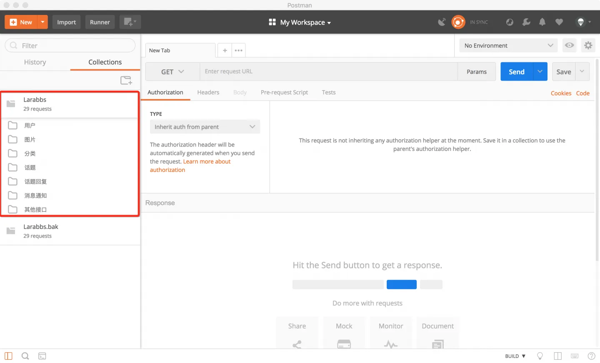
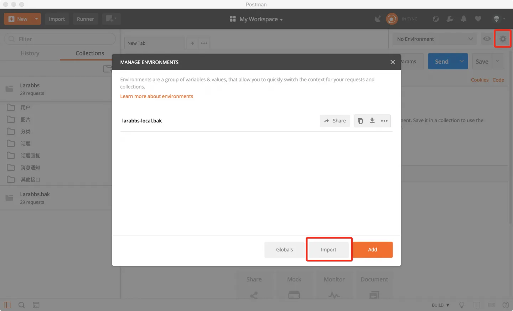
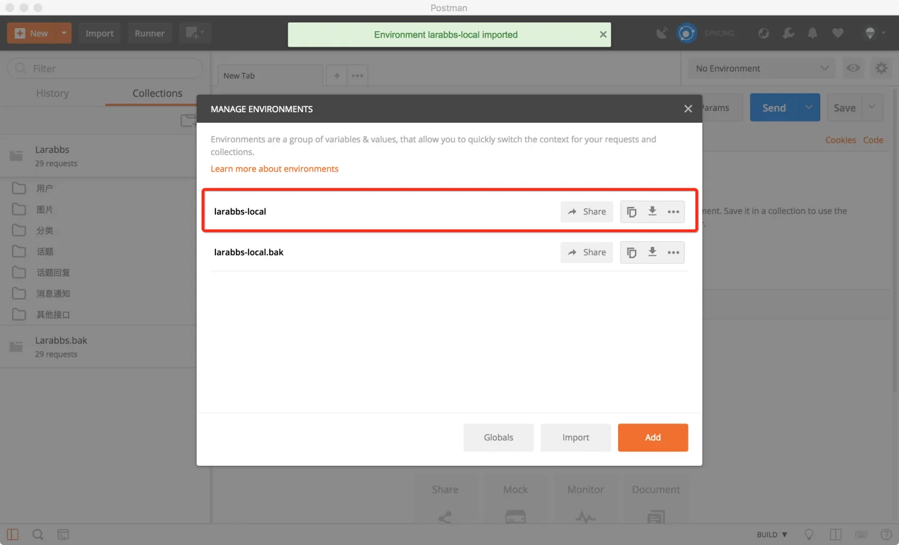
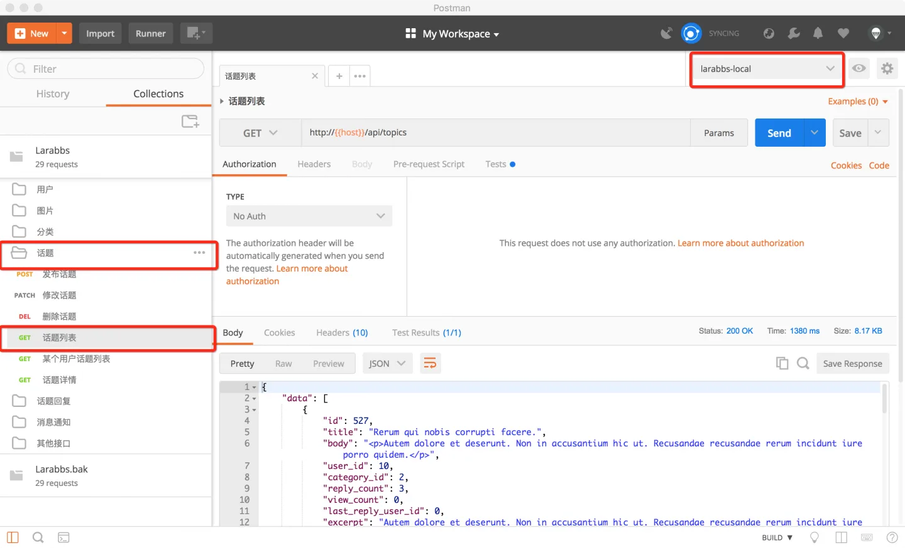

# 2.4. PostMan 和 API

原文链接：https://learnku.com/courses/laravel-weapp/1.7/download-postman-and-import/1597

本教程最新版为 [2.1](https://learnku.com/courses/laravel-weapp/2.1)，当前版本已放弃维护，请阅读最新版本！

## 安装 PostMan

PostMan 是一款跨平台，方便我们调试 API 的工具，你可以在 [PostMan官网](https://www.getpostman.com/) 下载，或者使用 [百度网盘下载](https://pan.baidu.com/s/1dEMMD2L)。

打开 PostMan 界面如上图所示，大体可以分为四个区域，左侧`接口集合`类似文件夹的功能，我们可以把我们的接口保存在这里，右侧上中下分别是`请求地址`，`请求参数`和`请求结果`。

## 导入 LaraBBS 接口

下载 [LaraBBS 的接口及配置](https://pan.baidu.com/s/10kR3b3EleKkXckZdOsUWXw) 文件，导入到 PostMan 中，包括两个文件：

- `Larabbs.postman_collection.json` —— 接口集合；

- `larabbs-local.postman_environment.json` —— 环境配置；

### 1. 导入接口集合

点击 PostMan 左上角的 Import按钮，选择 `Larabbs.postman_collection.json` 文件：

导入成功后，可以在左侧的 Collections 中看到 LaraBBS 的所有接口：

### 2. 导入环境配置

点击 PostMan 右上角的设置按钮，选择 `larabbs-local.postman_environment.json` 文件：

导入成功后可以看到多了一个 `larabbs-local` 环境：

### 3. 测试接口

打开话题目录中的 `话题列表` 接口，环境选择 `larabbs-local`，然后点击『Send』按钮发送接口请求：

请求成功，可以获取到话题数据。

## 结语

后续课程当我们在小程序里嵌套视图数据时，我们可以很直观地利用 PostMan 来查看接口返回的数据结构。开发中，当你不确定接口数据是否正常工作时，也可以使用 PostMan 来检测接口是否可用。
