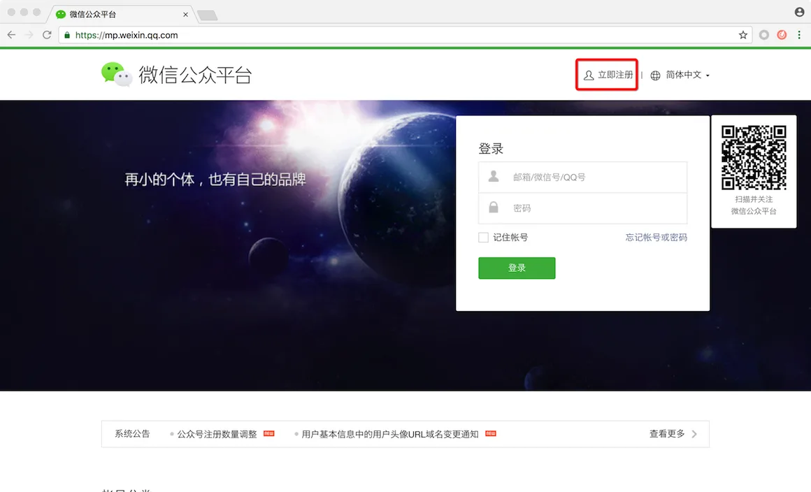
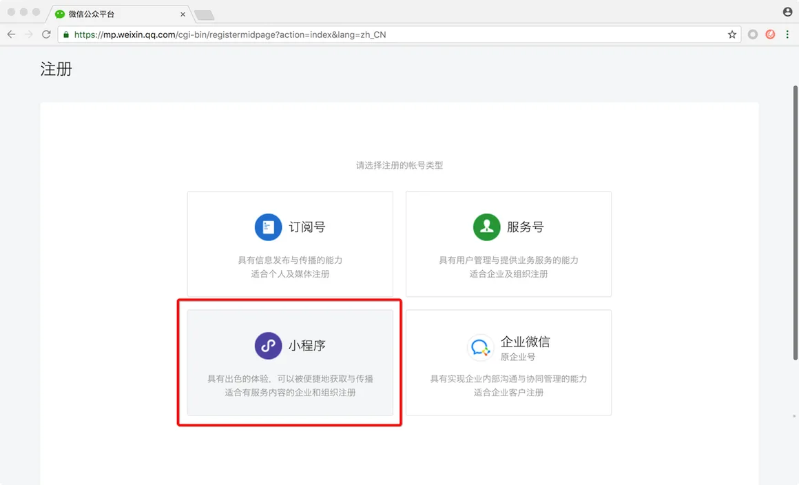
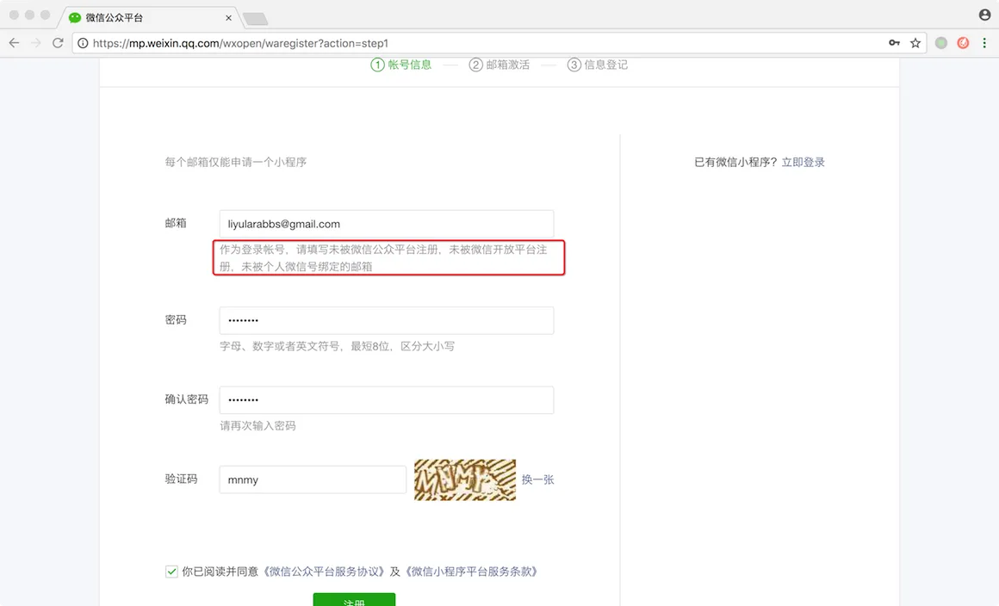
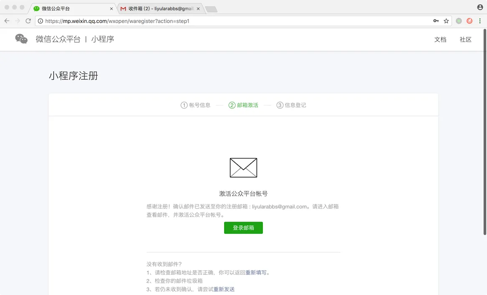
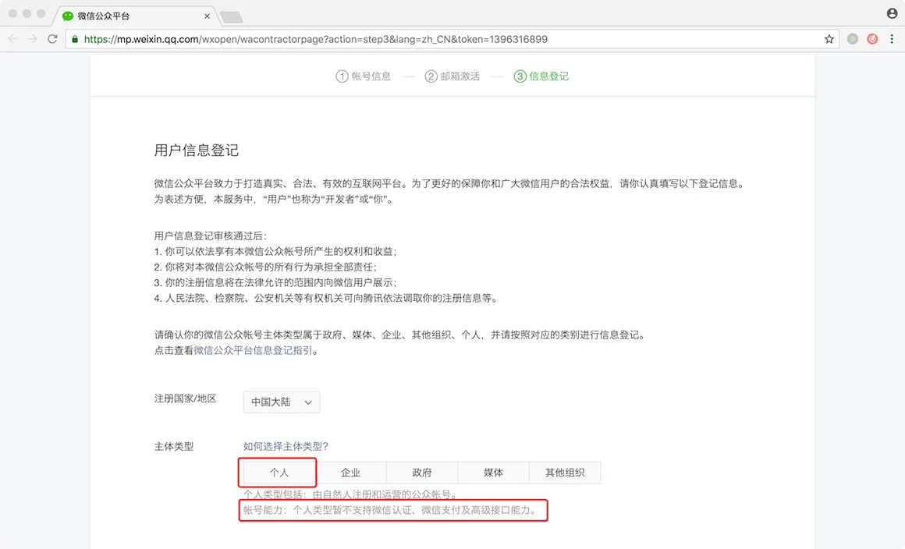
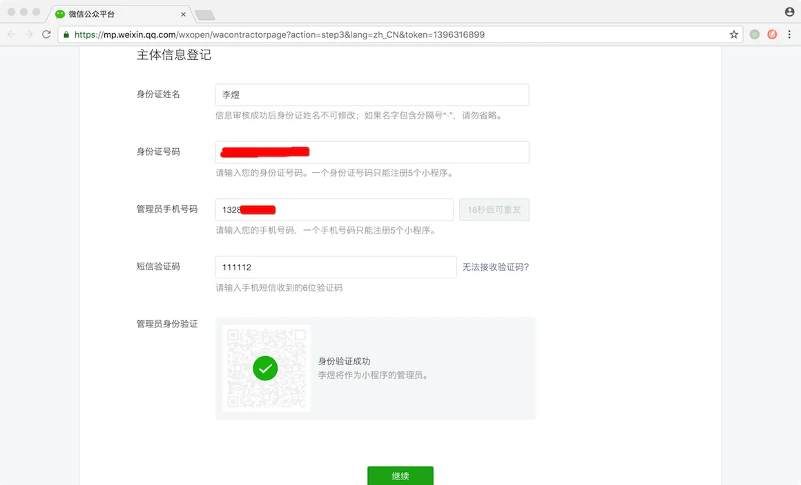
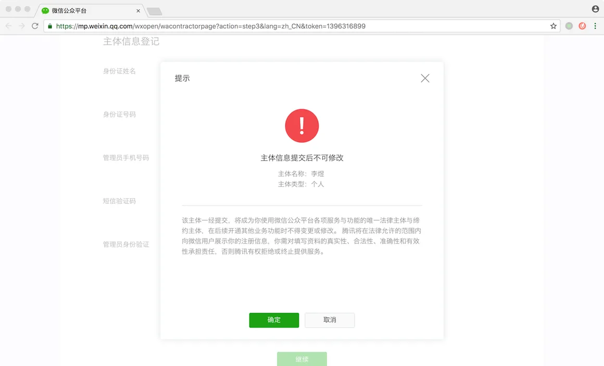
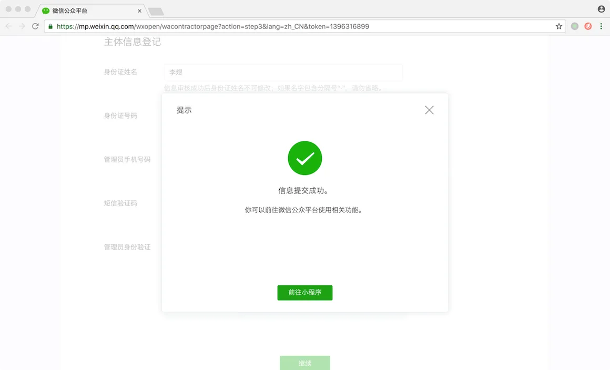
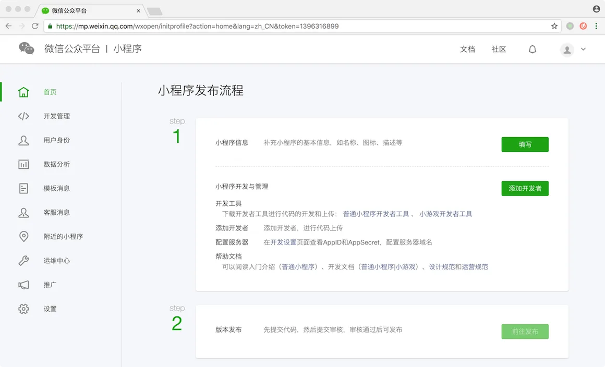

# 2.6. 小程序个人账号申请

原文链接：https://learnku.com/courses/laravel-weapp/1.7/applet-personal-account-application/1433

本教程最新版为 [2.1](https://learnku.com/courses/laravel-weapp/2.1)，当前版本已放弃维护，请阅读最新版本！

## 小程序个人账号申请

要开发微信小程序，首先需要申请小程序的个人账号。

## 1. 注册账号

登录 [微信公众平台](https://mp.weixin.qq.com/)，点击立即注册：

选择小程序：

填写邮箱及密码信息，注意：

>

作为登录帐号，请填写未被微信公众平台注册，未被微信开放平台注册，未被个人微信号绑定的邮箱。

这里的邮箱需要是未被微信其他平台注册过的邮箱，我们可以单独申请一个邮箱用来注册小程序：

注册成功，微信会发送确认邮件到注册的邮箱：

## 2. 信息登记

去注册邮箱找到微信的确认邮件，点击邮件中的链接，完成邮箱激活：

信息登记页面，`主体类型` 选择 `个人`。注意微信个人类型账户是有限制的：

- 不能申请微信认证；

- 不能使用微信支付；

- 无法为小程序设置门店，不能在附近的小程序中展示；

本教程是为 LaraBBS 开发微信小程序，不涉及上面的功能，所以注册个人类型即可：

填写个人主体信息，包括姓名，身份证及手机号，手机号需要通过短信验证，最后使用微信扫描二维码后点击继续：

主体信息提交过后是不能修改的，点击确定后注册完成：

点击前往小程序，我们会进入小程序的管理界面：

至此我们成功完成了微信小程序的个人账号申请。

>

注意：『小程序信息』和『添加开发者』不用填写将不会影响接下来我们的开发，我们会等到最后章节里发布小程序时，再来填写这些信息。

接下来开始介绍微信开发者工具。
