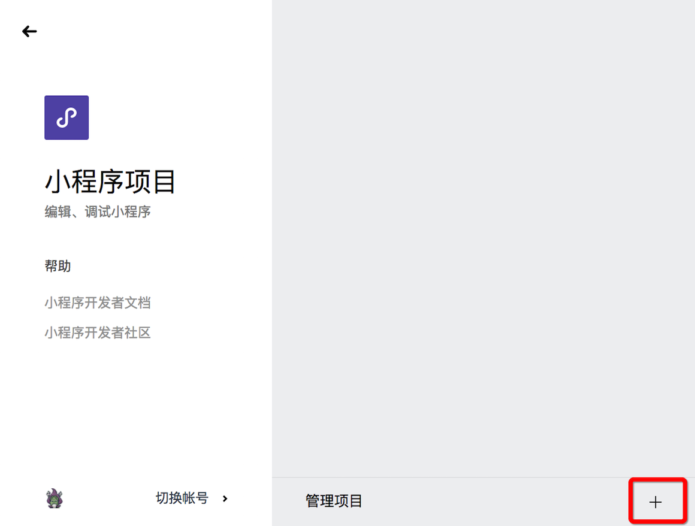
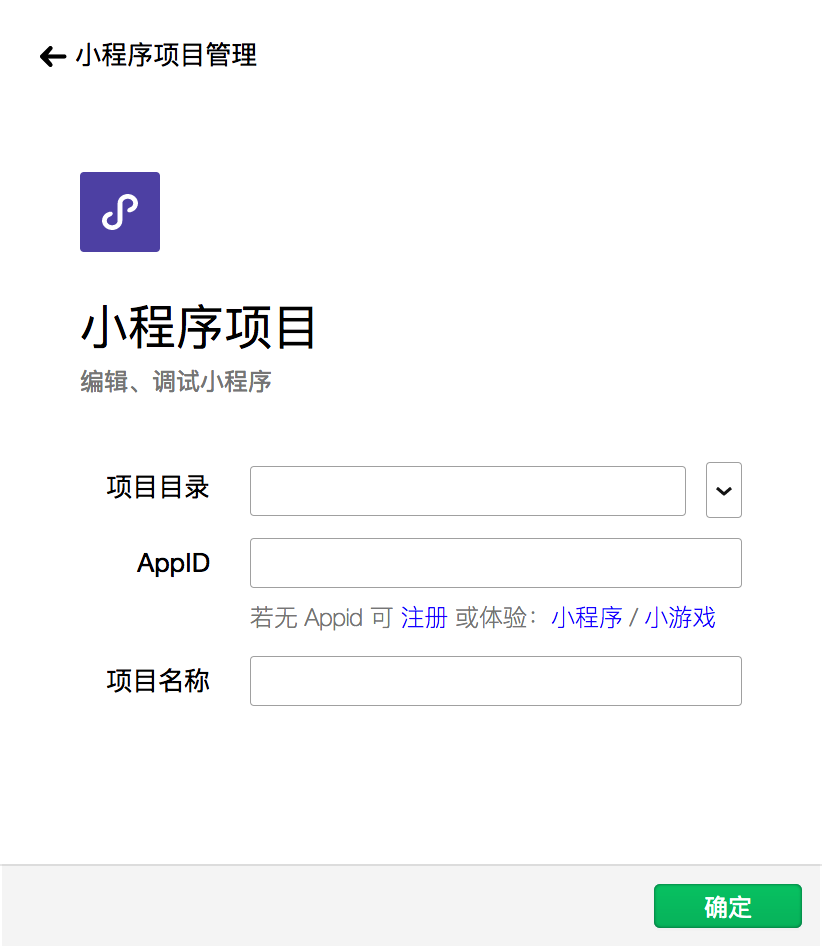
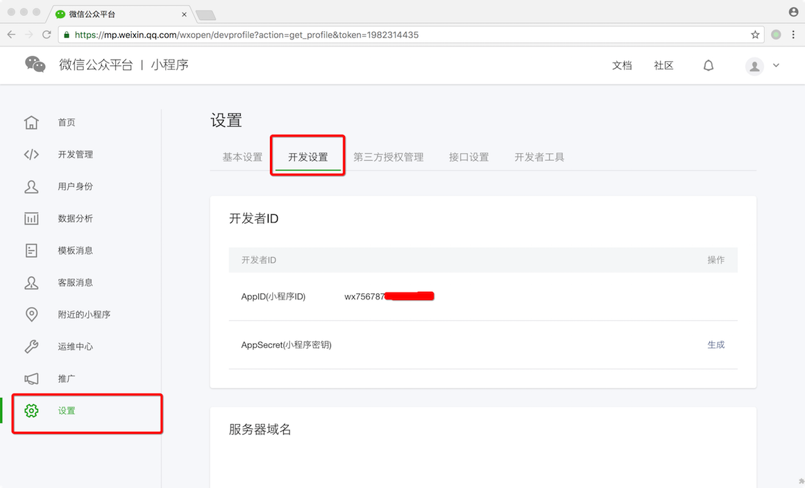
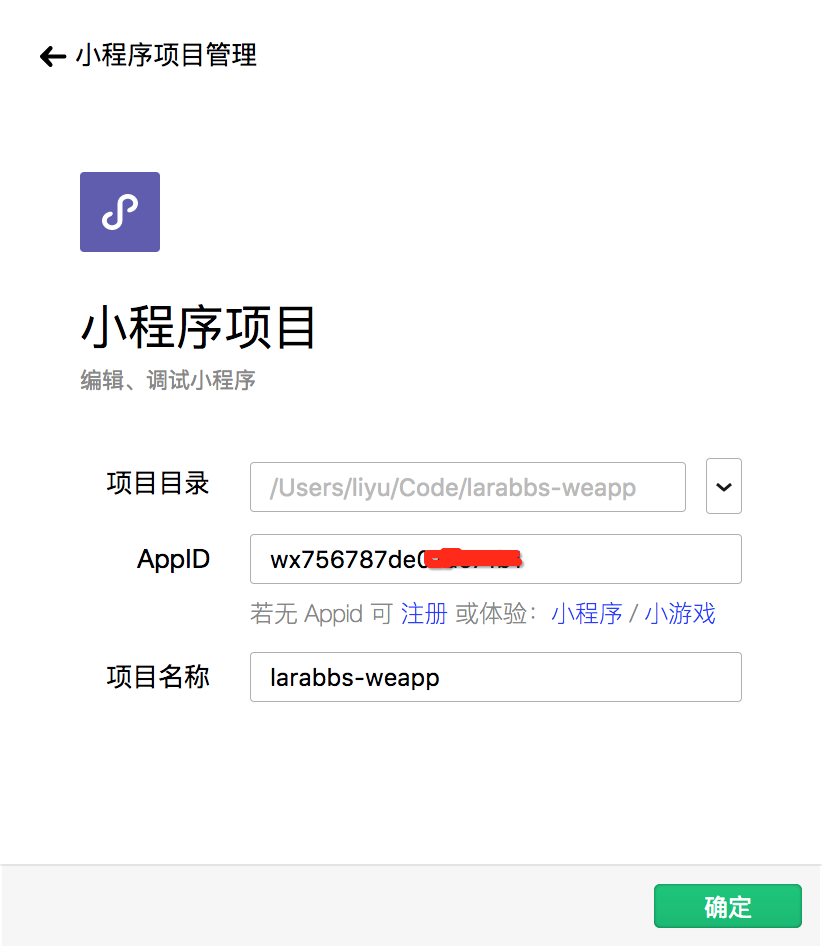
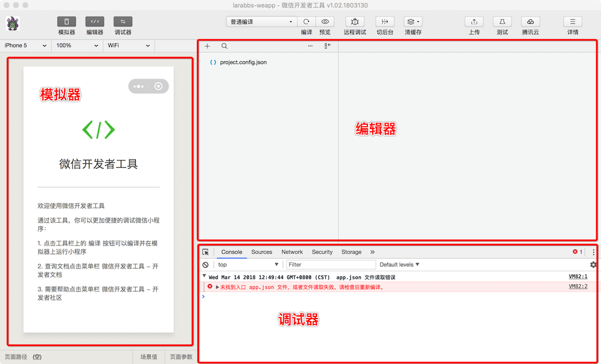
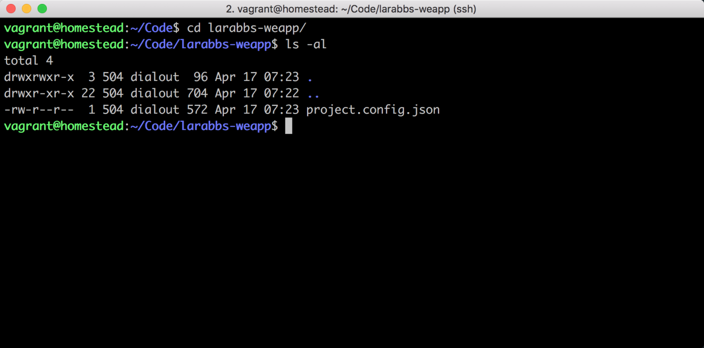

# 2.7. 项目初始化

原文链接：https://learnku.com/courses/laravel-weapp/1.7/introduction-of-wechat-developer-tools/1434

本教程最新版为 [2.1](https://learnku.com/courses/laravel-weapp/2.1)，当前版本已放弃维护，请阅读最新版本！

## 微信开发者工具介绍

[微信开发者工具](https://mp.weixin.qq.com/debug/wxadoc/dev/devtools/download.html) 是官方发布的微信开发 SDK，可以帮助我们简单、高效地开发和调试小程序。

本小节中，我们将带你安装和配置微信开发者工具，并从这里开始开发我们的  `larabbs-weapp` 项目。

## 1. 安装开发者工具

微信开发者工具目前只有 Windows 版和 Mac 版，在 [这里](https://mp.weixin.qq.com/debug/wxadoc/dev/devtools/download.html) 下载你需要的版本，直接安装即可。

>

尽量保持微信开发者工具为最新版本，避免因为工具的原因造成误解。本教程使用的是 Mac 版本的开发者工具进行演示，可能某些地方会与 Windows 的不一致，如果有疑惑，可以直接在课程下方进行提问。

安装成功后，打开微信开发者工具，使用微信扫描二维码登录，然后选择小程序项目。


## 2. 新建小程序项目

我们会进入小程序项目的管理界面，点击加号添加项目。



可以看到添加项目需要一个项目目录，小程序 AppID，以及项目名称。



接下来我们需前往 [微信小程序控制台](https://mp.weixin.qq.com/wxopen/initprofile?action=home&lang=zh_CN) 获取 `AppID`，使用上一节注册的个人小程序账号登录微信公众平台，进入『设置』->『开发设置』，即可看到小程序的 `AppID`。



选择 `larabbs-weapp` 目录，填写 `AppID` 和 `项目名称`：



>

如果是在 Windows 环境下进行开发，这里可能会添加不成功，遇到报错 『请选择空目录或含 app.json / project.config.json 的目录创建项目』，原因可能是 Windows 版本的开发者工具并未自动忽略目录中的 `.git` 目录，这时可以执行以下命令 `$ mv ~/Code/larabbs-weapp/.git ~/Code/larabbs.git` 将 .git 目录暂时移出目录，点击确定添加成功后，再执行 `$ mv ~/Code/larabbs.git ~/Code/larabbs-weapp/.git` 命令，将 .git 目录移回目录。

创建成功后我们会看到如下界面：



再使用以下命令看看开发者工具生成了什么：

```
$ ls -al
```

输出结果如下：



由于没有创建模板代码，所以现在是个空项目，项目中只有开发者工具为我们生成的 `project.config.json` 工具配置文件，我们在开发者工具上做的任何配置都会写入到这个文件，当我们重新安装工具或者换电脑工作时，这个配置文件可以方便我们恢复之前的工具配置。

微信开发者工具针对小程序项目主要有以下几个区域：

- 模拟器 —— 可以模拟不同手机，不同屏幕大小，在线断网等情况；

- 编辑器 —— 直接编辑代码，保存后可自动编译生效；

- 调试器 —— 进行程序调试，网络请求等代码调试，类似浏览器的开发者工具；

## 代码版本控制

```
$ cd ~/Code/larabbs-weapp
$ git add -A
$ git commit -m 'add project.config.json'
$ git push -u origin master
```
