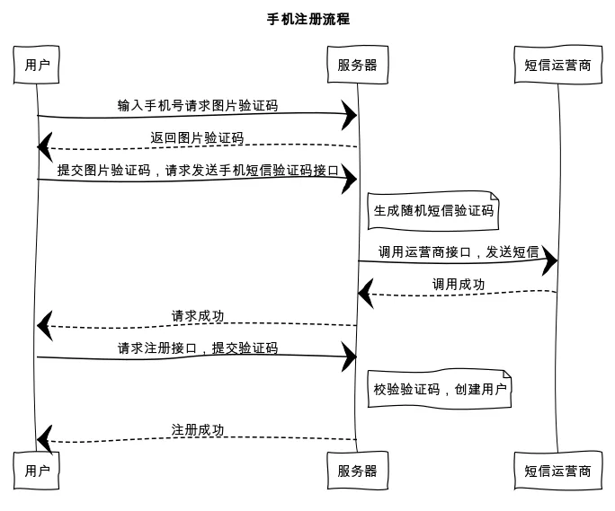
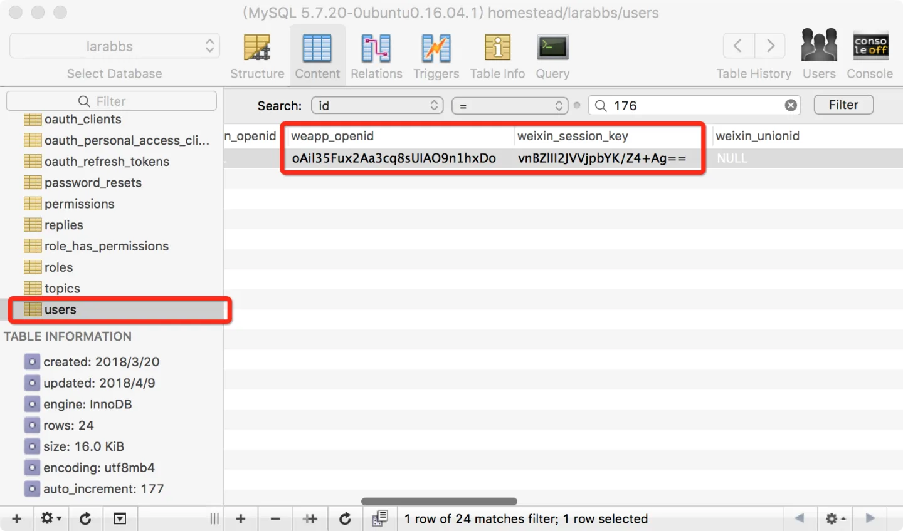
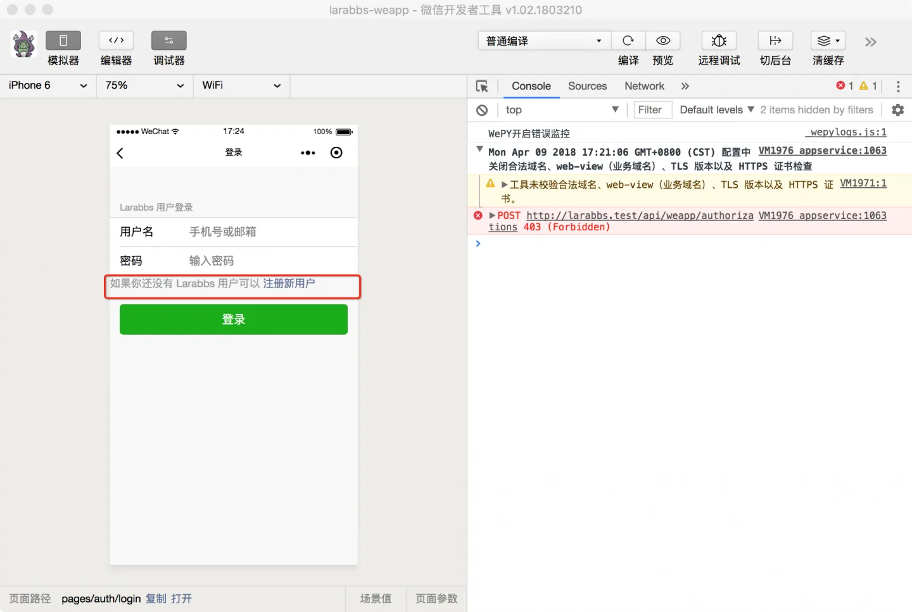
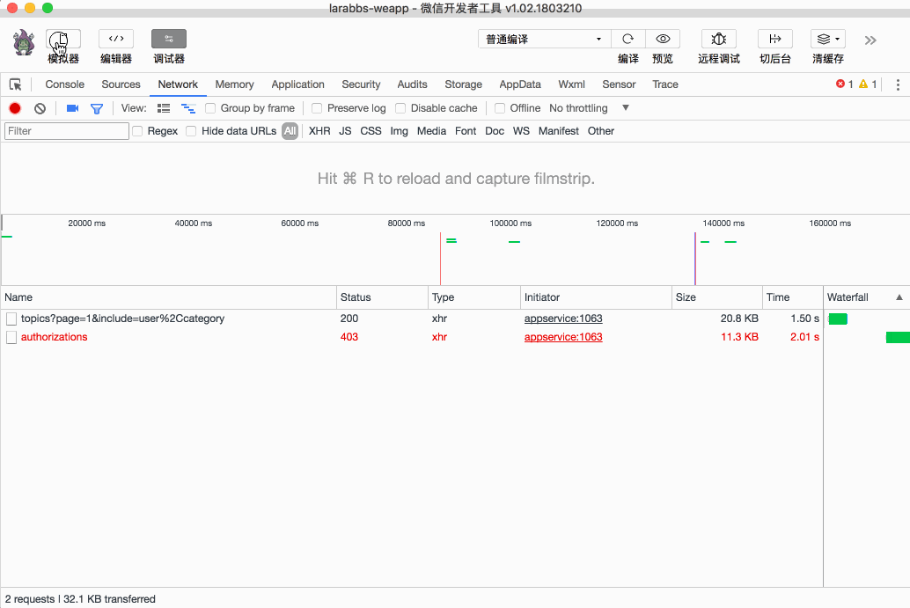

# 5.2. 获取图片验证码

原文链接：https://learnku.com/courses/laravel-weapp/1.7/get-picture-verification-code/1570

本教程最新版为 [2.1](https://learnku.com/courses/laravel-weapp/2.1)，当前版本已放弃维护，请阅读最新版本！

## 获取图片验证码

回忆一下手机注册的完整流程：



1. 用户输入手机号，请求图片验证码接口；

2. 服务器返回图片验证码；

3. 使用正确的图片验证码，请求短信验证码；

4. 服务器调用短信运营商的接口，发送短信至用户手机；

5. 通过正确的短信验证码，请求用户注册接口；

6. 完成注册流程。

这一节我们来完成流程 1 和 2 两个步骤，输入手机号，返回图片验证码的功能。但是首先需要将数据库中用户的 opneId 清空，因为上一章登录功能，openId 已经绑定在一个用户上了。



## 注册页面

```
$ cd ~/Code/larabbs-weapp
$ touch src/pages/auth/register.wpy
```

在 app.wpy 中注册页面：

src/app.wpy

```
.
.
.
pages: [
.
.
.
'pages/auth/register'
],
.
.
.
```

在登录页面中，在登录按钮上面增加注册页面链接，如果用户还没有账户可以跳转到注册页面：

src/pages/auth/login.wpy

```
.
.
.
<view class="weui-agree__text">
如果你还没有 Larabbs 用户可以 <navigator url="/pages/auth/register" class="weui-agree__link">注册新用户</navigator>
</view>

<view class="weui-btn-area">
<button class="weui-btn" type="primary" @tap="submit">登录</button>
</view>
.
.
.
```



## 修改页面

src/pages/auth/register.wpy

```
<style lang="less">
.register-wrap {
margin-top: 50px;
}
.error-message {
color: #E64340;
}
</style>
<template>
<view class="page">
<view class="page__bd register-wrap">
<form bindsubmit="submit">
<view class="weui-toptips weui-toptips_warn" wx:if="{{ errorMessage }}">{{ errorMessage }}</view>

<view class="weui-cells__title">Larabbs 手机注册</view>

<view class="weui-cells__title {{ errors.phone ? 'weui-cell_warn' : ''}}">手机号</view>
<view class="weui-cells weui-cells_after-title">
<view class="weui-cell weui-cell_input {{ errors.phone ? 'weui-cell_warn' : ''}}">
<view class="weui-cell__bd">
<input disabled="{{ phoneDisabled }}" class="weui-input" type="number" placeholder="请输入手机号" @input="bindPhoneInput"/>
</view>
<view class="weui-cell__ft">
<icon wx:if="{{ errors.phone }}" type="warn" size="23" color="#E64340"></icon>
<view class="weui-vcode-btn" @tap="tapCaptchaCode">获取验证码</view>
</view>
</view>
</view>
<view wx:if="{{ errors.phone }}" class="weui-cells__tips error-message">{{ errors.phone[0] }}</view>

<view class="weui-btn-area">
<button class="weui-btn" type="primary" formType="submit">注册</button>
</view>
</form>

<!-- 验证码输入模态框 -->
<modal class="modal" hidden="{{ captchaModalHidden }}" no-cancel bindconfirm="sendVerificationCode">
<view wx:if="{{ errors.captchaValue }}" class="weui-cells__tips error-message">{{ errors.captchaValue[0] }}</view>
<view class="weui-cell weui-cell_input weui-cell_vcode">
<view class="weui-cell__bd">
<input class="weui-input" placeholder="图片验证码" @input="bindCaptchaCodeInput"/>
</view>
<view class="weui-cell__ft">
<image class="weui-vcode-img" @tap="tapCaptchaCode" src="{{ captcha.imageContent }}" style="width: 100px"></image>
</view>
</view>
</modal>

</view>
</view>
</template>

<script>
import wepy from 'wepy'
import api from '@/utils/api'

export default class Login extends wepy.page {
config = {
navigationBarTitleText: '注册'
}
data = {
// 手机号
phone: null,
// 手机号 input 是否 disabled
phoneDisabled: false,
// 图片验证码 modal 是否显示
captchaModalHidden: true,
// 用户输入的验证码
captchaValue: null,
// 图片验证码 key 及过期时间
captcha: {},
// 表单错误
errors: {}
}
// 获取图片验证码
async getCaptchaCode() {
this.errors.phone = null

// 判断手机号是否正确
if (!(/^1[34578]\d{9}$/.test(this.phone))) {
this.errors.phone = ['请输入正确的手机号']
this.$apply()
return false
}

try {
// 调用发送验证码接口，参数为手机号
let captchaResponse = await api.request({
url: 'captchas',
method: 'POST',
data: {
phone: this.phone
}
})

// 表单错误
if (captchaResponse.statusCode === 422) {
this.errors = captchaResponse.data.errors
this.$apply()
}

// 记录 key 和过期时间，打开 modal
if (captchaResponse.statusCode === 201) {
this.captcha = {
key: captchaResponse.data.captcha_key,
imageContent: captchaResponse.data.captcha_image_content,
expiredAt: Date.parse(captchaResponse.data.expired_at)
}

// 打开modal
this.captchaModalHidden = false
this.$apply()
}
} catch (err) {
console.log(err)
wepy.showModal({
title: '提示',
content: '服务器错误，请联系管理员'
})
}
}
methods = {
// 绑定手机输入
bindPhoneInput (e) {
this.phone = e.detail.value
},
// 绑定验证码输入
bindCaptchaCodeInput (e) {
this.captchaValue = e.detail.value
},
// 响应获取图片验证码按钮点击事件
async tapCaptchaCode() {
this.getCaptchaCode()
}
}
}
</script>

```

上面的代码中我们使用到了 `form` 和 `modal` 组件：

- [form 组件](http://www.ionic.wang/weixin/component/form.html) 是表单组件，同 HTML 中的 form 表单，需要注意的是要增加 `bindsubmit` 属性，指定提交后回调的方法；

- [modal 组件](http://www.ionic.wang/weixin/component/modal.html) 是模态弹窗，代码中我们使用 `captchaModalHidden` 控制是否显示；需要设置 `bindconfirm` 属性，点击确定后触发的回调方法。

先忽略代码逻辑，统一看一遍代码结构，加强对结构的认识：

```
export default class Login extends wepy.page {
// 配置
config = {}
// 供模板数据绑定的数据
data = {}
// 获取验证码
async getCaptchaCode() {}
methods = {
// 用户输入手机事件处理
bindPhoneInput (e) {}
// 用户输入验证码事件处理
bindCaptchaCodeInput (e) {}
// 点击获取验证码事件处理
async tapCaptchaCode() {
}
}
```

这一节我们先完成输入手机号获取图片验证码的功能，所以表单中暂时只有手机号的输入框。分析一下代码逻辑：

1. 点击 `获取验证码` 会调用 `tapCaptchaCode` 方法，该方法直接调用 `getCaptchaCode`，因为获取图片验证码的逻辑不只有用户主动触发，也有可能主动调用，例如图片验证码输入错误后主动刷新，所以需要在 `methods` 外部定义一个 `getCaptchaCode`，方便程序内部调用；

2. 输入手机号后，使用 `/^1[345789]\d{9}$/.test(this.phone)` JS 的正则匹配方法 `test` ，判断手机号是否匹配正则表达式 `^1[34578]\d{9}$`；

3. 请求 `获取图片验证码` 接口，如果手机号已经被使用，则给出错误提示；

4. 输入未被使用的手机号，请求到图片验证码，设置在  `this.captcha` 中，打开图片验证码模态框。

## 开发者工具调试

- 如果用户输入的手机号不正确会给出错误提示；

- 如果手机号已存在，则提示用户已存在；

- 输入正确的手机号后会打开 `modal`，显示验证码：



可以正确的获取图片验证码信息，打开模态框，下一节我们会继续完成输入图片验证码获取手机验证码的功能。

## 代码版本控制

```
$ cd ~/Code/larabbs-weapp
$ git add -A
$ git commit -m 'get captcha code'
```
