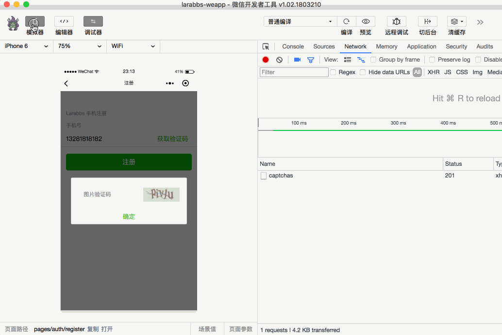

# 5.3. 获取手机短信验证码

原文链接：https://learnku.com/courses/laravel-weapp/1.7/get-mobile-phone-verification-code/1571

本教程最新版为 [2.1](https://learnku.com/courses/laravel-weapp/2.1)，当前版本已放弃维护，请阅读最新版本！

## 获取手机验证码

接着上一节，我们已经获取了图片验证码，现在需要输入正确的验证码，给目标手机发送短信验证码。

## 修改代码

用户输入图片验证码需要依次执行如下逻辑：

1. 判断用户是否输入验证码，没有输入给出提示；

2. 我们已经存储了图片验证码的有效期，如果验证码已经过期则重置整个流程；

3. 用户输入验证码后，请求接口，验证码错误提示用户，并自动重新获取一个验证码图片；

4. 输入正确的验证码后，记录下来短信验证码相关的信息。

src/pages/auth/register.wpy

```
.
.
.
data = {
.
.
.
// 表单错误
errors: {},
// 短信验证码 key 及过期时间
verificationCode: {}
}
// 重置注册流程，初始化 data 数据
resetRegister() {
this.captchaModalHidden = true
this.phoneDisabled = false
this.captcha = {}
this.verificationCode = {}
this.errors = {}
}
.
.
.
methods = {
.
.
.
// 响应获取图片验证码按钮点击事件
async tapCaptchaCode() {
this.getCaptchaCode()
},
// 发送短信验证码
async sendVerificationCode() {
if (!this.captchaValue) {
this.errors.captchaValue = ['请输入图片验证码']
return false
}

// 检查验证码是否过期，重置流程
if (new Date().getTime() > new Date(this.captcha.expiredAt).getTime()) {
wepy.showToast({
title: '验证码已过期',
icon: 'none',
duration: 2000
})
this.resetRegister()
return false
}

try {
let codeResponse = await api.request({
url: 'verificationCodes',
method: 'POST',
data: {
captcha_key: this.captcha.key,
captcha_code: this.captchaValue
}
})

// 验证码错误提示
if (codeResponse.statusCode === 401) {
this.errors.captchaValue = ['图片验证码错误']
this.$apply()
await this.getCaptchaCode()
return false
}

// 记录 key 和 过期时间
if (codeResponse.statusCode === 201) {
this.verificationCode = {
key: codeResponse.data.key,
expiredAt: Date.parse(codeResponse.data.expired_at)
}

// 关闭modal
this.captchaModalHidden = true
// 手机输入框 disabled
this.phoneDisabled = true
// 清空报错信息
this.errors = {}
this.$apply()
}
} catch (err) {
console.log(err)
wepy.showModal({
title: '提示',
content: '服务器错误，请联系管理员'
})
}
}
}
.
.
.
```

为了完成上述几个功能：

1. 首先在 `data` 中定义 `verificationCode`，用来存储最后获取的短信验证码数据；

2. 在 `methods` 中定义 `sendVerificationCode` 方法，`modal` 框点击确认的时候会触发该方法；

3. `sendVerificationCode` 中根据 `this.captcha.expiredAt` 判断验证码是否过期；

4. 图片验证码是有时效性的，过期说明用户获取验证码后很长时间都没有操作，那么调用 `resetRegister` 方法初始化所有数据，让用户从新开始注册流程；

5. 请求接口成功后，隐藏 `modal` 框，记录短信验证码相关的信息，`key` 以及过期时间，记录到 `this.verificationCode` 中。

## 开发者工具调试

输入错误的验证码后，会提示验证码错误，并自动刷新验证码图片；输入正确的验证码后 `modal` 关闭。



## 代码版本控制

```
$ cd ~/Code/larabbs-weapp
$ git add -A
$ git commit -m 'get verification code'
```
