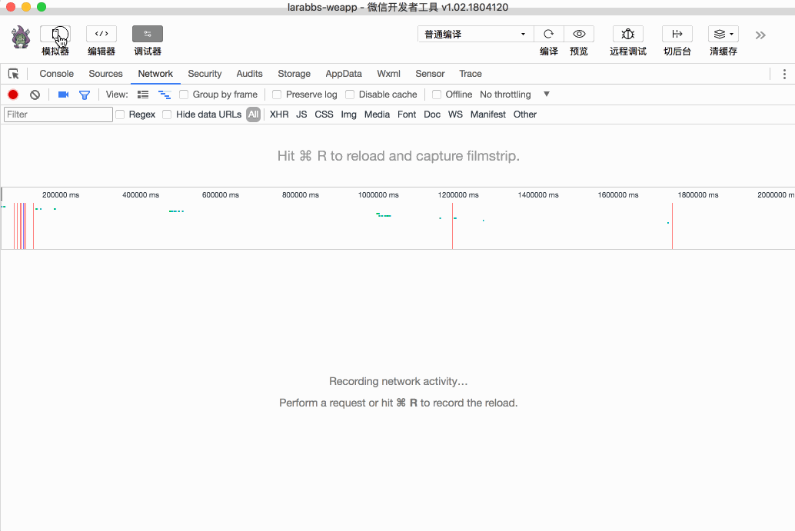
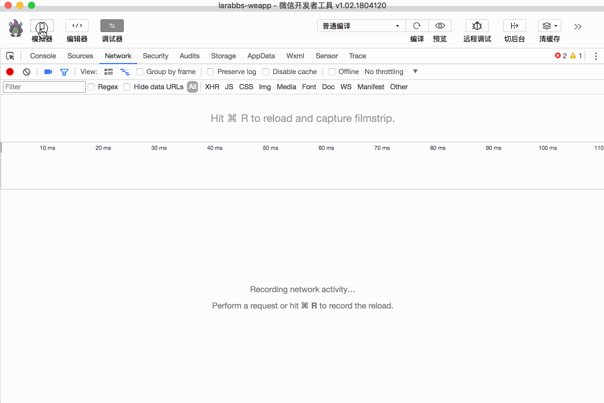

# 5.4. 手机注册页面

原文链接：https://learnku.com/courses/laravel-weapp/1.7/mobile-phone-registration-page/1572

本教程最新版为 [2.1](https://learnku.com/courses/laravel-weapp/2.1)，当前版本已放弃维护，请阅读最新版本！

## 手机注册页面

接着前面两节课的内容，我们已经由手机号获取了图片验证码，由图片验证码获取了短信验证码，接下来我们完成最后的步骤——提交用户姓名，密码，短信验证码注册用户。

## 修改代码

src/pages/auth/register.wpy

```
.
.
.
<form bindsubmit="submit">
<view class="weui-toptips weui-toptips_warn" wx:if="{{ errorMessage }}">{{ errorMessage }}</view>

<view class="weui-cells__title">Larabbs 手机注册</view>

<!-- 手机号  -->
<view class="weui-cells__title {{ errors.phone ? 'weui-cell_warn' : ''}}">手机号</view>
<view class="weui-cells weui-cells_after-title">
<view class="weui-cell weui-cell_input {{ errors.phone ? 'weui-cell_warn' : ''}}">
<view class="weui-cell__bd">
<input disabled="{{ phoneDisabled }}" class="weui-input" type="number" placeholder="请输入手机号" @input="bindPhoneInput"/>
</view>
<view class="weui-cell__ft">
<icon wx:if="{{ errors.phone }}" type="warn" size="23" color="#E64340"></icon>
<view class="weui-vcode-btn" @tap="tapCaptchaCode">获取验证码</view>
</view>
</view>
</view>
<view wx:if="{{ errors.phone }}" class="weui-cells__tips error-message">{{errors.phone[0]}}</view>

<!-- 短信验证码  -->
<view class="weui-cells__title {{ errors.verification_code ? 'weui-cell_warn' : ''}}">短信验证码</view>
<view class="weui-cells weui-cells_after-title">
<view class="weui-cell weui-cell_input {{ errors.verification_code ? 'weui-cell_warn' : ''}}">
<view class="weui-cell__bd">
<input class="weui-input" placeholder="请输入短信验证码" name="verification_code" />
</view>
<view class="weui-cell__ft">
<icon wx:if="{{ errors.verification_code }}" type="warn" size="23" color="#E64340"></icon>
</view>
</view>
</view>
<view wx:if="{{ errors.verification_code }}" class="weui-cells__tips error-message">{{errors.verification_code[0]}}</view>

<!-- 姓名 -->
<view class="weui-cells__title {{ errors.name ? 'weui-cell_warn' : ''}}">姓名</view>
<view class="weui-cells weui-cells_after-title">
<view class="weui-cell weui-cell_input {{ errors.name ? 'weui-cell_warn' : ''}}">
<view class="weui-cell__bd">
<input class="weui-input" placeholder="请输入姓名" name="name" />
</view>
<view class="weui-cell__ft">
<icon wx:if="{{ errors.name }}" type="warn" size="23" color="#E64340"></icon>
</view>
</view>
</view>
<view wx:if="{{ errors.name }}" class="weui-cells__tips error-message">{{errors.name[0]}}</view>

<!-- 密码 -->
<view class="weui-cells__title {{ errors.password ? 'weui-cell_warn' : ''}}">密码</view>
<view class="weui-cells weui-cells_after-title">
<view class="weui-cell weui-cell_input {{ errors.password ? 'weui-cell_warn' : ''}}">
<view class="weui-cell__bd">
<input class="weui-input" placeholder="请输入密码" name="password" type="password"/>
</view>
<view class="weui-cell__ft">
<icon wx:if="{{ errors.password }}" type="warn" size="23" color="#E64340"></icon>
</view>
</view>
</view>
<view wx:if="{{ errors.password }}" class="weui-cells__tips error-message">{{ errors.password[0] }}</view>

<view class="weui-btn-area">
<button class="weui-btn" type="primary" formType="submit">注册</button>
</view>
</form>
.
.
.
// 重置注册流程，初始化 data 数据
resetRegister() {
.
.
.
}
// 表单提交
async submit (e) {
this.errors = {}
// 检查验证码是否已发送
if (!this.verificationCode.key) {
wepy.showToast({
title: '请发送验证码',
icon: 'none',
duration: 2000
})
return false
}
// 检查验证码是否过期
if (new Date().getTime() > this.verificationCode.expiredAt) {
wepy.showToast({
title: '验证码已过期',
icon: 'none',
duration: 2000
})
this.resetRegister()
return false
}

try {
let formData = e.detail.value
formData.verification_key = this.verificationCode.key

let loginData = await wepy.login()
// 参数中增加code，用于获取 openid 绑定当前用户
formData.code = loginData.code

let registerResponse = await api.request({
url: 'weapp/users',
method: 'POST',
data: formData
})

// 验证码错误
if (registerResponse.statusCode === 401) {
this.errors.verification_code = ['验证码错误']
this.$apply()
}

// 表单错误
if (registerResponse.statusCode === 422) {
this.errors = registerResponse.data.errors
this.$apply()
}

// 注册成功，记录token
if (registerResponse.statusCode === 201) {
wepy.setStorageSync('access_token', registerResponse.data.meta.access_token)
wepy.setStorageSync('access_token_expired_at', new Date().getTime() + registerResponse.data.meta.expires_in * 1000)
// 设置用户信息
wepy.setStorageSync('user', registerResponse.data)

wepy.showToast({
title: '注册成功',
icon: 'success'
})

// 跳转到我的页面
setTimeout(function() {
wepy.switchTab({
url: '/pages/user'
})
}, 2000)
}
} catch (err) {
console.log(err)
wepy.showModal({
title: '提示',
content: '服务器错误，请联系管理员'
})
}
}
.
.
.
```

上面的代码中有以下几个新知识点：

- [showToast](https://developers.weixin.qq.com/miniprogram/dev/api/api-react.html#wxshowtoastobject) —— 显示消息提示框，三个参数：

- title —— 提示的内容；

- icon —— 图标，有三个有效值 `success` 显示成功图标；`loading` 显示加载图标；`none` 不显示图标；

- duration —— 提示的延迟时间，多久之后消失，单位是毫秒。

- 提交表单，当点击 `<form>` 表单中 `formType` 为 `submit` 的 `<button/>` 时会提交这个表单；注意表单提交的处理方法 `submit` 需要定义在 `methods` 外部；

- [switchTab](https://developers.weixin.qq.com/miniprogram/dev/api/ui-navigate.html#wxrelaunchobject) —— 跳转到 `tabBar` 页面，并关闭其他所有非 `tabBar` 页面。

在 from 表单中增加几个输入框，填写短信验证码，用户姓名和密码，主要完成以下逻辑：

1. 检查短信验证码是否过期，过期了调用 `this.resetRegister()` 重置注册流程；

2. 请求接口，验证码错误或者表单错误需要提示给用户；

3. 注册成功后将用户信息和 Token 记录到缓存中，使用 `switchTab` 跳转到 `/pages/user` 页面；

## 开发者工具调试

在 Larabbs 的 `获取短信验证码` 接口中，为了方便测试，默认非正式环境验证码固定为 `123456`。



输入错误的验证码会提示 `验证码错误`，输入正确后注册成功。

退出登陆后，再次进入登录页面，自动触发登录逻辑，因为注册的时候已经完成了小程序用户的绑定，所以会直接登录。



## 代码版本控制

```
$ cd ~/Code/larabbs-weapp
$ git add -A
$ git commit -m 'register'
```
