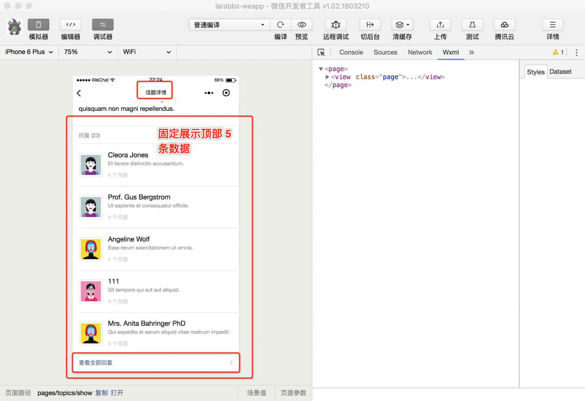
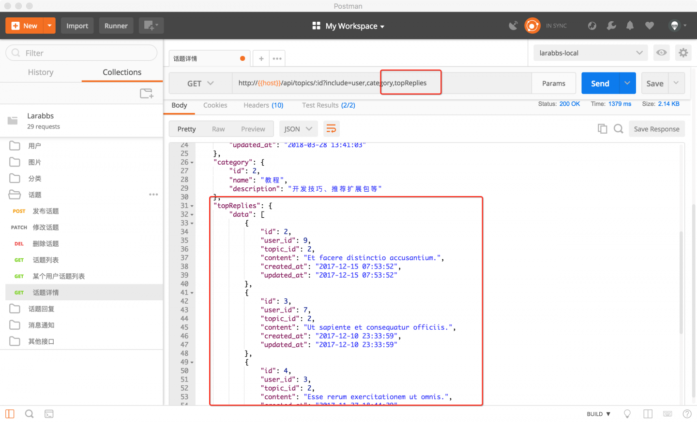
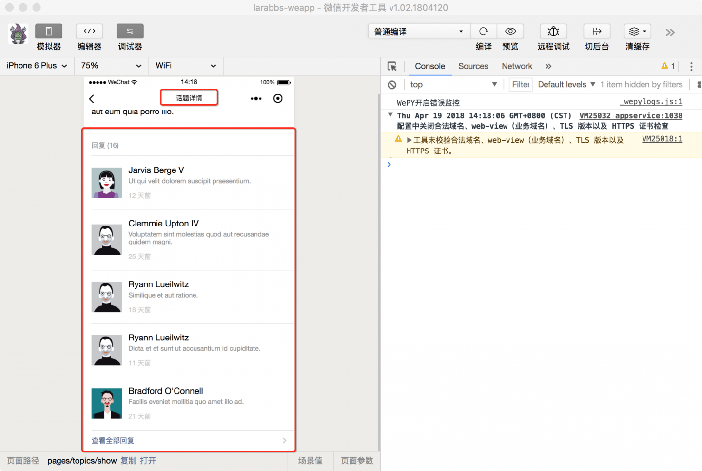
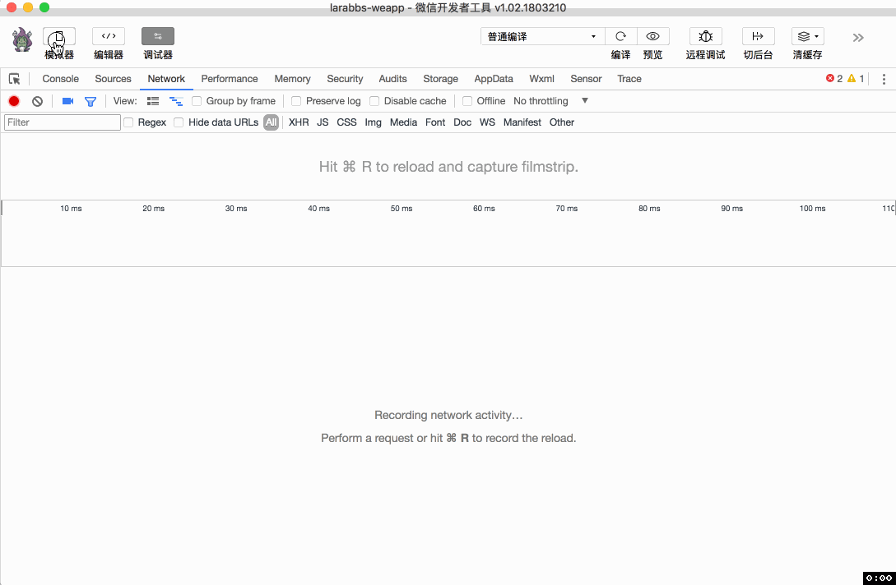

# 8.1. 回复列表

原文链接：https://learnku.com/courses/laravel-weapp/1.7/reply-list/1475

本教程最新版为 [2.1](https://learnku.com/courses/laravel-weapp/2.1)，当前版本已放弃维护，请阅读最新版本！

## 回复列表

话题相关的功能做完了，这一节我们来处理话题回复。

话题的回复是个列表，如何显示回复列表是个产品问题，可以有以下几种设计方式：

1. 考虑话题的回复数据量，如果不是特别大，可以一次性展示话题的所有评论数据；

2. 如果回复数据多，可以用上拉加载更多的方式一页一页加载；

3. 固定展示一部分数据，增加 `查看更多` 链接，点击后跳转到新页面显示回复列表;

从产品的角度还有很多种设计，都是可以，本教程选择第三种，在话题详情中固定展示最近的 5 条，底部增加 增加 `查看全部回复`  链接，如下图所示。



## 调整 Larabbs 接口

首先我们需要话题的 5 条回复数据，修改 LaraBBS 中的 `TopicTransformer`，增加一个 `include` 参数 `topReplies`：

app/Transformers/TopicTransformer.php

```
.
.
.
protected $availableIncludes = ['user', 'category', 'topReplies'];
.
.
.
public function includeTopReplies(Topic $topic)
{
return $this->collection($topic->topReplies, new ReplyTransformer());
}
.
.
.
```

我们增加了一个 `topReplies` 参数，增加了对应的方法 `includeTopReplies`，返回 `$topic->topReplies` 集合。

app/Models/Topic.php

```
.
.
.
public function replies()
{
return $this->hasMany(Reply::class);
}

public function topReplies()
{
return $this->replies()->limit(5);
}
.
.
.
```

在话题模型中增加 `topReplies` 方法，获取话题顶部的 5 条回复数据。增加代码后就可以通过增加 include 参数  `/api/topics/:id?include=topReplies` 获取话题的部分回复数据了。

使用 PostMan 调试话题详情接口，可以正确获取 `topReplies` 数据：


## 话题详情的回复

### 获取回复数据

修改话题详情页面，获取话题数据的同时获取回复数据 `topReplies`：

/src/pages/topics/show.wpy

```
.
.
.
async getTopic(id) {
try {
let topicResponse = await api.request({
url: 'topics/' + id,
data: {
include: 'user,category,topReplies.user'
}
})
if (topicResponse.statusCode === 200) {
let topic = topicResponse.data

// 格式化 updated_at
topic.updated_at_diff = util.diffForHumans(topic.updated_at)

// 处理回复数据的发布时间
topic.topReplies.data.forEach(function (reply) {
reply.created_at_diff = util.diffForHumans(reply.created_at)
})

this.topic = topic
this.$apply()
}

if (topicResponse.statusCode === 404) {
wepy.navigateBack()
}

return topicResponse
} catch (err) {
console.log(err)
wepy.showModal({
title: '提示',
content: '服务器错误，请联系管理员'
})
}
}
.
.
.
```

修改 `getTopic` 方法，修改 include 参数为增加  `include: 'user,category,topReplies.user'`，获取顶部回复数据以及发布回复的用户数据，获取数据后使用 `util.diffForHumans` 格式化回复的创建时间。

### 调整模板

/src/pages/topics/show.wpy

```
.
.
.
<view class="weui-article">
<rich-text nodes="{{ topic.body }}" bindtap="tap"></rich-text>

<button wx:if="{{ canDelete }}" @tap="deleteTopic" class="weui-btn mini-btn" type="default" size="mini">删除</button>
</view>

<!-- 话题回复 -->
<view class="weui-panel weui-panel_access" wx:if="{{ topic.reply_count }}">
<view class="weui-panel__hd">回复 ({{ topic.reply_count }})</view>
<view class="weui-panel__bd">
<repeat for="{{ topic.topReplies.data }}" wx:key="id" index="index" item="reply">
<view class="weui-media-box weui-media-box_appmsg" hover-class="weui-cell_active">
<navigator class="weui-media-box__hd weui-media-box__hd_in-appmsg" url="/pages/users/show?id={{ reply.user.id }}">
<image class="replyer-avatar weui-media-box__thumb" src="{{ reply.user.avatar }}" />
</navigator>
<view class="weui-media-box__bd weui-media-box__bd_in-appmsg">
<view class="weui-media-box__title">{{ reply.user.name }}</view>
<view class="weui-media-box__desc"><rich-text nodes="{{ reply.content }}" bindtap="tap"></rich-text></view>
<view class="weui-media-box__info">
<view class="weui-media-box__info__meta">{{ reply.created_at_diff }}</view>
</view>
</view>
</view>
</repeat>
</view>
<view class="weui-panel__ft">
<navigator class="weui-cell weui-cell_access weui-cell_link" url="">
<view class="weui-cell__bd">查看全部回复</view>
<view class="weui-cell__ft weui-cell__ft_in-access"></view>
</navigator>
</view>
</view>
.
.
.
```

在话题内容下面增加了回复数据的显示，使用 repeat 组件循环显示 `topic.topReplies.data`。我们使用了 `wx:if="{{ topic.reply_count }}"` 话题的回复数量来判断是否显示回复数据，但是 LaraBBS 中的话题和回复数据是使用 seed 填充进去的，并没有更新话题的 `reply_count` 属性，可能现在所有话题的  `reply_count` 都为 0，我们可以进入 [larabbs.test](http://larabbs.test) 为某个话题添加一些回复，然后打开开发者工具，进入话题详情，应该可以看到回复数据：



## 回复列表

### 注册页面

创建 `pages/replies` 目录，增加话题回复列表页面。

```
$ cd ~/Code/larabbs-weapp
$ mkdir src/pages/replies
$ touch src/pages/replies/index.wpy
```

在 `app.wpy` 中注册页面：

src/app.wpy

```
.
.
.
pages: [
.
.
.
'pages/auth/register',
'pages/replies/index'
],
.
.
.
```

### 增加链接

/src/pages/topics/show.wpy

```
.
.
.
<view class="weui-panel__ft">
<navigator class="weui-cell weui-cell_access weui-cell_link" url="/pages/replies/index?topic_id={{ topic.id }}">
<view class="weui-cell__bd">查看全部回复</view>
<view class="weui-cell__ft weui-cell__ft_in-access"></view>
</navigator>
</view>
</view>
.
.
.
```

在话题详情页面中，修改 `查看全部回复` 的链接为 `/pages/replies/index?topic_id={{ topic.id }}`，将话题 `id` 传入回复列表页面。

### 修改页面

编辑回复里列表页面：

src/pages/replies/index.wpy

```
<style lang="less">
.replyer-avatar {
padding: 4px;
border: 1px solid #ddd;
border-radius: 4px;
width: 50px;
height: 50px;
}
</style>
<template>
<view class="page">
<view class="page__bd">
<view class="weui-panel weui-panel_access">
<view class="weui-panel__bd">
<repeat for="{{ replies }}" wx:key="id" index="index" item="reply">
<view class="weui-media-box weui-media-box_appmsg" hover-class="weui-cell_active">
<navigator class="weui-media-box__hd weui-media-box__hd_in-appmsg" url="/pages/users/show?id={{ reply.user_id }}">
<image class="replyer-avatar weui-media-box__thumb" src="{{ reply.user.avatar }}" />
</navigator>
<view class="weui-media-box__bd weui-media-box__bd_in-appmsg">
<view class="weui-media-box__title">{{ reply.user.name }}</view>
<view class="weui-media-box__desc"><rich-text nodes="{{ reply.content }}" bindtap="tap"></rich-text></view>
<view class="weui-media-box__info">
<view class="weui-media-box__info__meta">{{ reply.created_at_diff }}</view>
</view>
</view>
</view>
</repeat>
<view class="weui-loadmore weui-loadmore_line" wx:if="{{ noMoreData }}">
<view class="weui-loadmore__tips weui-loadmore__tips_in-line">没有更多数据</view>
</view>
</view>
</view>
</view>
</view>
</template>
<script>
import wepy from 'wepy'
import util from '@/utils/util'
import api from '@/utils/api'

export default class replyIndex extends wepy.page {
config = {
// 可以下拉刷新
enablePullDownRefresh: true,
// 页面标题
navigationBarTitleText: '回复列表'
}
data = {
// 回复数据
replies: [],
// 是否有更多数据
noMoreData: false,
// 是否在加载中
isLoading: false,
// 当前页数
page: 1,
// 话题 id
topicId: 0
}
// 获取话题回复
async getReplies(reset = false) {
try {
// 请求话题回复接口
let repliesResponse = await api.request({
url: 'topics/' + this.topicId + '/replies',
data: {
page: this.page,
include: 'user'
}
})

if (repliesResponse.statusCode === 200) {
let replies = repliesResponse.data.data

// 格式化回复创建时间
replies.forEach(function (reply) {
reply.created_at_diff = util.diffForHumans(reply.created_at)
})
// 如果reset不为true则合并 this.replies；否则直接覆盖
this.replies = reset ? replies : this.replies.concat(replies)

let pagination = repliesResponse.data.meta.pagination

// 根据分页数据判断是否有更多数据
if (pagination.current_page === pagination.total_pages) {
this.noMoreData = true
}
this.$apply()
}

return repliesResponse
} catch (err) {
console.log(err)
wepy.showModal({
title: '提示',
content: '服务器错误，请联系管理员'
})
}
}
async onLoad(options) {
// 获取 URL 参数中的 话题id
this.topicId = options.topic_id
this.getReplies()
}
async onPullDownRefresh() {
this.noMoreData = false
this.page = 1
await this.getReplies(true)
wepy.stopPullDownRefresh()
}
async onReachBottom () {
// 如果没有更多数据，或者正在加载，直接返回
if (this.noMoreData || this.isLoading) {
return
}
// 设置为加载中
this.isLoading = true
this.page = this.page + 1
await this.getReplies()
this.isLoading = false
this.$apply()
}
}
</script>

```

回复列表页面的代码逻辑与话题列表基本一致，我们增加了下拉刷新和上拉加载更多，根据 `onLoad` 中传入的话题 id，获取对应话题的回复数据，代码中已添加详细的注释，这里就不再做重复的逻辑解释。

## 开发者工具调试

进入某个话题详情，可以看到回复的 5 条数据，点击 `查看全部回复` 链接，跳转到回复列表页面，查看该话题的所有回复：


## 代码版本控制

```
$ cd ~/Code/larabbs-weapp
$ git add -A
$ git commit -m 'page reply index'
```
