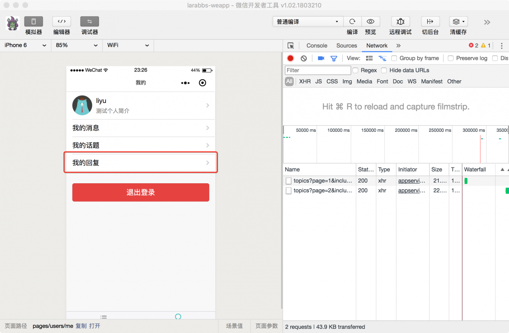
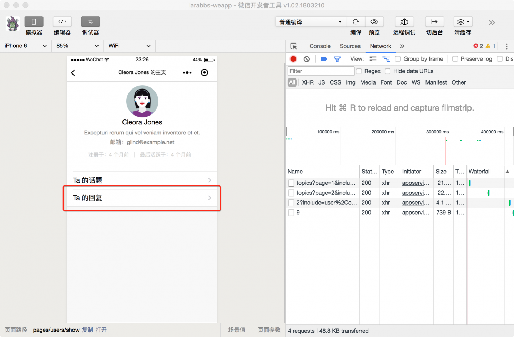
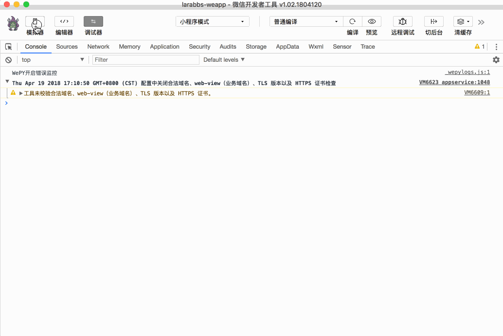

# 8.2. 用户的回复列表

原文链接：https://learnku.com/courses/laravel-weapp/1.7/users-reply-list/1582

本教程最新版为 [2.1](https://learnku.com/courses/laravel-weapp/2.1)，当前版本已放弃维护，请阅读最新版本！

## 用户的回复列表

上一节我们完成了某个话题的回复列表，但是我的所有回复，某个用户的所有回复也需要一个列表展示：




之前的课程，我们已经在 `我的` 页面和 `用户详情页面` 中预留了链接，跳转到一个列表页，展示用户所有的回复信息。用户所有回复和话题回复不同，还需要显示话题的标题，点击标题后可以跳转到话题详情中，我们新建一个页面来处理用户的所有回复。

## 注册页面

创建 `pages/replies` 目录，增加话题列表页面。

```
$ cd ~/Code/larabbs-weapp
$ touch src/pages/replies/userIndex.wpy
```

在 `app.wpy` 中注册页面：

src/app.wpy

```
.
.
.
config = {
pages: [
.
.
.
'pages/replies/index',
'pages/replies/userIndex'
],
.
.
.
```

## 增加链接

修改 `用户详情` 页面，增加链接：
src/pages/users/show.wpy

```
.
.
.
<navigator class="weui-cell weui-cell_access" url="/pages/replies/userIndex?user_id={{ user.id }}">
<view class="weui-cell__bd" url="">
<view class="weui-cell__bd">Ta 的回复</view>
</view>
<view class="weui-cell__ft weui-cell__ft_in-access"></view>
</navigator>
.
.
.
```

修改 `我的` 页面，增加链接，当用户登录的时候，也就是 `user` 数据有值时，才赋值链接，传入参数 `user_id` 为当前登录用户 `id`：
src/pages/users/me.wpy

```
.
.
.
<navigator class="weui-cell weui-cell_access" url="{{ user ? '/pages/replies/userIndex?user_id='+ user.id : '' }}">
<view class="weui-cell__bd" url="">
<view class="weui-cell__bd">我的回复</view>
</view>
<view class="weui-cell__ft weui-cell__ft_in-access"></view>
</navigator>
.
.
.
```

在 `我的` 页面和 `用户详情页面` 中修改之前的链接，跳转到我们刚才添加的用户回复列表页面。

## 修改页面

链接添加好了，下面我们来完成用户回复列表页面的逻辑，相信首先你肯定会发现一个问题，`用户的回复列表` 与 `话题的回复列表`，除了要显示的页面不一样，剩下的逻辑，下拉刷新，上拉加载更多，获取话题数据的逻辑基本都一样。能不能只写一遍逻辑呢？我们可以使用 WePY 提供的 Mixin 混合功能。

### 什么是 Mixin 混合

[Mixin 混合](https://tencent.github.io/wepy/document.html#/?id=mixin-%E6%B7%B7%E5%90%88)可以将组之间的可复用部分抽离，从而在组件中使用混合时，可以将混合的数据，事件以及方法注入到组件之中。混合分为两种：

- 默认式混合 —— 可以简单的理解为页面继承，页面未声明的数据，组件，事件，自定义方法等，会直接使用 Mixin 中定义的，如果页面申明了以上这些，则以页面申明的为准；

- 兼容式混合 —— 针对 methods 中的响应事件，以及小程序页面事件会先调用页面中的函数，页面中和 Mixin 中定义的函数都会执行，只是会先调用页面中的函数，再执行 Mixin 中的函数。

你可能对这个概念还很模糊，不用担心，大家先了解一下定义，下面我们定义一个 Mixin，并应用在 `用户的回复列表` 与 `话题的回复列表`，随着代码实践，你应该会有更加深入的认识。

### 增加 replyMixin

对于 Mixin 我们统一创建在 `src/mixins` 目录中，执行下面的命令，创建 `replyMixin.js`：

```
$ cd ~/Code/larabbs-weapp
$ touch src/mixins/replyMixin.js
```

编辑 `replyMixin.js`：

src/mixins/replyMixin.js

```
import wepy from 'wepy'
import util from '@/utils/util'
import api from '@/utils/api'

export default class ReplyMixin extends wepy.mixin {
data = {
// 回复数据
replies: [],
// 是否有更多数据
noMoreData: false,
// 是否在加载中
isLoading: false,
// 当前页数
page: 1
}
// 获取话题回复
async getReplies(reset = false) {
try {
// 请求话题回复接口
let repliesResponse = await api.request({
url: this.requestData.url,
data: {
page: this.page,
include: this.requestData.include || 'user'
}
})

if (repliesResponse.statusCode === 200) {
let replies = repliesResponse.data.data

// 格式化回复创建时间
replies.forEach(function (reply) {
reply.created_at_diff = util.diffForHumans(reply.created_at)
})
// 如果reset不为true则合并 this.replies；否则直接覆盖
this.replies = reset ? replies : this.replies.concat(replies)

let pagination = repliesResponse.data.meta.pagination

// 根据分页数据判断是否有更多数据
if (pagination.current_page === pagination.total_pages) {
this.noMoreData = true
}
this.$apply()
}

return repliesResponse
} catch (err) {
console.log(err)
wepy.showModal({
title: '提示',
content: '服务器错误，请联系管理员'
})
}
}
async onPullDownRefresh() {
this.noMoreData = false
this.page = 1
await this.getReplies(true)
wepy.stopPullDownRefresh()
}
async onReachBottom () {
// 如果没有更多数据，或者正在加载，直接返回
if (this.noMoreData || this.isLoading) {
return
}
// 设置为加载中
this.isLoading = true
this.page = this.page + 1
await this.getReplies()
this.isLoading = false
this.$apply()
}
}

```

你会发现 replyMixin 中的逻辑基本就是 `回复列表`（pages/replies/index.wpy）中的逻辑，区别是：

1. replyMixin 文件不是页面，所以后缀为 `.js` 而非 `.wpy`；

2. replyMixin 继承的是 `wepy.mixin`—— `export default class ReplyMixin extends wepy.mixin`

3. `getReplies` 是获取话题回复数据的方法，因为不同的页面请求的接口地址不同，请求使用的 include 参数也可能不同，所以这里使用 `this.requestData`，每个页面需要自己赋值 `request.url` 属性；也可以使用不同的 include 参数 `request.include` 默认只有用户数据。

除了这些区别外，跟写一个页面没什么区别，就像是把页面中 JS 的逻辑抽离出来了，然后被塞进了某个页面，混合在了一起。

### 修改用户回复列表

应用 replyMixin 到回复列表中：
src/pages/replies/userIndex.wpy

```
<style lang="less">
.replyer-avatar {
padding: 4px;
border: 1px solid #ddd;
border-radius: 4px;
width: 50px;
height: 50px;
}
</style>
<template>
<view class="page">
<view class="page__bd">
<view class="weui-panel weui-panel_access">
<view class="weui-panel__bd">
<repeat for="{{ replies }}" wx:key="id" index="index" item="reply">
<view class="weui-media-box weui-media-box_appmsg" hover-class="weui-cell_active">
<view class="weui-media-box__hd weui-media-box__hd_in-appmsg">
<image class="replyer-avatar weui-media-box__thumb" src="{{ reply.user.avatar }}" />
</view>
<navigator class="weui-media-box__bd weui-media-box__bd_in-appmsg" url="/pages/topics/show?id={{ reply.topic_id }}">
<view class="weui-media-box__title">{{ reply.topic.title }}</view>
<view class="weui-media-box__desc"><rich-text nodes="{{ reply.content }}" bindtap="tap"></rich-text></view>
<view class="weui-media-box__info">
<view class="weui-media-box__info__meta">{{ reply.created_at_diff }}</view>
</view>
</navigator>
</view>
</repeat>
<view class="weui-loadmore weui-loadmore_line" wx:if="{{ noMoreData }}">
<view class="weui-loadmore__tips weui-loadmore__tips_in-line">没有更多数据</view>
</view>
</view>
</view>
</view>
</view>
</template>
<script>
import wepy from 'wepy'
import replyMixin from '@/mixins/replyMixin'

export default class replyUserIndex extends wepy.page {
config = {
enablePullDownRefresh: true,
navigationBarTitleText: '用户回复列表'
}
mixins = [replyMixin]
data = {
requestData: {},
include: 'user,topic'
}
async onLoad(options) {
this.requestData.url = 'users/' + options.user_id + '/replies'
this.requestData.include = 'user,topic'
this.getReplies()
}
}
</script>

```

分析一下页面逻辑：

1. 引入 `replyMixin` —— `import replyMixin from '@/mixins/replyMixin'`；

2. 使用 `replyMixin` —— `mixins = [replyMixin]`；

3. 定义 `requestData` 数据，`onLoad` 根据传入的用户 `id` 拼接接口 URL；`include` 包含用户以及回复所在话题数据。

页面模板基本上同 `话题回复列表` 页面，但是由于使用了 Mixin 代码逻辑简化了很多，是不是很方便呢。

### 修改话题回复列表

`话题回复列表页` 面同样可以使用 `replyMixin`：

src/pages/replies/index.wpy

```
.
.
.
<script>
import wepy from 'wepy'
import replyMixin from '@/mixins/replyMixin'

export default class replyIndex extends wepy.page {
config = {
// 可以下拉刷新
enablePullDownRefresh: true,
// 页面标题
navigationBarTitleText: '回复列表'
}
data = {
requestData: {}
}
mixins = [replyMixin]
async onLoad(options) {
// 获取 URL 参数中的 话题id
this.requestData.url = 'topics/' + options.topic_id + '/replies'
this.getReplies()
}
}
</script>
```

## 开发者工具调试

可正常访问话题的回复列表，以及某个用户的所有回复列表：



## 代码版本控制

```
$ cd ~/Code/larabbs-weapp
$ git add -A
$ git commit -m 'page reply userIndex'
```
