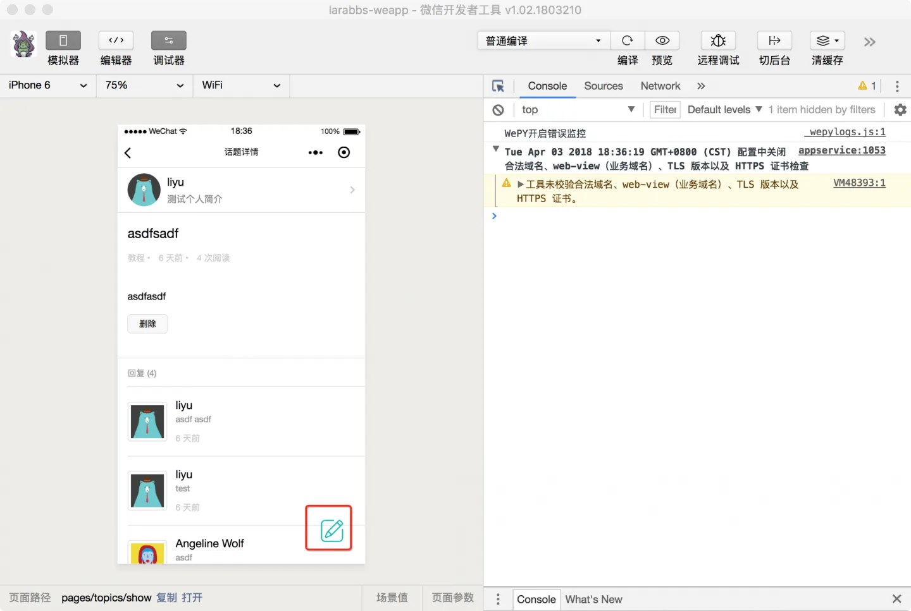
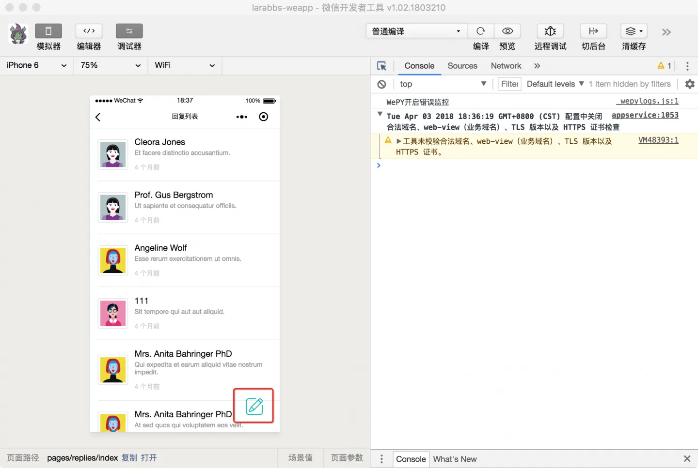
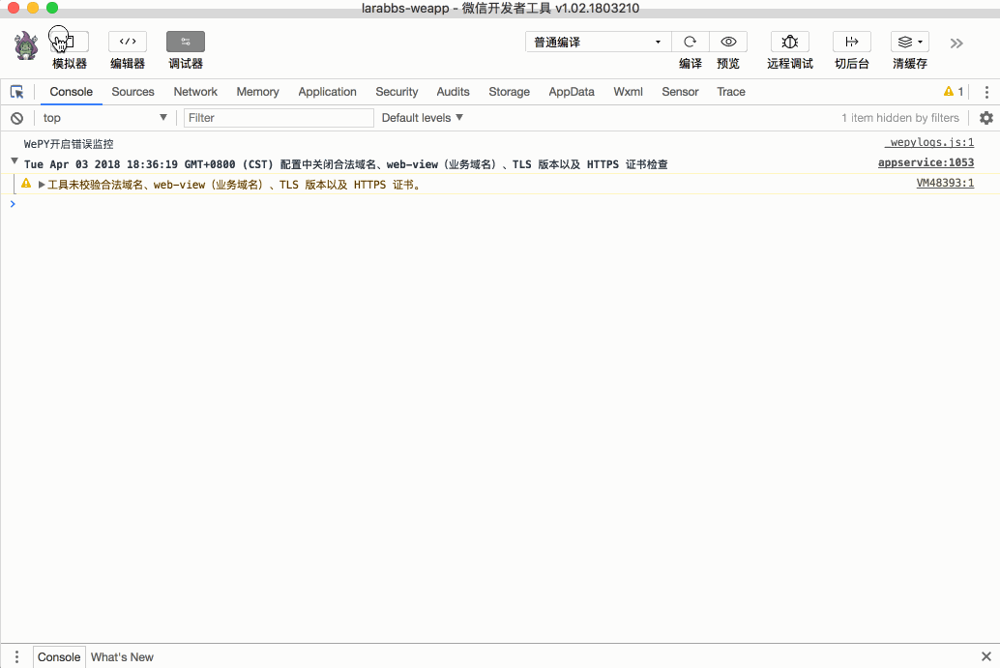

# 8.3. 发表回复

原文链接：https://learnku.com/courses/laravel-weapp/1.7/publish-a-reply/1474

本教程最新版为 [2.1](https://learnku.com/courses/laravel-weapp/2.1)，当前版本已放弃维护，请阅读最新版本！

## 发表回复

这一节我们来为话题添加回复功能。

## 注册发布回复页面

回复功能，我们可以跳转到一个新的页面进行发布操作，所以首先创建一个发布回复页面：

```bash
$ cd ~/Code/larabbs-weapp
$ touch src/pages/replies/create.wpy
```

注册页面：

src/app.wpy

```
.
.
.
config = {
pages: [
.
.
.
'pages/replies/userIndex',
'pages/replies/create'
],
.
.
.
```

## 添加链接

首先去 [iconfont](http://www.iconfont.cn/)  找一个合适的分类图标，命名为 `reply.png` ，存入 `src/images` 目录中。


`话题详情` 页面和 `回复列表` 页面，都应该有入口让用户可以添加回复，我们可以在右下角放置一个浮动图标，点击以后跳转到发布回复页面。

src/pages/topics/show.wpy

```
<style lang="less">
.
.
.
.create-reply {
width: 40px;
height: 40px;
position: fixed;
bottom: 30px;
right: 30px;
}
.
.
.
<view class="page__bd">
.
.
.
<!-- 回复按钮 -->
<navigator url="/pages/replies/create?topic_id={{ topic.id }}">
<image src="/images/reply.png" class="create-reply" />
</navigator>
</view>
.
.
.
```

在 `话题详情` 页面中增加话题回复链接：



src/pages/replies/index.wpy

```
.
.
.
.create-reply {
width: 40px;
height: 40px;
position: fixed;
bottom: 30px;
right: 30px;
}
.
.
.
<view class="page__bd">
.
.
.
<!-- 回复链接 -->
<navigator url="/pages/replies/create?topic_id={{ topicId }}">
<image src="/images/reply.png" class="create-reply" />
</navigator>
</view>
.
.
.
data = {
requestData: {},
topicId: 0
}
mixins = [replyMixin]
async onLoad(options) {
this.topicId = options.topic_id
// 获取 URL 参数中的 话题id
this.requestData.url = 'topics/' + options.topic_id + '/replies'
this.getReplies()
}
```

在 `回复列表` 页面中增加话题回复链接，因为链接地址需要用到话题 id，所以增加一个 `topicId` 属性，`onLoad` 的时候从 URL 参数 `options` 中获取：



## 发布回复页面

src/pages/replies/create.wpy

```
<style lang="less">
.content {
    height: 5.3em;
}
</style>
<template>
<view class="page">
<view class="page__bd">
<form bindsubmit="submit">
<view class="weui-cells__title">评论内容</view>
<view class="weui-cells weui-cells_after-title">
<view class="weui-cell">
<view class="weui-cell__bd">
<textarea class="weui-textarea content" placeholder="请输入评论内容" name="content"/>
</view>
</view>
</view>
</view>

<view class="weui-btn-area">
<button class="weui-btn" type="primary" formType="submit">提交</button>
</view>
</form>
</view>
</view>
</template>
<script>
import wepy from 'wepy'
import api from '@/utils/api'

export default class ReplyCreate extends wepy.page {
    config = {
        navigationBarTitleText: '添加回复'
    }
    data = {
        // 回复的话题id
        topicId: 0
    }
    onLoad(options) {
        // 未登录跳转到登录页面
        if (!this.$parent.checkLogin()) {
            wepy.navigateTo({
                    url: '/pages/auth/login'
            })
        }
        this.topicId = options.topic_id
    }
    // 提交表单
    async submit (e) {
        this.errors = null

        let formData = e.detail.value
        // 如果未填写内容，提示用户
        if (!formData.content) {
            wepy.showToast({
                    title: '请填写内容',
                    icon: 'none',
                    duration: 2000
            })

            return
        }

        try {
            // 请求发布回复接口
            let createResponse = await api.authRequest({
                    url: 'topics/' + this.topicId + '/replies',
                    method: 'POST',
                    data: formData
            })

            // 请求成功，缓存用户数据
            if (createResponse.statusCode === 201) {
                // 设置全局变量，控制列表刷新
                let pages = this.getCurrentPages()
                // 如果有上一页
                if (pages.length > 1) {
                    // 检查所有已经打开的页面，如果是话题列表页面就记录下来
                    let refreshPages = []
                    pages.forEach((page) => {
                            if (page.route === 'pages/topics/show' || page.route === 'pages/replies/index') {
                                refreshPages.push(page.route)
                            }
                    })
                    this.$parent.globalData.refreshPages = this.$parent.globalData.refreshPages.concat(refreshPages)
                    this.$apply()
                }

                // 提示发布成功
                wepy.showToast({
                        title: '发布成功',
                        icon: 'success'
                })

                // 2 秒后返回上一页
                setTimeout(function() {
                        wepy.navigateBack()
                    }, 2000)
            }
        } catch (err) {
            console.log(err)
            wepy.showModal({
                    title: '提示',
                    content: '服务器错误，请联系管理员'
            })
        }
    }
}
</script>
```

整个页面的逻辑并不复杂：

1. onLoad 时首先判断用户是否已经登录，没登录先跳转到登录页面；将传入的话题 id 赋值 topicId；

2. 如果表单未填写内容，给出提示；

3. 提交后，如果发布成功，根据已经打开的页面，设置需要刷新的页面；

4. 提示发布成功，2 秒后跳转回之前的页面。

## 发布成功后刷新页面

发布成功后会返回之前的页面，发布成功后我们已经设置了需要刷新的页面，现在需要在页面的 `onShow` 方法中检测：

修改回复列表页面：
src/pages/replies/index.wpy

```
.
.
.
onShow() {
this.$parent.checkRefreshPages(this.getCurrentPages().pop().route, () => {
this.noMoreData = false
this.page = 1
this.getReplies(true)
})
}
.
.
.
```

修改话题详情页面：
src/pages/topics/show.wpy

```
.
.
.
async onShow() {
this.$parent.checkRefreshPages(this.getCurrentPages().pop().route, () => {
this.getTopic(this.topic.id)
})
}
.
.
.
```

逻辑都是在 onShow 方法中检测全局变量中，当前页面是否需要重新获取数据。

## 开发者工具调试

未登录的用户，跳转到发布话题页面时会跳转到登录页面，自动登录。


在回复列表页面也可以跳转到发布回复页面。


## 代码版本控制

```bash
$ cd ~/Code/larabbs-weapp
$ git add -A
$ git commit -m 'page reply create'
```
