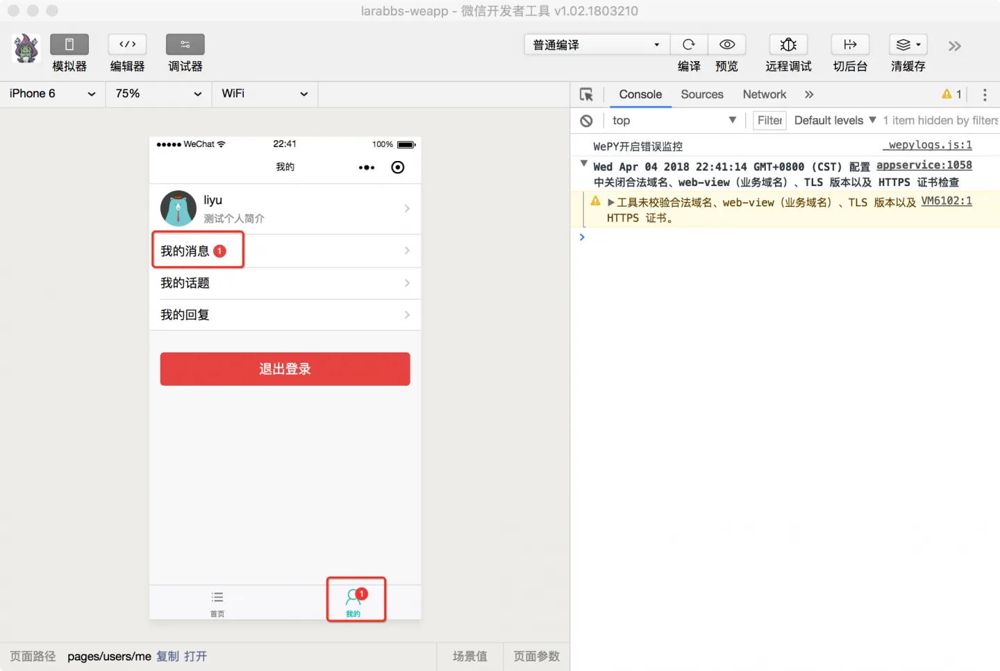
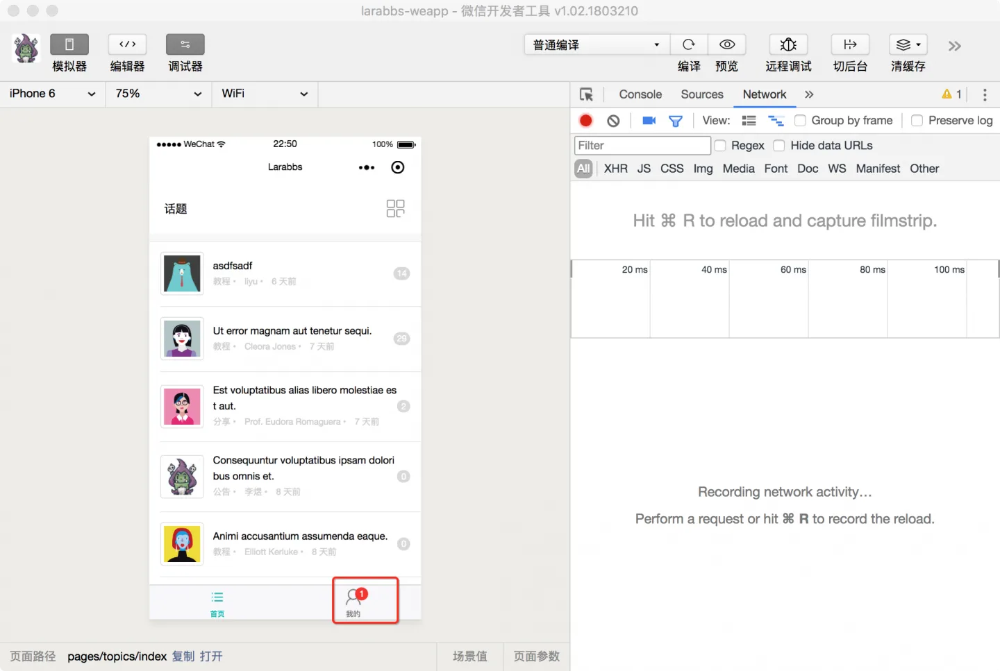
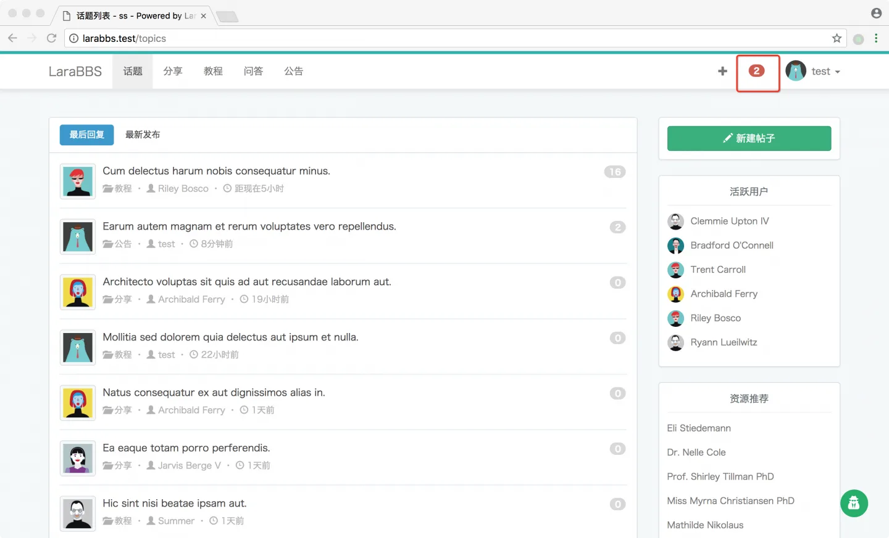
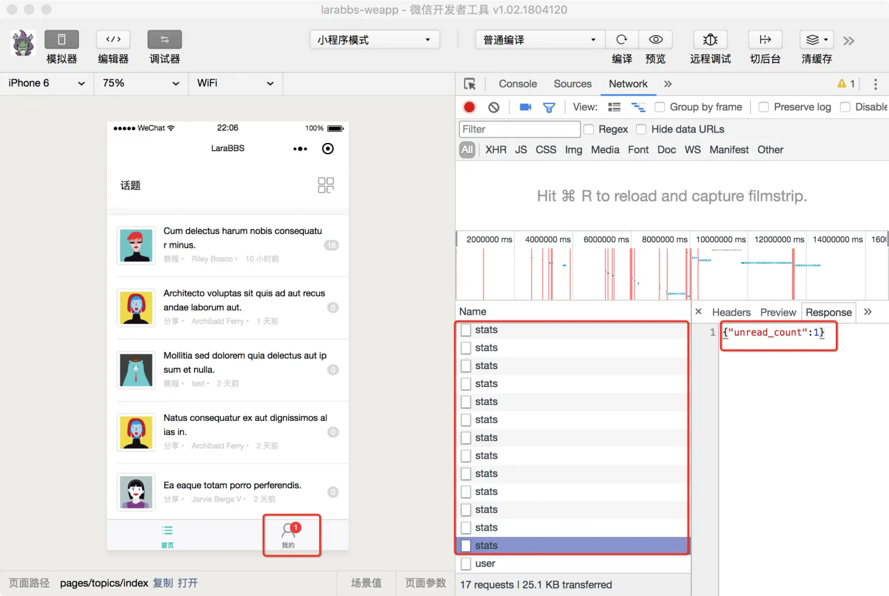
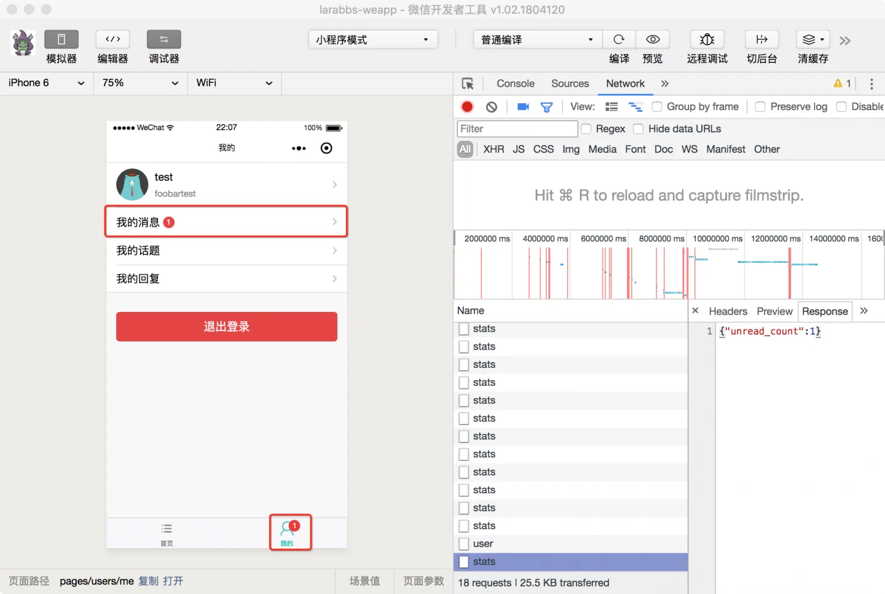

# 8.4. 未读消息

原文链接：https://learnku.com/courses/laravel-weapp/1.7/message-notification/1476

本教程最新版为 [2.1](https://learnku.com/courses/laravel-weapp/2.1)，当前版本已放弃维护，请阅读最新版本！

## 未读消息数

在 Larabbs 中当其他用户回复我发布的主题是，我会收到系统通知，显示出来未读的消息数量，这一节我们在小程序中实现该功能。

## 获取未读消息

需要在 Tabbar 和 `我的` 页面中增加一些消息数提示（Badge），提示用户新的未读消息，以下是我们预期的样子：





为了实现图片中的功能，首先需要每隔一段时间请求接口，获取当前用户的未读消息数，设置在 Tabbar 中：

src/app.wpy

```
.
.
.
globalData = {
refreshPages: [],
unreadCount: 0
}
.
.
.
onLaunch() {
// 小程序启动，调用一起获取未读消息数
this.updateUnreadCount()
// 每隔 60 秒，调用一起获取未读消息数
setInterval(() => {
this.updateUnreadCount()
}, 60000)
}
// 获取未读消息数
async updateUnreadCount() {
// 未登录不需要请求
if (!this.checkLogin()) {
return
}

// 请求消息统计接口
let notificationResponse = await api.authRequest('user/notifications/stats', false)

//  请求成功，赋值全局变量 unreadCount
if (notificationResponse.statusCode === 200) {
this.globalData.unreadCount = notificationResponse.data.unread_count
}
}
.
.
.
```

当小程序初始化完成时，会触发 onLaunch 且全局只触发一次，我们可以在该方法中开始一个轮询，每隔一段时间请求一次未读消息数：

1. 增加全局变量  `unreadCount`，页面中可以通过 `this.$parent.globalData.unreadCount` 获取；

2. 封装 `updateUnreadCount`，如果用户未登录则返回，如果已登录则请求服务器接口获取未读消息数，并赋值给 `unreadCount`；

3. 小程序初始化完成后，主动调用一次 `updateUnreadCount`，然后使用 JS 的 `setInterval` 方法，该方法可以按照指定的周期来调用函数或计算表达式，这里我们设置每隔 60 秒调用一次 `updateUnreadCount` 方法。

## 增加 Mixins unreadCount

全局已经有了未读消息数量，接下来就需要在显示了 Tabbar 的页面中将未读消息设置在 Tabbar 中，由于 `首页` 和 `我的` 页面都有相同的通能，我们可以利用 Mixins 来处理这部分逻辑。

创建 Mixin unreadCount：

```bash
$ cd ~/Code/larabbs-weapp
$ touch src/mixins/unreadCount.js
```

src/mixins/unreadCount.js

```
import wepy from 'wepy'

export default class UnreadCount extends wepy.mixin {
    data = {
        // 轮询
        interval: null,
        // 未读消息数
        unreadCount: 0
    }
    // 页面显示
    onShow() {
        this.updateUnreadCount()
        this.interval = setInterval(() => {
                this.updateUnreadCount()
            }, 30000)
    }
    // 页面隐藏
    onHide() {
        // 关闭轮询
        clearInterval(this.interval)
    }
    // 设置未读消息数
    updateUnreadCount() {
        // 从全局获取未读消息数
        this.unreadCount = this.$parent.globalData.unreadCount
        this.$apply()

        if (this.unreadCount) {
            // 设置 badge
            wepy.setTabBarBadge({
                    index: 1,
                    text: this.unreadCount.toString()
            })
        } else {
            // 移除 badge
            wepy.removeTabBarBadge({
                    index: 1
            })
        }
    }
}
```

提前了解两个知识点：

1. [setTabBarBadge](https://developers.weixin.qq.com/miniprogram/dev/api/ui-tabbar.html#wxsettabbarbadgeobject) —— 为 TabBar 某一项的右上角添加文本；

- 参数 `index` TabBar 的哪一项，从左边算起；

- 参数 `text` 是要设置的文本。

2. [removeTabBarBadge](https://developers.weixin.qq.com/miniprogram/dev/api/ui-tabbar.html#wxremovetabbarbadgeobject) ——移除 TabBar 某一项右上角的文本。

- 参数 `index` TabBar 的哪一项，从左边算起；

分析一下 `unreadCount` 的逻辑：

- `updateUnreadCount` 方法用来同步全局变量中的 `unreadCount`；

- `onShow` 方法中开启轮询，每 30  秒执行一次，`unreadCount` 大于 0 则设置 Badge；等于 0 则删除 Badge；

- `onHide` 时结束这个轮询。

同时修改 `我的` 页面和 `话题列表` 页面，添加 `unreadCount` Mixin：

src/pages/users/me.wpy
src/pages/topics/index.wpy

```
.
.
.
import unreadCount from '@/mixins/unreadCount'
.
.
.
mixins = [unreadCount]
.
.
.
```

在 `首页` 和 `我的` 页面中加入相同的代码，即可完成 Tabbar 中 Badge 的设置。

最后在 `我的` 页面中，调整页面，在我的消息后面也显示未读消息数：

src/pages/users/me.wpy

```
<navigator class="weui-cell weui-cell_access" url="">
<view class="weui-cell__bd" url="">
<view class="weui-cell__bd">
<view style="display: inline-block; vertical-align: middle">我的消息</view>
<view class="weui-badge" style="margin-left: 5px;" wx:if="{{ unreadCount }}">{{ unreadCount }}</view>
</view>
</view>
<view class="weui-cell__ft weui-cell__ft_in-access"></view>
</navigator>
```

## 开发者工具调试

创建未读消息测试数据：

1. 用当前小程序账号登录 [larabbs.test](http://larabbs.test) ，发布一个话题；

2. 使用其他用户登录，在刚才发布的话题中进行回复，这样小程序登录的用户便会有未读消息。



在首页停留，会发现每隔 60 秒会有一次网络请求，获取未读消息数，当有未读消息时，TabBar 中会有数量提示：


进入 `我的` 页面，可以看到 `我的消息` 链接后面也会有未读消息数：


## 代码版本控制

```bash
$ cd ~/Code/larabbs-weapp
$ git add -A
$ git commit -m 'unread notification'
```
